# 020：Jupyter内核系统 💻

在本节课中，我们将要学习Jupyter环境中的内核系统。内核是执行笔记本文件中代码的计算引擎，它支持多种编程语言，是进行数据科学项目的重要工具。

## 什么是Jupyter内核？🔧

上一节我们介绍了Jupyter Notebook的基本界面，本节中我们来看看其核心计算组件——内核。

一个笔记本内核是一个**计算引擎**，它负责执行笔记本文件中所包含的代码。其核心关系可以概括为：
**笔记本文件（前端界面） + 内核（后端引擎） = 可执行的交互式环境**

## 内核如何工作？⚙️

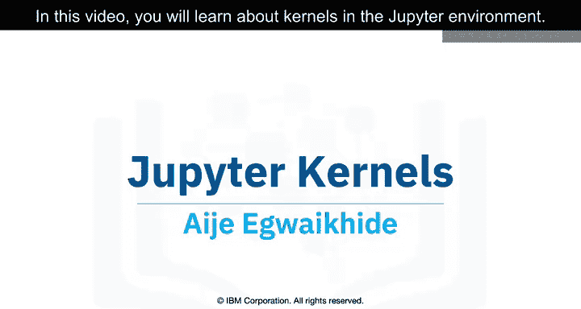

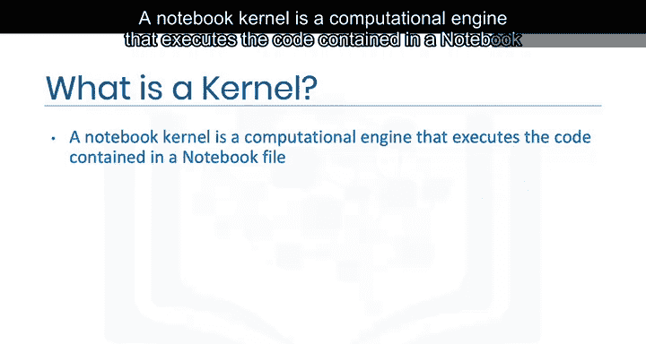

当你打开一个笔记本文档时，与之关联的内核会自动启动。执行笔记本中的代码时，内核会进行计算并产生结果。

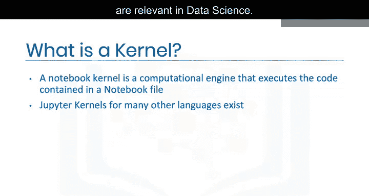

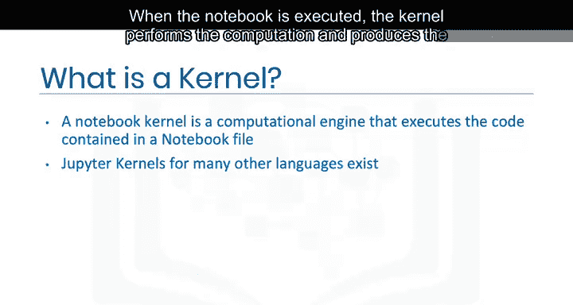

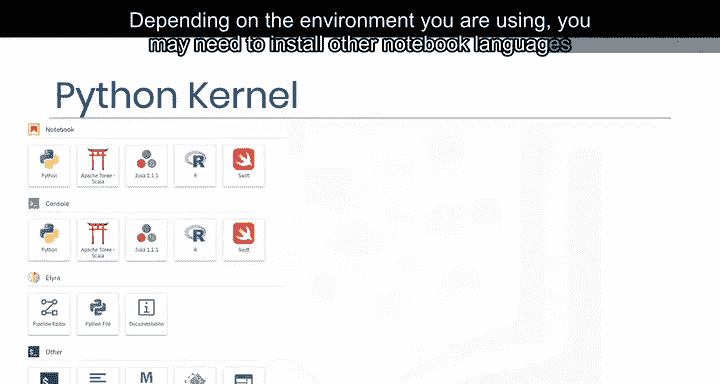

根据你所使用的环境，你可能需要在Jupyter环境中安装其他编程语言的内核。在Skills Network的实验环境中，一些语言的内核已经为你预装好了。

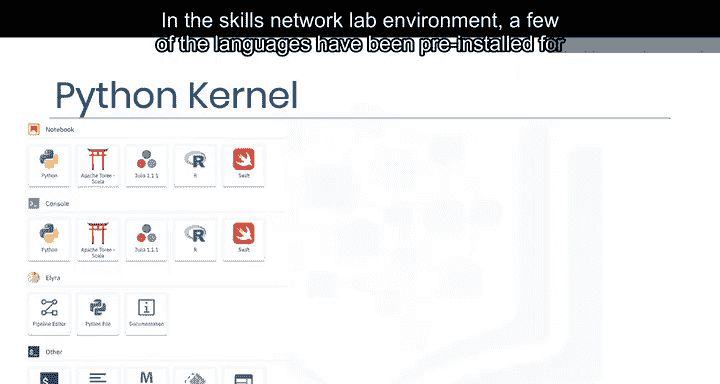

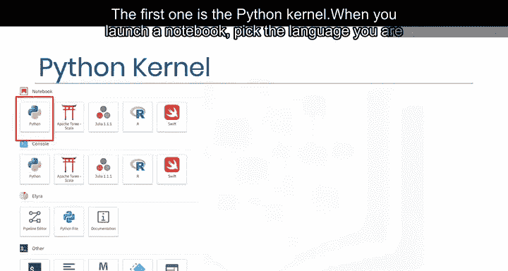

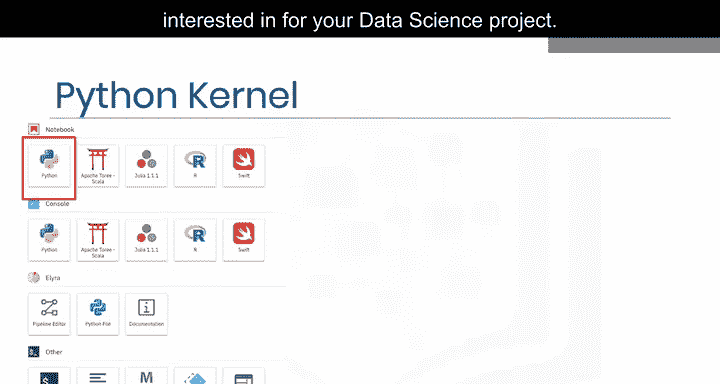

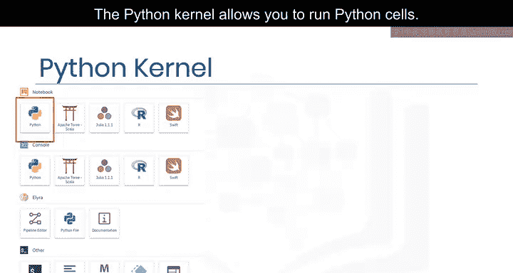

## 支持的内核语言 🌐

Jupyter支持多种编程语言的内核。以下是数据科学中常用的一些内核：

*   **Python内核**：这是最常用的内核，允许你运行Python代码单元。
*   **R内核**：用于执行R语言代码，常用于统计分析和数据可视化。
*   **Julia内核**：适用于高性能科学计算。
*   **其他内核**：Jupyter社区还支持Scala、Apache Toree（Spark）和Swift等多种语言。

## 如何选择与切换内核？🔄

在启动新笔记本时，你可以直接选择感兴趣的语言内核。对于已打开的笔记本，你可以通过界面右上角显示当前内核类型的地方进行切换。

操作步骤如下：
1.  点击界面右上角当前内核的名称（例如“Python 3”）。
2.  在下拉菜单中选择你想要切换到的其他内核。
3.  内核切换后，你就可以使用新语言执行代码单元了。

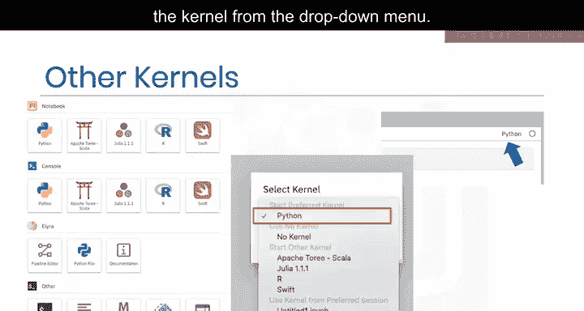

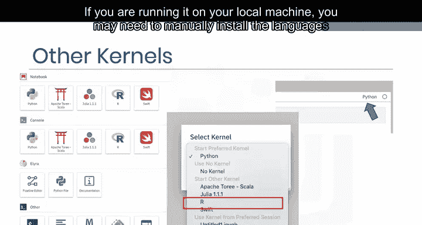

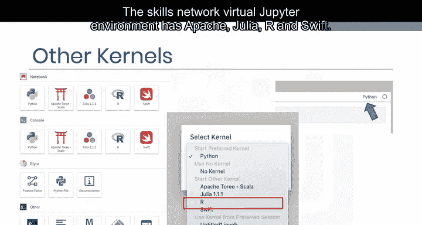

请注意，如果你在本地机器上运行Jupyter，可能需要通过命令行手动安装所需语言的内核包，例如使用 `pip install` 或 `conda install` 命令。

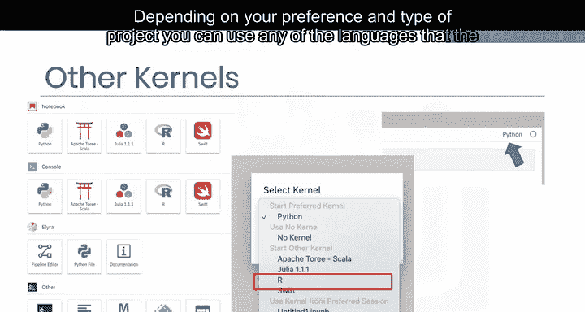

## 总结 📝

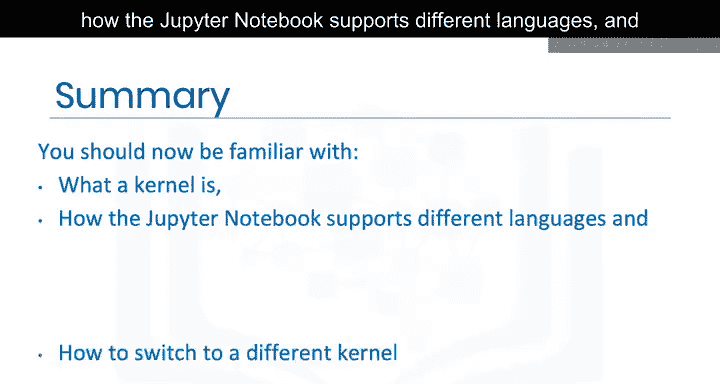

本节课中我们一起学习了Jupyter内核系统的关键知识。你现在应该熟悉了内核的定义——它是执行代码的计算引擎；了解了Jupyter笔记本如何通过不同内核支持多种编程语言；并且掌握了在笔记本中查看及切换到不同内核的方法。正确理解和使用内核，是高效利用Jupyter进行数据科学工作的基础。