# 021：Jupyter架构解析

在本节课中，我们将学习Jupyter生态系统的基本架构设计。我们将了解其核心的双进程模型、各组件如何交互协作，以及笔记本文件如何被转换和保存。

## 🏗️ Jupyter的双进程模型

Jupyter采用一个由**内核**和**客户端**构成的双进程模型。

*   **客户端**是用户界面，它允许用户向内核发送代码。
*   **内核**负责执行接收到的代码，并将结果返回给客户端进行显示。

在使用Jupyter Notebook时，**客户端就是你的浏览器**。

## 💾 笔记本的保存与服务器

Jupyter Notebook包含了你的代码、元数据、内容和输出。当你保存笔记本时，会发生以下过程：

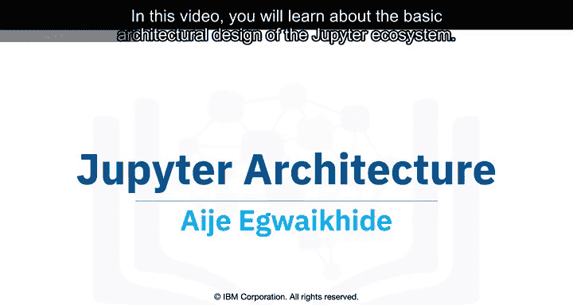

1.  笔记本从你的浏览器发送到**Notebook服务器**。
2.  Notebook服务器将笔记本作为一个扩展名为 **`.ipynb`** 的文件保存到磁盘上。

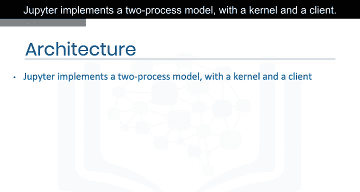

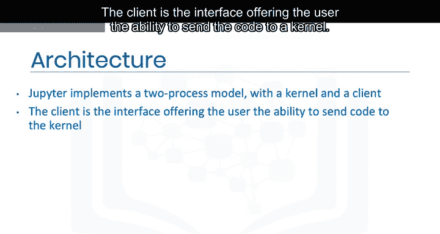

Notebook服务器负责所有笔记本文件的保存和加载工作。

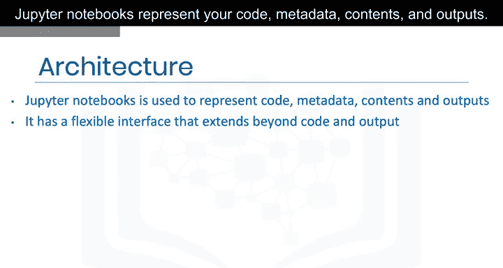

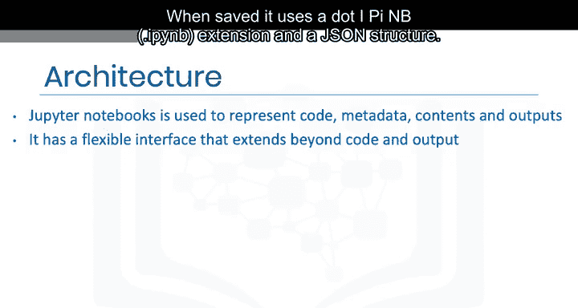

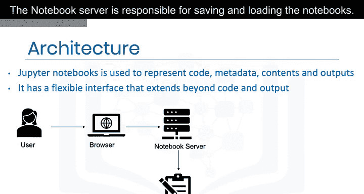

## ⚙️ 代码执行流程

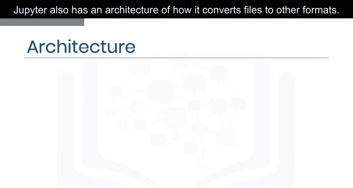

当用户运行代码单元时，这些代码单元会被发送给**内核**执行。

上一节我们介绍了Jupyter的核心执行模型，本节中我们来看看它如何处理文件格式转换。

## 🔄 文件转换架构

Jupyter还有一个关于如何将文件转换为其他格式的架构。它使用一个名为 **`nbconvert`** 的工具。

例如，如果我们想将一个笔记本文件（`.ipynb`）转换为一个HTML文件（`.html`），它将经历以下流程：

以下是转换过程的步骤：
1.  **预处理器**修改笔记本。
2.  **导出器**将笔记本转换为新的文件格式（如HTML）。
3.  **后处理器**对导出生成的文件进行进一步处理。

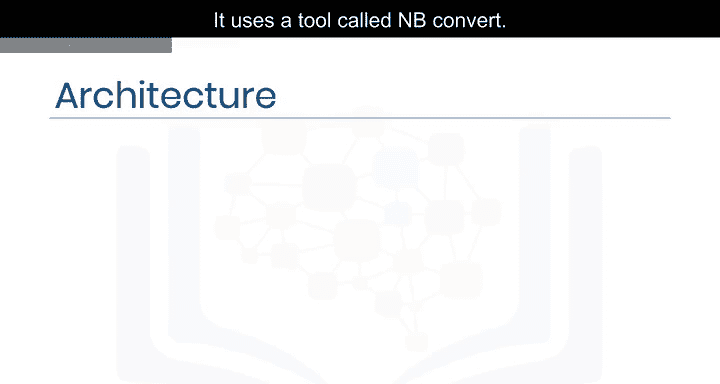

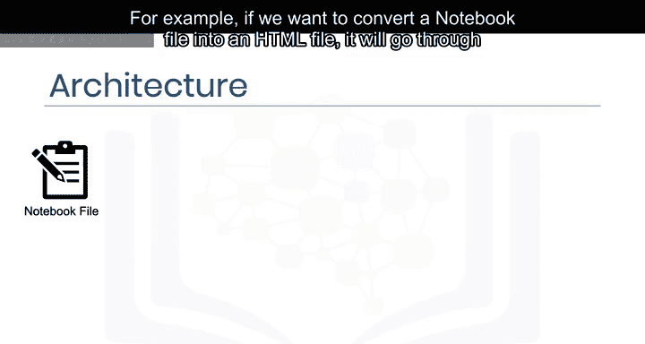

转换完成后，当你访问该HTML文件的URL时，系统会首先获取笔记本，将其转换为HTML，然后以HTML文件的形式展示给你。

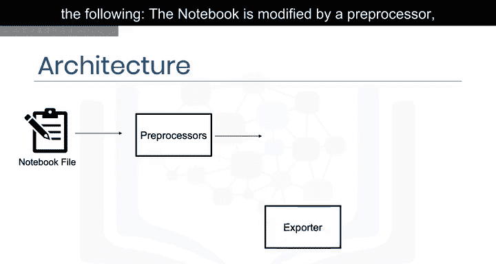

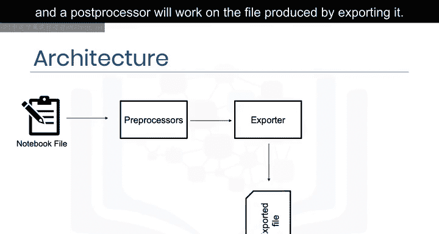

## 📝 课程总结

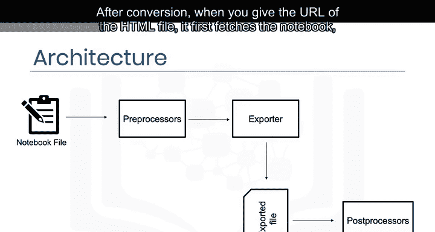

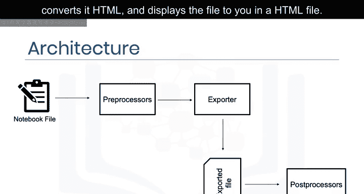

本节课中我们一起学习了：
*   Jupyter**双进程模型**的实现（客户端与内核）。
*   **Notebook服务器**如何与内核及客户端进行通信。
*   将笔记本文件转换为其他文件的**架构设计**，特别是通过`nbconvert`工具进行的转换流程。

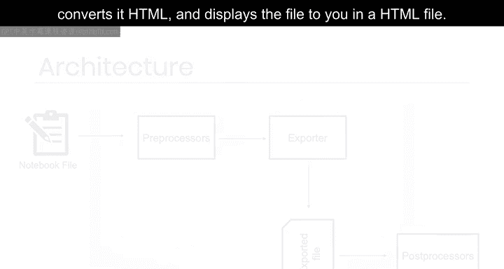

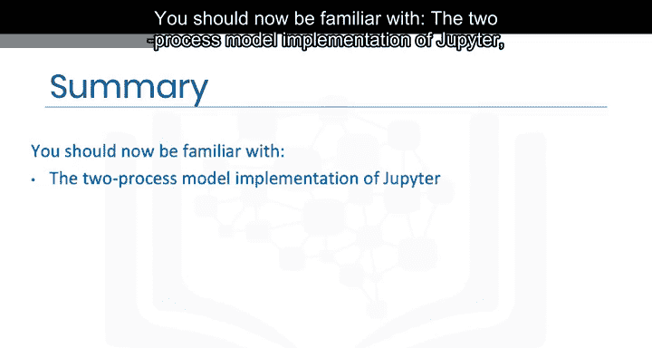

现在，你应该对Jupyter的基本架构有了清晰的了解。