# 022：R与RStudio导论

在本节课中，我们将要学习R编程语言及其集成开发环境RStudio。我们将了解R在数据科学中的应用、RStudio的基本界面，以及一些在数据科学社区中广受欢迎的R包。

---

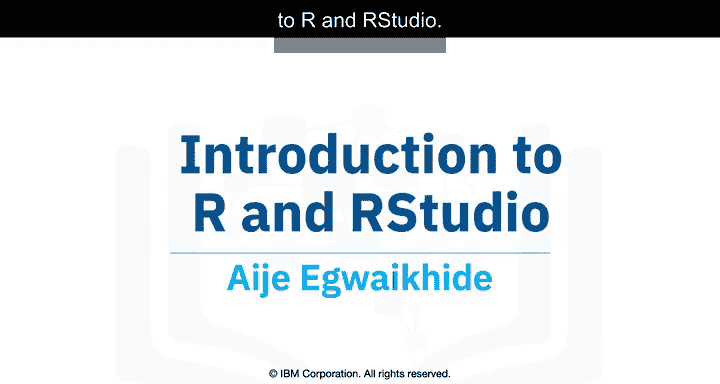

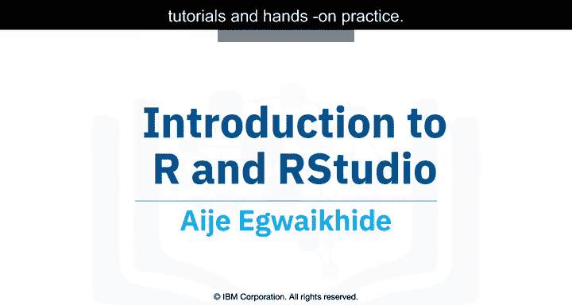

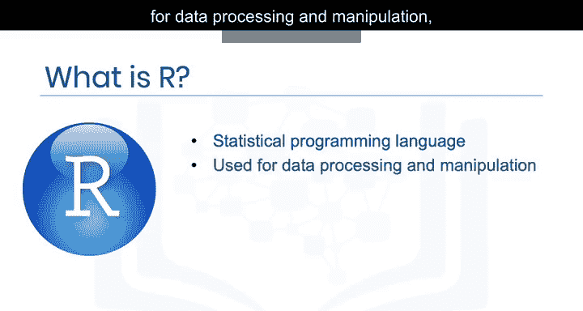

## 🧠 什么是R？

R是一种统计编程语言。它是数据处理与操作、统计推断、数据分析和机器学习算法的强大工具。

根据2017年Stack Overflow的访问数据，R在学术界、医疗保健和政府领域使用最为广泛。

R拥有众多函数，支持从不同来源导入数据，例如：文件、数据库、网络以及SPSS等统计软件。

R之所以成为一些数据科学家的首选语言，是因为其内置函数易于使用。R也以能生成出色的可视化图表而闻名，并且拥有大量现成的包来处理数据分析，通常无需额外安装库。

## 💻 什么是RStudio？

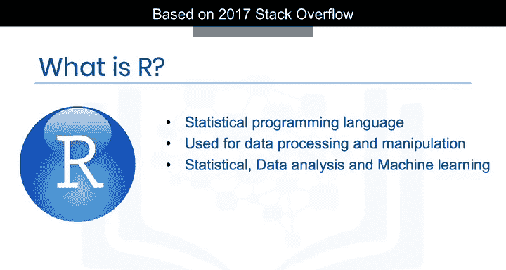

要使用R，我们需要一个环境来帮助运行代码。RStudio是最流行的用于开发和运行R语言源代码及程序的集成开发环境之一。

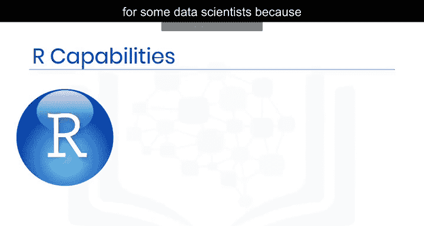

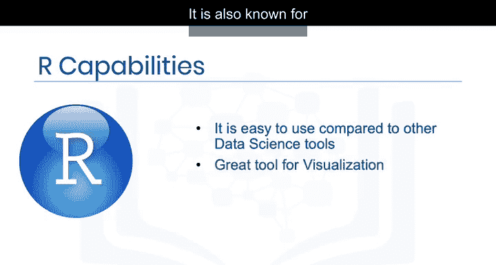

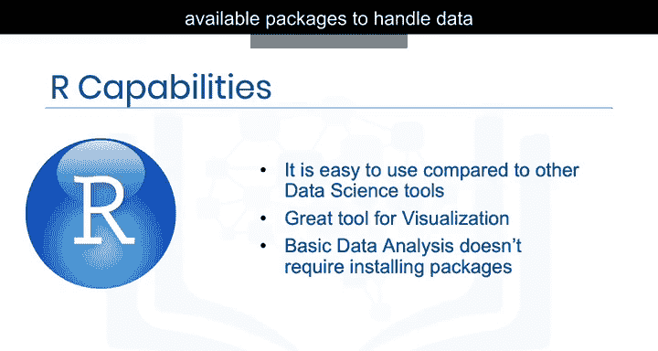

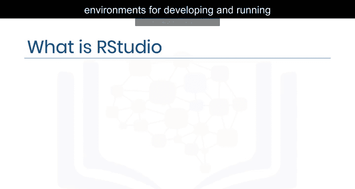

RStudio旨在帮助提高使用R语言的生产力。它包含一个支持直接代码编写的语法高亮编辑器。

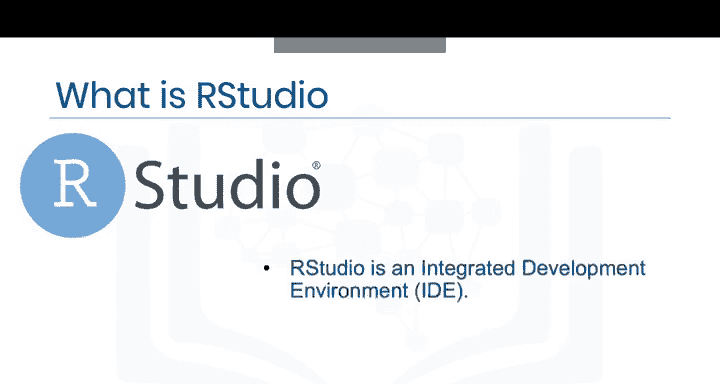

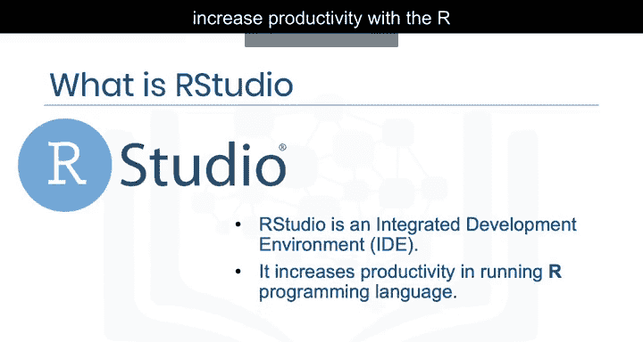

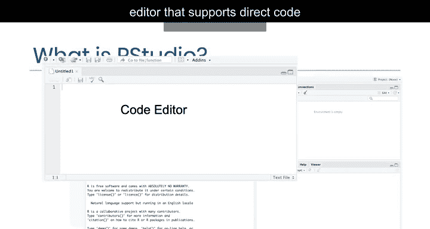

## 🖥️ RStudio界面导览

以下是RStudio界面的主要组成部分：

*   **脚本编辑器**：用于编写和保存代码文件，记录你的工作。
*   **控制台**：用于键入R命令并立即执行。
*   **工作空间与历史标签页**：显示你在当前R会话中创建的所有R对象列表，以及所有先前命令的历史记录。
*   **文件/绘图/包/帮助标签页**：显示工作目录中的文件、已创建绘图的历史记录、允许将绘图导出为PDF或图像文件、查看本地计算机上可用的外部R包，以及获取R资源帮助。

RStudio支持众多包和更多功能。

## 📦 数据科学中的热门R包

如果R是你进行数据科学的工具，以下是一些在数据科学社区中非常流行的库：

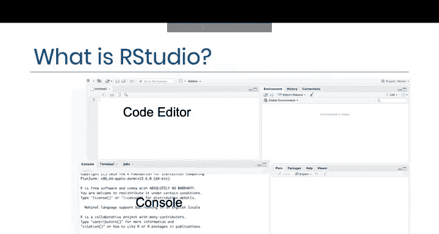

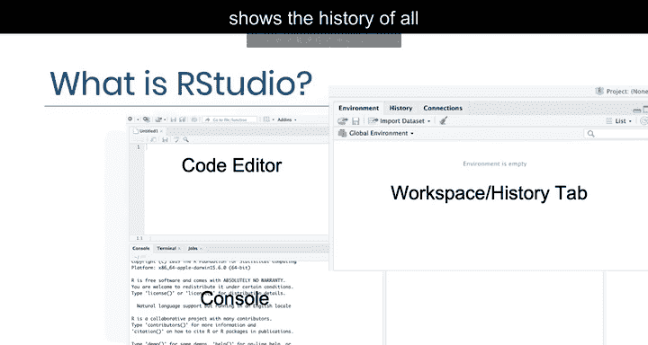

*   **`dplyr`**：用于数据操作和转换。
    ```r
    # 示例：使用dplyr筛选数据
    filtered_data <- data %>% filter(column > 10)
    ```
*   **`stringr`**：用于字符串操作和处理。
*   **`ggplot2`**：用于创建复杂且精美的数据可视化图形。
    ```r
    # 示例：使用ggplot2创建散点图
    ggplot(data, aes(x=var1, y=var2)) + geom_point()
    ```
*   **`caret`**：用于简化机器学习工作流程。

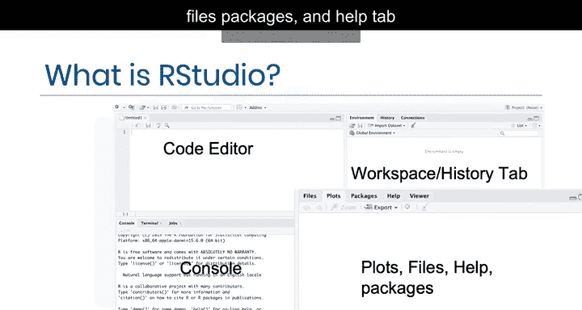

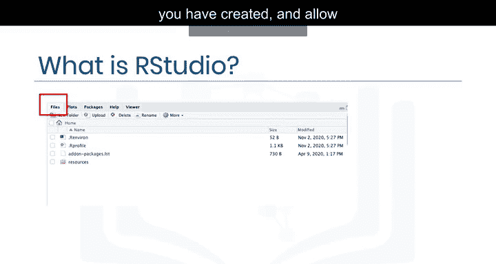

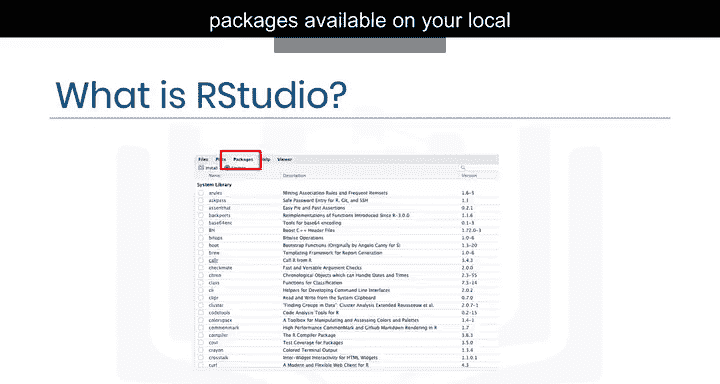

## 🧪 实践环境：Skills Network Labs

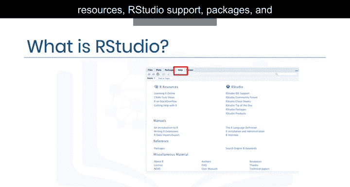

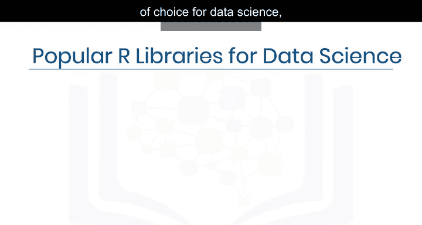

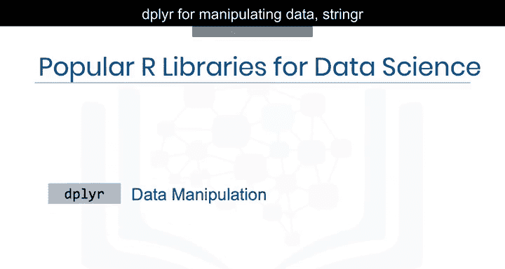

为了让你能快速上手学习，我们通过Skills Network Labs为你提供了一个RStudio虚拟环境。

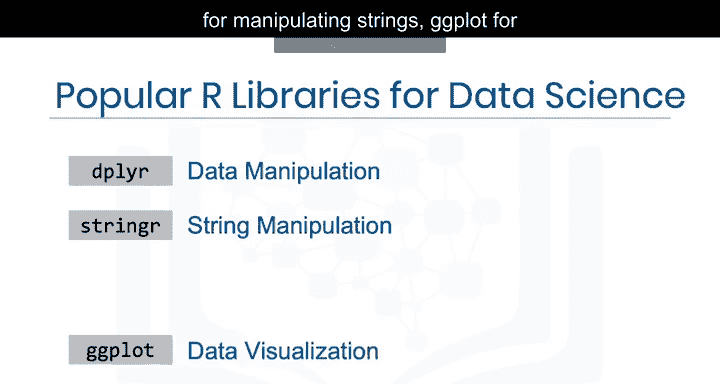

这个虚拟实验室环境旨在帮助你轻松练习课程中学到的内容，无需创建账户、下载或安装任何软件。

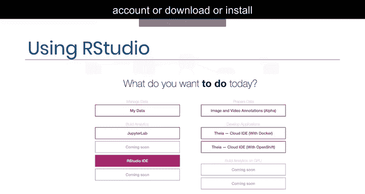

---

## ✅ 课程总结

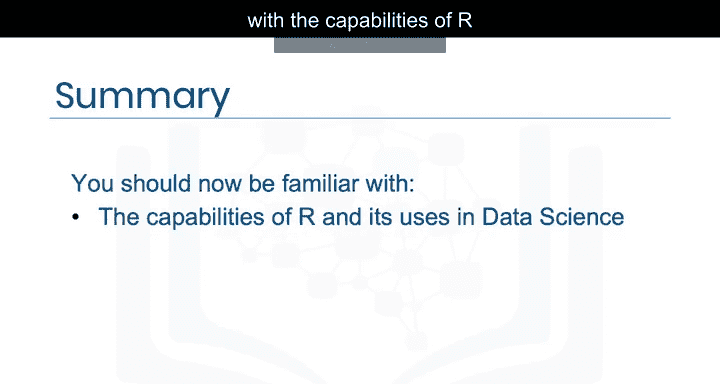

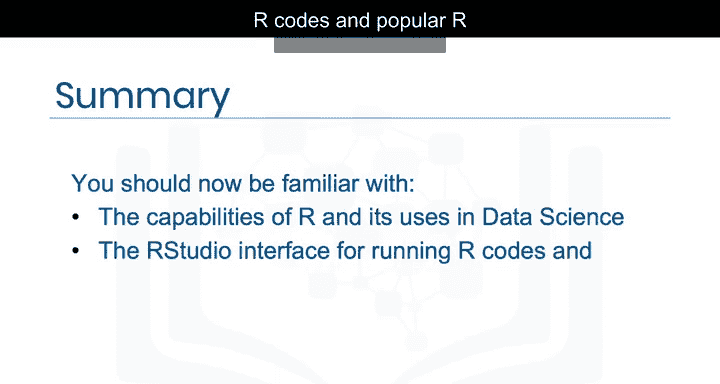

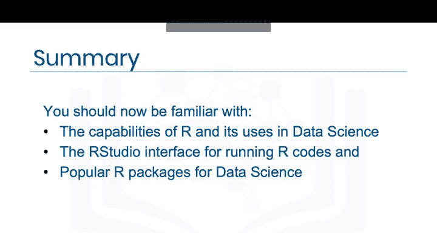

本节课中，我们一起学习了R编程语言在数据科学中的能力和用途，用于运行R代码的RStudio界面，以及数据科学中一些流行的R包。现在，你应该对如何开始使用R进行数据科学项目有了基本的了解。