# 023：RStudio可视化功能

在本节课中，我们将学习如何使用R语言及其强大的包进行数据可视化。数据科学家的一项重要工作是通过可视化从海量数据中提取洞见，而R提供了多种工具来高效地完成这项任务。

---

## 🎨 R中的数据可视化工具

随着数据量的不断增长，作为数据科学家，我们的众多职责之一就是通过可视化来呈现数据洞见。

R是一个出色的数据可视化工具，并拥有多种不同的包。以下是一些流行且顶级的数据可视化工具：

以下是R中几个重要的可视化包：

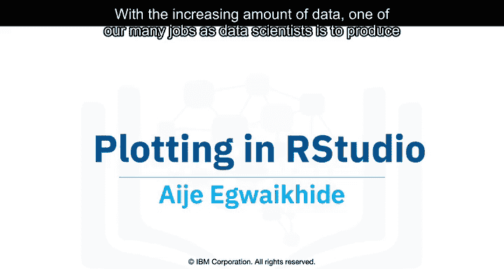

*   **ggplot2**：用于创建直方图、条形图、散点图等数据可视化。它允许在单个可视化图表上添加图层和组件。
*   **plotly**：一个R包，可用于创建基于网页的数据可视化，这些图表可以显示或保存为独立的HTML文件。
*   **lattice**：一个用于实现复杂多变量数据集可视化的工具。它是一个高级数据可视化库，能够处理许多典型的图形而无需大量定制。
*   **leaflet**：在创建交互式地图绘图时非常有用。

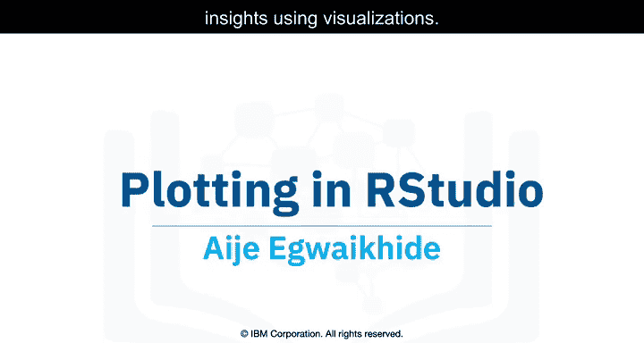

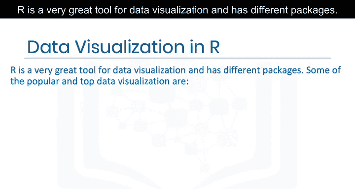

根据你的需求和具体的数据科学项目，这些库和包大多能派上用场。要在你的R环境中安装这些包，请使用 `install.packages("包名")` 命令。

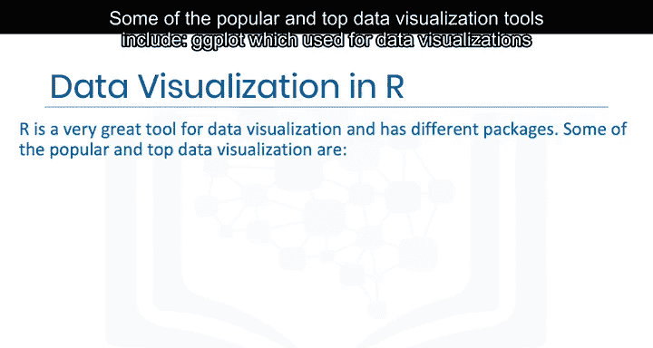

---

## 📈 使用基础R绘图

R也拥有其内置的函数来创建绘图和可视化，最常用的是 `plot()` 函数。

例如，`plot(values)` 是 `plot` 函数最简单的形式，它会返回一个值相对于索引的散点图。

你还可以向图形中添加线条和标题，使其更易于阅读和理解。这里我们为绘图添加一条线，并使用 `title()` 函数添加标题。

```r
# 基础绘图示例
plot(values)
lines(values) # 添加线条
title("My Plot") # 添加标题
```

---

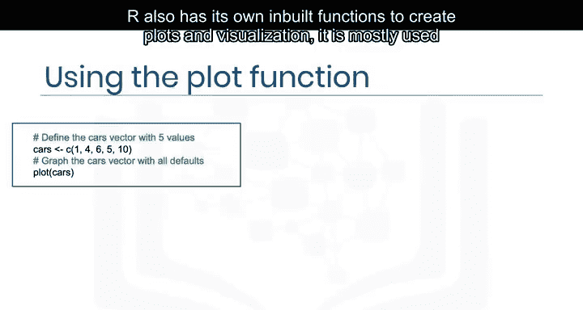

## 🖼️ 使用ggplot2创建高级可视化


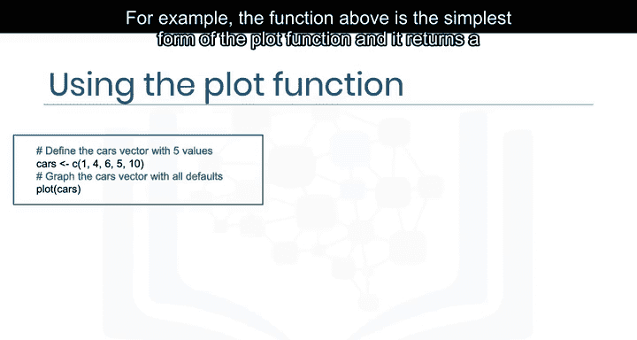

我们可以使用ggplot2库创建更美观的可视化。ggplot2是R的一个数据可视化包，能够处理复杂的绘图需求，允许你向图表中添加图层。

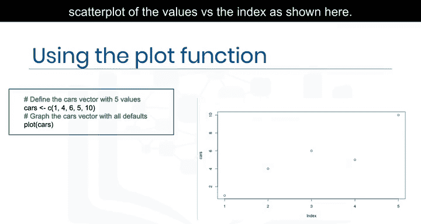

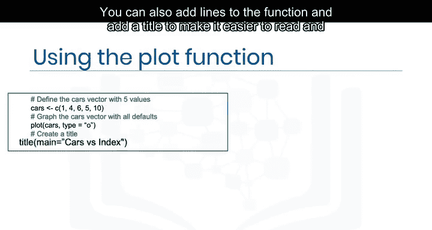

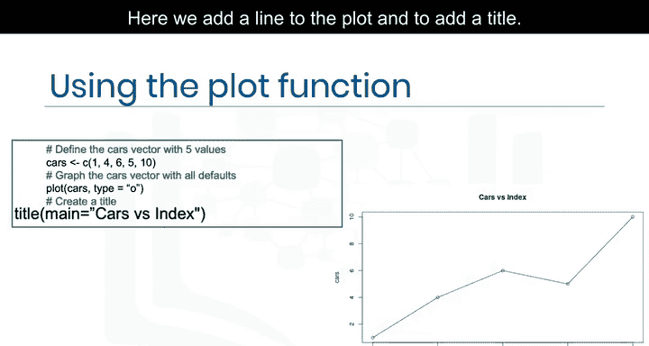

通过调整函数和参数来创建散点图，我们将使用内置数据集 `mtcars`。

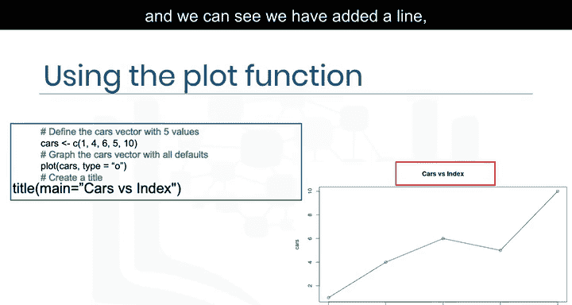

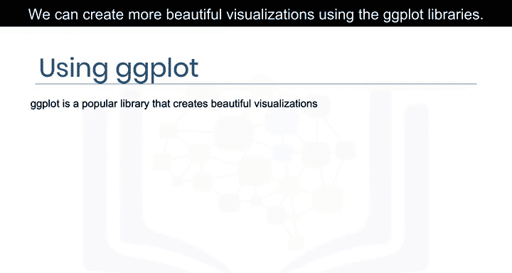

我们首先使用 `library()` 函数将ggplot2库载入内存，然后在数据框 `mtcars` 上调用 `ggplot()`，指定X轴为每加仑英里数（`mpg`），Y轴为车重（`wt`）。接着添加 `geom_point()` 函数来告知ggplot2我们想要一个散点图，否则它将返回一个空白的绘图区域。

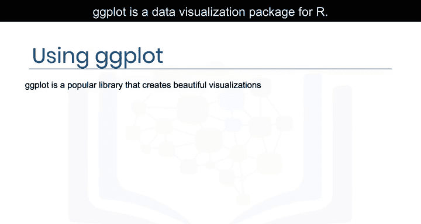

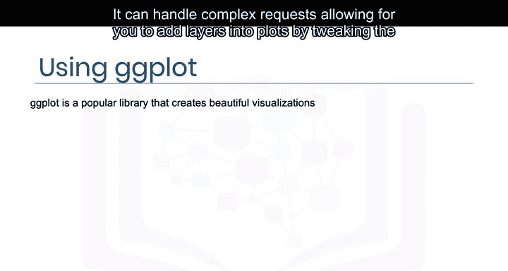

```r
# ggplot2 散点图示例
library(ggplot2)
ggplot(data = mtcars, aes(x = mpg, y = wt)) +
  geom_point()
```

这将生成一个更美观、更易读的图表。

---

## ✏️ 为图表添加标题和调整坐标轴

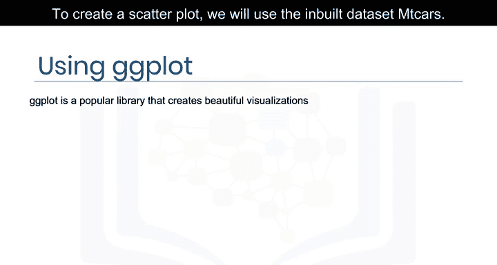

你还可以通过 `ggtitle()` 参数添加标题，并使用 `labs()` 参数通过指定我们想要看到的新名称来更改坐标轴的名称。


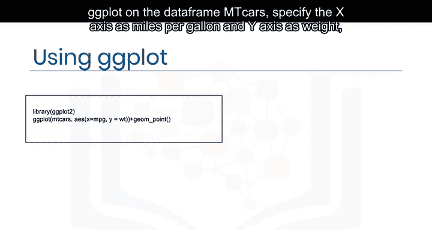

```r
# 添加标题和坐标轴标签
ggplot(data = mtcars, aes(x = mpg, y = wt)) +
  geom_point() +
  ggtitle("汽车重量与油耗关系图") +
  labs(x = "每加仑英里数 (MPG)", y = "重量 (千磅)")
```

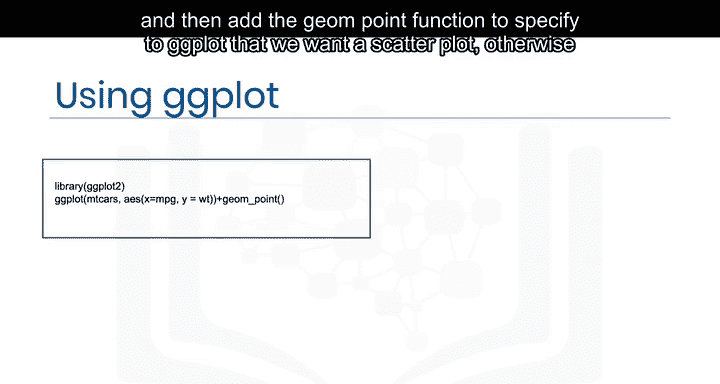

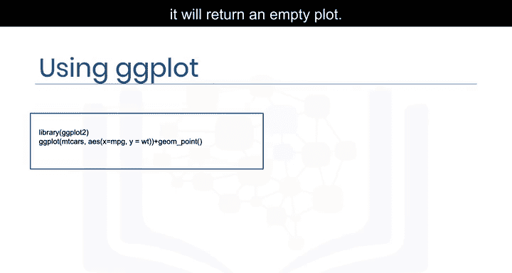

我们将看到一个更易于阅读和理解的图表。

---

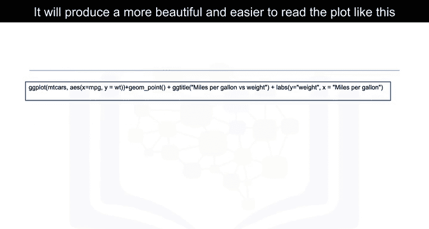

## 🔬 实验环节：使用ggplot2与GGally

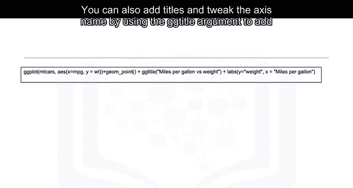

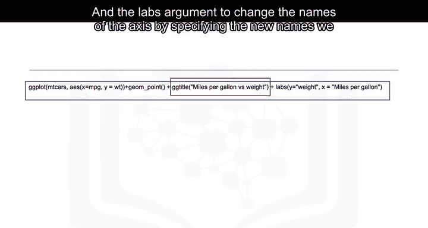

在我们的实验环节，将使用ggplot2及其扩展库GGally来重现上述图形。GGally通过添加多个函数来扩展ggplot2，降低了将几何对象与转换后的数据相结合的复杂性。

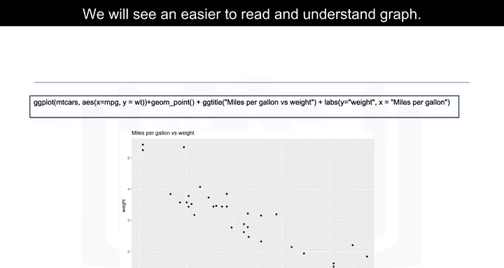

请在控制台窗口中键入并执行以下命令来安装这两个包。你不需要任何编码经验，因为代码和命令都会提供给你。

```r
install.packages("ggplot2")
install.packages("GGally")
```

---

## 📚 课程总结

本节课中，我们一起学习了：

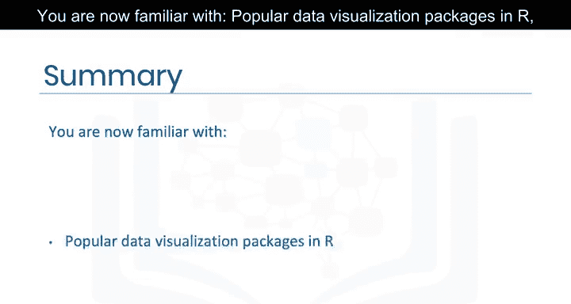

1.  R中流行的数据可视化包，如ggplot2、plotly、lattice和leaflet。
2.  使用基础R的 `plot()` 函数进行绘图。
3.  使用ggplot2创建更高级、更美观的可视化图表。
4.  使用 `ggtitle()` 和 `labs()` 函数为图表添加标题和更改坐标轴名称。

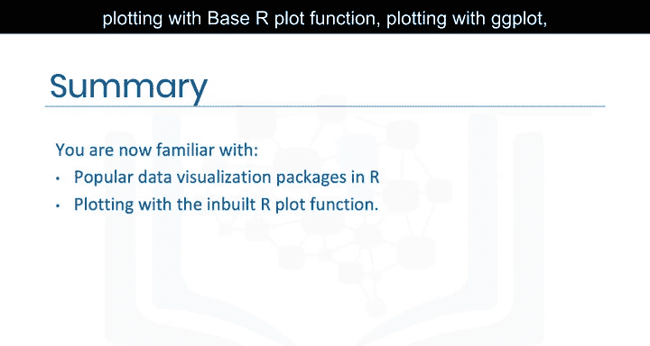

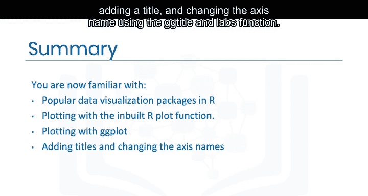

现在，你已经熟悉了在R中创建数据可视化的基本和高级方法，可以开始探索并呈现你的数据洞见了。