# 024：Git与GitHub概述

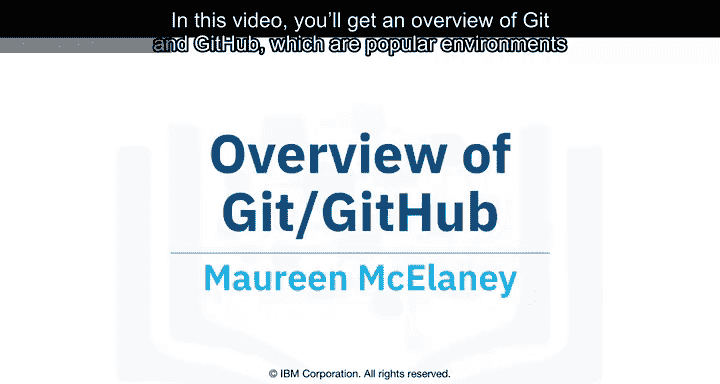

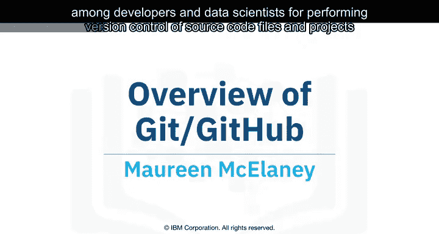

在本节课中，我们将要学习Git与GitHub的基本概念。它们是开发者和数据科学家中非常流行的环境，用于对源代码文件和项目进行版本控制，并支持与他人协作。

要理解Git和GitHub，首先需要了解版本控制的基本概念。版本控制系统允许你跟踪文档的更改。这让你在犯错时能轻松恢复文档的旧版本，同时也使与他人协作变得更加容易。

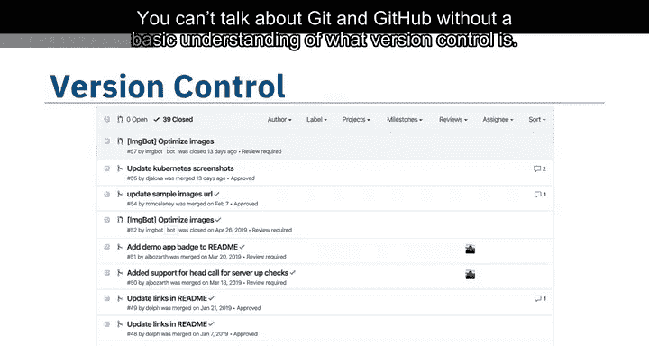

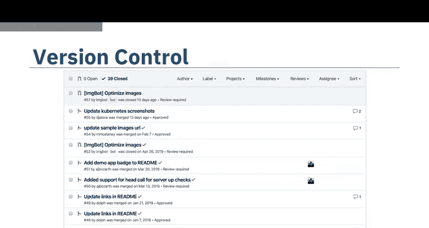

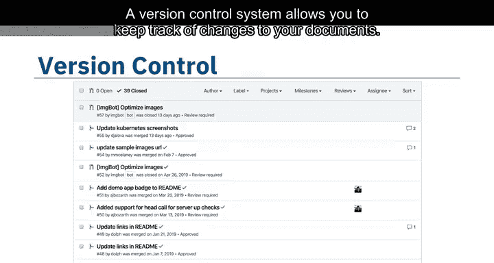

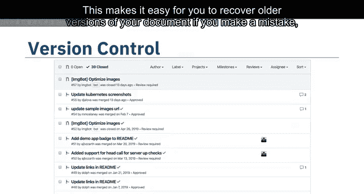

以下是一个例子，用以说明版本控制的工作原理。假设你有一份购物清单，你希望室友确认所需物品并添加其他项目。在没有版本控制的情况下，你在购物前会面临一团混乱的局面。

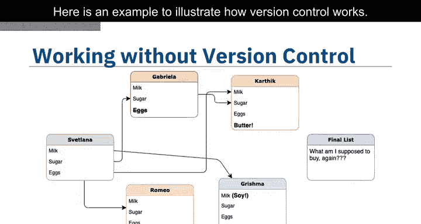

使用版本控制后，在每个人都贡献了他们的想法后，你就能确切地知道需要什么。

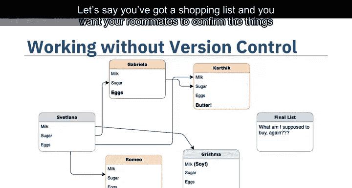

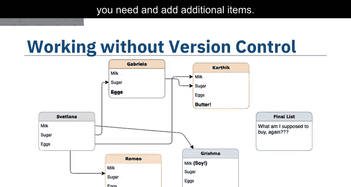

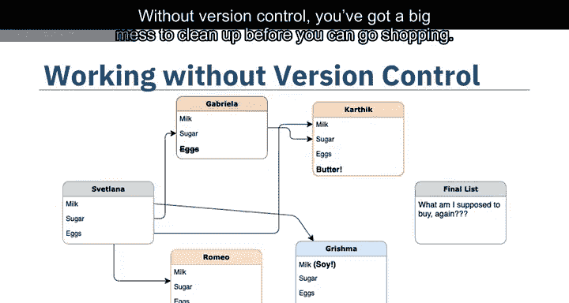

Git是在新通用公共许可证下分发的免费开源软件。Git是一个分布式版本控制系统，这意味着世界各地的用户都可以在他们自己的计算机上拥有你项目的副本。当他们进行了更改后，可以将他们的版本同步到远程服务器，与你分享。

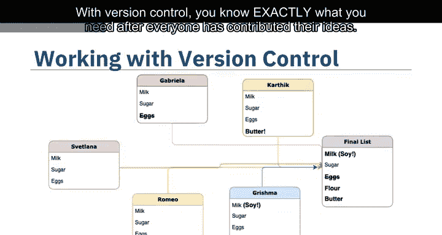

Git并非唯一的版本控制系统，但其分布式特性是它成为目前最常用版本控制系统之一的主要原因。

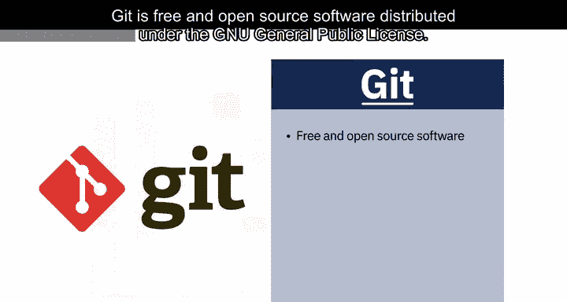

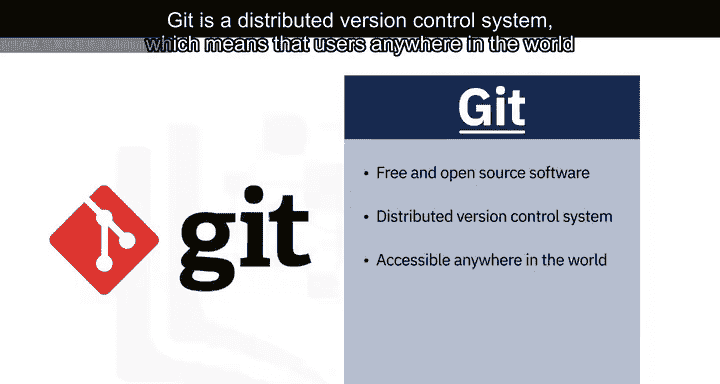

版本控制系统广泛用于涉及代码的事务，但你也可以对图像、文档和任何数量的文件类型进行版本控制。

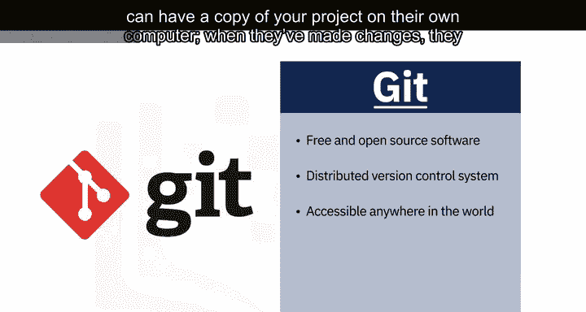

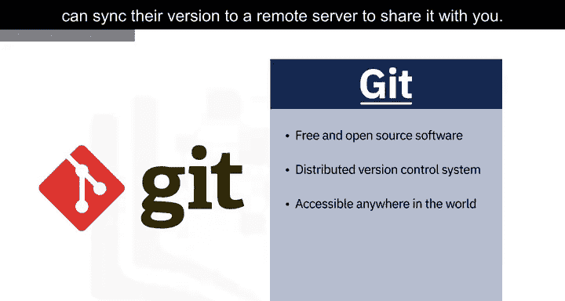

你可以通过命令行界面在没有Web界面的情况下使用Git，但GitHub是最受欢迎的Git仓库Web托管服务之一。

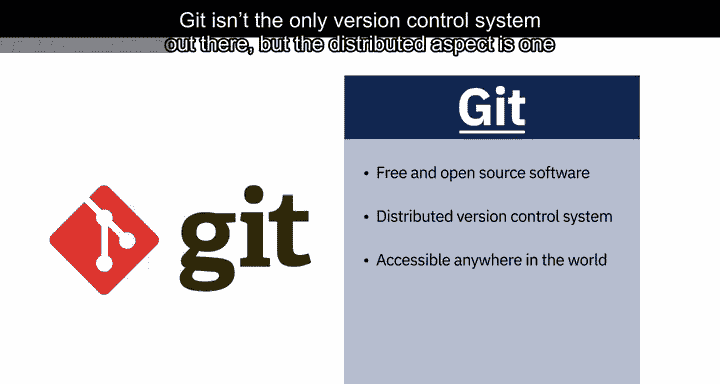

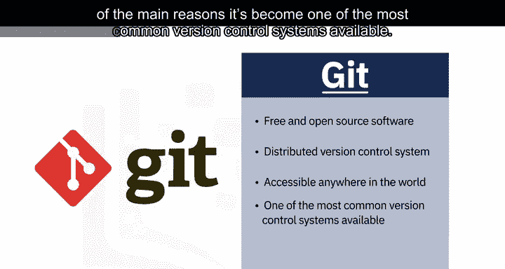

其他类似的托管服务包括GitLab、Bitbucket和Beanstalk。

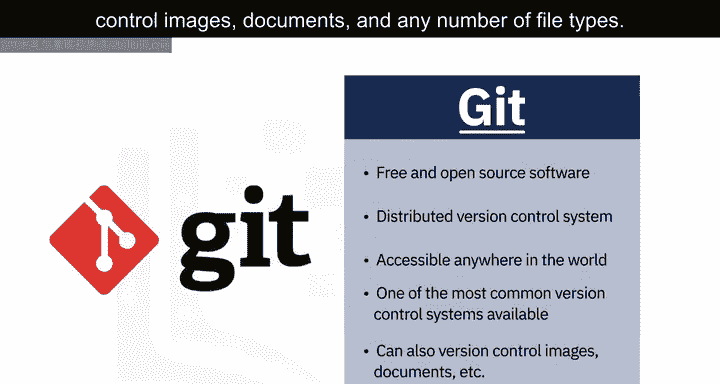

在开始之前，你需要了解一些基本术语。

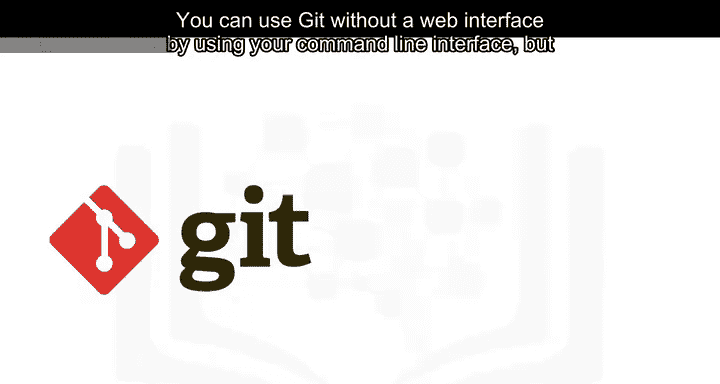

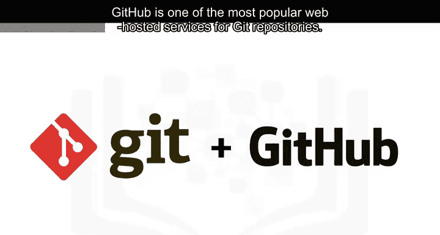

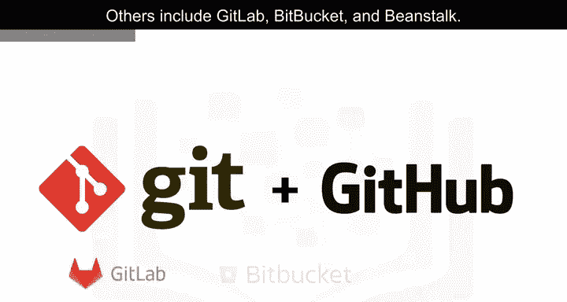

SSH协议是一种用于从一台计算机安全远程登录到另一台计算机的方法。仓库包含你为版本控制而设置的项目文件夹。分支是仓库的一个副本。拉取请求是你请求他人在你的更改最终确定之前进行审查和批准的方式。

工作目录包含你计算机上与Git仓库关联的文件和子目录。

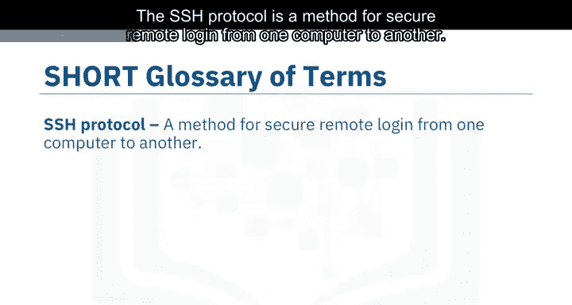

在开始使用新仓库时，有几个基本的Git命令你会经常用到。你只需要创建一次，可以在本地创建然后推送到GitHub，或者通过使用`git init`命令克隆一个现有的仓库。

`git add`命令将更改从工作目录移动到暂存区。`git status`命令允许你查看工作目录的状态以及更改的暂存快照。

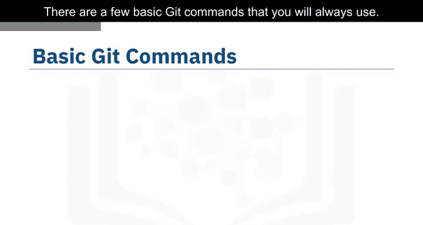

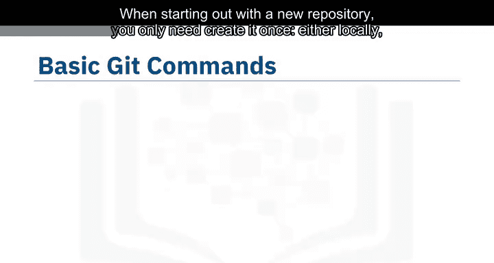

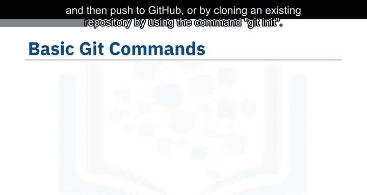

`git commit`命令获取你更改的暂存快照，并将它们提交到项目中。

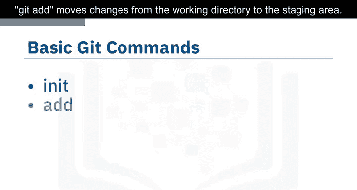

`git reset`命令撤销你对工作目录中文件所做的更改。

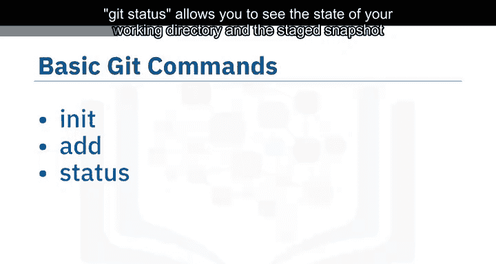

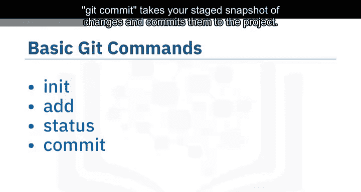

`git log`命令使你能够浏览项目之前的更改。

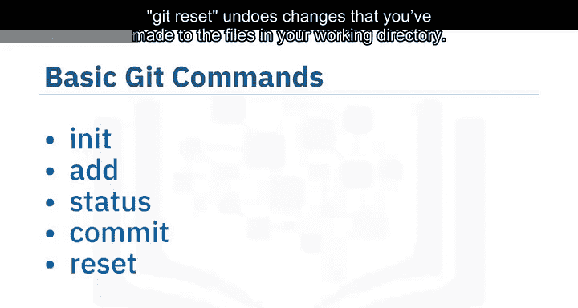

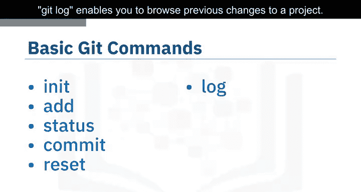

`git branch`命令让你在仓库内创建一个隔离的环境来进行更改。

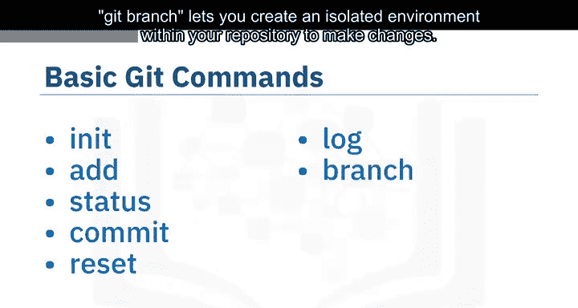

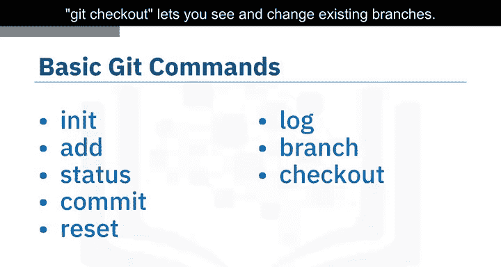

`git checkout`命令让你查看和切换现有的分支。`git merge`命令让你将所有内容重新整合在一起。

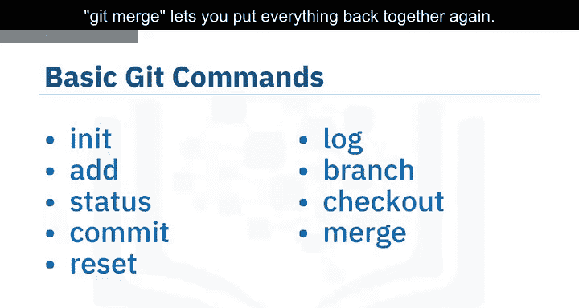

要学习如何有效使用Git并开始与全球的数据科学家协作，你需要掌握这些基本命令。幸运的是，GitHub提供了出色的资源来帮助你入门。访问try.github.io下载备忘单并完成教程。在接下来的模块中，我们将为你提供一个关于设置本地环境并开始项目的速成课程。

本节课中我们一起学习了Git与GitHub的核心概念、基本术语和常用命令。理解版本控制是有效协作和管理项目的基础。通过掌握这些工具，你将能够更好地跟踪项目变化并与他人高效合作。