# 025：GitHub入门指南

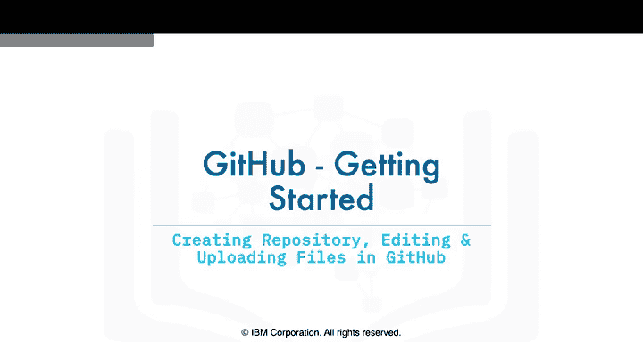

在本节课中，我们将学习如何使用GitHub的网页界面进行基本操作，包括创建仓库、编辑文件以及提交更改。这些是使用GitHub进行版本控制和协作的基础。

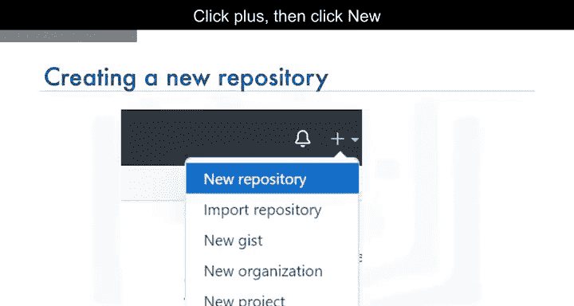

---

在上一节视频中，我们学习了Git和GitHub的基本概念。在继续本节内容之前，请确保你已经注册并登录了GitHub账户。

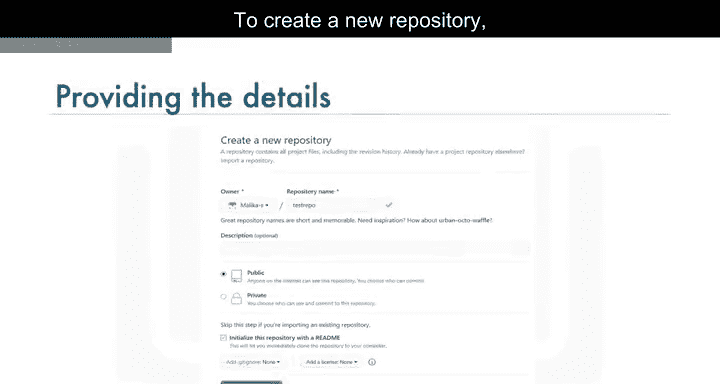

让我们从创建一个新的仓库开始。点击页面右上角的加号（+），然后选择“New repository”。

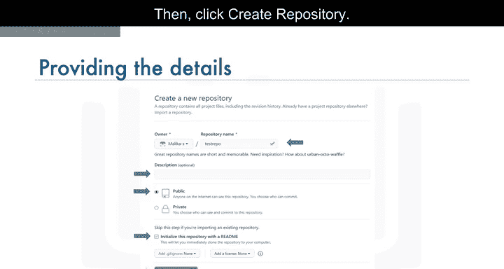

要创建一个新仓库，你需要提供以下信息：
*   为你的新仓库命名。
*   可选地，添加一段仓库描述。
*   选择仓库的可见性，即公开（Public）或私有（Private）。
*   选择“Initialize this repository with a README”选项，以便初始化一个README文件。
*   最后，点击“Create repository”按钮。

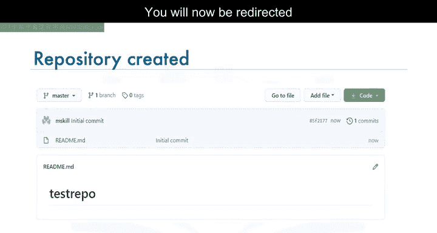

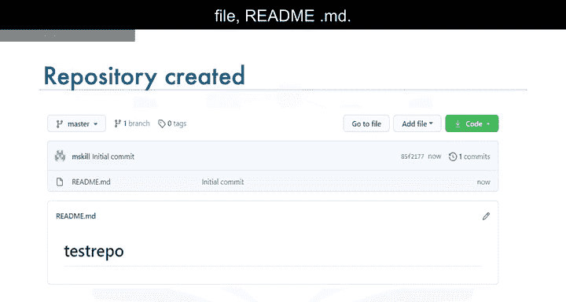

创建完成后，页面会自动跳转到你新建的仓库。仓库的根目录默认会列出，目前只有一个文件：`README.md`。

---

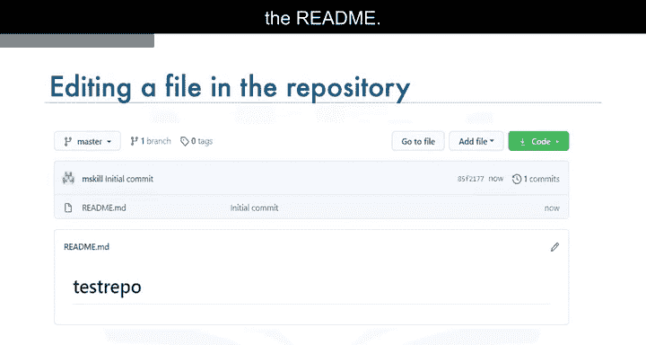

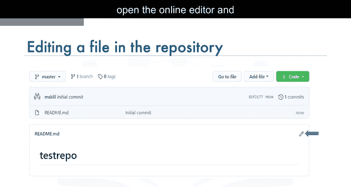

现在，我们来学习如何编辑README文件。你可以在浏览器中直接完成这个操作。点击文件旁边的铅笔图标，即可打开在线编辑器，然后修改README文件中的文本。

要将你的更改保存到仓库，你必须在修改后提交它们。滚动到页面底部的“Commit changes”部分。添加一条提交信息，并可选地添加详细描述。然后点击“Commit changes”按钮。

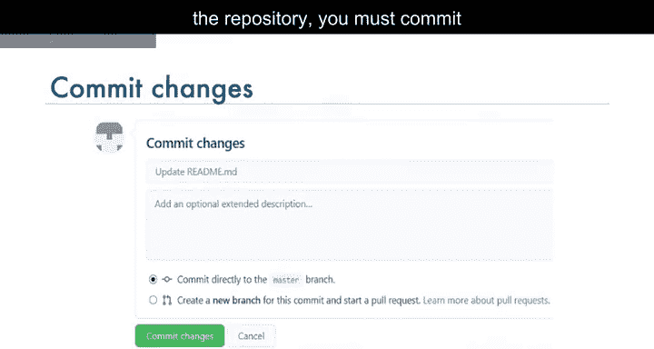

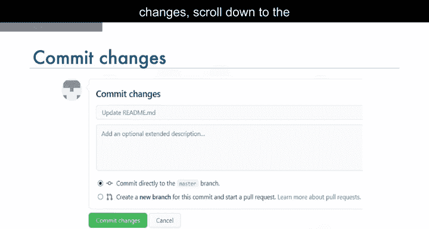

“Commit changes”操作用于将你的更改保存到仓库。

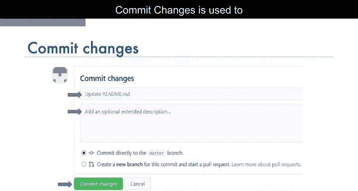

点击仓库名称链接，可以回到仓库的主页。请注意，README文件已经更新，你可以在此验证你的更改。

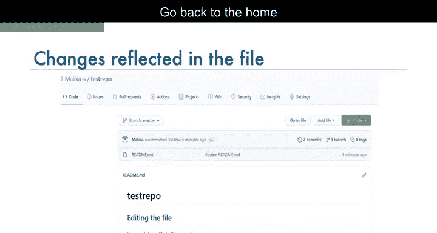

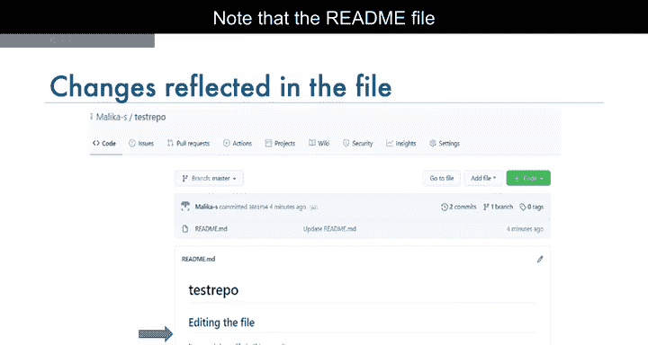

---

接下来，我们学习如何使用GitHub内置的、在浏览器中运行的网页编辑器来创建一个新文件。点击“Add file”按钮，然后选择“Create new file”来创建新文件。

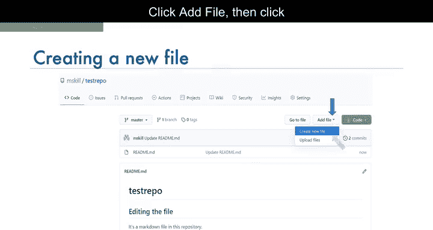

要创建一个名为`firstPython.py`的Python文件，首先需要提供文件名。接着，添加一段描述代码的注释，然后编写你的代码。

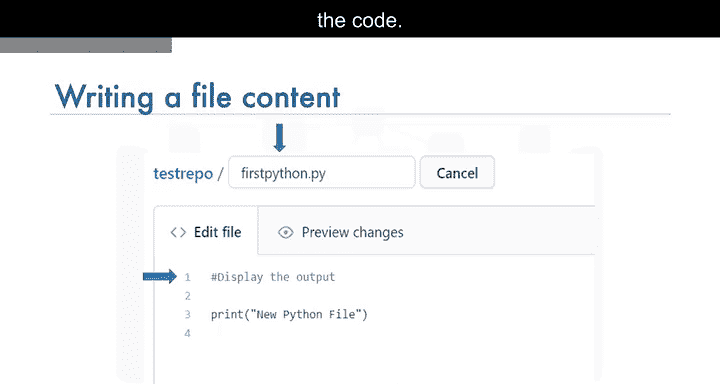

完成后，将更改提交到仓库。

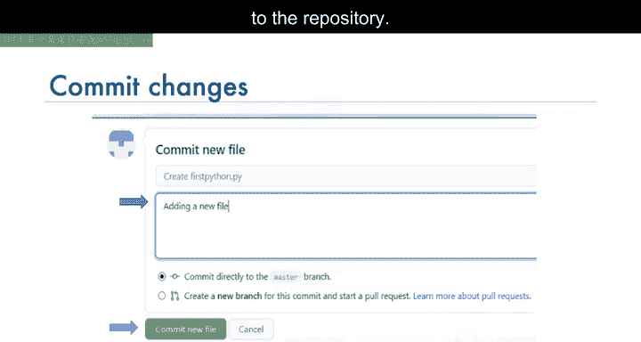

现在你可以看到，你的文件已经被添加到仓库中。仓库列表会显示文件是何时被添加或修改的。

当你需要修改文件时，可以再次编辑它。点击文件名，然后点击铅笔图标，进行编辑并提交更改。

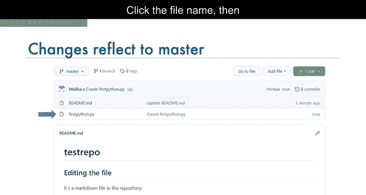

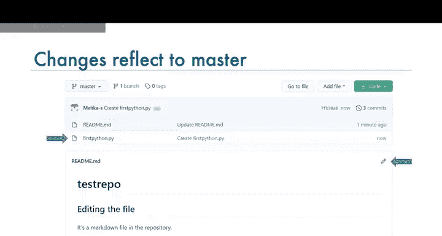

---

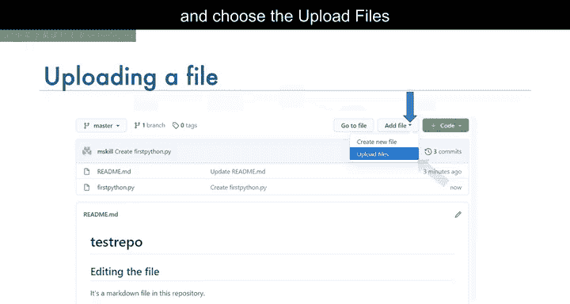

你还可以将本地系统中的文件上传到仓库。在仓库主页，点击“Add file”按钮，然后选择“Upload files”选项。

点击“Choose your files”，从你的本地系统中选择想要上传的文件。

文件上传过程可能需要一点时间，具体取决于你上传的内容。一旦文件上传完成，点击“Commit changes”。现在，仓库中就会反映出你上传的文件。

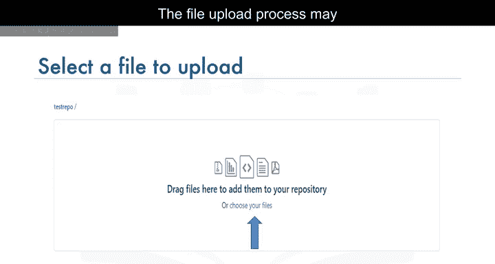

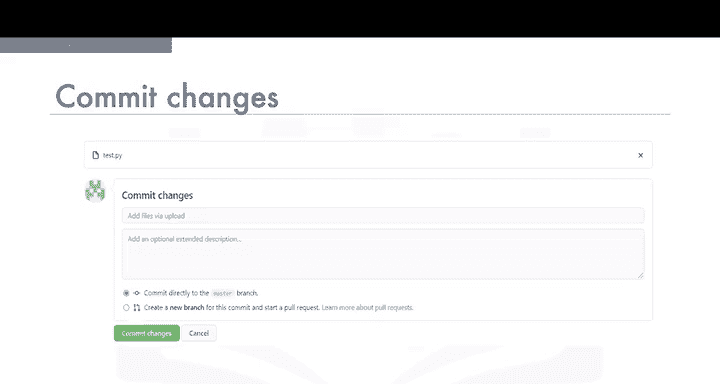

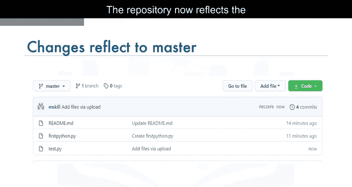

---

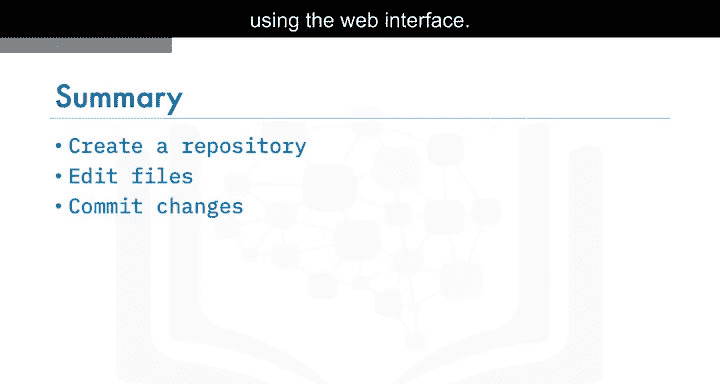

在本节课中，我们一起学习了如何使用GitHub的网页界面创建仓库、编辑文件以及提交更改。这些是管理代码和项目版本的基础操作，为后续更深入的协作和版本控制打下了基础。