# 027：数据科学工具 - P27 🛠️ 命令行操作Git与GitHub（选修）

在本节课中，我们将学习Git和GitHub的基本概念与操作。Git是一个版本控制系统，用于跟踪代码的变更历史；GitHub则是一个基于Git的代码托管平台。我们将通过命令行来学习如何创建仓库、提交更改以及与远程仓库同步。

---

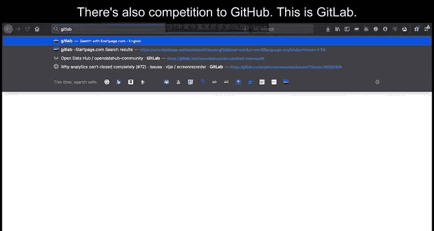

## 概述 📋

本节内容面向Git和GitHub的初学者。我们将介绍如何创建远程仓库、克隆到本地、添加文件、提交更改以及推送更新。这些操作构成了使用Git进行版本控制的基础工作流。

---

## 创建远程仓库 🏗️

首先，我们需要在GitHub上创建一个远程仓库。仓库是存储项目文件的地方。

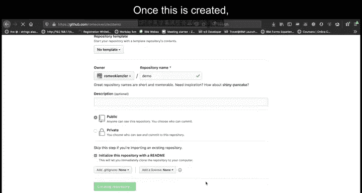

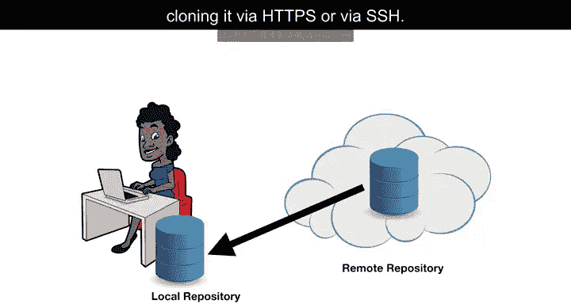

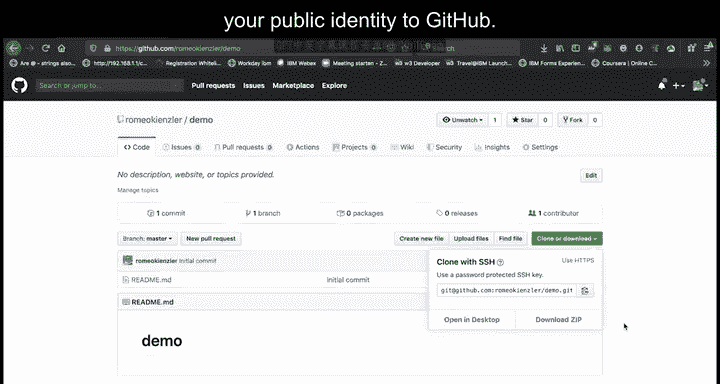

以下是创建仓库的步骤：

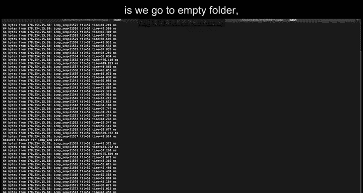

1.  登录GitHub。
2.  点击“New repository”按钮。
3.  为仓库命名，例如 `demo`。
4.  选择仓库的可见性（公开或私有）。
5.  可以选择使用README文件初始化仓库。
6.  点击“Create repository”完成创建。

创建完成后，你将获得一个远程仓库的地址。

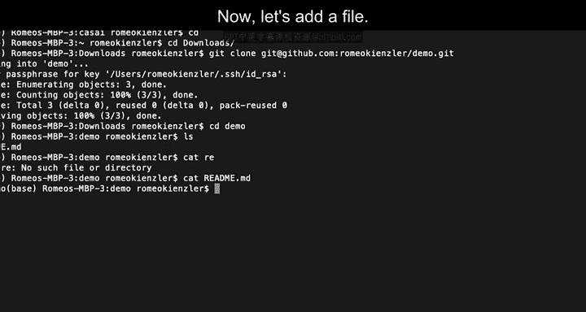

---

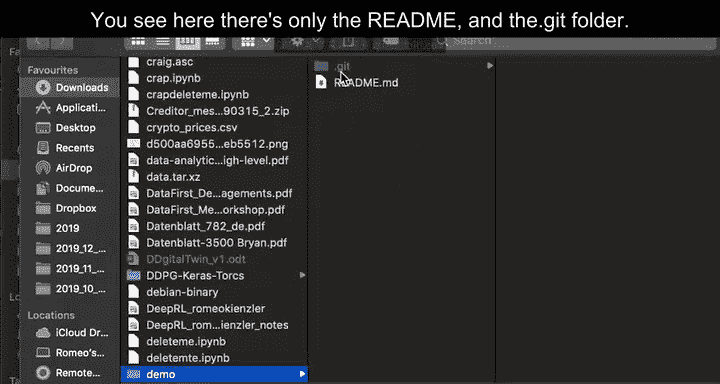

## 克隆仓库到本地 💻

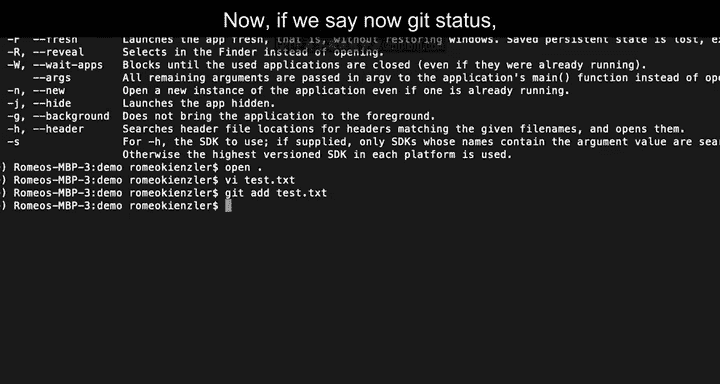

上一节我们创建了远程仓库，本节中我们来看看如何将其复制到本地计算机上。这个过程称为“克隆”。

克隆仓库有两种主要方式：通过HTTPS或SSH协议。使用SSH通常更方便，但需要预先配置SSH密钥。

以下是克隆仓库的命令：
```bash
git clone <repository-url>
```
例如：
```bash
git clone git@github.com:username/demo.git
```
执行此命令后，远程仓库的所有内容将被复制到当前目录下的一个新文件夹中。

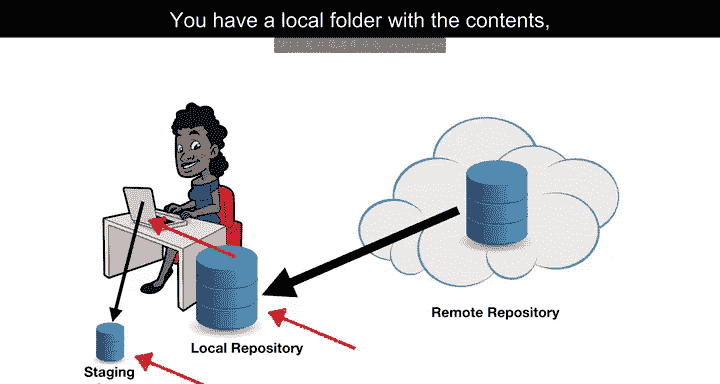

---

## 本地工作流：添加与提交 ✍️

现在，我们已经在本地拥有了仓库的副本。接下来，我们学习如何在本地进行修改并保存这些更改。

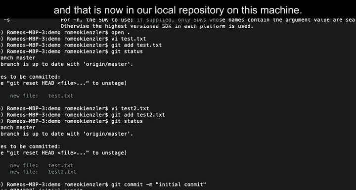

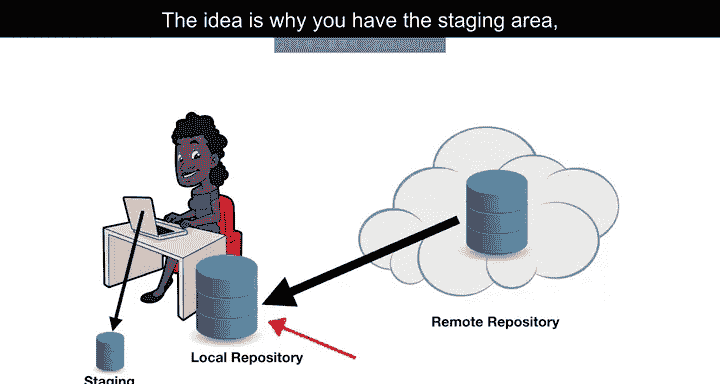

Git的工作流涉及几个关键区域：工作目录、暂存区和本地仓库。你首先在工作目录中修改文件，然后将更改添加到暂存区，最后提交到本地仓库。

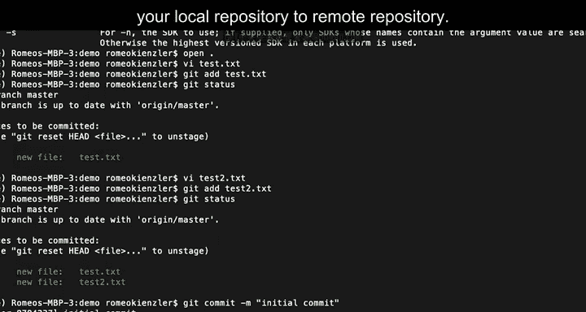

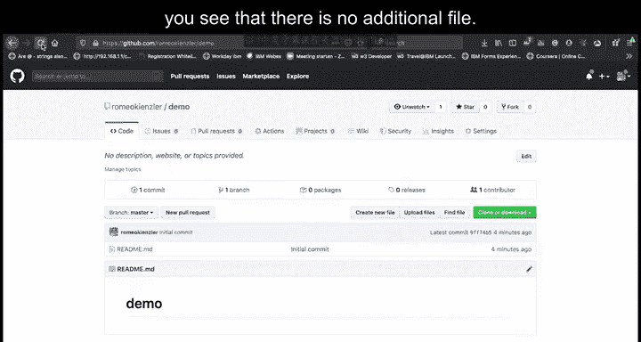

以下是操作步骤：

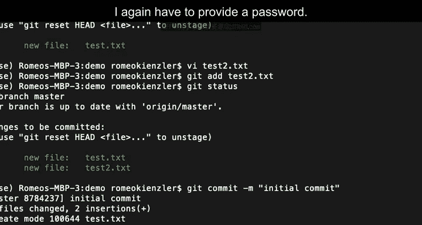

1.  **创建或修改文件**：在本地仓库文件夹中创建新文件或编辑现有文件。
2.  **添加文件到暂存区**：使用 `git add` 命令将文件的更改放入暂存区。你可以添加单个文件或所有更改。
    ```bash
    git add filename.txt
    # 或添加所有更改
    git add .
    ```
3.  **检查状态**：使用 `git status` 命令查看哪些文件已被暂存。
4.  **提交更改**：使用 `git commit` 命令将暂存区的更改永久保存到本地仓库。每次提交都需要一个描述性的消息。
    ```bash
    git commit -m "描述此次提交的信息"
    ```
暂存区的存在让你可以精确控制哪些更改被包含在一次提交中。

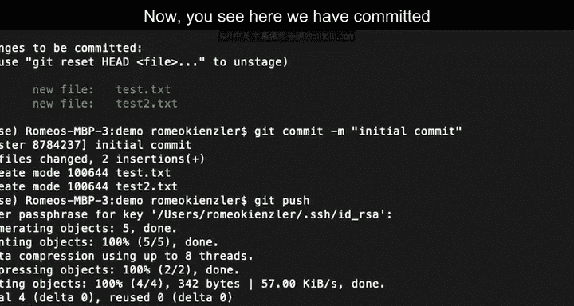

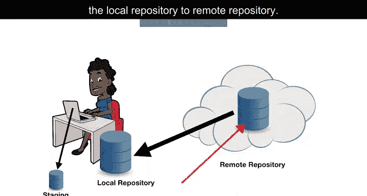

---

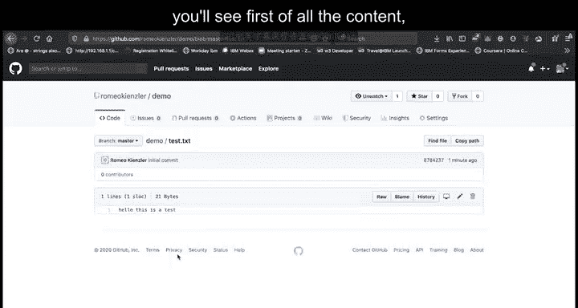

## 同步到远程仓库 🔄

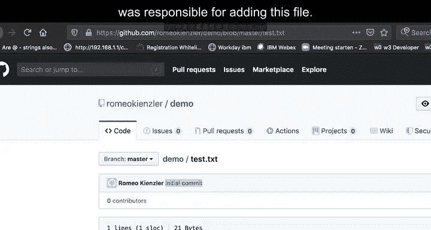

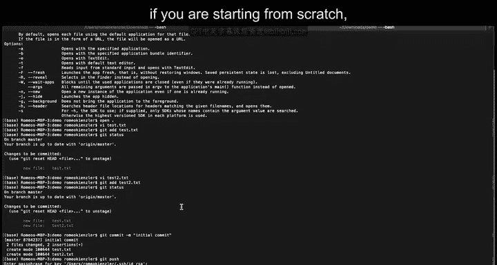

我们已经将更改提交到了本地仓库。为了让其他人看到这些更改，或者在不同设备间同步，我们需要将本地提交推送到远程仓库。

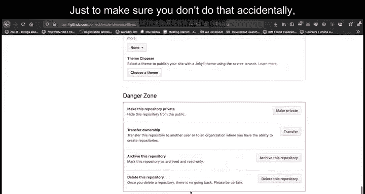

以下是推送命令：
```bash
git push
```
执行此命令后，本地仓库的提交历史将被上传到GitHub上的远程仓库。其他人现在可以拉取这些更新。

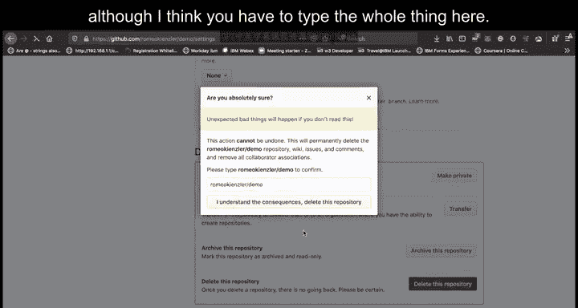

你可以返回GitHub网站，刷新仓库页面，确认新文件或更改已经出现。

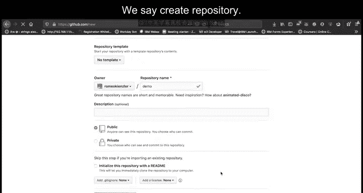

---

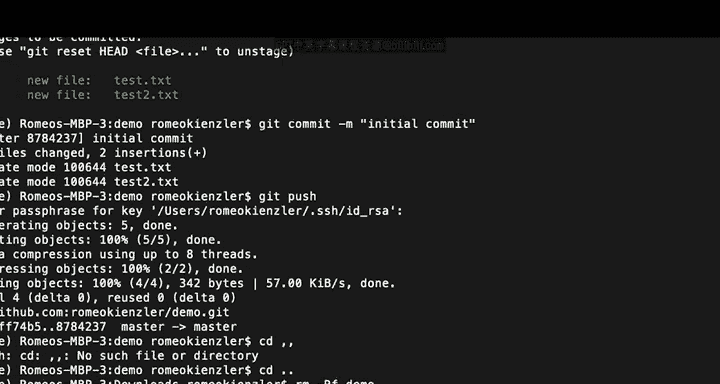

## 从零初始化本地仓库 🆕

除了克隆现有仓库，你也可以先初始化一个本地Git仓库，然后将其与一个新的远程仓库关联。

以下是操作步骤：

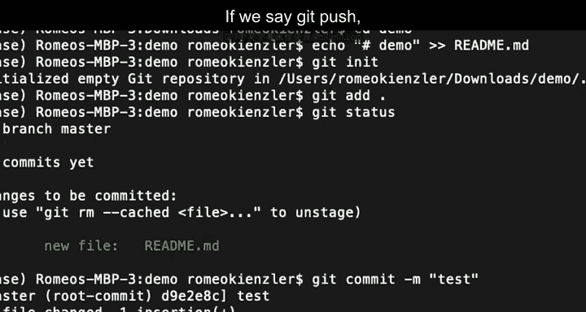

1.  **初始化本地仓库**：在一个空文件夹中，运行 `git init` 命令。这会创建一个隐藏的 `.git` 文件夹，用于管理版本控制。
    ```bash
    git init
    ```
2.  **添加文件并提交**：与之前一样，创建文件，使用 `git add` 和 `git commit` 命令。
3.  **关联远程仓库**：使用 `git remote add` 命令告诉本地仓库远程仓库的地址。
    ```bash
    git remote add origin <remote-repository-url>
    ```
4.  **首次推送**：由于是第一次推送，需要使用 `-u` 参数设置上游分支。
    ```bash
    git push -u origin master
    ```
这样，一个全新的本地项目就与远程仓库建立了连接。

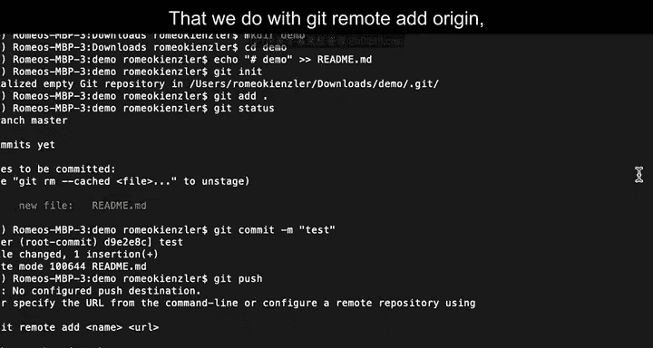

---

## 总结 🎯

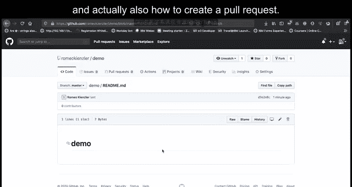

本节课中我们一起学习了Git和GitHub的基础命令行操作。我们涵盖了从创建远程仓库、克隆项目到本地，到在本地进行添加、提交更改，最后将更改推送回远程仓库的完整流程。我们还了解了如何从零开始初始化一个本地仓库并与远程仓库关联。掌握这些核心操作是进行协作开发和版本控制的第一步。在接下来的课程中，我们将学习更高级的主题，如分支管理和拉取请求。