# 028：命令行分支与合并（选修）📚

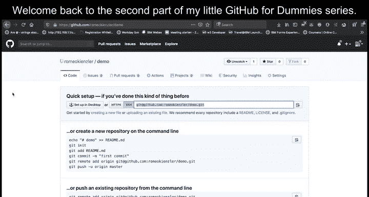

在本节课中，我们将学习如何使用Git命令行进行分支创建、切换、同步远程更改以及将分支合并回主分支。这些是团队协作和项目管理中的核心技能。

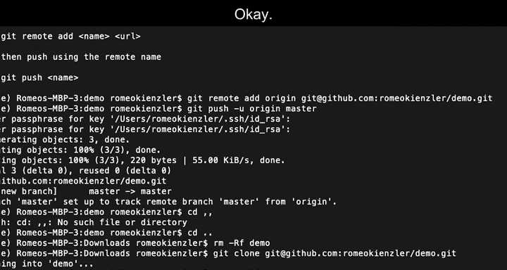

上一节我们介绍了Git的基本操作，本节中我们来看看如何处理远程仓库的更新以及如何使用分支进行独立开发。

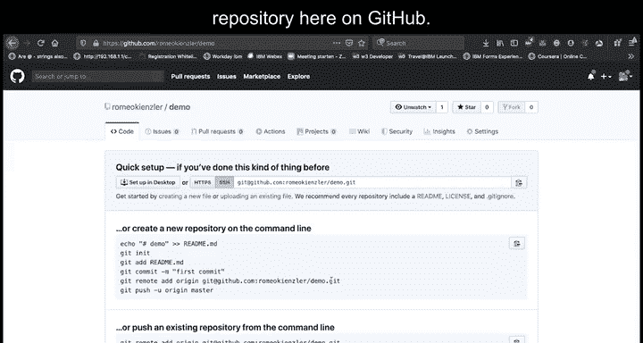

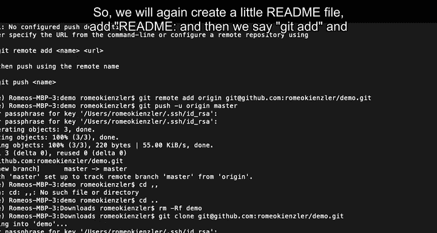

## 同步远程仓库更改 🔄

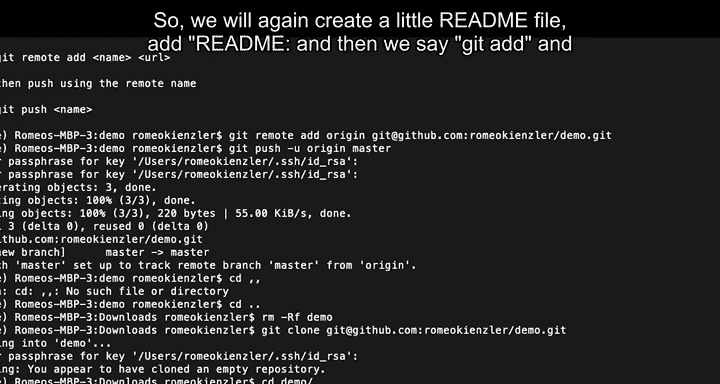

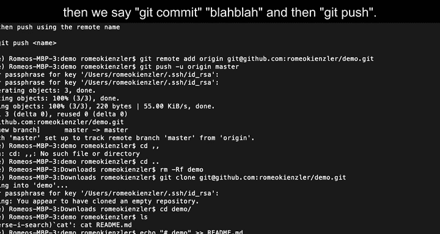

当其他协作者向远程仓库推送了新的更改时，你需要将这些更改拉取到你的本地仓库以保持同步。

以下是操作步骤：

1.  假设远程仓库最初是空的。我们首先在本地创建一个 `README.md` 文件，并将其推送到远程仓库。
    ```bash
    echo "# My Project" > README.md
    git add README.md
    git commit -m "Initial commit with README"
    git push origin master
    ```

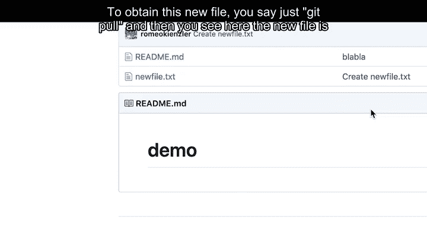

2.  接着，另一位协作者（或你自己在GitHub网页上）在远程仓库直接创建了一个名为 `newfile.txt` 的新文件。此时，你的本地仓库还没有这个文件。

3.  为了获取远程仓库的最新内容，你只需执行 `git pull` 命令。
    ```bash
    git pull origin master
    ```
    执行后，`newfile.txt` 文件就会出现在你的本地工作目录中。

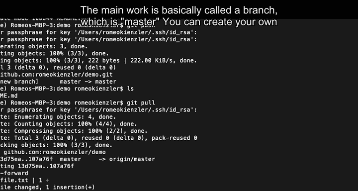

## 创建与使用分支 🌿

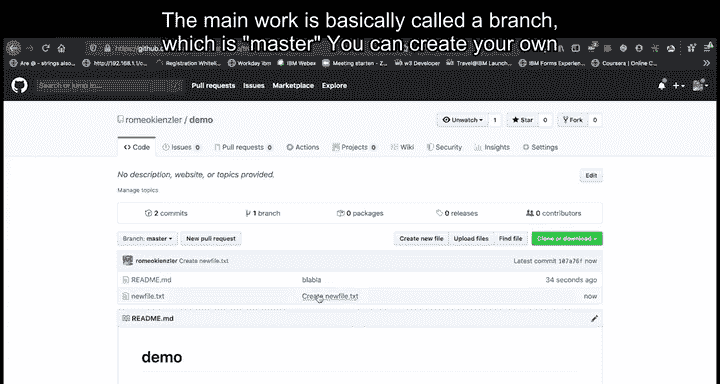

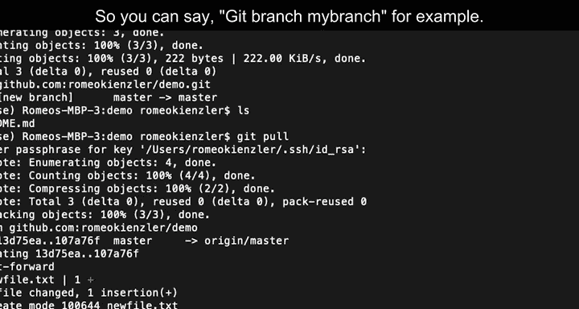

在进行大型项目开发时，为了避免干扰主线的稳定工作，你可以创建自己的分支进行独立开发。主线通常被称为 **`master`** 分支。

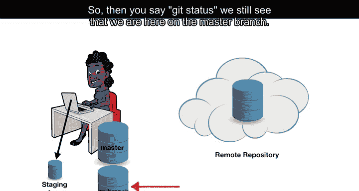

以下是创建和使用分支的步骤：

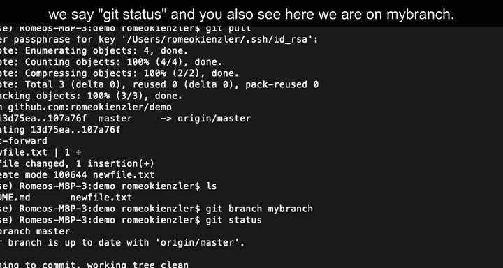

1.  首先，创建一个名为 `my-branch` 的新分支。
    ```bash
    git branch my-branch
    ```

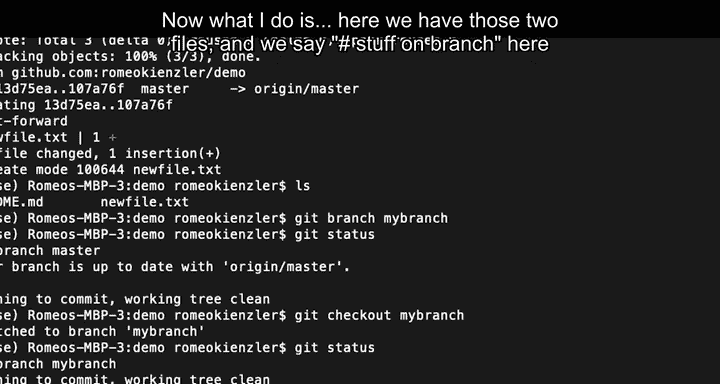

2.  创建分支后，使用 `git checkout` 命令切换到新分支。
    ```bash
    git checkout my-branch
    ```
    使用 `git status` 命令可以确认当前已切换到 `my-branch` 分支。

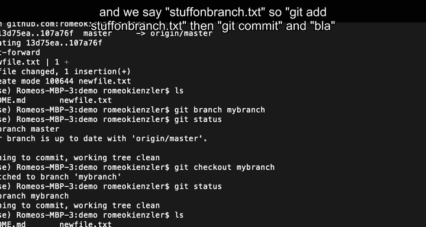

3.  在新分支上进行开发。例如，创建一个新文件并提交。
    ```bash
    echo "Work in progress..." > stuff_on_branch.txt
    git add stuff_on_branch.txt
    git commit -m "Added work on my branch"
    ```

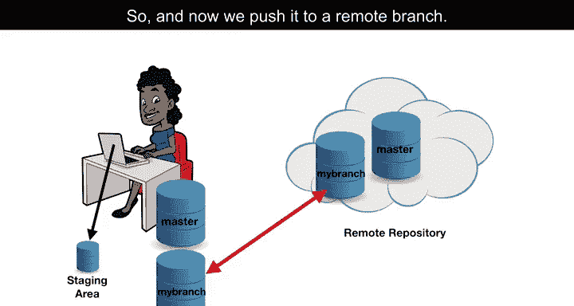

4.  首次将本地分支推送到远程仓库时，需要建立追踪关系。
    ```bash
    git push -u origin my-branch
    ```
    现在，远程仓库也会出现一个 `my-branch` 分支，并且包含了 `stuff_on_branch.txt` 文件，而 `master` 分支则没有这个文件。

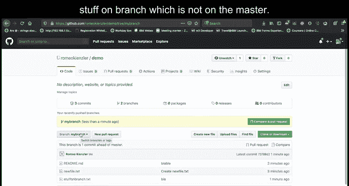

## 合并分支回主线 🔀

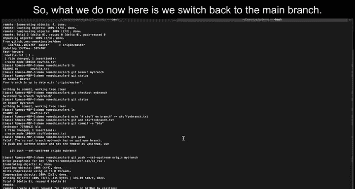

当你在分支上的工作完成后，需要将其合并回主分支（`master`）。

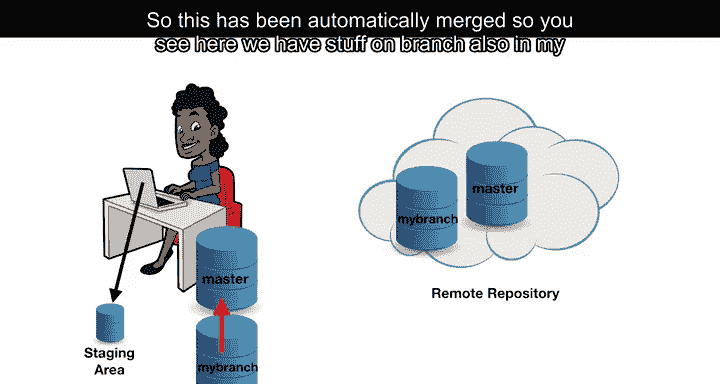

以下是合并分支的步骤：

1.  首先，切换回主分支 `master`。
    ```bash
    git checkout master
    ```

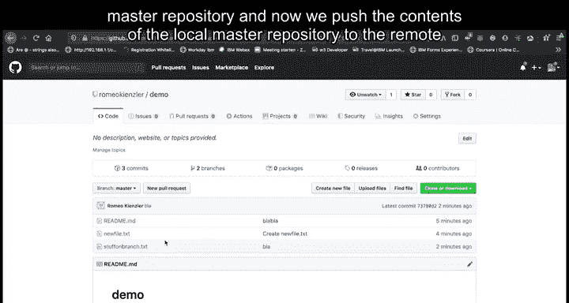

2.  然后，执行 `git merge` 命令，将 `my-branch` 分支的更改合并到当前所在的 `master` 分支。
    ```bash
    git merge my-branch
    ```
    如果合并顺利，你会看到 `stuff_on_branch.txt` 文件现在也出现在了本地的 `master` 分支目录中。

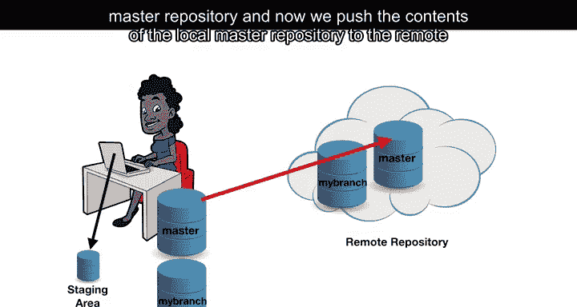

3.  最后，将本地 `master` 分支的更新推送到远程仓库，完成整个合并过程。
    ```bash
    git push origin master
    ```
    刷新远程仓库页面，你会看到 `master` 分支现在也包含了来自 `my-branch` 分支的文件。

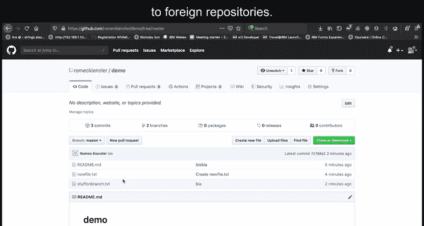

本节课中我们一起学习了如何拉取远程更新、创建独立的分支进行开发，以及如何将分支的成果合并回主分支。这个过程实现了从本地分支到本地主线，再到远程主线的完整工作流。在下一节课中，我们将学习如何创建拉取请求（Pull Request）并为外部开源项目做贡献。