# 029：通过Pull Request参与协作（选修）

在本节课中，我们将学习如何在GitHub上通过Fork仓库、提交更改以及创建Pull Request来参与开源项目的协作。这是参与开源社区贡献的标准工作流程。

---

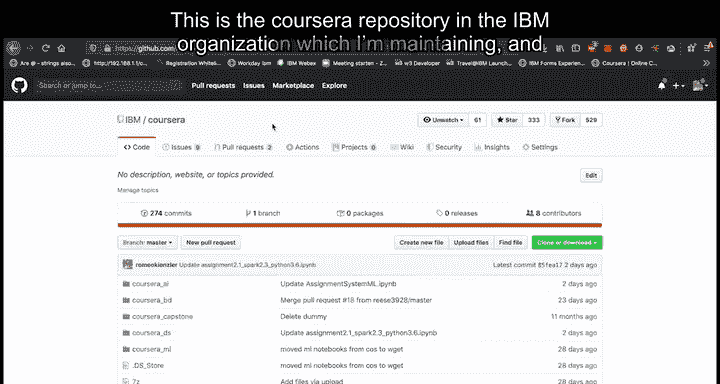

## 概述

上一节我们介绍了Git的基本操作。本节中我们来看看如何参与到他人维护的项目中。我们将学习三个核心步骤：Fork（复制）一个仓库到自己的账户，在本地进行修改并提交，最后通过创建Pull Request将你的修改提议合并回原始项目。

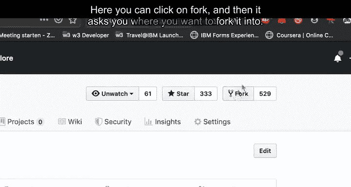

---

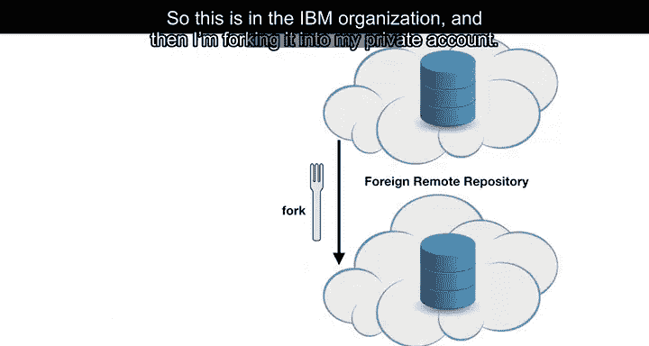

## 第一步：Fork项目仓库

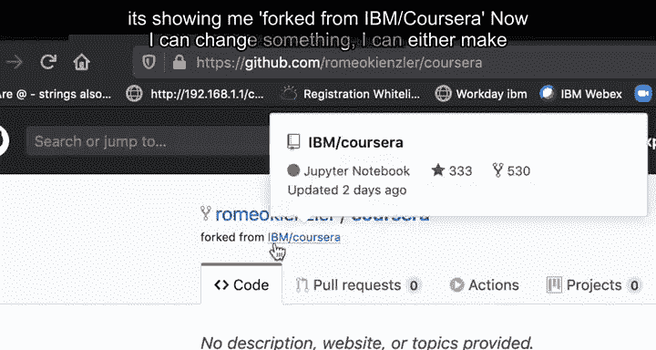

首先，你需要找到想要贡献的项目。例如，假设你想为IBM组织下的“Coursera”仓库修复一个错误。

以下是Fork仓库的步骤：

1.  访问目标仓库页面。
2.  点击页面右上角的 **Fork** 按钮。
3.  选择将仓库复制到你的个人账户。

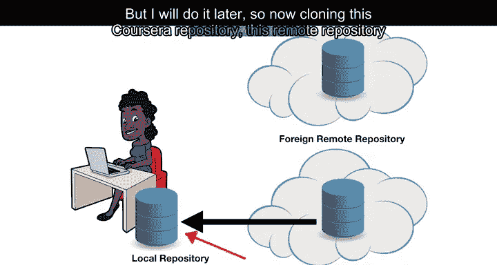

完成此操作后，你将在自己的账户下拥有一个原仓库的完整副本。这个副本就是你独立工作的起点。

---

## 第二步：配置SSH密钥（可选但推荐）

为了安全地克隆和推送代码，建议配置SSH密钥进行身份验证。

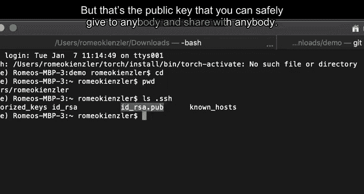

以下是配置SSH密钥的步骤：

1.  在本地终端生成SSH密钥对。命令通常为：`ssh-keygen -t rsa -b 4096 -C "your_email@example.com"`
2.  生成的私钥（如 `id_rsa`）需妥善保管，切勿泄露。
3.  将公钥（如 `id_rsa.pub`）的内容添加到你的GitHub账户设置中（Settings -> SSH and GPG keys）。

添加后，你就可以通过SSH协议安全地与GitHub进行通信。

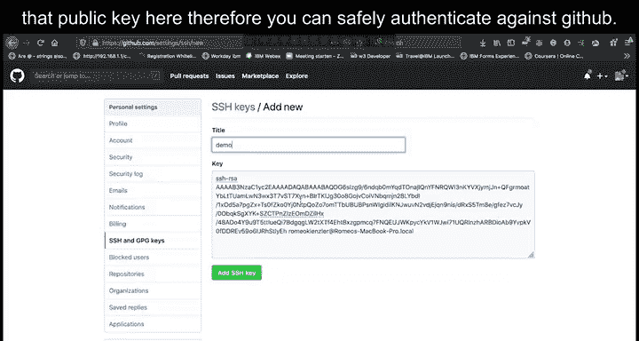

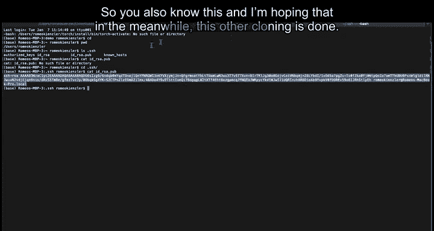

---

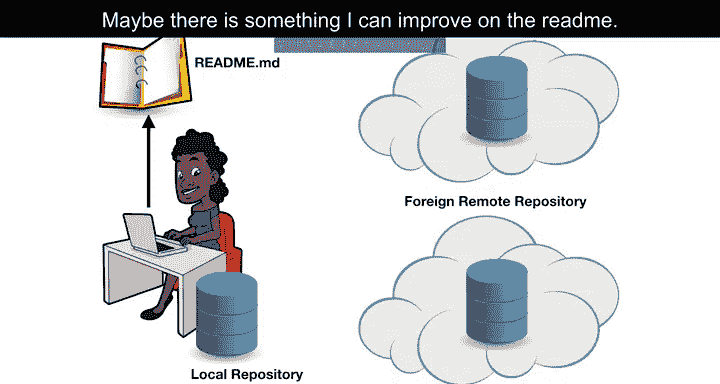

## 第三步：克隆仓库与本地修改

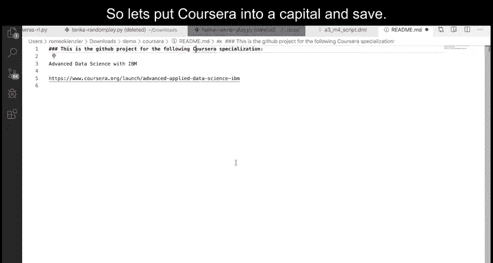

现在，你可以将你Fork的仓库克隆到本地进行修改。

以下是克隆和修改的步骤：

1.  使用 `git clone` 命令克隆你的Fork仓库到本地。
2.  在本地找到需要修改的文件并进行编辑。例如，修改 `README.md` 文件中的一个拼写错误。
3.  使用 `git add` 命令将修改的文件加入暂存区。
4.  使用 `git commit -m “你的提交信息”` 命令提交更改。提交信息应清晰描述修改内容。
5.  使用 `git push` 命令将本地提交推送到你远程的Fork仓库。

此时，修改仅存在于你的Fork仓库中，尚未影响到原始项目。

---

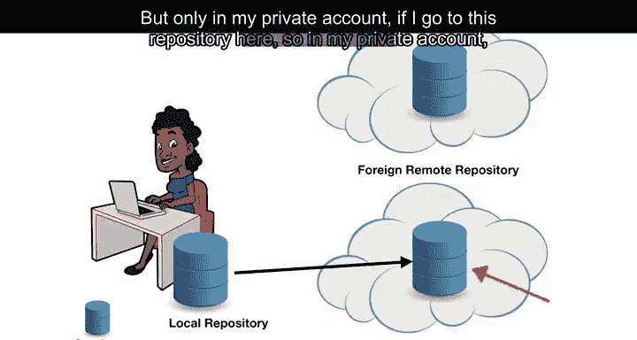

## 第四步：创建Pull Request

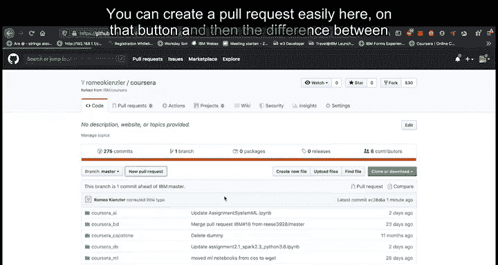

最后一步是向原始项目的维护者提议合并你的修改。

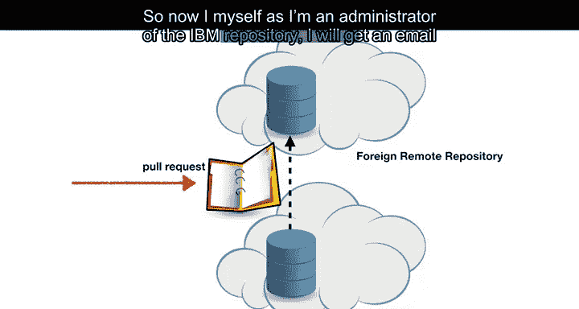

以下是创建Pull Request的步骤：

1.  在你的Fork仓库页面上，点击 **Pull request** 或 **Compare & pull request** 按钮。
2.  GitHub会自动比较你的分支与原始项目分支的差异。
3.  确认差异无误后，填写Pull Request的标题和描述，清晰地说明你的修改内容和原因。
4.  点击 **Create pull request** 提交申请。

提交后，原始项目的维护者会收到通知，并可以审查你的代码更改。如果被接受，你的修改就会被合并到原始项目中。

---

## 总结

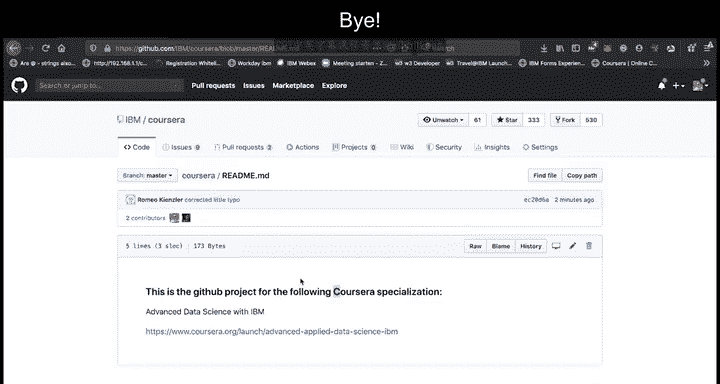

本节课我们一起学习了参与开源协作的完整流程。我们掌握了如何Fork一个项目仓库到自己的账户，如何在本地进行修改和提交，以及最终如何通过创建Pull Request将贡献提交给原项目维护者进行审核。掌握这个流程，是成为开源社区积极贡献者的关键一步。