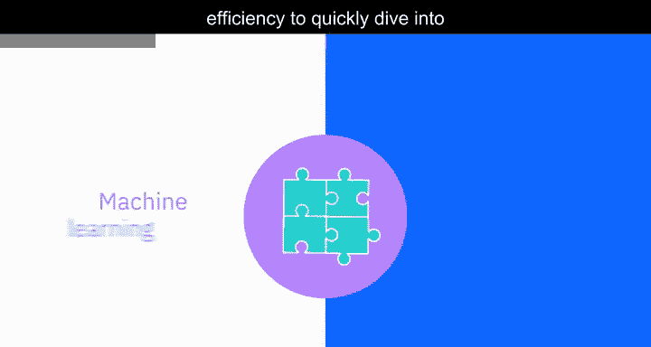
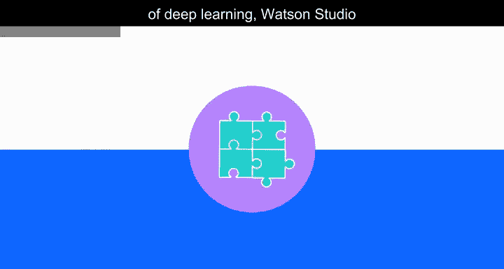
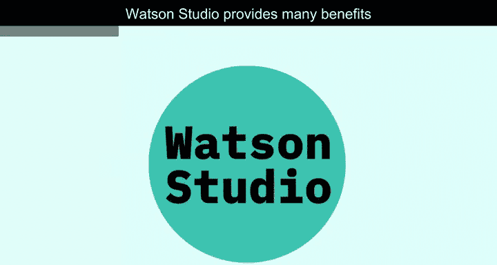
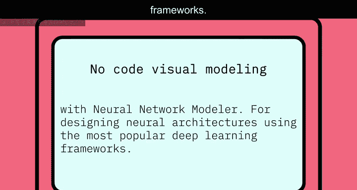
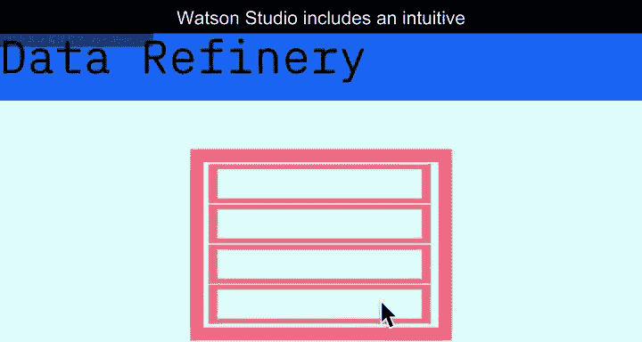
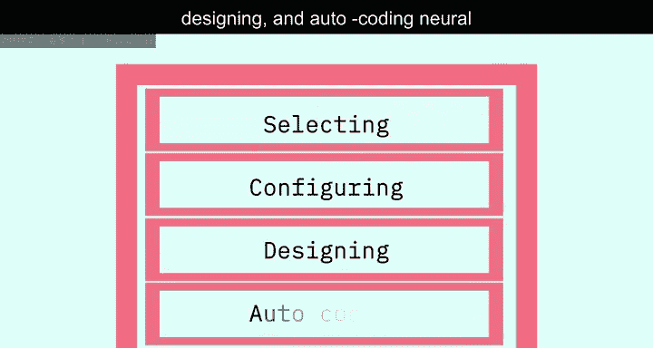
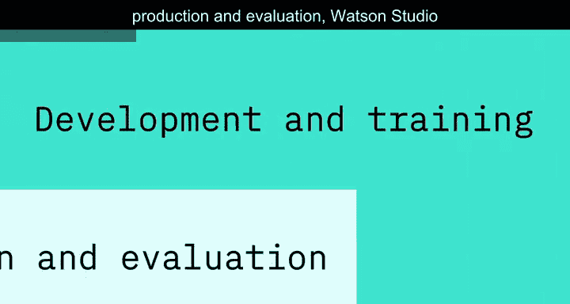
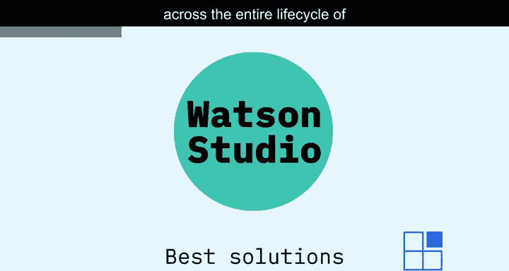

# 030：IBM Watson Studio简介 🚀

在本节课中，我们将学习IBM Watson Studio，这是一个旨在简化数据科学和机器学习工作流程的集成平台。我们将了解它如何帮助团队更高效地协作，并利用各种工具从数据中提取价值。

---

每个企业都希望更智能地工作。为此，企业需要利用其最宝贵的资源：数据。然而，从数据中提取全部价值并非易事。

首先，企业通常需要同时管理大量复杂的工具，这些工具用于查找和清洗数据、分析并生成数据可视化，以及使用数据构建和部署机器学习模型。

更复杂的是，这些工具通常需要大量时间进行单独管理，并且难以集成到现有系统中，这会严重拖慢工作流程。

但有了Watson Studio，情况就不同了。它通过一个简化的流程来简化您的数据项目，帮助您从数据中提取价值和洞察，从而让您的业务更快、更智能地发展。它提供了一个易于使用的协作式数据科学和机器学习环境，让您可以在一个地方完成模型构建与训练、数据准备与分析以及洞察共享。

上一节我们提到了传统数据科学工具的复杂性，本节中我们来看看Watson Studio如何通过其核心功能解决这些问题。

以下是Watson Studio的主要优势：

*   **易于使用的可视化与拖放式编程**：Watson Studio易于创建可视化并使用拖放式代码，将基于数据的决策能力赋予组织中的任何成员，无需IT协助。
*   **集成强大的开源工具**：如果您需要访问开源工具，该环境提供了当前最流行、最强大的一些工具。
*   **高效协作的工作流**：Watson Studio的单一环境创建了极其高效的工作流。数据科学家可以在系统内共享资产并协作解决问题，而无需每次遇到新问题都从头开始。开发人员可以利用这种效率，快速投入到机器学习和深度学习算法的构建中。

在深度学习领域，Watson Studio支持一些最流行的框架，并可以将深度学习部署到最新的GPU上，以加速建模过程。内置的神经网络建模器使环境更易用，即使您没有从头开始构建模型的专门资源，也能通过简化的图形界面构建模型。

Watson Studio还提供了入门模板，帮助您在视觉识别、语言分类等领域快速开始建模，并整合了其他IBM Watson服务的工具。

因为Watson Studio与IBM Watson知识目录（一个智能资产发现工具）无缝集成，您可以将数据和模型转化为可信的企业资源，并在不损害合规性、安全性或访问控制的前提下，充满信心地进行协作。

Watson Studio为组织带来了诸多益处，有助于将人工智能融入业务并推动创新。

以下是Watson Studio支持的一些关键技术与功能：

*   **嵌入式AI服务**：您可以使用嵌入式AI服务（如Watson视觉识别）来训练Watson Studio。
*   **模型定制与部署**：您可以定制模型，并使用开源工具（如Jupyter Notebooks、Anaconda和RStudio）将其部署为API或Core ML。
*   **广泛的代码库支持**：Watson Studio支持大多数流行的代码库。
*   **无代码可视化建模**：通过神经网络建模器进行无代码可视化建模。
*   **深度学习框架**：支持使用最流行的深度学习框架设计神经架构。

在Watson Studio中，您可以使用Data Refinery交互式地发现、清洗和转换数据。它通过内置的图表和统计数据帮助您理解数据的质量和分布，并通过交互式仪表板提供可视化结果。

Watson Studio包含一个直观的拖放界面，使非程序员能够通过可视化选择、配置、设计和自动编码神经网络来加速模型构建过程。

从开发、训练到生产与评估，Watson Studio会随时间跟踪您的模型，确保您为任何给定任务获得最佳性能，从而在机器学习模型的整个生命周期中使用最佳解决方案。

---

本节课中，我们一起学习了IBM Watson Studio。它是一个集成的数据科学与机器学习平台，通过提供协作环境、支持多种开源工具、简化可视化建模以及集成数据清洗和模型管理功能，极大地简化了从数据中提取价值的过程，帮助企业更智能、更高效地运作。