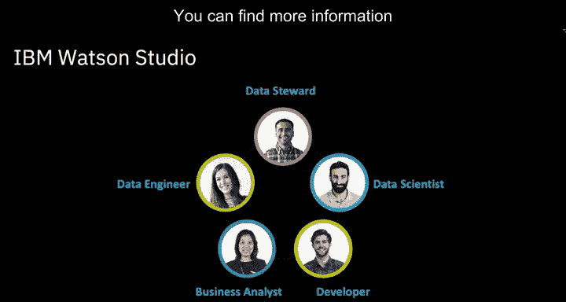
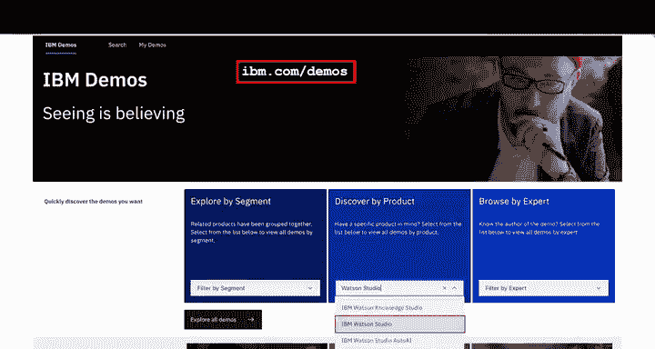
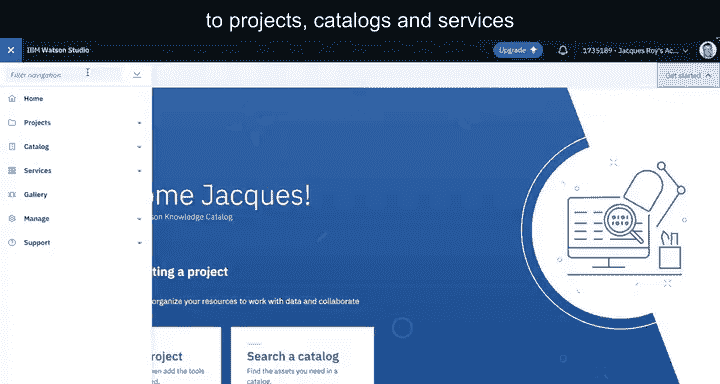
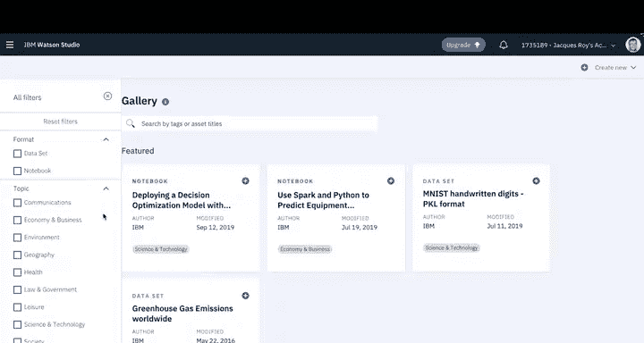
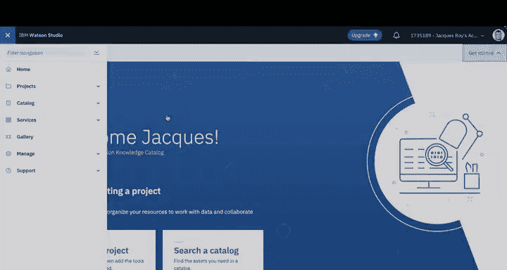
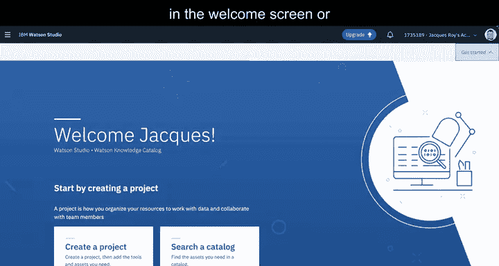
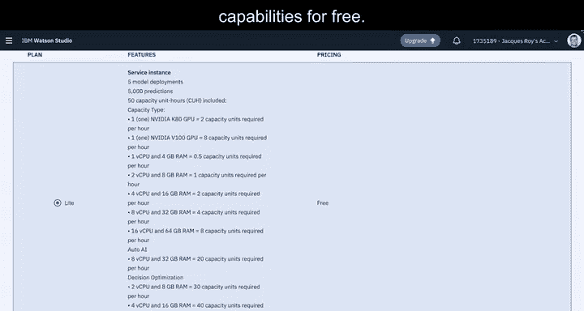

# 031：Watson Studio导论

在本节课中，我们将学习IBM Watson Studio平台的基本概念与核心功能。Watson Studio是一个集成了工具、服务和数据的综合性平台，旨在帮助企业加速向数据驱动型组织转型。我们将从平台概述开始，逐步介绍其界面、协作特性以及关键操作步骤。

---

## 🏢 Watson Studio平台概述

Watson Studio是一个集成的工具、服务和数据平台，帮助企业加速向数据驱动型组织转型。你可以通过免费账户开始探索其功能。

数据科学是一项团队协作的工作。不同类型的人员都对数据科学能够提供的洞察感兴趣，这包括业务分析师、数据工程师、数据管理员、数据科学家和开发人员。数据需要被定位和清洗，模型需要被创建、测试、监控和更新，所有这些都需要团队协作。因此，Watson Studio被构建为一个协作平台，一个志同道合者的社区。

本介绍涵盖内容很多，我们仅触及表面。你可以在IBM官方网站的“数字技术互动”站点（ibm.com/demos）找到更多信息。

---

## 🖥️ 平台界面与导航

登录后，你可能会看到“开始使用”欢迎屏幕。你可以通过点击右上角的“开始使用”按钮来最小化此屏幕。

一个容易错过的重要项目是左上角的“汉堡菜单”按钮。它为你提供直接访问项目、目录和服务等功能的途径。

---

## 🗂️ 资源库与资产管理

资源库特别有趣，它是一个资产集合，包含来自多个来源的教程、笔记本、数据集、文章和论文。新资产会不断添加。

可以使用类型、语言、技术、主题等过滤器搜索资产。

搜索结果可以按功能或日期排序。

“管理”选项让你快速访问特定管理区域。最后，Watson环境中集成了支持和文档。

---

## 🤝 项目协作与管理

如前所述，项目是协作的中心。创建项目非常简单：在欢迎屏幕点击“创建项目”或“新建项目”，然后选择创建空项目或基于现有项目创建。

接着，为项目命名，可能添加描述，然后就可以开始了。在项目层面，我们也有一个选项菜单。

首先是“概览”，你可以查看项目的基本信息。此选项卡还包括一个“自述文件”部分，你可以在其中提供关于项目内容的更多细节。

下一个是“资产”，你可以查看作为项目一部分的数据资产、模型、笔记本和其他资产。你可以使用屏幕顶部的“添加到项目”下拉菜单来添加特定资产。

我们不会深入讨论所有菜单项，但需要了解的一个重要项是“连接”。这允许你访问来自Watson Studio外部的数据。如你所见，它包括许多IBM的数据服务，也有不少来自第三方（如亚马逊和微软）的服务。

回到我们的项目，我想指出“环境”部分。用于数据探索、数据操作和模型创建的一个重要工具是笔记本。根据需要完成的工作量，我们可以选择资源分配。我们还可以定制环境以包含额外的库，从而从一开始就拥有一个完整的环境。

我想再指出顶部菜单中的两个选项：“访问控制”和“设置”。“访问控制”允许你控制协作者及其权限等。在“设置”部分，除其他功能外，你可以添加服务。例如，点击“添加服务”下拉菜单，选择Watson并添加机器学习服务。你可以选择添加之前在其他项目中创建的现有服务，或创建新服务。请注意，大多数服务都包含一个免费的轻量版本，这意味着你可以免费尝试各种功能。

---

## 📝 总结

本节课中，我们一起学习了IBM Watson Studio平台的核心概念与基本操作。我们了解到它是一个促进团队协作的集成平台，涵盖了从数据管理、模型开发到服务部署的多个环节。通过免费账户和丰富的内置资源，初学者可以轻松开始数据科学项目的探索与实践。