# 032：创建Watson Studio账户 🚀

在本节课中，我们将学习如何免费注册并试用IBM Watson平台。我们将逐步完成创建IBM Cloud账户、关联Watson服务以及验证设置的完整流程。

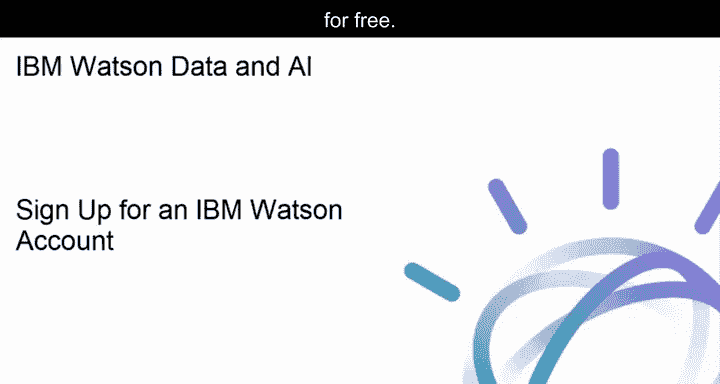

---

IBM Watson为您提供对IBM Watson Studio、IBM Watson Knowledge Catalog、Data Refinery、机器学习与深度学习模型、可视化识别工具、仪表板以及流处理流程的访问权限。

访问 `dataplatform.cloud.ibm.com` 可以注册免费试用。当您注册IBM Watson账户时，系统会自动为您创建一个免费的IBM Cloud账户。

下图展示了注册后将为您配置的Watson应用程序：IBM Watson Studio和IBM Watson Knowledge Catalog。

如果您已经拥有一个IBM Cloud账户，那么可以直接使用您的IBM ID登录IBM Watson。否则，请输入您的电子邮件地址，系统将用它为您创建一个IBM Cloud账户。

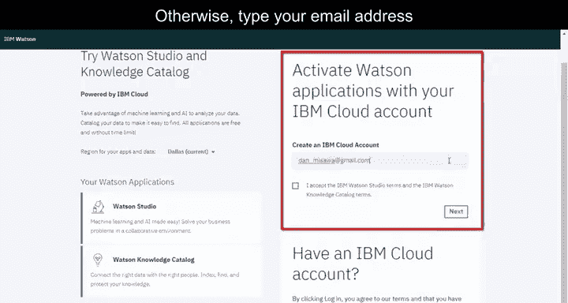

在接下来的页面中，您将被重定向到IBM Cloud注册页面，需要在此提供创建账户所需的基本信息。然后点击 **`创建账户`**。

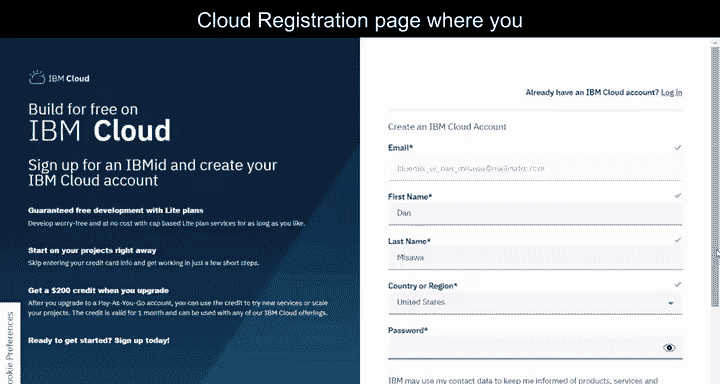

现在，请检查您的电子邮箱并确认您的账户。

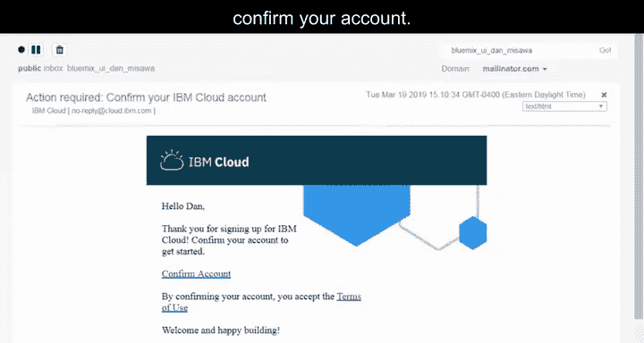

完成IBM Cloud注册后，您可以使用相同的凭据登录。

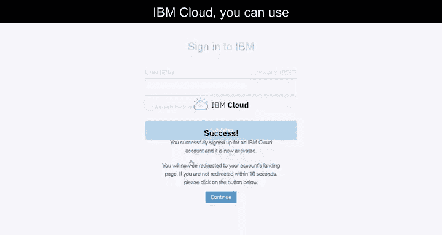

接下来，系统将引导您使用IBM Cloud凭据创建IBM Watson账户。最终，您将看到账户已成功创建的提示。

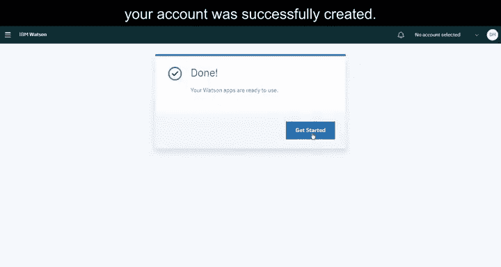

这个IBM账户默认只关联一个IBM Cloud账户和一个资源组。

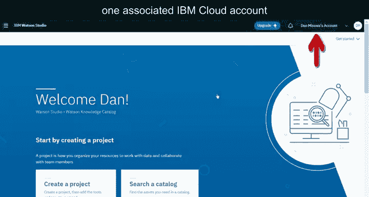

如果您关联了多个账户，或者一个账户下有多个资源组，那么在设置Watson Studio账户时，您会看到以下屏幕，可以选择要使用的账户和资源组。

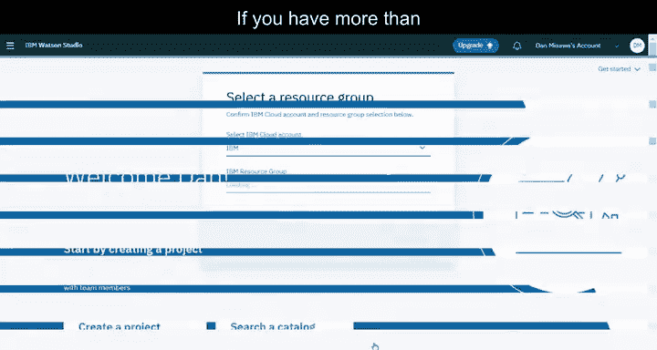

IBM Cloud使用资源组作为一种方式，让您以可定制的分组来组织账户资源，从而能够快速为用户分配同时访问多个资源的权限。

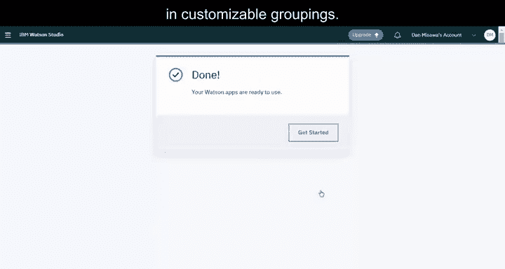

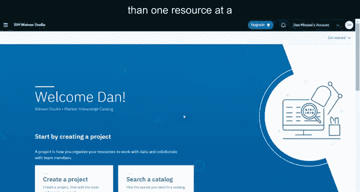

最后，请查看设置以验证已配置的应用程序和服务。

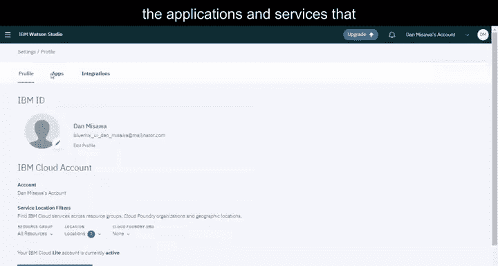

至此，您已准备就绪，可以开始在IBM Watson中工作了。

---

**总结**

本节课中，我们一起学习了如何免费注册IBM Watson Studio账户。整个过程包括访问注册页面、创建IBM Cloud账户、确认邮箱、登录以及了解资源组的概念。完成这些步骤后，您就可以使用IBM Watson提供的强大数据科学工具了。