# 033：Watson Studio中的Jupyter Notebook（上）

在本节课中，我们将学习如何在IBM Watson Studio中创建、配置和运行Jupyter Notebook。你将掌握从添加数据到运行代码，再到管理Notebook环境的基本工作流程。

---

## 在Watson Studio项目中创建Notebook

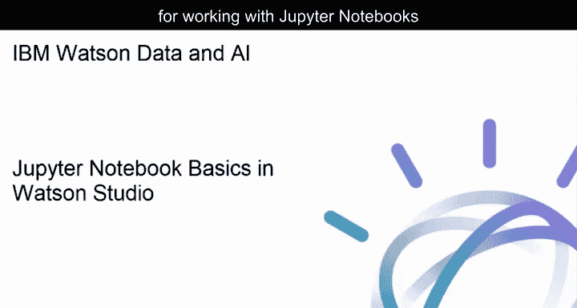

首先，进入一个Watson Studio项目，并向项目中添加一个Notebook。


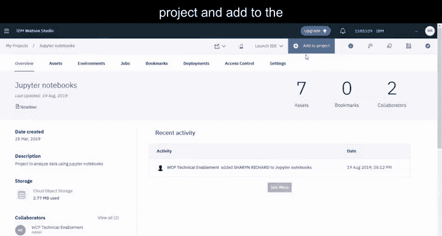

只需提供一个名称和描述。

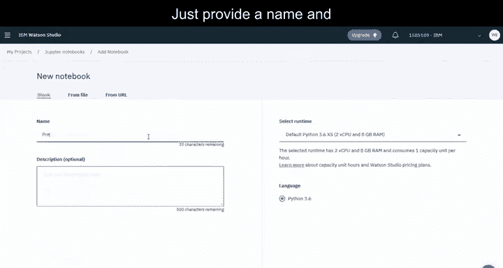


然后创建Notebook。让我们先加载一个文件，以便有一些数据可供操作。

---

## 加载数据文件

从文件侧滑面板中，浏览并选择要加载的文件。文件添加到项目后，即可在此Notebook中使用。

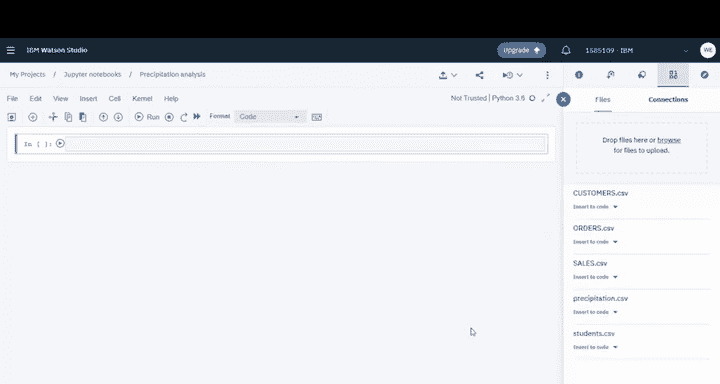


只需点击“插入代码”，并选择插入一个Pandas DataFrame。在运行Notebook之前，最佳实践是在顶部插入一个单元格来描述Notebook的功能。


---

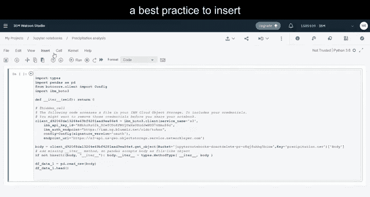

## 添加描述性单元格

将单元格类型更改为Markdown，这样该单元格就不会被当作代码处理。


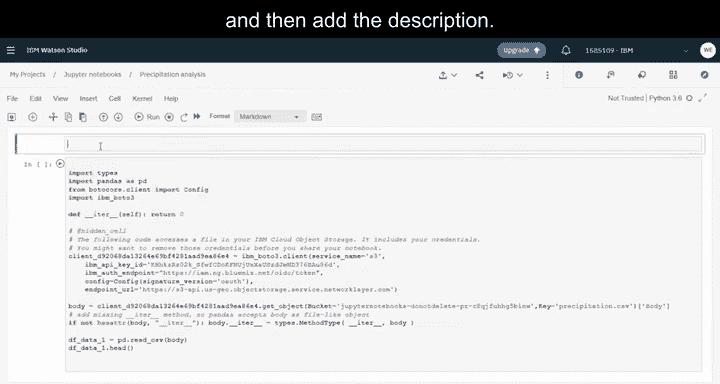

然后，添加描述。现在，你已准备好运行Notebook。


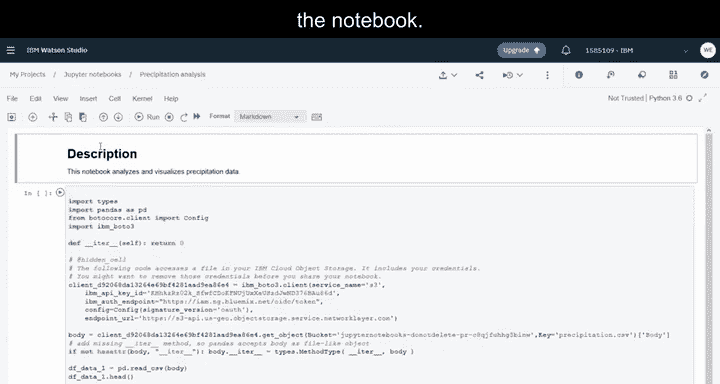

---

## 运行Notebook与查看数据

插入的代码会使用你的云对象存储实例凭证，将数据集加载到一个DataFrame中。

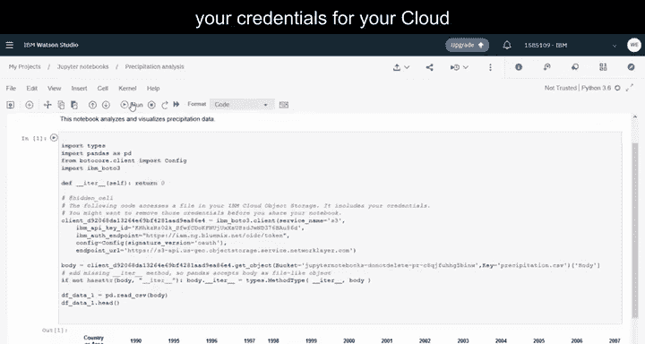

```python
# 示例：使用pandas加载数据
import pandas as pd
df = pd.read_csv('your_data_file.csv')
```

然后，代码会显示数据集的前五行。

```python
df.head()
```

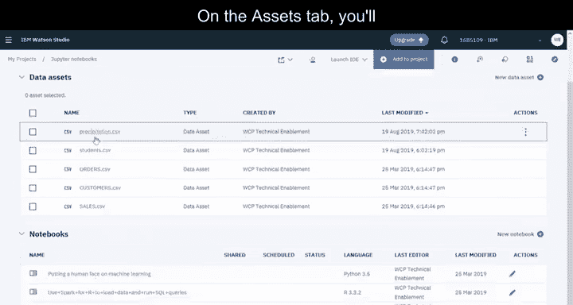

在返回项目之前，请保存Notebook。在“资产”选项卡中，你可以找到已保存的Notebook。


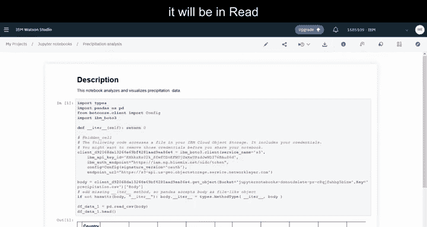

---

## 编辑与管理Notebook

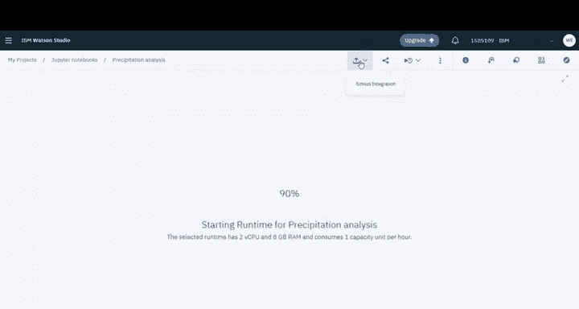

如果你打开Notebook，它将处于只读模式。


但你可以编辑Notebook并进行更改。例如，你可以访问信息面板并更改Notebook的名称。

在“环境”选项卡中，你可以更改用于运行Notebook的环境，以及停止或重新启动运行时环境。


---

## 分享Notebook

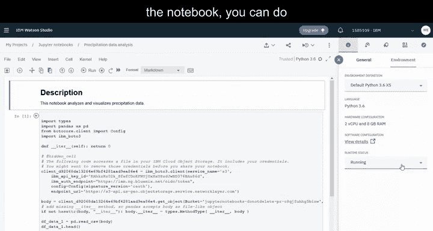

如果你想分享Notebook的只读版本，可以在此处操作。


你可以选择要分享的内容范围，以及通过链接或社交媒体分享Notebook的方式。

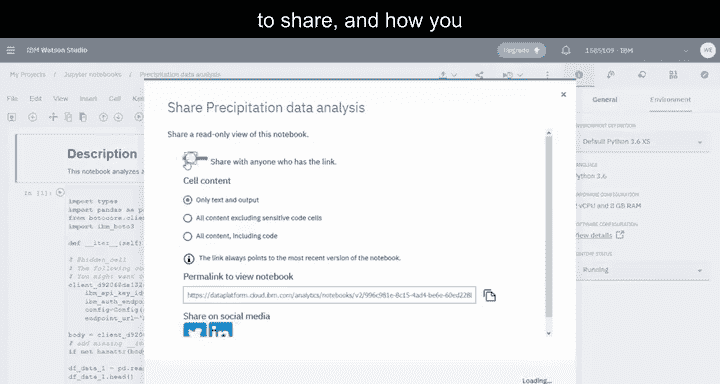


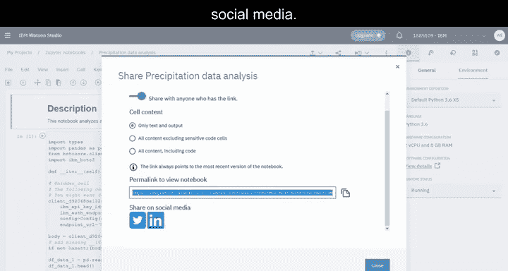

---

## 调度Notebook任务

如果你想在另一个时间调度运行Notebook，可以创建一个任务。

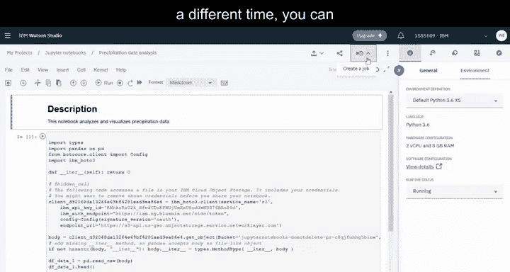


只需为任务提供一个名称，并选择调度选项，例如指定任务运行的日期，以及是否希望任务重复运行。


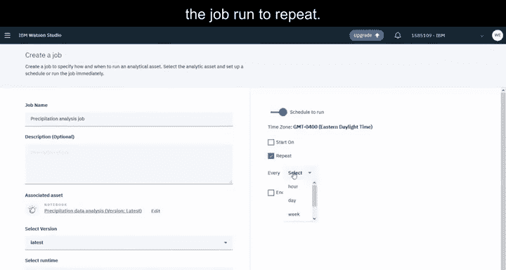

创建并运行任务后，你可以在项目的“任务”选项卡中查看其状态。


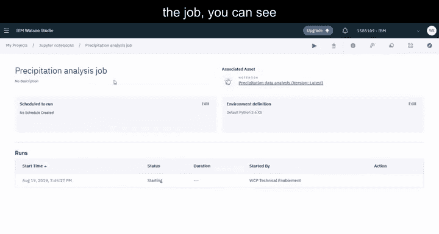

---

## 总结

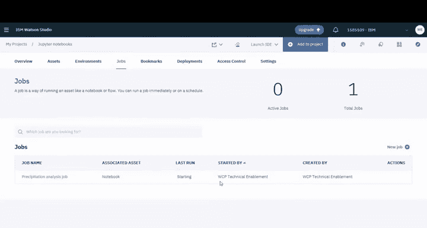

本节课中，我们一起学习了在Watson Studio中操作Jupyter Notebook的核心步骤。从创建Notebook、加载数据、添加描述，到运行代码、管理环境和分享成果，你现在已经掌握了利用这一强大工具进行数据科学分析的入门技能。下一节课，我们将深入探索Notebook的更多高级功能。