# 034：Watson Studio中的Jupyter Notebook（下）

在本节课中，我们将学习如何在IBM Watson Studio中创建Jupyter Notebook，并掌握如何添加数据资产、配置运行时环境以及切换不同环境的核心操作。

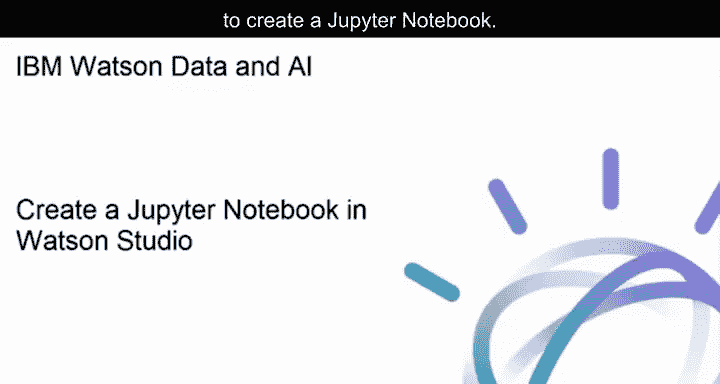

---

## 🚀 创建Jupyter Notebook

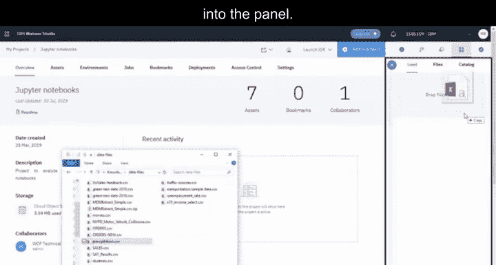

上一节我们介绍了Watson Studio的基本界面，本节中我们来看看如何创建一个Jupyter Notebook并开始数据分析。

首先，为项目添加一个数据资产。您可以通过浏览选择文件，或将文件直接拖入面板。

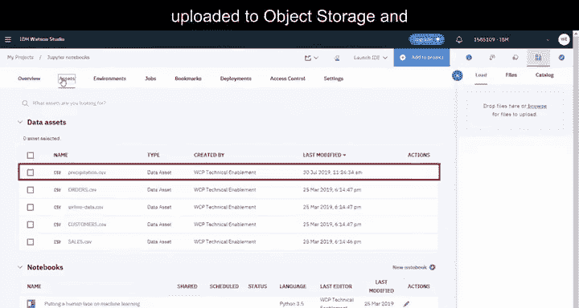

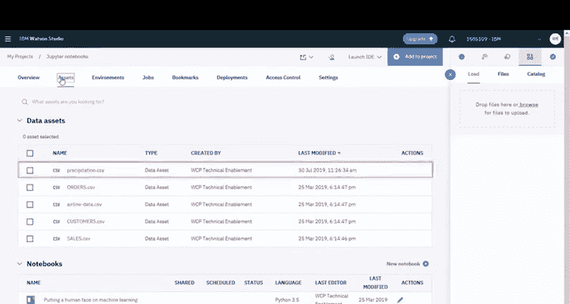


数据文件上传后，将存储在对象存储中，并作为项目的数据资产可用。

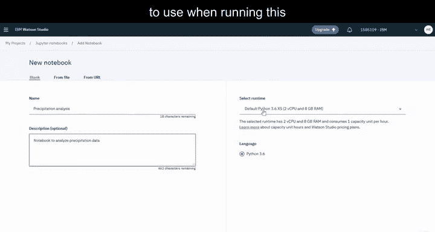


接下来，创建Notebook。请提供名称和描述，然后选择运行此Notebook时使用的运行时环境。


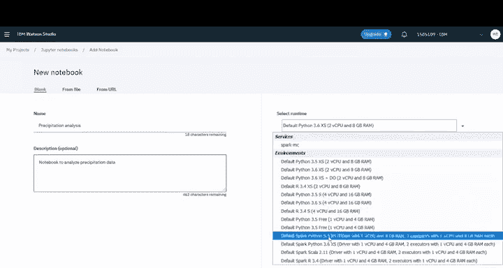

以下是可用的环境列表。您将在后续课程中了解更多关于环境的内容。目前，只需选择默认的Spark Python环境，并确认语言和Spark版本。准备就绪后，创建Notebook。

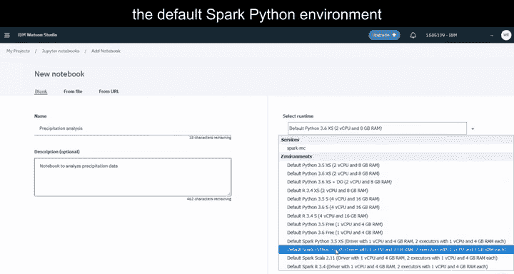


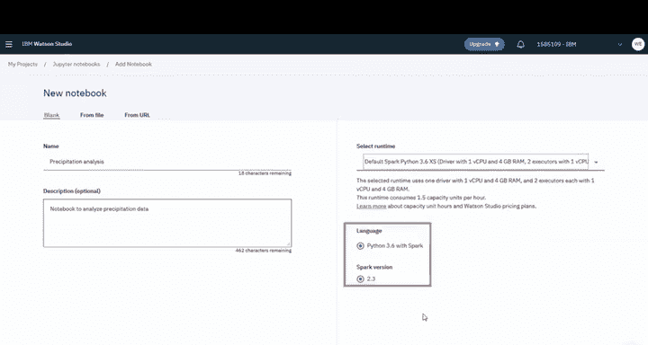

等待运行时环境实例化完成。环境就绪后，在Notebook中访问数据源并定位文件。

点击“插入代码”，选择插入数据的方式。下拉框中的选项取决于Notebook使用的语言和文件类型。


插入的代码包含从对象存储实例读取数据文件所需的凭据。运行代码后，将显示前五行数据。

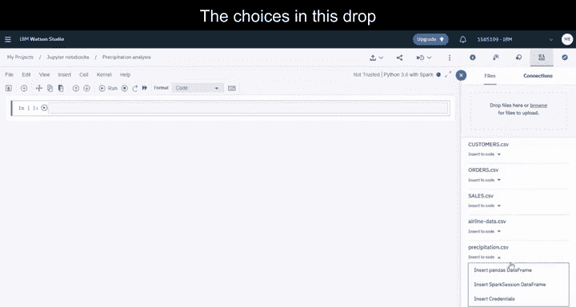


---

## ⚙️ 配置运行时环境

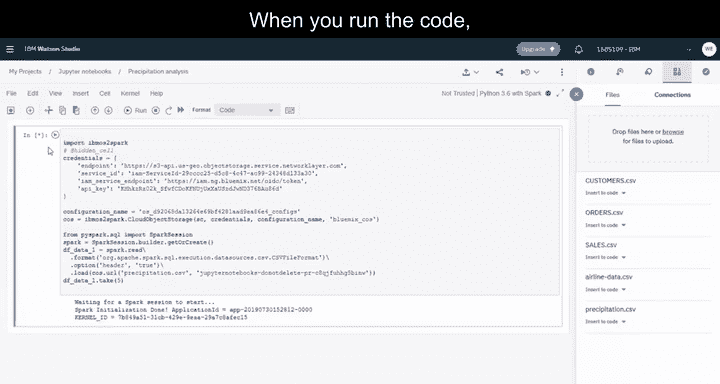

现在，让我们深入了解环境配置。在“环境”选项卡中，您可以为Watson Studio工具（如Notebook）定义运行时环境的硬件规格和软件配置。

您可以看到一个活跃的运行时环境，即您刚创建的Notebook正在使用的环境。


以下是其他默认环境。您可以查看任何默认环境以了解其配置摘要。

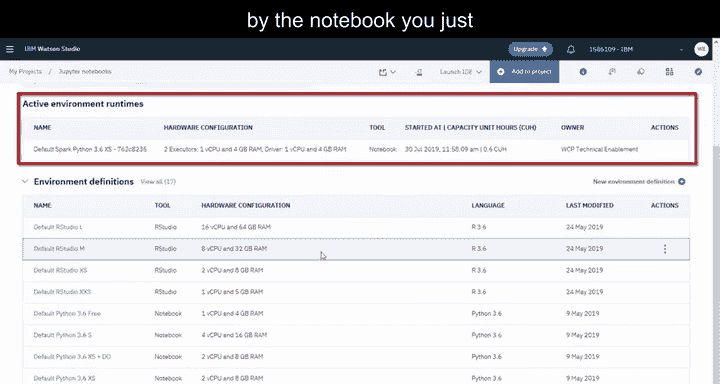


您还可以创建新的环境定义。首先，提供名称和描述。如果选择Spark作为类型，您将看到一些额外的配置选项。本例中，我们接受默认设置，并选择Scala作为软件版本。

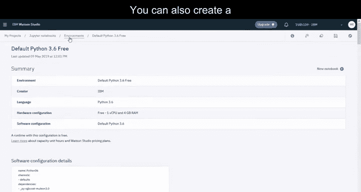


准备就绪后，创建新环境。环境创建完成后，即可与Notebook一起使用。

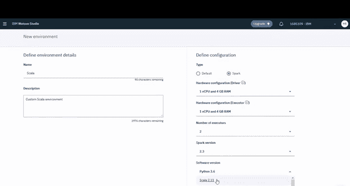

---


## 🔄 切换Notebook环境

若要切换Notebook使用的环境，首先需要停止当前内核。然后，您可以更改环境。

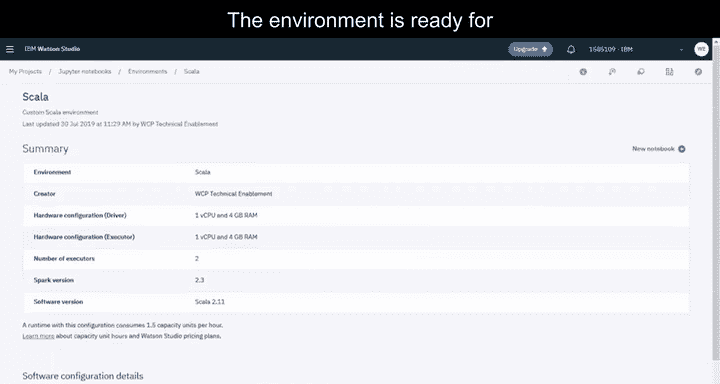


选择您刚创建的自定义环境，并将其与Notebook关联。现在，以编辑模式打开Notebook，等待新环境实例化。

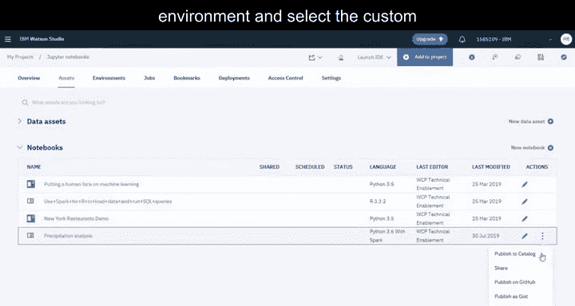


由于此Notebook上次保存时使用了不同的内核，您需要设置新内核。让我们删除现有的单元格。

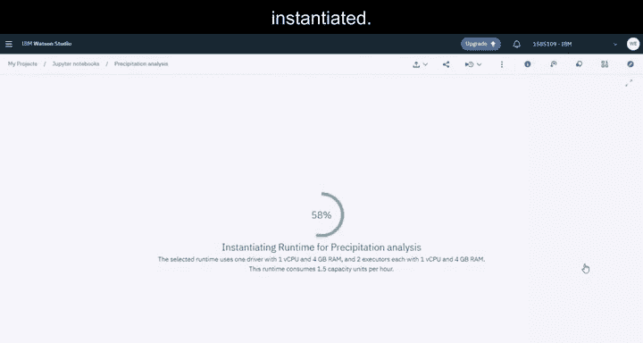


定位源数据文件，并插入Spark Session DataFrame。

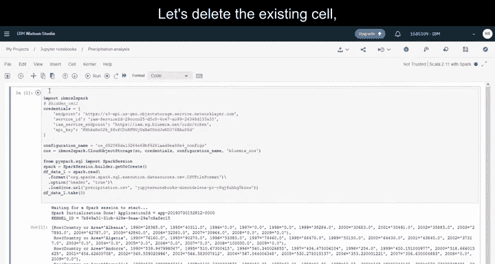

```python
# 示例代码：插入Spark Session DataFrame
df = spark.read.csv("data_source_path", header=True, inferSchema=True)
df.show(5)
```

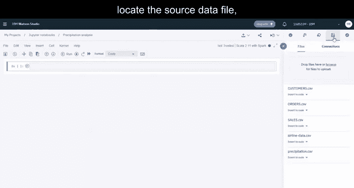

运行代码后，将显示前五行数据。

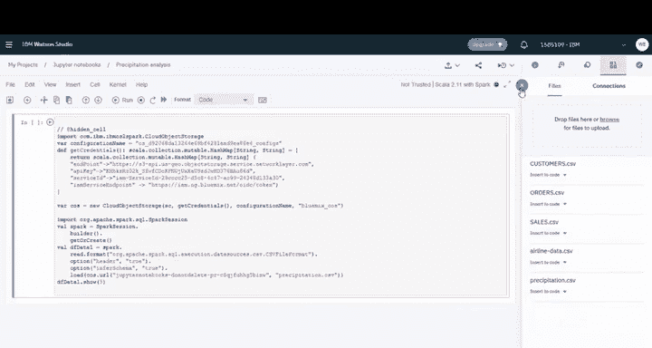


---

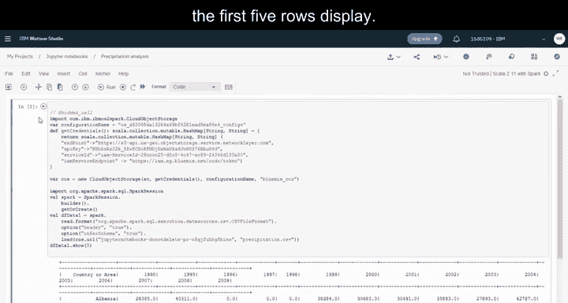

## 📚 总结

本节课中，我们一起学习了在Watson Studio中创建Jupyter Notebook的完整流程，包括添加数据资产、配置运行时环境以及切换不同环境。您现在可以开始探索社区，查找示例Notebook和数据集，以启动数据分析工作。