# 035：GitHub与Watson Studio集成 🔗

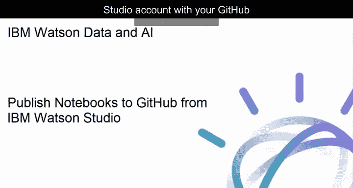

在本节课中，我们将学习如何将您的IBM Watson Studio账户与GitHub账户连接起来，以便将项目中的Notebook等资产直接发布到GitHub仓库或Gist中。

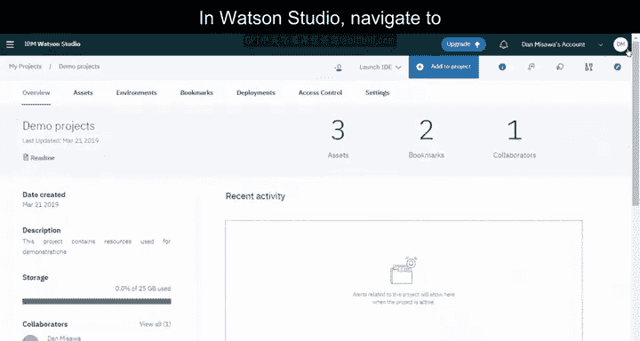

---

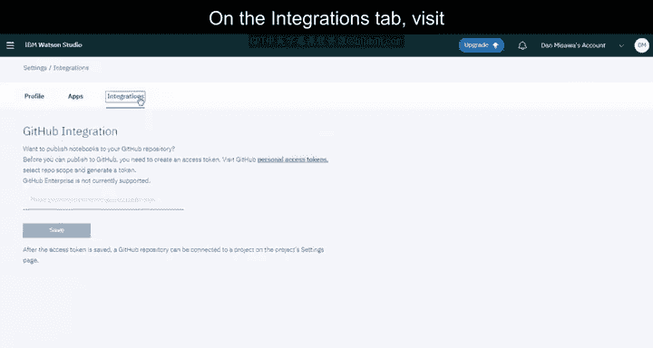

上一节我们介绍了Watson Studio的基本界面，本节中我们来看看如何将其与GitHub进行集成，以实现代码的版本控制和共享。

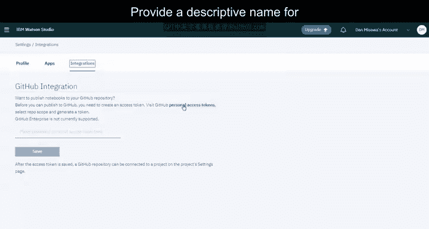

## 生成GitHub个人访问令牌

首先，您需要在Watson Studio中配置GitHub集成。这需要一个GitHub的个人访问令牌作为安全凭证。

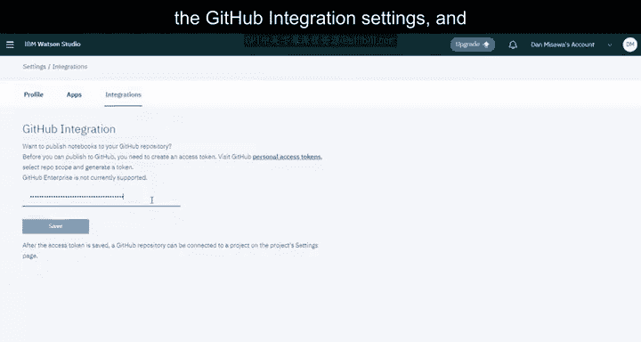

以下是生成和配置令牌的步骤：

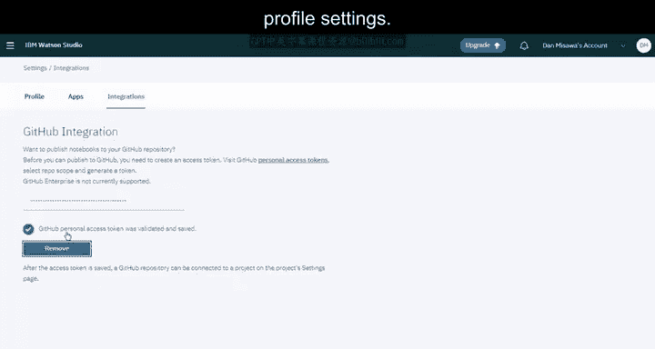

1.  在Watson Studio中，导航至您的个人资料设置。
2.  在“集成”选项卡下，访问链接以生成一个GitHub个人访问令牌。
3.  为令牌提供一个描述性名称，并选择`repo`权限范围。然后，生成令牌。
4.  复制生成的令牌。
5.  返回Watson Studio的GitHub集成设置页面，粘贴该令牌。
6.  当您将令牌保存至个人资料设置时，系统会对其进行验证。

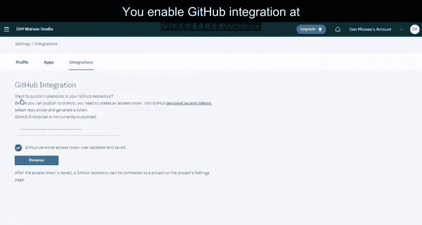

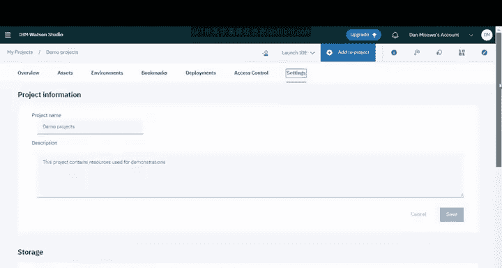

## 在项目中启用GitHub集成

成功配置个人令牌后，您可以在具体的项目级别启用GitHub集成。

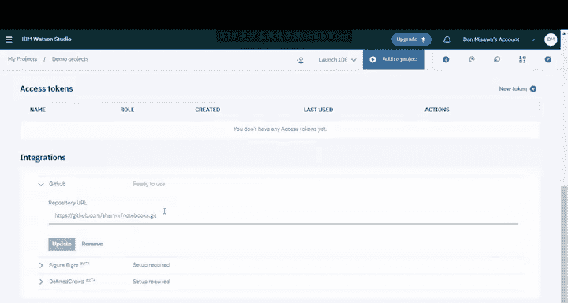

操作步骤如下：

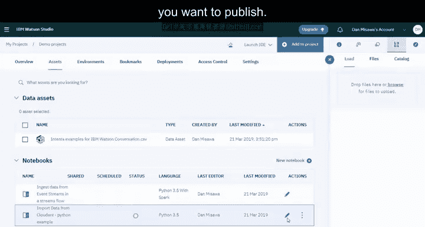

1.  导航至您的项目。
2.  在项目的“设置”选项卡中，找到并启用GitHub集成功能。
3.  滚动至页面底部，粘贴一个已存在的GitHub仓库URL。
4.  URL验证通过后，点击“连接”按钮。

## 发布Notebook到GitHub

连接仓库后，您可以将项目中的Notebook发布到GitHub。

以下是发布Notebook的流程：

1.  进入项目的“资产”选项卡，打开您想要发布的Notebook。
2.  请注意，发布前的最佳实践是移除或替换掉凭证信息。示例中的Notebook已将凭证替换为“X”。
3.  确认Notebook已准备就绪后，您可以提供目标路径和提交信息。
4.  您还可以选择“发布时不包含隐藏代码”，这意味着Notebook中以隐藏单元格注释开头的任何单元格将不会被发布。
5.  准备完成后，点击“发布”。系统将提示发布成功，并提供Notebook、仓库和提交的链接。
6.  您可以查看具体的提交记录，并导航至仓库查看已发布的Notebook。

## 发布为Gist

除了仓库，您还可以将Notebook发布为Gist。Gist是GitHub上另一种分享工作的方式。

关于Gist的要点如下：
*   每个Gist都是一个Git仓库，因此可以被复刻和克隆。
*   存在两种类型的Gist：公开的和私密的。
*   如果您开始时创建的是私密Gist，之后可以将其转换为公开Gist。
*   同样，您可以选择在发布时移除隐藏的单元格。

---

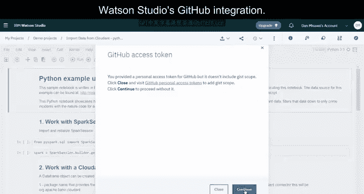

本节课中我们一起学习了如何将Watson Studio与GitHub集成。我们掌握了生成个人访问令牌、在项目中连接GitHub仓库、将Notebook发布到仓库或Gist的完整流程。这为数据科学项目的版本管理和协作分享提供了便利。