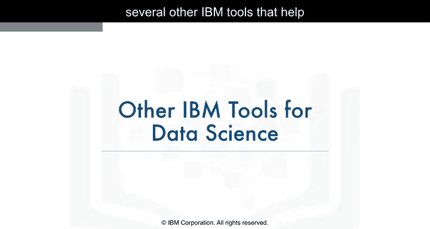
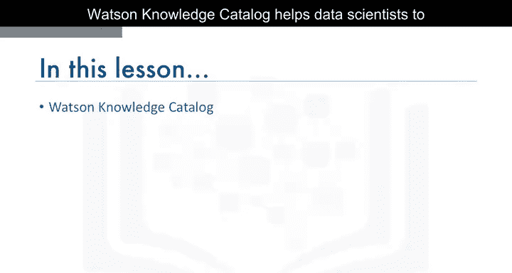
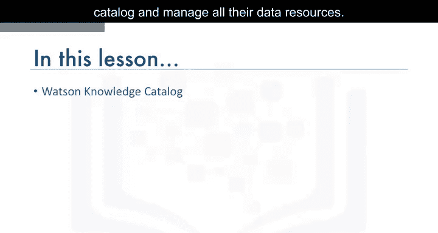
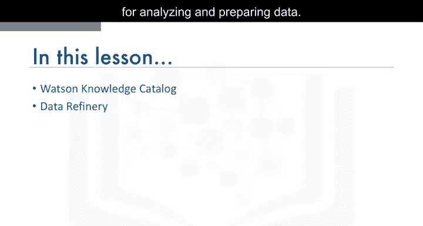
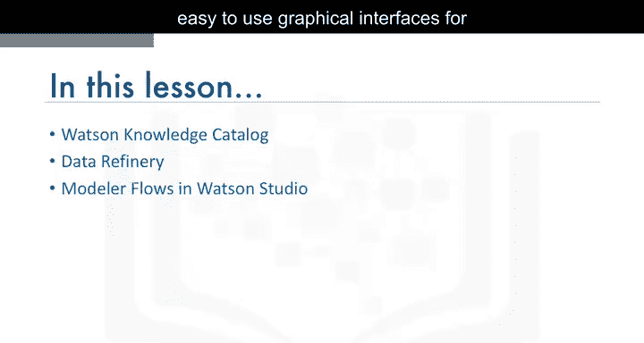
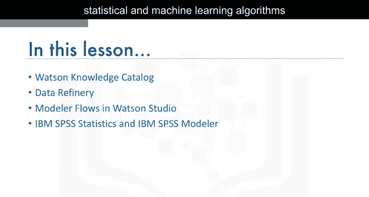
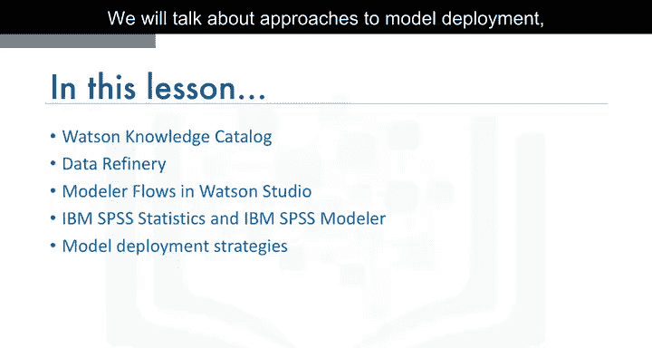
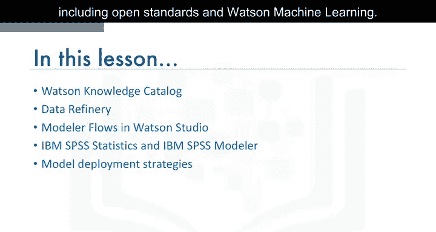
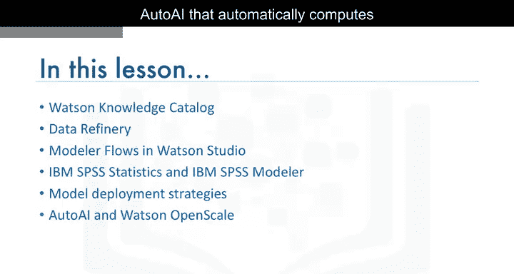
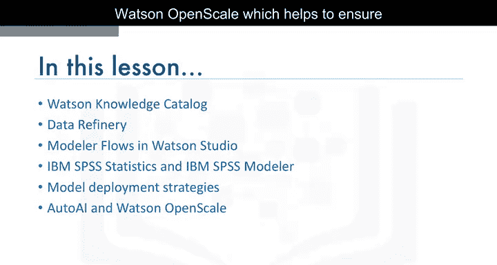

# 036：其他IBM数据科学工具

在本节课中，我们将了解几种有助于数据科学家日常工作的其他IBM工具。

上一节我们介绍了数据科学的核心工作流程，本节中我们来看看IBM提供的一系列辅助工具，它们能帮助数据科学家更高效地管理数据、进行分析和部署模型。

---

## 🗂️ Watson Knowledge Catalog

Watson Knowledge Catalog 帮助数据科学家对所有的数据资源进行编目和管理。



它提供了一个集中的平台，让团队能够发现、理解、治理和保护数据资产。

以下是Watson Knowledge Catalog的主要功能：

*   数据资产编目与发现
*   数据治理与策略管理
*   数据质量与沿袭追踪
*   协作与数据共享

---

## 🔧 Data Refinery



Data Refinery 提供了用于分析和准备数据的图形化工具。



它允许用户通过直观的界面进行数据清洗、转换和可视化，而无需编写复杂的代码。

以下是使用Data Refinery的典型步骤：

1.  连接到数据源。
2.  使用图形化界面探索数据概况。
3.  应用数据清洗和转换操作（例如，过滤、合并、派生新列）。
4.  将处理后的数据输出到下游分析或模型训练。

---



## 📈 SPSS系列产品

基于SPSS的产品为各种统计和机器学习算法以及数据转换提供了易于使用的图形界面。

这些工具降低了高级分析的门槛，使业务分析师和数据科学家都能快速构建模型。

SPSS产品家族通常包括以下组件：

*   **SPSS Statistics**：用于统计分析。
*   **SPSS Modeler**：用于机器学习模型构建和部署。
*   **SPSS Collaboration and Deployment Services**：用于团队协作和模型管理。

---

## 🚀 模型部署方法

我们将讨论模型部署的方法，包括开放标准和Watson Machine Learning。

将训练好的模型投入生产环境是数据科学项目的关键一步，IBM提供了灵活的部署方案。



以下是两种主要的部署途径：

*   **开放标准**：使用如 **PMML (Predictive Model Markup Language)** 或 **ONNX (Open Neural Network Exchange)** 等格式导出模型，以便在其他兼容平台上部署。
    ```python
    # 示例：使用sklearn2pmml导出PMML模型（伪代码）
    # from sklearn2pmml import sklearn2pmml
    # sklearn2pmml(pipeline, "model.pmml")
    ```
*   **Watson Machine Learning**：在IBM Cloud上托管和管理模型，提供自动化的部署、监控和扩展功能。



---



## 🤖 Watson Studio的新特性



Watson Studio 的新特性包括 **Auto AI**（自动计算最佳数据管道）和 **Watson OpenScale**（有助于确保模型的公平性和可解释性）。

这些功能代表了人工智能自动化和可信AI的最新发展方向。

以下是这两个核心特性的简要说明：

*   **Auto AI**：自动化机器学习流程，从数据预处理、特征工程、算法选择到超参数调优，自动寻找最优模型。
*   **Watson OpenScale**：监控生产中的AI模型，检测并减轻偏差，提供模型决策的解释，确保AI的透明与公平。

---

## 📝 总结

本节课中我们一起学习了IBM生态系统中的其他重要数据科学工具。

我们了解了**Watson Knowledge Catalog**如何帮助管理数据资产，**Data Refinery**如何通过图形化界面简化数据准备，以及**SPSS**系列产品如何提供强大的分析能力。



我们还探讨了模型部署的两种方法：遵循开放标准和使用**Watson Machine Learning**服务。



最后，我们介绍了**Watson Studio**的新特性——**Auto AI**和**Watson OpenScale**，它们分别致力于自动化机器学习流程和确保AI模型的公平、可信与可解释。

掌握这些工具将能极大地提升数据科学项目的效率与可靠性。