# 037：IBM Watson知识目录

在本节课中，我们将学习IBM Watson知识目录。这是一个强大的企业级数据治理与资产发现平台，旨在帮助组织高效管理和利用其分散的数据资产。

---

大多数组织拥有海量数据，这些数据以多种形式存储在不同位置。快速找到相关数据并连接不同的数据源，可能具有挑战性且耗时。

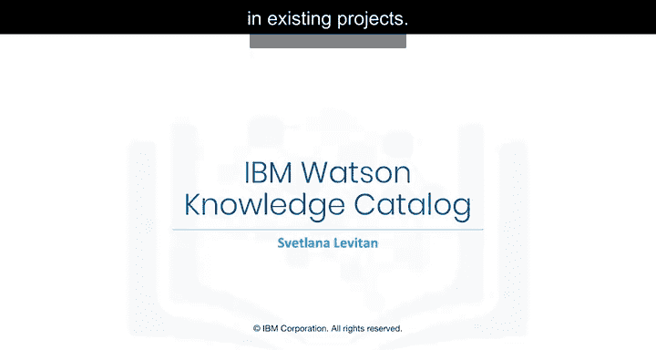

Watson知识目录将所有信息资产统一到一个富含元数据的单一目录中。其基础是Watson对资产间关系、以及它们在现有项目中如何被用户使用和共享的理解。

---

上一节我们介绍了数据科学工具的整体范畴，本节中我们来看看Watson知识目录在其中扮演的角色。

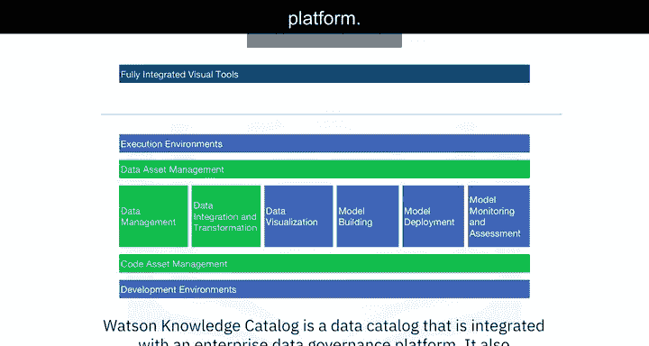

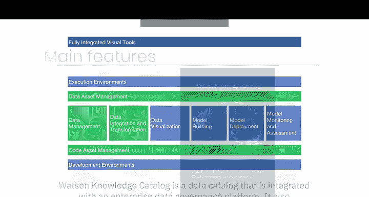

以下是Watson知识目录对应的工具类别：
*   **数据资产管理**
*   **代码资产管理**
*   **数据管理**
*   **数据集成与转换**

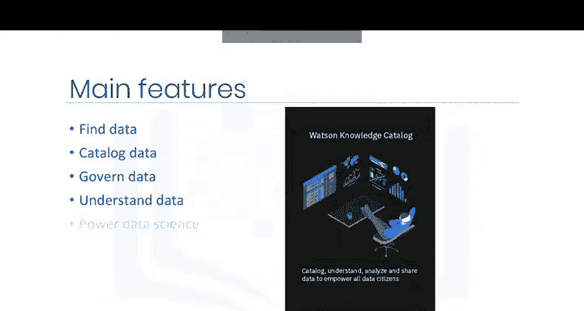

Watson知识目录是一个与企业数据治理平台集成的数据目录。它同时也融合了Watson Studio的分析能力。

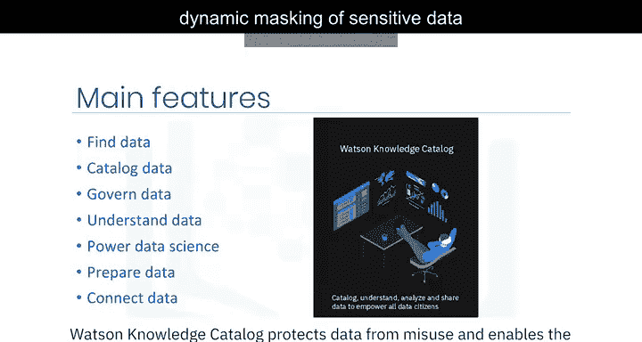

---

数据目录的核心功能是帮助数据科学家。以下是其主要作用：
*   **轻松查找**所需数据。
*   **准备**数据以供分析。
*   **理解**数据的含义和结构。
*   **按需使用**数据。

---

除了管理，Watson知识目录还注重数据的安全与理解。以下是其关键特性：
*   **保护数据免遭滥用**，通过自动动态屏蔽敏感数据元素来实现资产共享。
*   提供**数据概况可视化**、内置图表和统计信息，帮助用户理解数据资产。

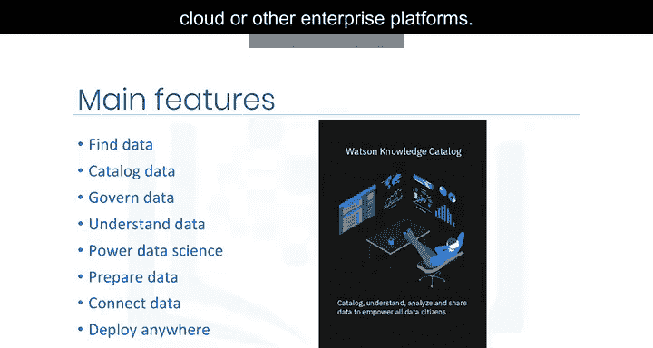

---

Watson知识目录与整个数据科学生态系统紧密集成。以下是其集成与部署能力：
*   与**Watson Studio**无缝集成，帮助数据从业者在一套强大的机器学习工具中驱动其数据产品的生产。
*   用户可以通过内置的**数据精炼**工具交互式地发现、清理和准备数据。
*   支持连接到**超过30种IBM及第三方数据源**，帮助您在原始位置对数据进行编目和使用。
*   提供多种部署选择：可在**IBM Cloud**上使用，也可通过**IBM Cloud Pak for Data**在任何地方运行。后者是一个基于Red Hat OpenShift容器构建的完全集成的数据和AI平台，可轻松部署到任何公有云、私有云或其他企业平台。

---

了解了整体功能后，我们来深入其核心概念：目录的构成。

一个目录包含以下核心部分：
*   **资产的元数据**：关于资产内容以及如何访问它们的信息。
*   **协作者集合**：需要使用这些资产进行数据分析的人员。

元数据存储在加密的IBM Cloud对象存储实例中。您可以将想要存储在云中的数据上传到您选择的对象存储，然后在创建目录时指定该存储位置。

**数据元数据的存储位置与实际数据的存储位置是分开的**。这意味着您可以保持数据在原位，无需将其移入目录，因为目录仅包含元数据。您的数据可以位于：
*   本地数据仓库
*   其他IBM Cloud服务（如Cloudant或Db2 on Cloud）
*   非IBM云服务（如Amazon或Azure）
*   流数据服务
*   甚至“暗数据”源（如PDF文件）

元数据中包含如何访问数据资产的信息，即**位置和凭证**。这意味着任何目录成员，只要拥有足够权限，都无需知道凭证或自行创建连接即可访问数据。

---

由于新创建的目录是空的，让我们浏览一个现有目录的“浏览资产”选项卡。以下是您可以看到的内容：
*   **推荐资产**
*   **高评分资产**
*   **最近创建的资产**
*   **所有资产的列表**

您可以输入搜索词来查找资产。您还可以按资产类型（如数据资产或笔记本）进行筛选，或按资产添加到目录时分配的标签进行筛选。

查看资产时，您会看到数据预览以及其他信息，例如描述、评分、标签、源位置以及任何分类。在“访问”选项卡上，有权限的人员可以添加成员来查看此特定资产。“评论”选项卡显示评论并允许您贡献评论。

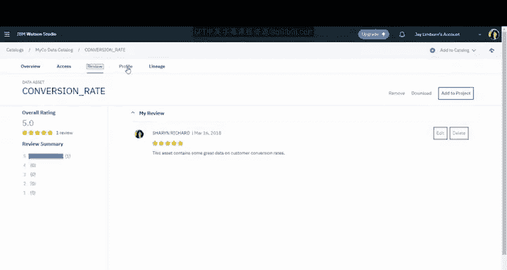

---

当资产被添加到启用了数据策略的目录时，Watson知识目录会根据列中的值自动分析概况并对资产内容进行分类。“概况”选项卡包含关于推断分类的更详细信息。

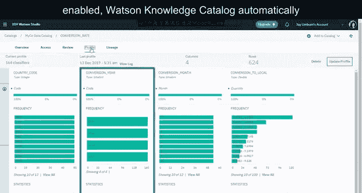

您可以查看对每列进行分类的其他可能性，以及这些可能性的置信度分数。

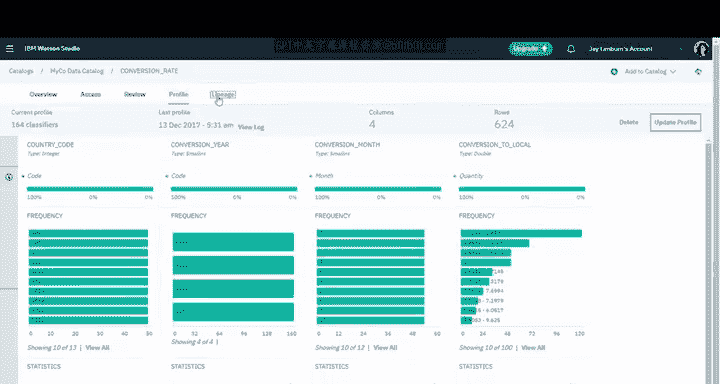

在“沿袭”选项卡上，您将看到Watson知识目录捕获的、发生在此数据资产生命周期中的各种事件，从而可以追踪资产自创建以来发生的情况。在“访问控制”选项卡上，您可以查看当前的目录成员列表。您也可以添加成员，这与在项目中添加协作者非常相似。

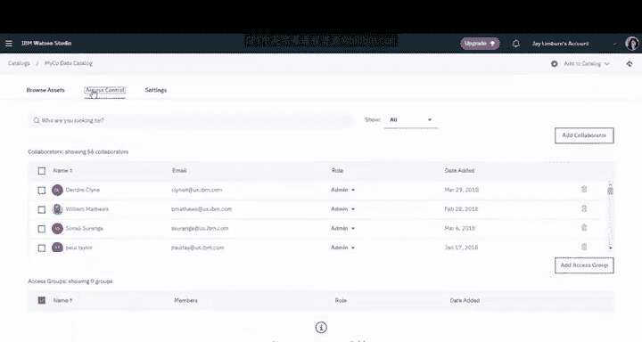

大多数目录成员可能拥有“编辑者”角色。“查看者”角色受到有意限制，只有少数精选用户会拥有“管理员”角色。

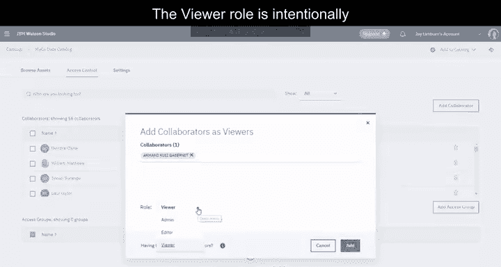

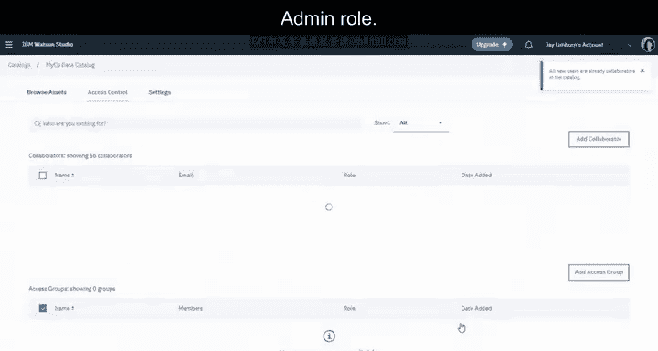

---

Watson知识目录包含根据组织治理策略自动屏蔽敏感数据的功能。例如，在图中您可以看到数据集中的**名字**、**姓氏**和**性别**数据已被屏蔽。

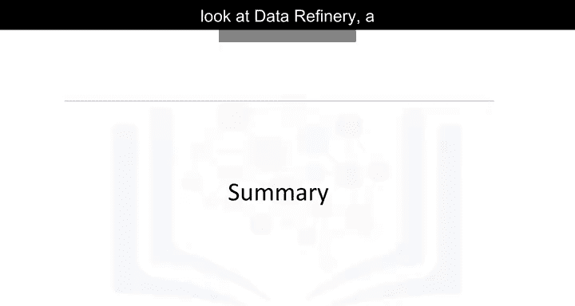

---

本节课中我们一起学习了IBM Watson知识目录如何帮助组织处理其众多的数据和其他资产。您了解了它作为统一数据目录的核心功能、其安全与治理特性、灵活的部署选项以及用户如何通过它来发现、理解和协作使用数据资产。

在下一个视频中，我们将介绍数据精炼，这是一个用于分析和准备数据的强大工具。