# 039：Watson Studio中的SPSS建模流程

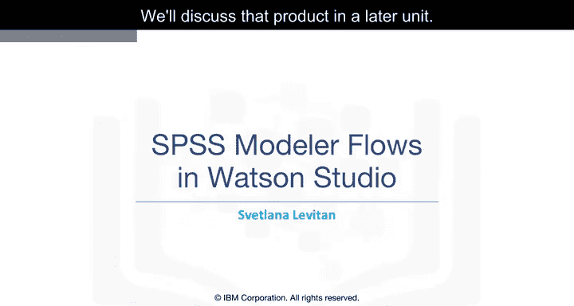

在本节课中，我们将学习如何使用一种易于上手的图形化方式来构建机器学习模型和流水线。我们将重点介绍Watson Studio中的SPSS建模流程功能。

## 概述：什么是SPSS建模流程？

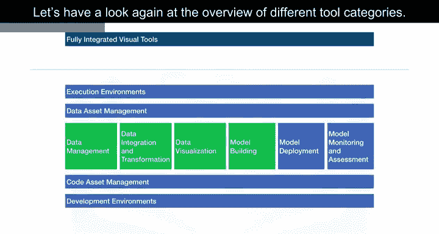

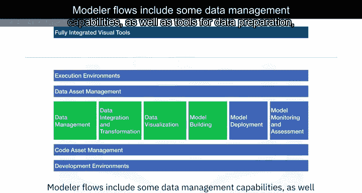

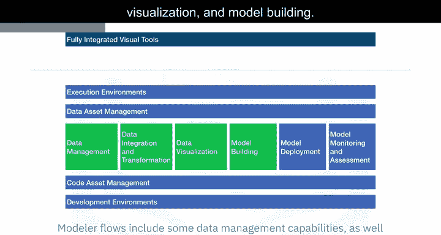

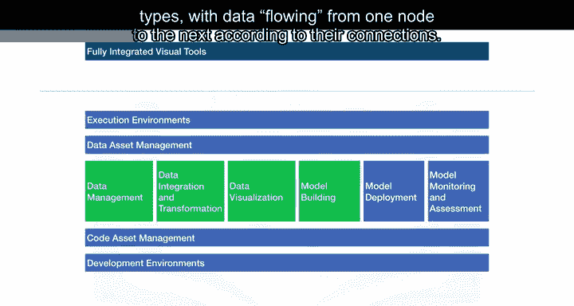

SPSS建模流程是Watson Studio平台的一部分，它提供了一种图形化的方式来构建机器学习模型和数据处理流水线。该功能的设计灵感来源于IBM的另一款产品——SPSS Modeler。我们将在后续单元中详细讨论该产品。

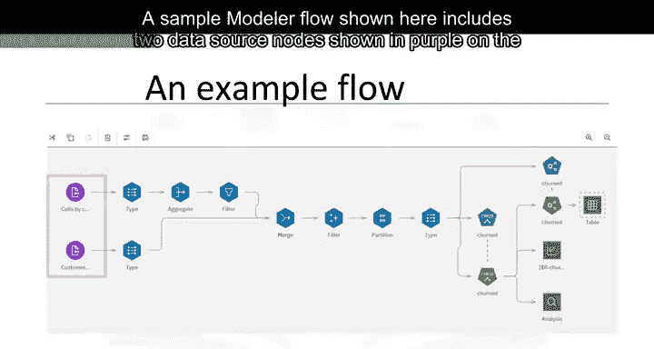

## 核心概念与界面

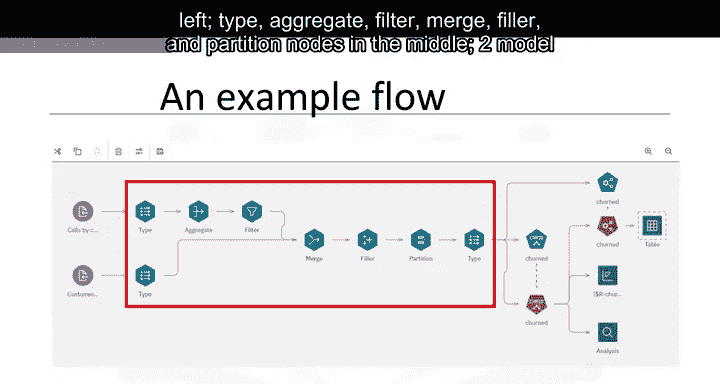

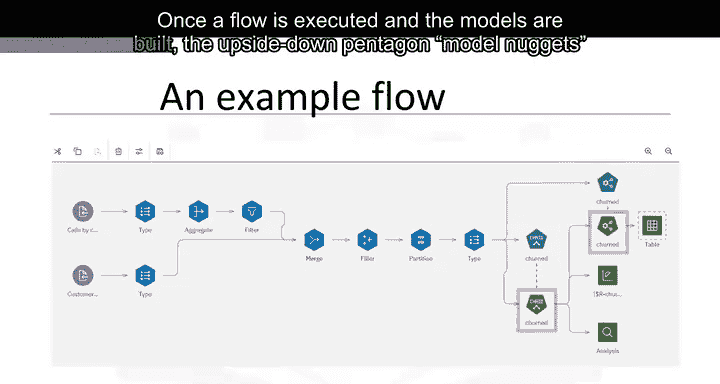

SPSS建模流程集成了数据管理、数据准备、数据可视化和模型构建等多种工具。所有流程都通过一个拖放式编辑器创建，由不同类型的节点组成，数据根据节点间的连接从一个节点流向另一个节点。

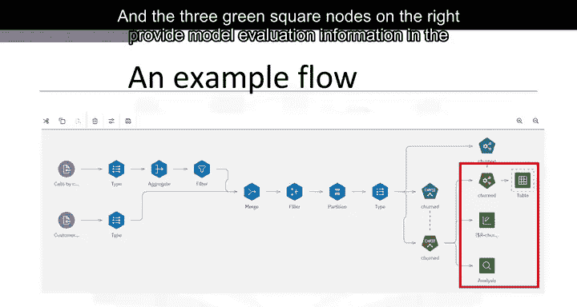

以下是构建流程的核心步骤：
1.  从界面左侧的“调色板”区域，将不同类型的节点拖拽到中央的“画布”上。
2.  每个流程都始于“导入”组中的一个或多个数据源节点。
3.  流程中可以包含其他所有类型的节点，用于数据处理和模型构建。

## 一个示例流程解析

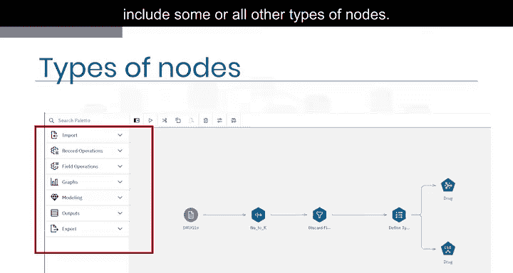

为了帮助新用户上手，Watson Studio提供了一些示例流程。这里我们以一个药物研究的示例流程为例进行解析。

该流程使用了一个小型人造数据集。目标变量是一个名为`drug`的分类字段，共有五个类别，同时存在多个预测变量。

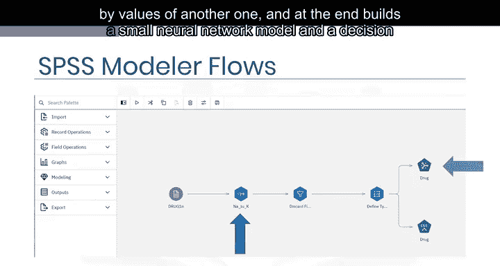

流程的执行步骤如下：
1.  通过将一个预测变量的值除以另一个预测变量的值，创建出一个新的衍生字段。
2.  流程最终构建了一个小型神经网络模型和一个决策树模型。
3.  当用户点击顶部面板上的运行按钮（三角形图标）后，流程开始执行并构建模型。

模型构建完成后，每个模型节点下方会显示一个新的五边形节点，称为“模型块”。

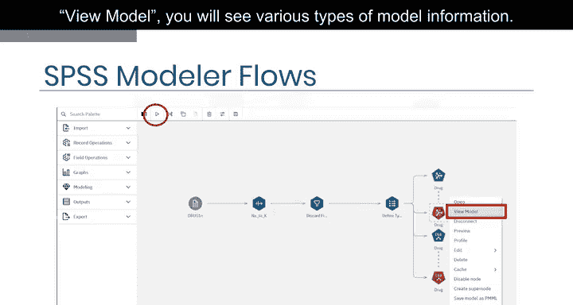

## 查看与评估模型

模型块包含了模型的详细信息，并可用于对新数据进行预测。

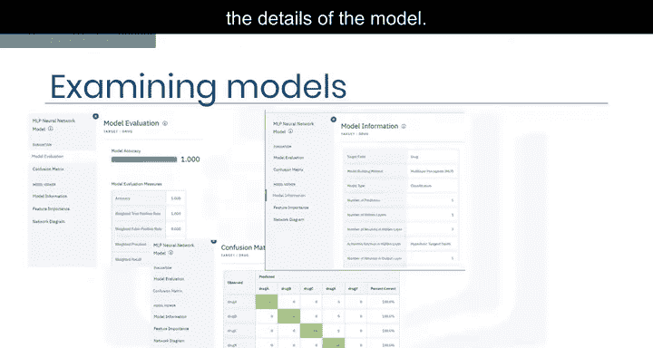

以下是查看模型信息的主要方式：
*   **查看模型**：点击模型块右上角的三个点，选择“查看模型”，即可看到各类模型信息。
*   **模型评估**：模型查看器的第一个窗口会显示模型准确率及相关指标，如精确率和召回率。在示例中，我们得到了完美的准确率，但这在真实数据中通常难以实现。
*   **混淆矩阵**：该视图展示了模型在训练数据上的预测结果与实际观测值的匹配情况。在本示例中，所有案例都被正确分类。
*   **模型信息**：显示一个表格，提供关于模型细节的更多信息。
*   **特征重要性**：显示一个图表，表明各个模型输入变量的相对预测强度。

## 深入探索模型结构

我们可以进一步探索已构建模型的具体结构。

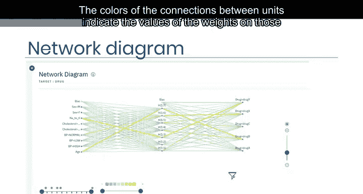

对于神经网络模型，“网络图”提供了我们所构建模型的视觉化表示：
*   **输入层（左侧）**：包含与每个连续预测变量和每个分类预测变量的类别相对应的单元，外加一个偏置单元（神经网络每层通常都有）。
*   **隐藏层（中间）**：包含七个单元（神经元）和一个偏置单元。
*   **输出层（右侧）**：包含五个单元，对应五个目标类别。
*   图表右侧和底部的控件支持对模型进行一些交互式探索。单元间连接线的颜色表示该连接权重的值。

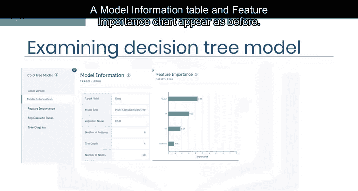

对于使用C5算法构建的决策树模型，除了显示模型信息表和特征重要性图表外，还会显示“顶级决策规则”表。决策树模型因其特殊的结构而广受欢迎，这种结构使得解释预测结果或提取决策规则变得非常容易。同时，树状图也会被显示出来。

## 自动化建模节点与AutoAI

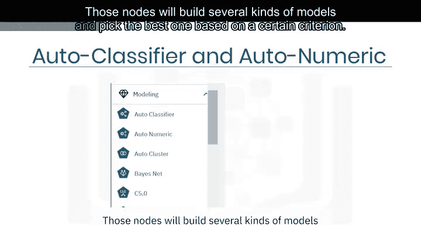

在流程调色板的顶部，有“自动分类器”和“自动数值预测器”节点，分别可用于分类目标和连续目标。这些节点会构建多种类型的模型，并根据特定标准选择最佳的一个。

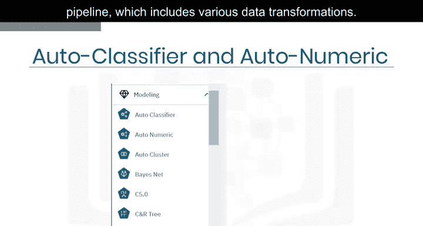

Watson Studio的AutoAI功能将这种自动化能力提升到了新的水平。它不仅自动寻找最佳模型，还能自动构建完整的数据流水线，其中包含各种数据转换步骤。

## 总结

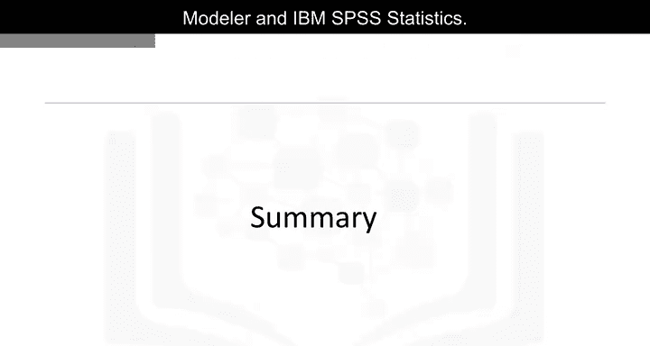

本节课中，我们一起学习了Watson Studio中的建模流程如何帮助分析师通过图形化界面创建强大的机器学习流水线，而无需编写任何代码。该功能基于IBM SPSS Modeler。接下来，在完成一个实验以获得该技术的实践经验后，我们将了解另外两个可用于数据科学的IBM产品：IBM SPSS Modeler和IBM SPSS Statistics。