# 040：IBM SPSS建模工具 📊

在本节课中，我们将讨论两款对数据科学家非常有帮助的产品。这两款产品均随IBM在2009年收购SPSS公司而加入IBM。首先介绍的是IBM SPSS Modeler。

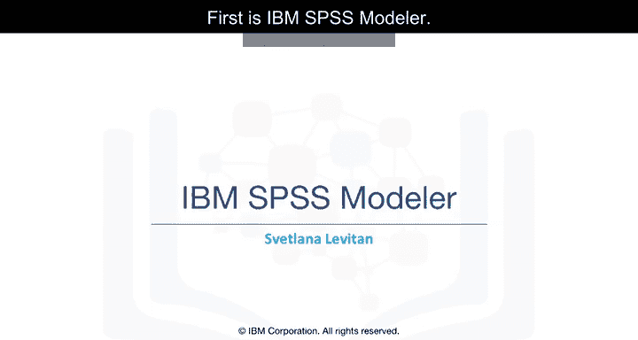

---

## 概述

我们将学习IBM SPSS Modeler，这是一个用于数据挖掘和文本分析的可视化软件。它允许用户无需编程即可构建复杂的预测模型管道。本节将详细介绍其界面、核心功能和一个预测客户流失的完整建模流程示例。

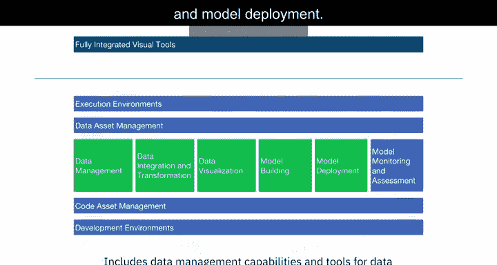

---

## 工具类别回顾

上一节我们介绍了不同的数据科学工具类别。IBM SPSS Modeler集成了数据管理、数据准备、可视化、模型构建和模型部署等多种能力。

---

## IBM SPSS Modeler简介

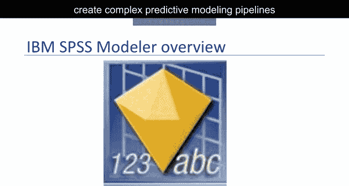

该产品由英国Integral Solutions Limited公司于1994年创建，最初名为Clementine。1998年被SPSS公司收购，随后SPSS公司在2009年被IBM收购。

SPSS Modeler是一个数据挖掘和文本分析软件应用程序，用于构建预测模型和执行其他分析任务。它拥有可视化界面，使用户能够在不编程的情况下利用统计和数据挖掘算法。其核心目标之一是从一开始就创建易于使用的复杂预测建模管道。

---

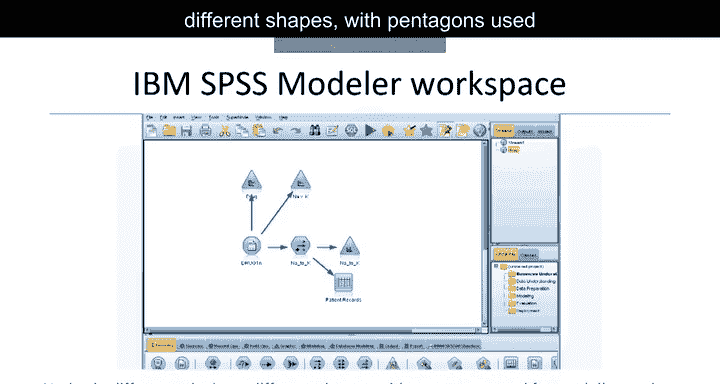

## 界面与节点

一个示例模型或“流”如下图所示。它包含一个圆形数据源节点、三个三角形图形节点、一个用于计算新变量的六边形节点，以及画布下方的一个方形输出表节点。

在画布下方，我们可以看到丰富的节点面板，其中包含数据源、记录和字段操作、图形、模型、输出等独立选项卡。不同选项卡中的节点具有不同的形状，例如五边形用于建模节点。

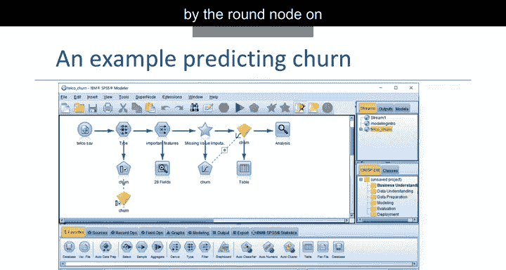

---

## 示例流程：预测客户流失

现在，我们来查看产品自带的一个示例流程。该流程从一个电信记录数据集开始，目标是构建一个模型来预测哪些客户即将停止服务，即预测“客户流失”。

数据源由左侧的圆形节点表示。

### 数据角色与测量级别定义

六边形类型的节点通常跟在数据源节点之后。它使我们能够为所有变量指定角色（目标、预测变量或无）和测量级别（如连续、名义或标志）。

术语“标志”用于表示具有两个类别的变量，其中一个可视为正面，另一个为负面。在此示例中，“流失”字段的测量级别设置为“标志”，角色设置为“目标”。所有其他字段均设置为预测变量和输入。

### 特征选择

原始数据集有许多字段，其中一些与目标变量无关。因此，我们首先需要确定哪些字段作为预测变量更有用。有一个特征选择建模节点可以帮助完成此任务。

执行包含特征选择节点的流程后，会在流程图中该节点下方创建一个黄色的“模型块”。使用该模型块，我们可以生成一个过滤节点，以过滤掉对目标变量预测能力不强的变量。

### 数据审计与缺失值处理

位于过滤节点下方的数据审计节点，显示了数据的各种属性，例如每个变量中的异常值数量和有效值的百分比。它还可以帮助创建一个用于缺失值插补的特殊节点，即用基于领域知识选择的一些有效值替换变量的缺失值。

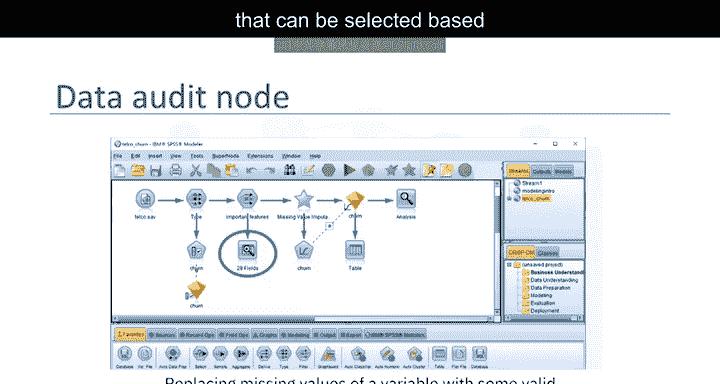

在此例中，变量“log_tool”有超过50%的缺失值。我们将指定一个值（均值）来替换它们。

### 超级节点

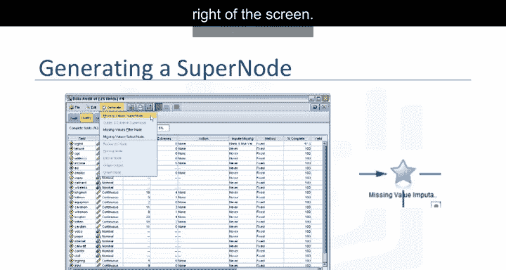

Modeler中的超级节点是一种特殊节点，不在面板中，而是由用户创建并包含特殊功能。数据审计节点使我们能够创建一个用于插补缺失值的超级节点。它呈星形，显示在屏幕右侧。

### 构建逻辑回归模型

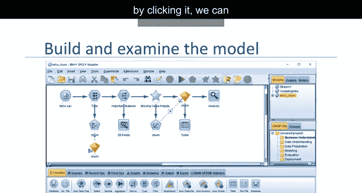

最后，我们将逻辑回归模型节点连接到流程并点击运行。另一个模型块会出现，点击它可以查看各种模型信息和其他输出。

### 模型输出与评估

点击模型块后打开的“输出”窗口中，“摘要”选项卡显示了目标、输入和一些基于模型构建前指定的高级输出设置的模型构建设置。我们还可以看到分类表、准确度以及模型生成的其他一些输出。

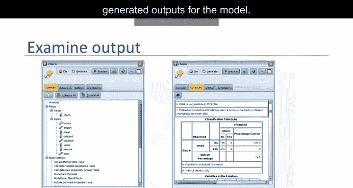

请注意，这些结果仅基于训练数据。

### 防止过拟合：使用分区节点

为了评估模型在其他真实世界数据上的泛化能力，应始终使用分区节点来保留一部分记录用于测试和验证。

然后在模型设置屏幕中，选中“使用分区数据”复选框。这将有助于检测和避免模型过拟合。

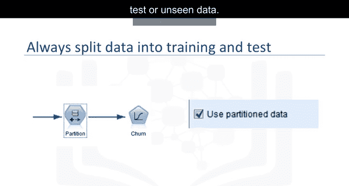

**过拟合**的定义是：模型在训练数据（用于训练模型的数据）上的准确度显著高于在测试数据或未见数据上的准确度。

公式表示为：
`过拟合风险 = 训练准确度 - 测试准确度`，当此值过大时，表明可能存在过拟合。

### 模型评分与评估

之前添加的黄色模型块也可用于计算原始数据或新数据源上的预测（也称为评分）。我们只需将相关数据源连接到该模型块，确保其包含模型中使用的预测变量，并创建一个输出到表格或其他结构以存储评分。我们还可以在模型块内指定评分设置。

请注意，如果模型是基于转换后的预测数据构建的，那么在模型对新数据进行评分之前，会对新数据应用相同的数据转换步骤。

分析节点是流程中的最后一个节点。它连接到模型块，执行时将计算一些模型评估指标，例如混淆矩阵和准确度。

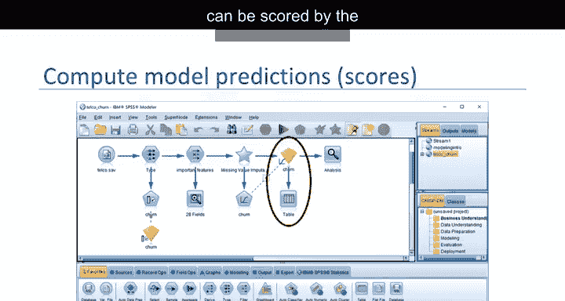
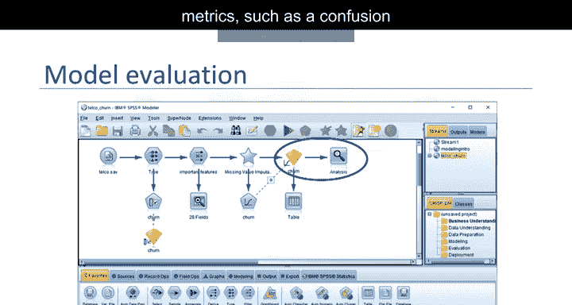

---

## 更广泛的功能

在此示例中，我们仅查看了逻辑回归模型。IBM SPSS Modeler提供了丰富的建模面板，包括许多分类、回归、聚类、关联规则和其他模型。它还包含大量数据源类型、数据转换、图形和输出节点的选择。我们甚至还没有讨论文本分析、实体解析以及该产品对数据科学家非常有帮助的许多其他功能。仅IBM SPSS Modeler就可以开设一门完整的课程。

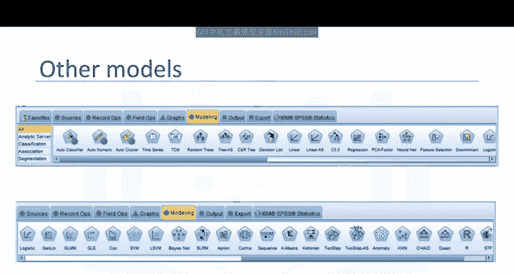

---

## 总结

本节课中，我们一起学习了IBM SPSS Modeler如何帮助分析师通过图形界面创建强大的机器学习管道。你了解了其界面组成、核心概念如节点和模型块，并跟随一个预测客户流失的示例，走完了从数据准备、特征选择、缺失值处理到模型构建、评估和评分的完整流程。我们还强调了使用分区节点防止过拟合的重要性。

接下来，我们将讨论最初的SPSS产品，现在称为IBM SPSS Statistics。

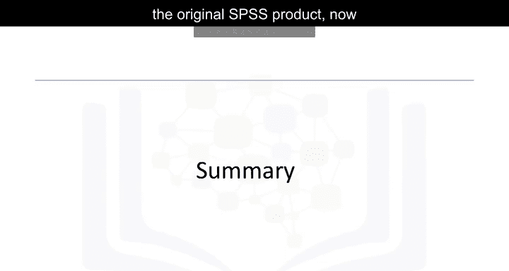

