# 041：IBM SPSS统计分析

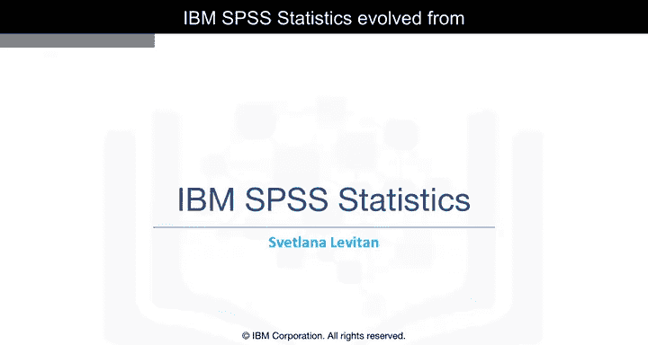

在本节课中，我们将学习IBM SPSS Statistics软件。这是一个广泛用于统计分析、数据挖掘和预测建模的工具。我们将了解其历史、界面、核心功能以及如何通过图形界面和代码语法来执行数据分析任务。

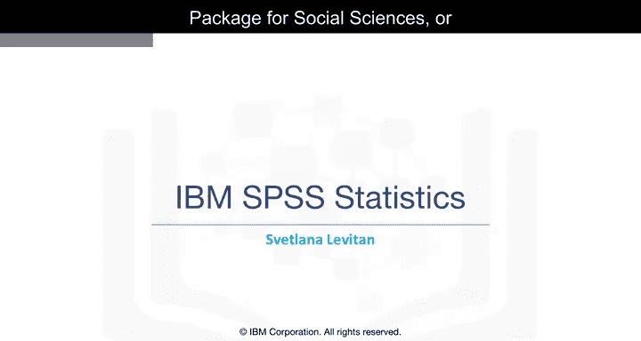

---

## 🏛️ IBM SPSS Statistics的起源与发展

IBM SPSS Statistics由一款1968年发布的产品演变而来。该产品最初名为“社会科学统计软件包”，简称SPSS。

---

## 🖥️ 软件界面与数据视图

IBM SPSS Statistics是一款统计与机器学习软件应用，广泛应用于学术界、政府机构及大型企业。它用于构建预测模型、执行数据统计分析以及完成其他分析任务。

该软件拥有可视化界面，使用户无需编程即可利用统计和数据挖掘算法。其界面与Modeler软件有很大不同。

屏幕主区域看起来很像电子表格。它显示数据并允许手动编辑。这个名为“employee data”的小型数据集是早期创建的，不代表真实人物，随产品附带用于演示和教程。

屏幕底部有两个标签页：**数据视图**和**变量视图**。

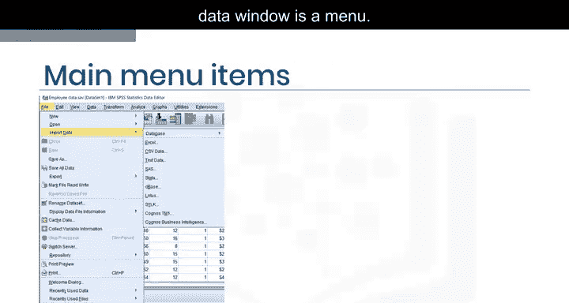

在变量视图中，可以查看和编辑所有变量的信息，包括名称、标签、数据类型和测量级别。还可以指定分类变量的值标签和缺失值。

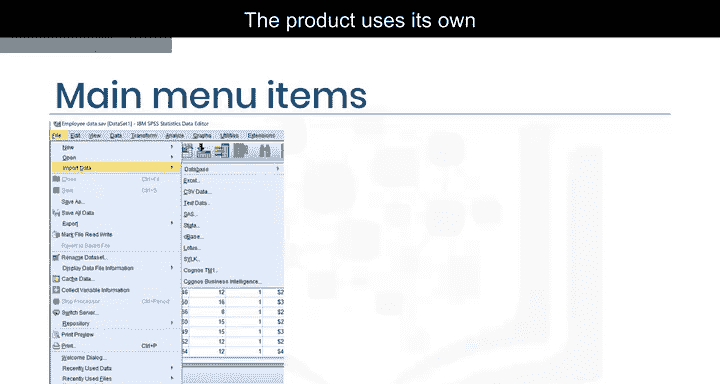

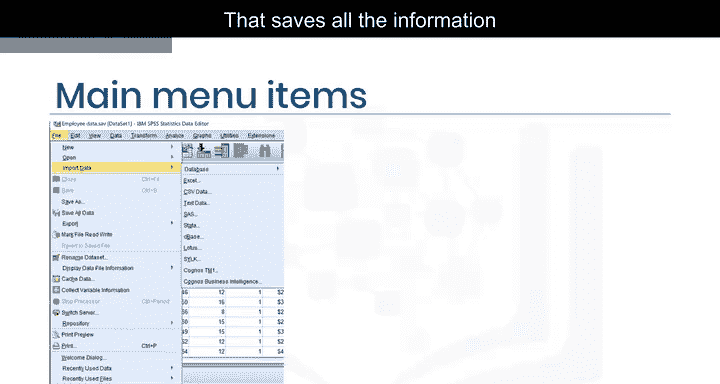

---

## 📂 数据导入与导出

数据窗口顶部是“文件”菜单。选择“导入数据”时，会看到可以导入的多种数据格式列表。

该产品使用其自身的`.sav`扩展名数据文件格式。该格式保存了我们在变量视图中看到的所有变量信息。

菜单支持从多种其他格式导入数据，也支持导出到多种格式。

---

## 🔧 数据操作与验证

在“数据”菜单下，可以找到一系列可能的数据操作选项。

数据验证可以通过用户定义的规则来执行，这些规则指定了变量值的预期行为。例如，如果日期和月份分别存储在不同列中，日期不能超过31天，但对于二月，日期不能超过29天。因此，可以创建特殊规则并在数据验证期间应用。

此外，可以启用一些检查，例如记录中或字段中的缺失值百分比。

点击“转换”菜单项时，会找到多种可用的数据转换选项。

在“计算变量”下，可以基于现有变量为新变量编写公式。可以使用产品中提供的任何主要数学和统计函数。还可以选择使用自动数据准备功能，类似于Modeler软件。

---

## 📊 分析与建模

在“分析”菜单中，可以看到多种类型的统计和机器学习分析。

在“回归”下，有多种与回归相关的模型。其他类型的回归也单独出现在分析菜单中，包括一般线性模型、广义线性模型、混合模型和对数线性模型。

现在，让我们在数据上构建一个决策树模型。在这个练习中，我们将尝试基于分析菜单中其他字段来预测“就业类别”字段。

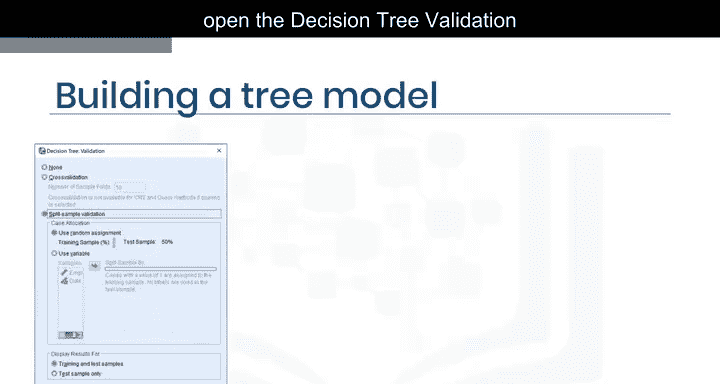

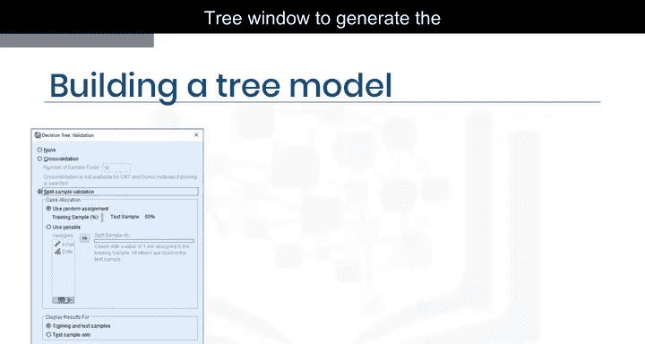

以下是构建决策树的步骤：

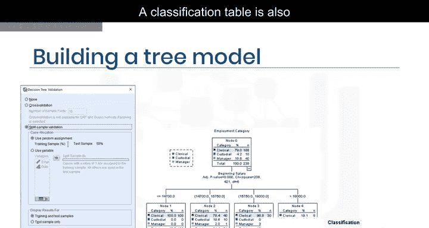

1.  在分析菜单中，选择“分类”，然后选择“树”。
2.  在决策树窗口中，指定因变量为“就业类别”，并使用除ID和出生日期外的大多数其他字段作为预测变量或自变量。
3.  通常不应将ID变量用作预测变量，因为它对新案例没有帮助；在此示例中，出生日期似乎也不是有用的预测变量。
4.  选择“穷举CHAID”作为我们的生长方法，尽管还有其他三个选项可用。
5.  点击“验证”按钮打开决策树验证窗口，在这里选择“拆分样本验证”以确保我们在新数据上测试模型。
6.  在决策树窗口中点击“确定”以生成输出，包括此处显示的树形图。

同时会显示一个分类表，展示模型在训练数据和测试数据上的表现。在本例中，训练数据的准确率为91.2%，而测试数据的准确率仅为85.6%。这意味着模型对新数据的泛化能力不是很好。

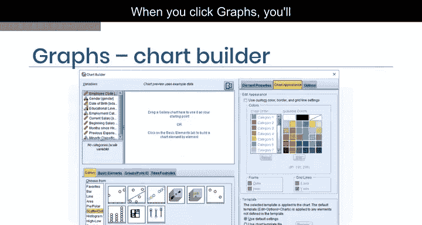

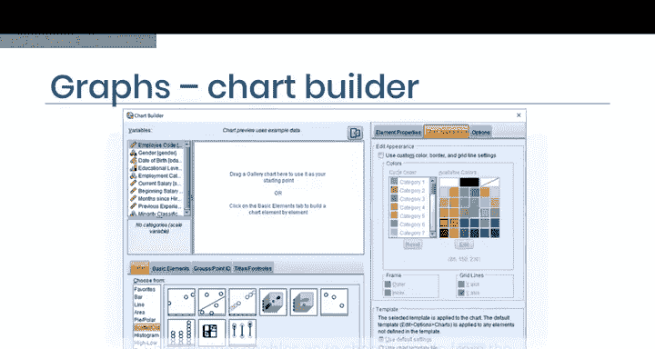

通过使用不同的模型，有可能获得更好的结果。

---

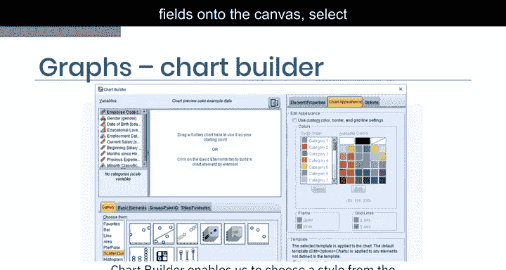

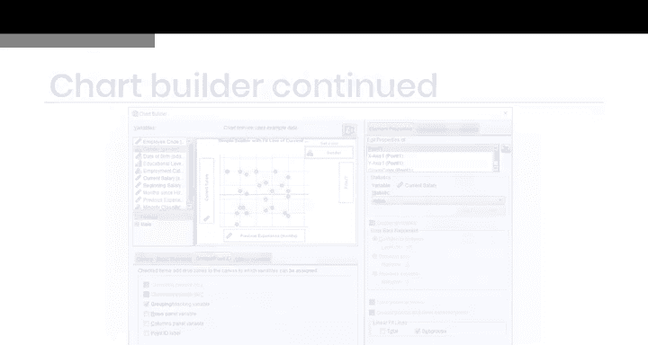

## 📈 图表构建器

接下来，我们看看图表功能。点击“图形”菜单项时，会打开一个多功能图表构建器以及其他几个选项。

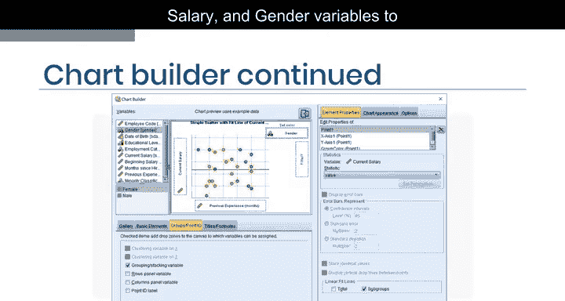

图表构建器使我们能够从图库中选择样式，并将所需字段拖到画布上，选择颜色，并从其他选项中进行选择。

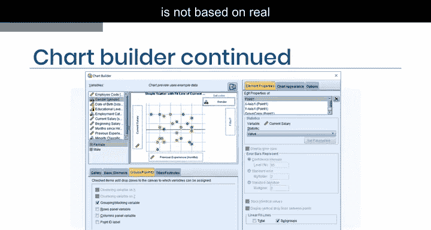

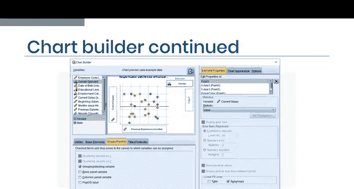

以下是一个示例：我们将“先前经验”、“当前薪资”和“性别”变量拖到相应的槽位，以定义图表上点的坐标轴和颜色。

画布上的图并非基于真实数据。这个示例只是让你了解预期的效果。

这是从我们一直使用的数据中获得的真实图表。它显示了不同性别的不同颜色点，以及回归线，这些回归线显示了每个性别的当前薪资与先前经验之间的关系。

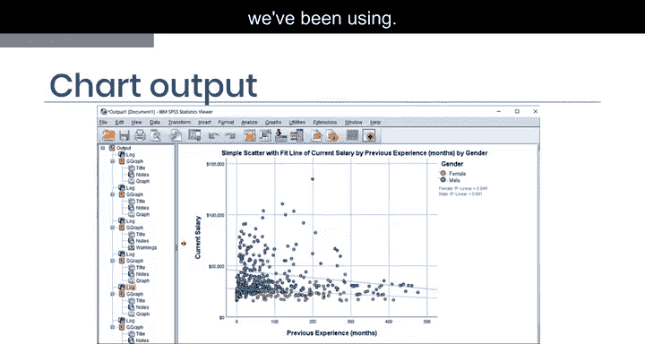

---

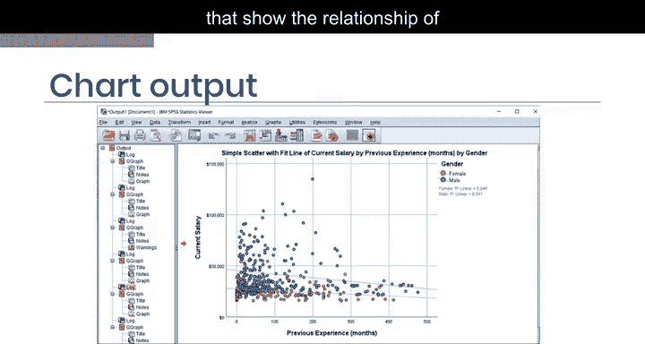

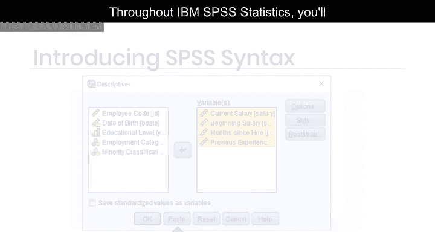

## 💻 语法编辑器与代码复用

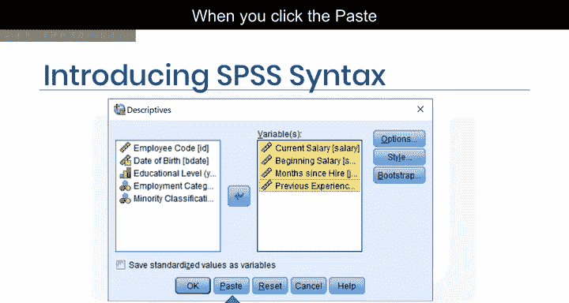

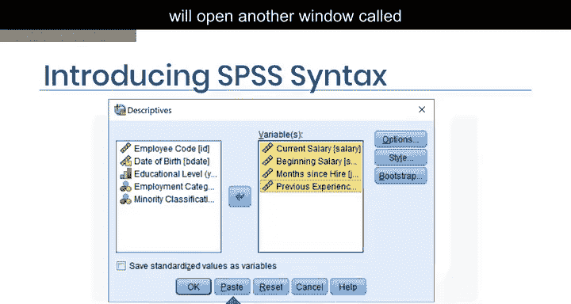

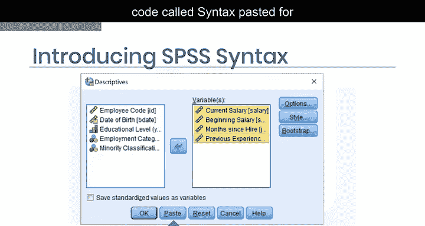

在整个IBM SPSS Statistics中，你会看到一个“粘贴”按钮。当你点击粘贴按钮而不是立即执行任务时，应用程序会打开另一个名为“语法编辑器”的窗口。

在这里，你可以看到为你粘贴的代码，称为“语法”。例如，这是我们刚刚构建的决策树的代码。

一旦我们有了语法，就可以执行它、手动编辑它、存储它以备后用，或者将其发送给其他IBM SPSS Statistics用户。

有经验的SPSS用户可以从头开始编写代码，而其他人可能更喜欢通过图形界面生成代码。请记住，在整个程序中都可以使用粘贴语法的选项。

如果语法是由数据分析过程中的所有步骤生成的，包括打开数据集、应用任何数据转换、构建模型，然后保存为扩展名为`.sps`的语法文件，这类似于在IBM SPSS Modeler中保存一个流。

然而，一个重要的区别是，它没有提供一种简单的方法来用模型对新记录进行评分。我们将在下一节讨论部署模型的不同方式。

---

## 🎯 课程总结

在本节课中，我们一起学习了IBM SPSS Statistics如何帮助数据科学家使用许多统计和机器学习技术来分析数据。通过图形用户界面，我们可以创建复杂的分析，这些分析可以以语法的形式保存并在以后重复使用。

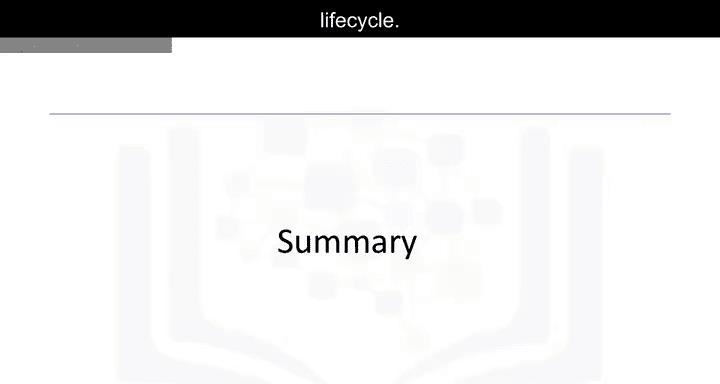

接下来，我们将讨论预测模型部署，这是整个数据科学生命周期的重要组成部分。