# 042：Watson机器学习模型部署 🚀

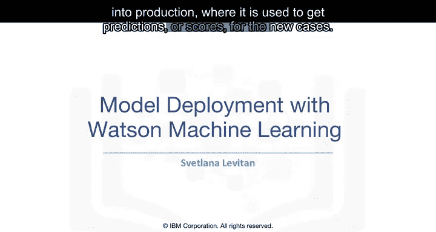

在本节课中，我们将学习机器学习模型部署的重要性，以及如何利用开放标准和IBM Watson Machine Learning服务将模型投入生产环境。模型部署是实现投资回报的关键步骤，它使模型能够对新数据进行预测或评分。

---

## 模型部署的挑战

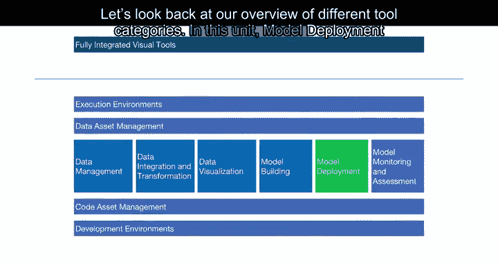

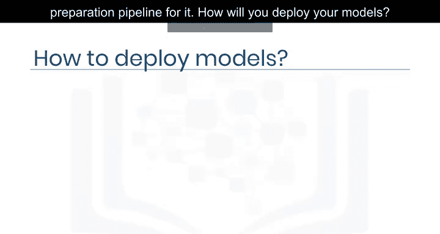

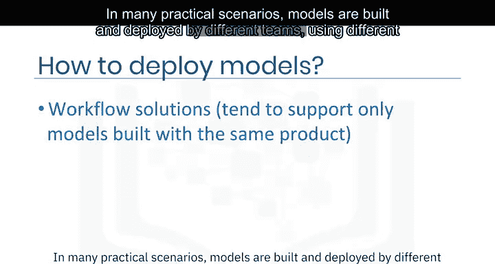

上一节我们介绍了构建机器学习模型和流水线。本节中我们来看看模型部署环节。在许多实际应用中，只有当模型或流水线投入生产环境，用于对新案例进行预测或评分时，才能获得投资回报。

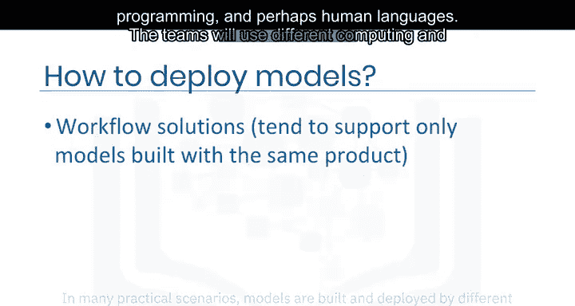

假设你努力创建了最佳的机器学习模型及其数据准备流水线。你将如何部署你的模型？在许多实际场景中，模型由不同的团队使用不同的编程语言（甚至可能是不同的人类语言）构建和部署。这些团队会使用不同的计算和数据存储环境，将你的程序以及相关的数据准备和后处理步骤从一个环境转换到另一个环境可能非常困难。

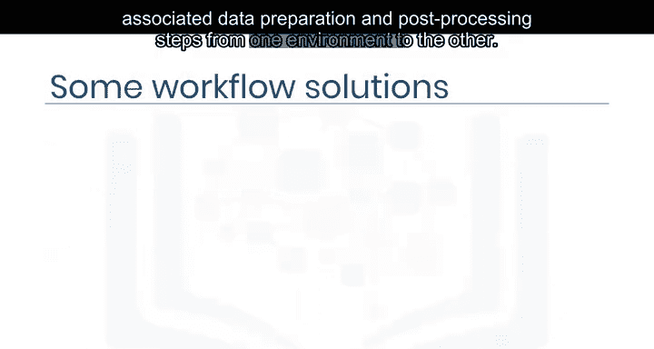

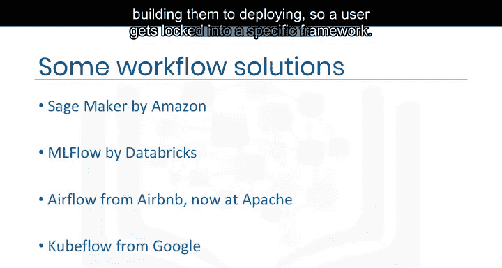

## 模型部署的现有方法

目前，有几种方法可以解决这个问题，包括商业方案和开源方案。然而，每种方案通常只支持从构建到部署的所有可能模型中的一个子集，因此用户会被锁定在特定的框架中。

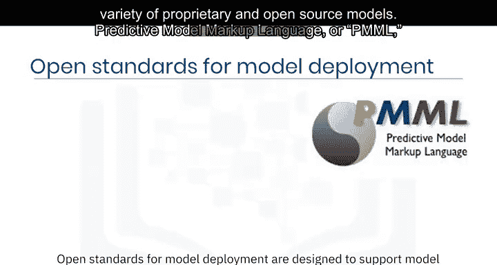

## 模型部署的开放标准

开放标准旨在支持更广泛的专有和开源模型之间的模型交换。

以下是几种主要的开放标准：

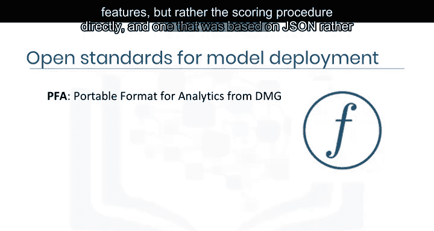

*   **预测模型标记语言**：PMML是第一个基于XML的此类标准，由数据挖掘小组在20世纪90年代创建。PMML 4.4版本包含了17种统计和机器学习模型以及许多内置函数的数据转换方法。该标准被广泛认知和使用。Watson Studio、IBM SPSS Statistics、IBM SPSS Modeler等产品都支持将大多数模型导出为PMML格式。
*   **分析可移植格式**：2013年，市场产生了对新标准的需求，这种标准不描述模型及其特征，而是直接描述评分过程，并且基于JSON而非XML。这导致了PFA的创建。PFA现在被许多公司和开源包使用。
*   **开放神经网络交换格式**：2012年后，深度学习模型变得非常流行，但PMML和PFA未能迅速适应其发展。由于新兴深度学习框架和专用硬件的多样性，对标准中间表示形式的需求被放大。2017年，微软和Facebook创建并开源了ONNX格式，最初用于神经网络，后来扩展到也支持传统机器学习。目前，许多公司正在合作进一步开发和扩展ONNX，广泛的产品和开源包都在增加对它的支持。

## IBM Watson Machine Learning

Watson Machine Learning是IBM用于模型部署的商业产品。它支持部署使用大多数开源包构建的模型，以及用PMML或ONNX表达的模型。它还支持部署IBM SPSS Modeler流和来自Watson Studio的Modeler流程。

部署可以通过图形界面或Python代码完成，可以用于通过REST API进行在线评分，也可以进行批量评分。

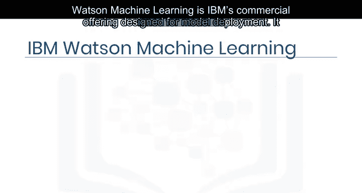

Watson Machine Learning通过提供多种编程语言的代码片段，帮助将已部署的模型集成到应用程序中。

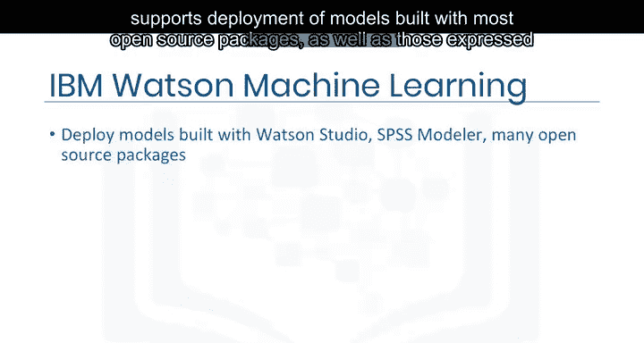

---

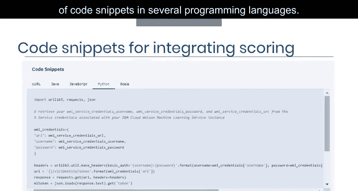

## 总结

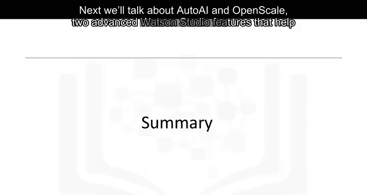

本节课中我们一起学习了模型部署的挑战、现有的部署方法以及关键的开放标准（PMML、PFA、ONNX）。我们还了解了IBM Watson Machine Learning如何作为一个综合性平台，支持多种格式的模型部署，并帮助将模型集成到生产应用程序中。接下来，我们将讨论AutoAI和OpenScale这两个高级Watson Studio功能，它们有助于进一步简化数据科学家的工作。