# 043：Watson Studio自动AI 🤖

在本节课中，我们将要学习IBM Watson Studio中的一项强大功能——AutoAI。这项功能能够自动化机器学习流程的创建，帮助数据科学家更快地获得结果，并专注于更具创造性的工作。

## 概述

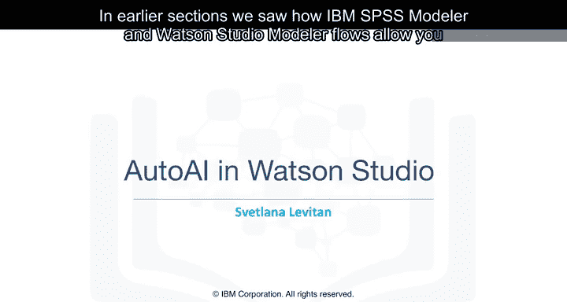

在前面的章节中，我们了解了IBM SPSS Modeler和Watson Studio Modeler Flows如何允许您以图形化方式创建包含数据转换步骤和机器学习模型的流程。

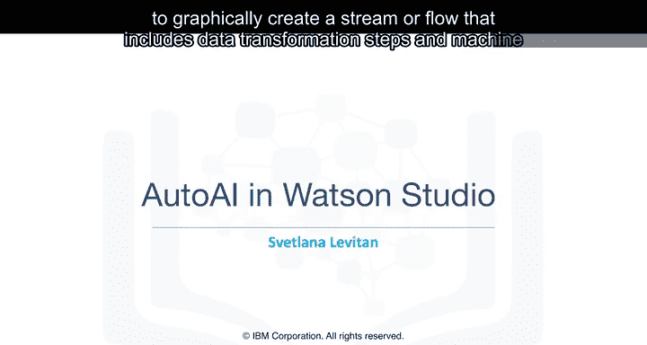

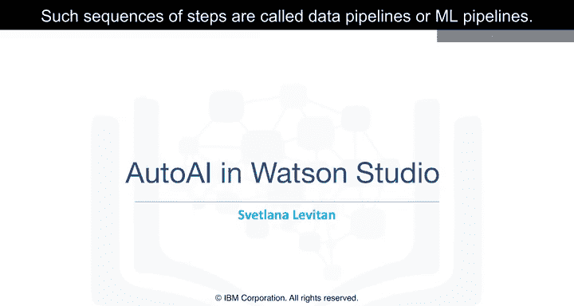

这类步骤序列被称为**数据流水线**或**机器学习流水线**。

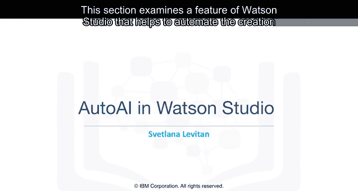

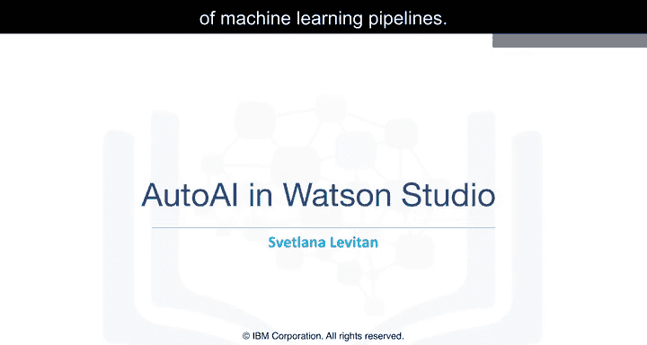

本节将探讨Watson Studio的一个特性，它有助于自动化创建机器学习流水线。这使得数据科学家能够更快地产生结果，并专注于更具创造性的工作。

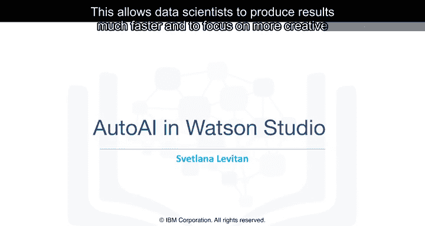

## 自动化AI的必要性

目前，市场上缺乏合格的数据科学家。数据科学家通常执行的许多操作是重复且耗时的。因此，自动化部分重复性工作将有助于释放新手和经验丰富的数据科学家的时间，让他们能够专注于接受过培训的重要工作。

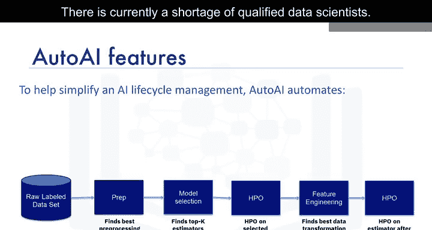

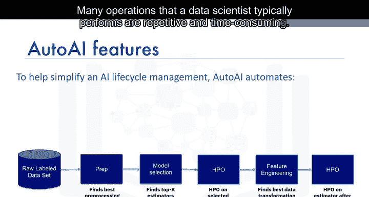

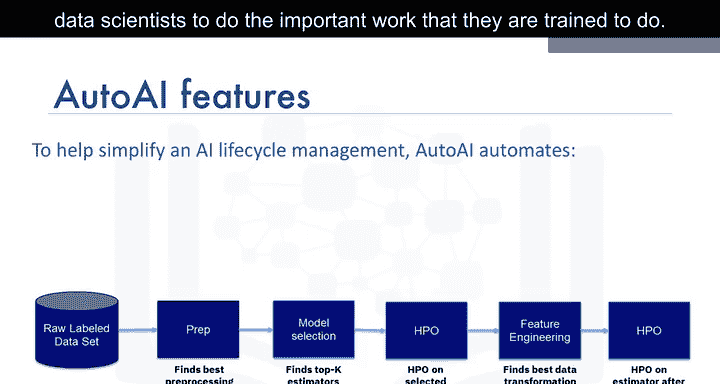

## 什么是AutoAI？

AutoAI系统由IBM研究专家与IBM杰出工程师、两届Kaggle大师Jean Francois Puget合作开发。它提供了一个图形界面，用于创建和部署带有实时可视化的机器学习模型。

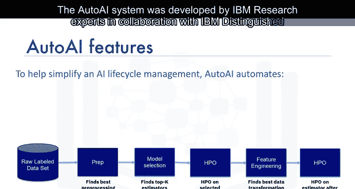

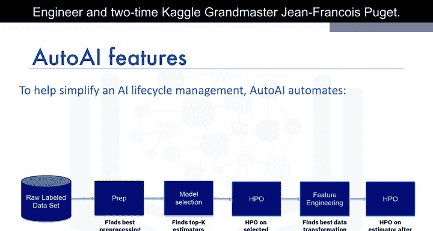

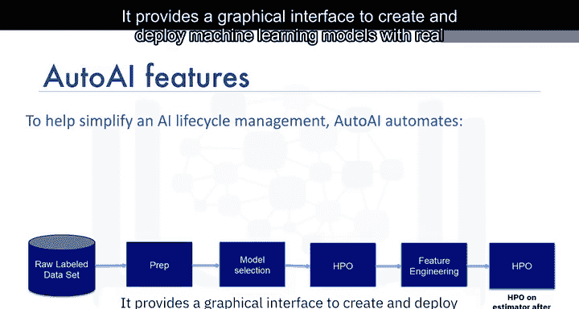

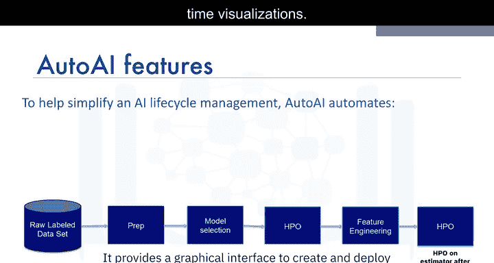

AutoAI自动执行典型的机器学习步骤，例如：
*   **数据准备**
*   **模型选择**
*   **特征工程**
*   **超参数优化**

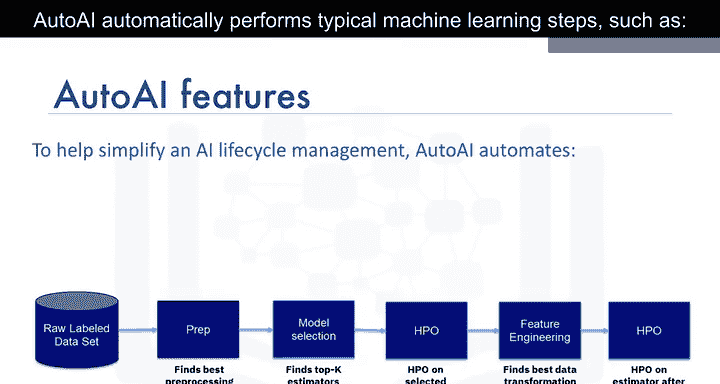

用户可以在图形界面上查看进度。

## AutoAI实战：一个分类示例

上一节我们介绍了AutoAI的概念，本节中我们来看看一个具体的应用实例。

这个例子展示了训练一个模型来预测顾客是否可能从一家户外装备店购买帐篷。

我们从一个结构化的历史数据集开始。在这个数据集中，有四个特征或预测列：
*   `gender`：顾客的性别
*   `age`：顾客的年龄
*   `marital_status`：婚姻状况（已婚、单身或未指定）
*   `profession`：顾客职业的一般类别，例如酒店业、销售或简单的“其他”

模型将学习预测`Is_tent`列的值，即顾客是否购买了帐篷。

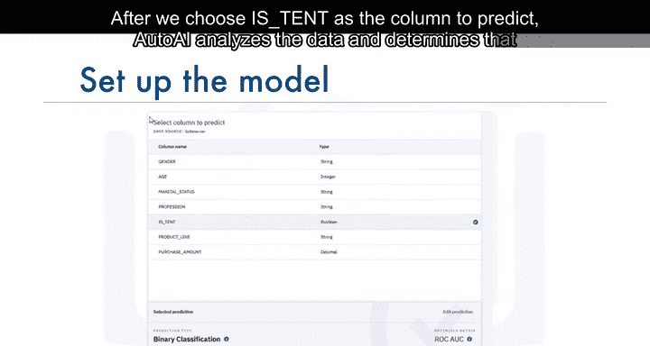

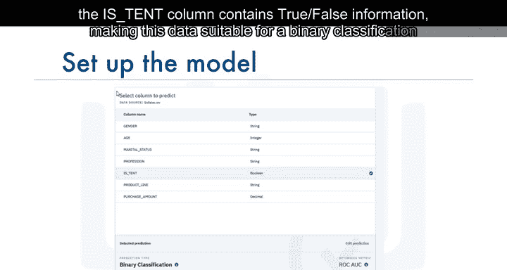

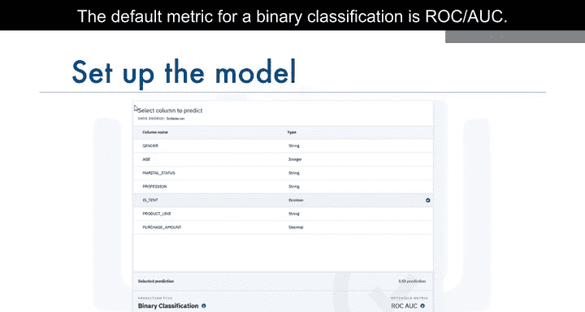

当我们选择`Is_tent`作为要预测的列后，AutoAI会分析数据并确定`Is_tent`列包含`True`/`False`信息，这使得这些数据适合用于**二元分类模型**。二元分类的默认评估指标是**ROC/AUC**。

点击“运行实验”后，一个信息图会显示模型训练过程中构建流水线的过程。一旦流水线创建完成，我们可以在排行榜中查看和比较排名后的流水线。

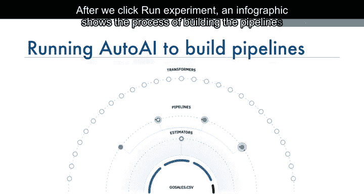

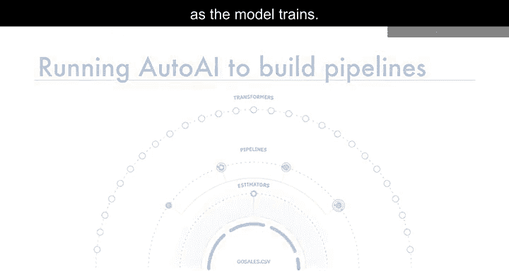

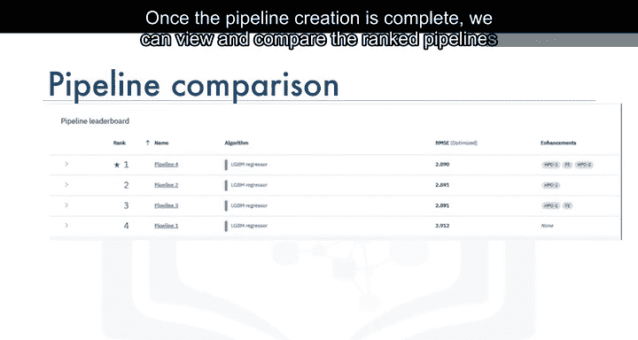

## 流水线比较与回归示例

由于底层样本数据的原因，上述二元分类模型的流水线相当一致。

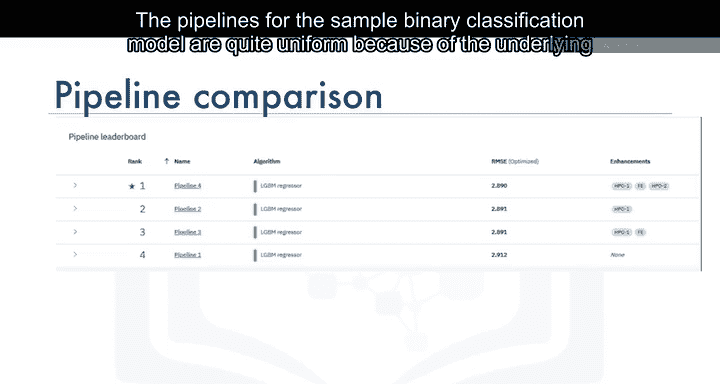

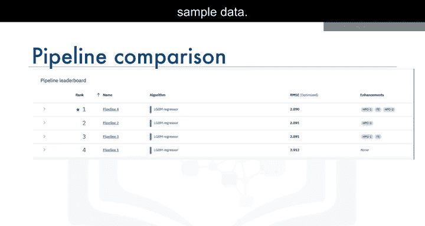

为了更清楚地观察流水线的作用，我们可以将实验重新运行为一个**回归实验**，以预测购买金额。该实验会在生成的流水线中产生更好的多样性。😊

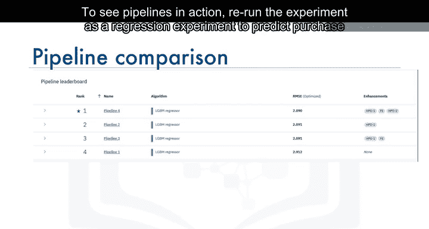

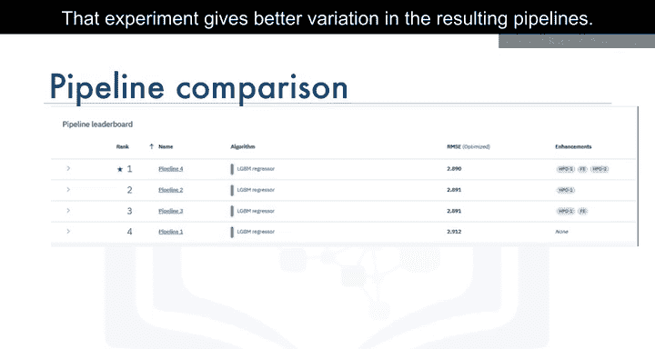

点击“流水线比较”后，我们可以看到不同流水线在各种模型质量指标上的差异。这些流水线可以作为机器学习资产保存在Watson Studio项目中，然后进行部署和测试。

## 功能范围与总结

目前，AutoAI仅适用于**分类**和**回归**模型。计划在未来增加时间序列模型的支持。

在本节课中，我们一起学习了AutoAI如何自动化典型的数据科学任务，帮助更快地获得性能更好的数据流水线，同时简化了在Watson Machine Learning中将流水线部署到生产环境的过程。

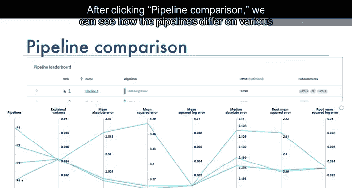

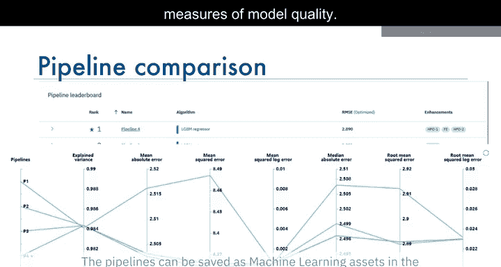

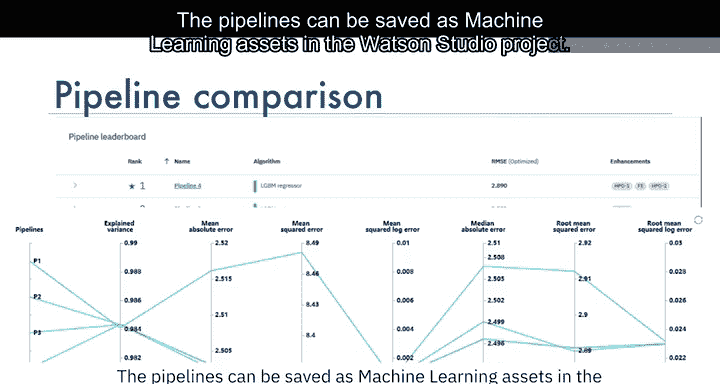

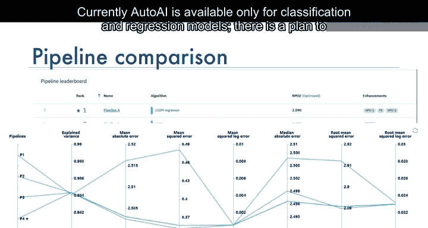

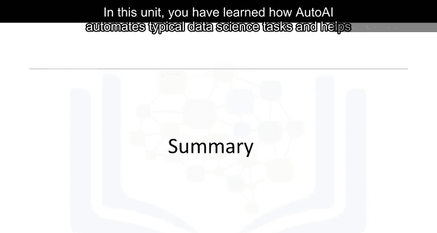

在下一节中，我们将讨论Watson OpenScale，它有助于确保您的模型是公平的、可解释的并且是最新的。

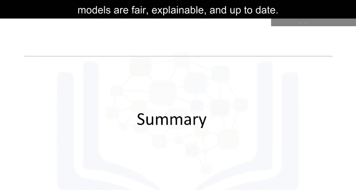

