# 044：IBM Watson公平性监测 👁️

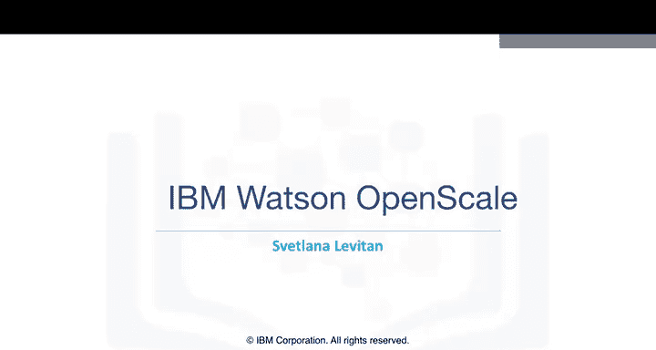

在本节课中，我们将学习IBM Watson Studio的一个重要功能——Watson OpenScale。该工具旨在确保机器学习流程的公平性与可解释性，并在模型部署后持续监控其性能。

---

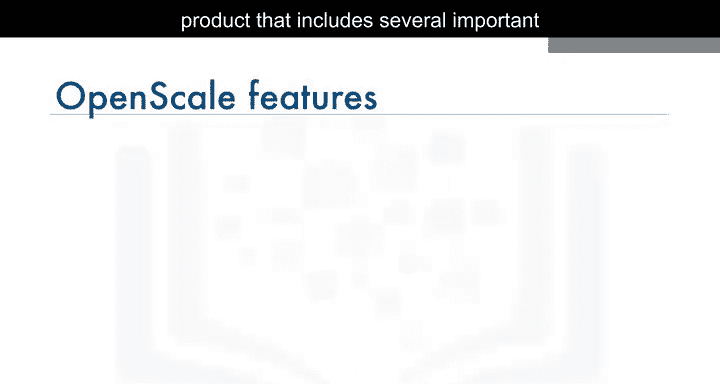

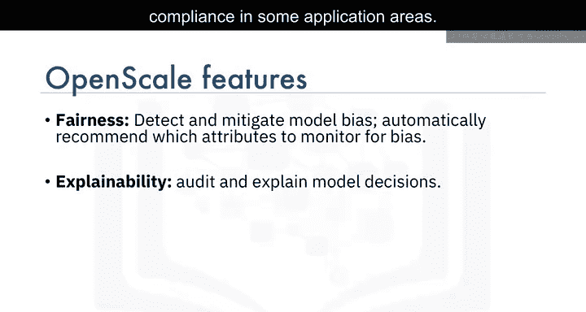

## 概述：什么是IBM Watson OpenScale？ 🧠

IBM Watson OpenScale是一个综合性产品，它包含多个关键功能，旨在管理生产环境中的AI模型。

上一节我们介绍了Watson Studio平台，本节中我们来看看其子产品OpenScale的核心能力。

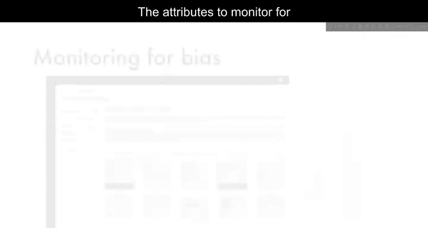

以下是OpenScale的主要功能：

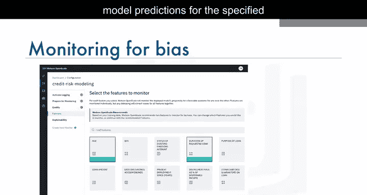

*   **公平性测试与纠偏**：它能测试模型及其预测的公平性，并提供方法来克服偏见。
*   **预测可解释性**：它能帮助提供模型预测的解释，这对于某些应用领域的合规性至关重要。
*   **性能监控与漂移检测**：它监控模型在生产环境中的性能，并能检测其随时间的退化或“模型漂移”。
*   **自动再训练**：用户可以设定标准，当满足条件时，模型会自动使用新数据进行再训练。
*   **业务影响衡量**：它有助于衡量模型对业务的帮助程度。

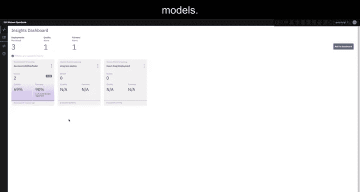

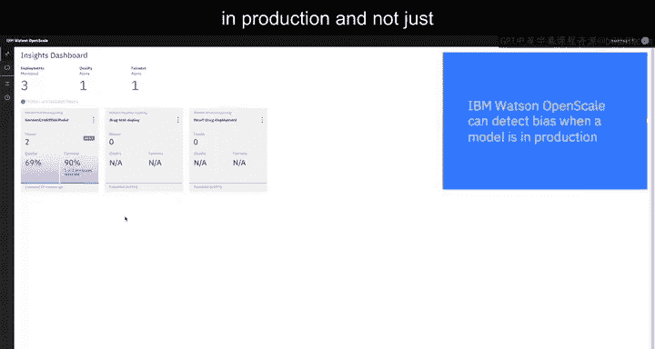

---

## 核心功能一：监测与确保公平性 ⚖️

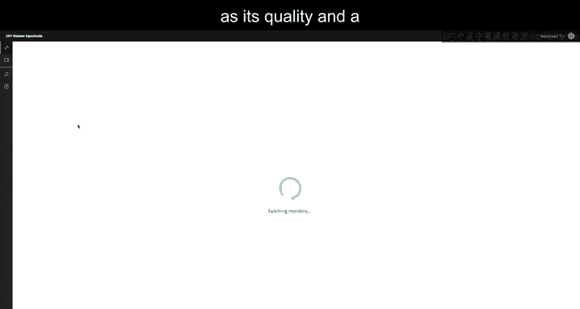

用户需要知道他们的AI模型是公平的。然而，模型训练所用的数据可能包含不希望的偏见，这些偏见可能会无意中被带入最终的模型中。

IBM Watson OpenScale不仅能在模型构建时，还能在模型投入生产后检测偏见。

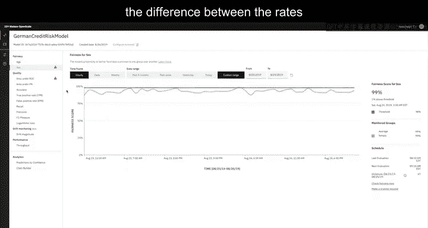

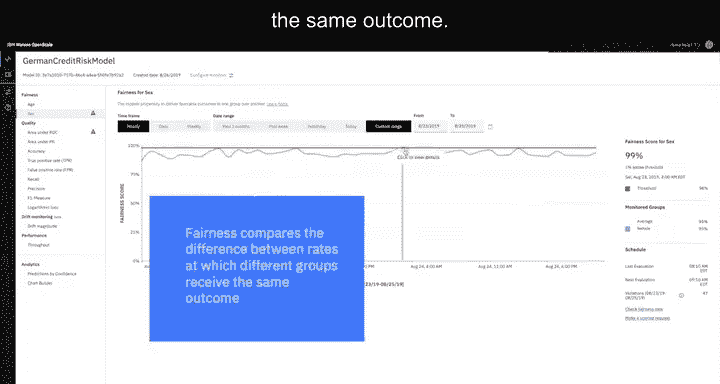

### 公平性如何衡量？

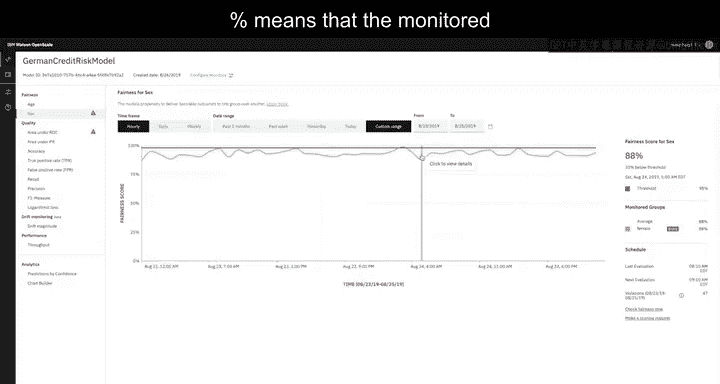

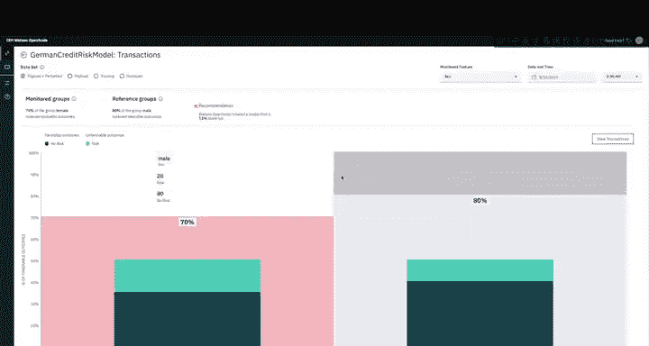

OpenScale通过计算不同群体（例如，女性与男性）获得相同结果的比率差异来衡量模型的公平性。

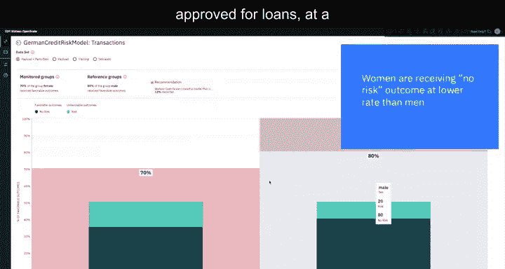

**公式表示**：`公平性值 = (监测群体获得有利结果的比率) / (参考群体获得有利结果的比率) * 100%`

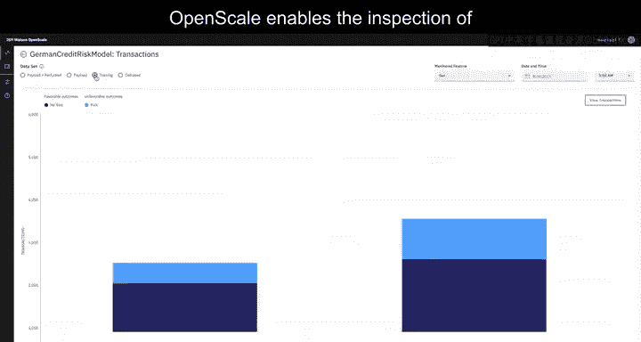

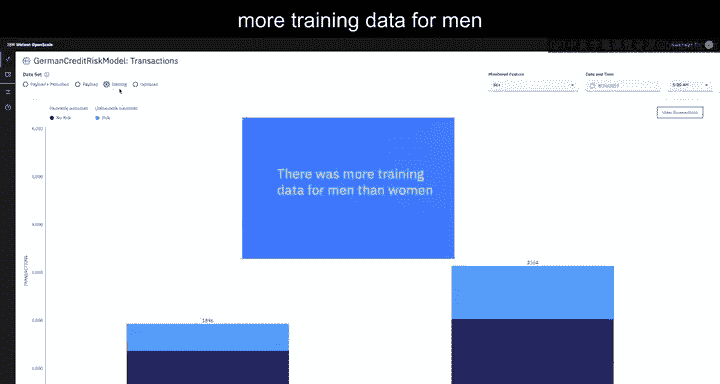

公平性值低于100%意味着被监测群体比参考群体更频繁地获得不利结果。

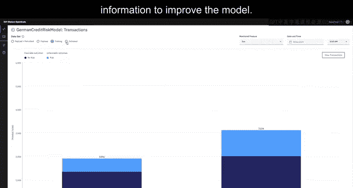

### 实例演示：信贷风险模型

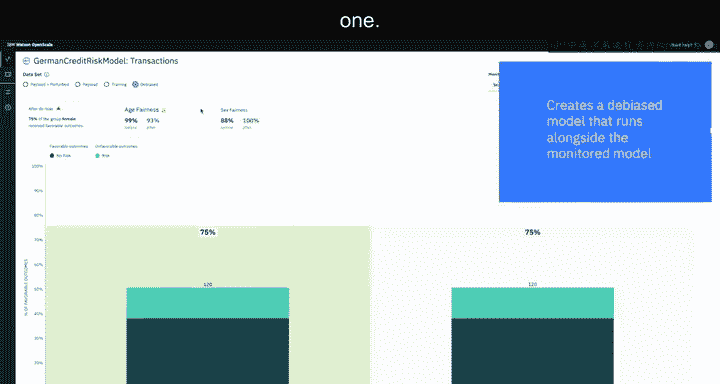

在一个信贷风险模型的演示中，模型根据信用历史、年龄、抚养人数等多种特征来决定某人是否有资格获得贷款。

启动OpenScale后，我们可以看到被监控模型的几个关键指标，例如其质量和公平性分数。在本例中，数据显示女性获得“无风险”结果（即贷款获批）的比率低于男性。

### 洞察偏见根源

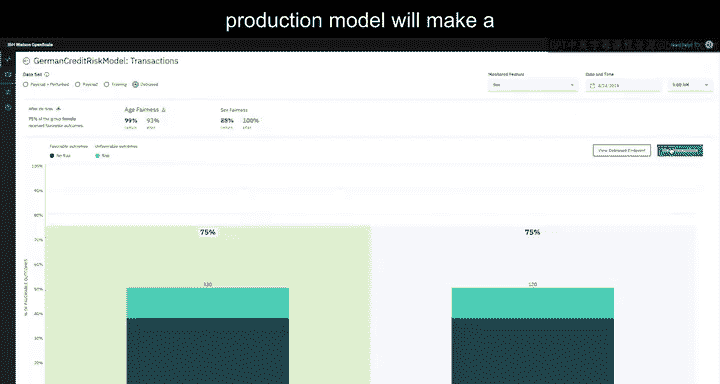

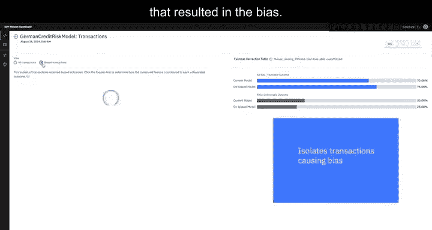

OpenScale允许检查每个模型的训练数据。检查揭示出，训练数据中男性的数据多于女性。这为了解模型为何对申请贷款的女性存在偏见提供了一些线索。数据科学家可以利用这些信息来改进模型。

### 缓解偏见

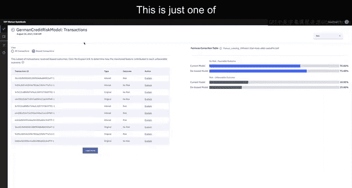

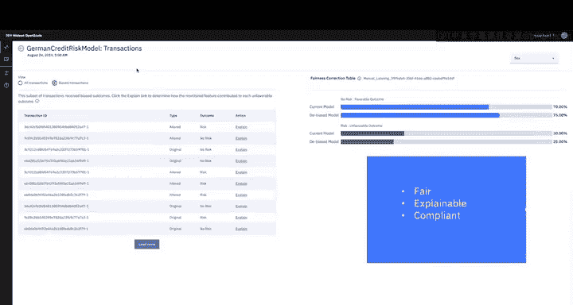

检测偏见是一方面，OpenScale还能通过创建一个“去偏见”模型来缓解它，该模型与受监控的模型一同运行。

这个“去偏见”模型经过训练，能够检测出您的生产模型何时会做出带有偏见的预测。对于这些预测，Watson OpenScale会将记录中的监测值（本例中为“女性”）翻转为参考值（“男性”），而保持该记录中所有其他数据点不变。

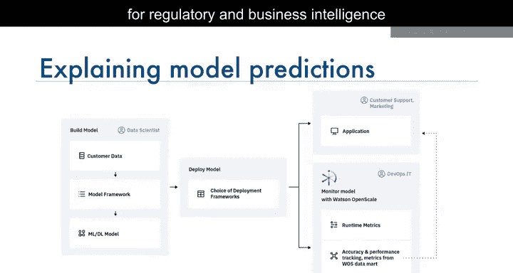

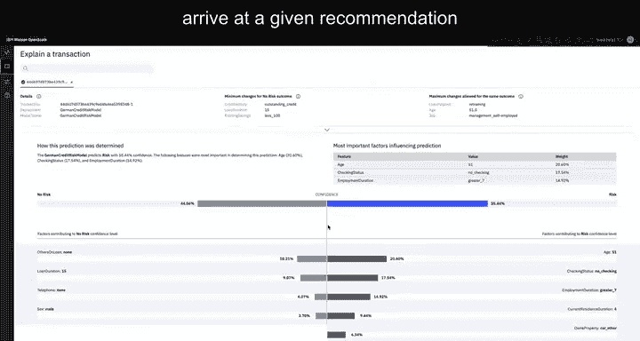

如果这一改变将预测从“有风险”变为“无风险”，那么“去偏见”模型就会将“无风险”结果作为去偏见后的结果呈现。这只是Watson OpenScale帮助确保模型公平性的方法之一。

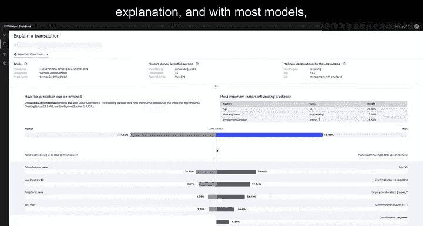

---

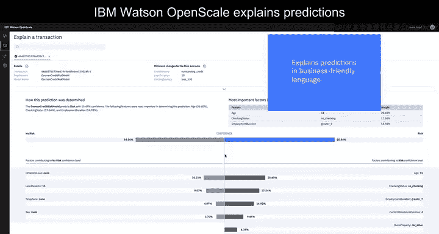

## 核心功能二：提供预测解释 📝

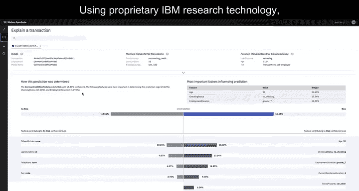

用户和客户希望知道AI模型为何得出某个推荐或预测。但对于大多数模型而言，提供这种解释并非易事。

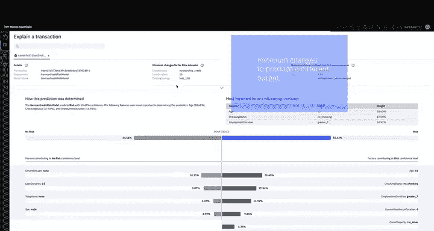

IBM Watson OpenScale能用业务友好的语言解释预测。例如，对于这个被预测为“有风险”的信贷申请，OpenScale会确定对该预测产生正面或负面贡献的特征，并将其清晰地列出来。

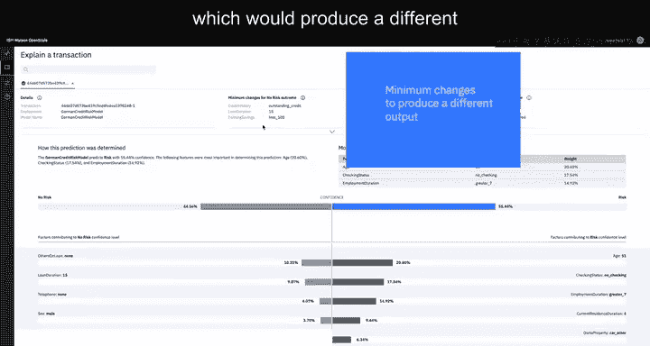

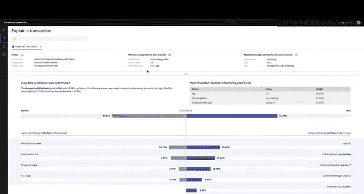

解释以可视化方式呈现，同时也提供基于句子的文本摘要，以确保最大程度的清晰度。

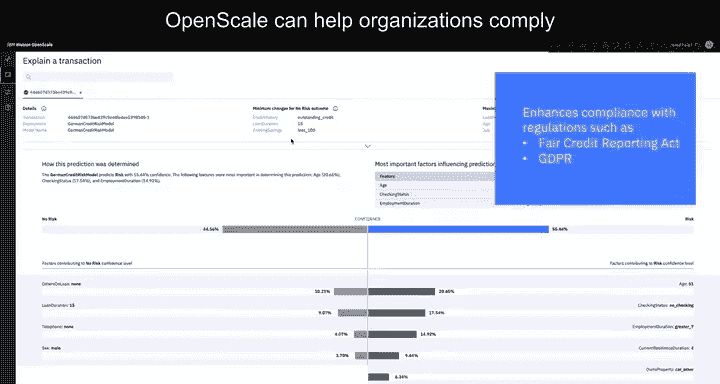

利用IBM专有的研究技术，OpenScale还能生成对比解释。在这里，我们可以看到对此输入记录所需的最小更改，这些更改将产生不同的输出，将预测从“有风险”变为“无风险”。

Watson OpenScale提供的解释可以帮助组织遵守诸如《公平信用报告法》和GDPR等法规，这些法规赋予客户权利要求知道其申请被拒绝的原因。

---

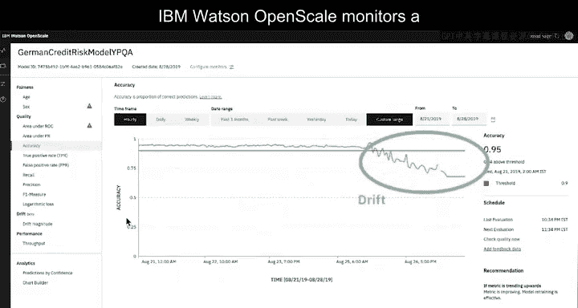

## 核心功能三：监控模型漂移与性能 📉

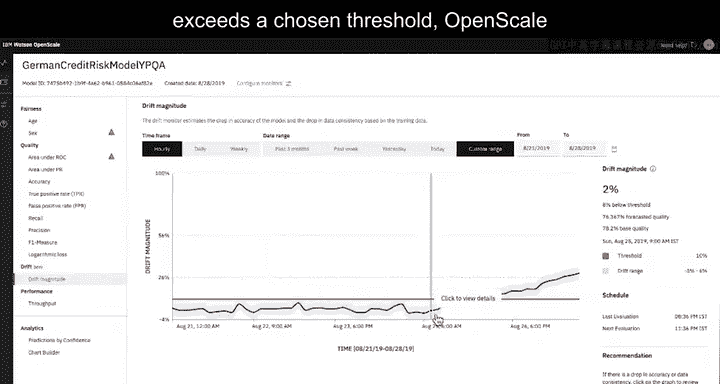

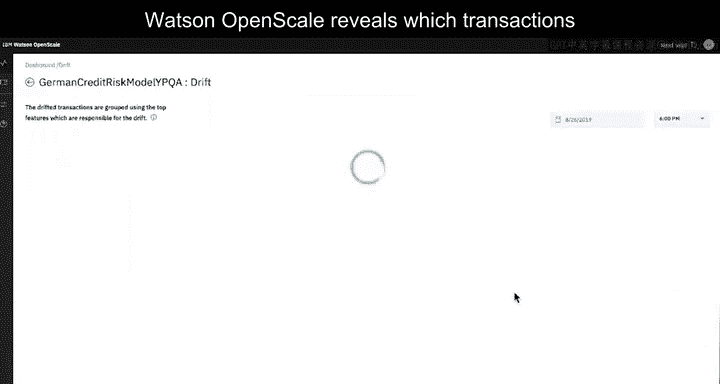

在AI模型投入生产之前，它必须证明自己能在测试数据（训练数据的一个子集）上做出准确的预测。然而，随着时间的推移，生产数据可能开始与训练数据有所不同，导致模型开始做出不那么准确的预测。这种现象被称为“漂移”。

IBM Watson OpenScale监控模型在生产数据上的准确性，并将其与在训练数据上的准确性进行比较。当准确性差异超过设定的阈值时，OpenScale会生成警报。

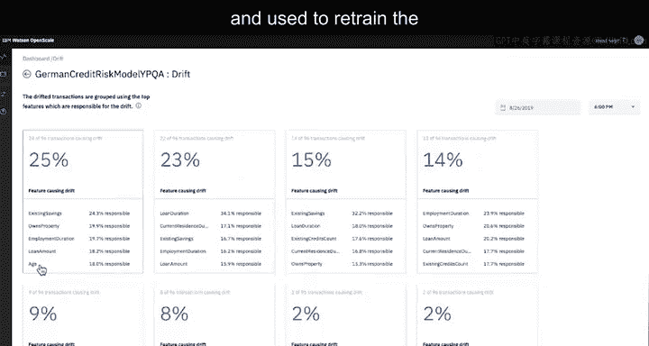

同时，OpenScale会揭示哪些交易导致了漂移，并识别出应负责的主要交易特征。例如，在此贷款审批模型中，导致漂移的交易有25%是因为某些特征存在问题，这些特征包含的数据与训练数据有至关重要的不同。

导致漂移的交易可以被发送进行手动标记，并用于重新训练模型，从而使其预测准确性在运行时不会下降。Watson OpenScale不仅帮助识别漂移，还突出其根本原因，并提供可转化为训练数据的交易，有助于修复漂移。

例如，根据Watson OpenScale的建议重新训练的模型版本，开始做出准确的推荐，缓解了漂移问题。这确保了您的模型能够随着时间的推移持续交付您期望的结果。

---

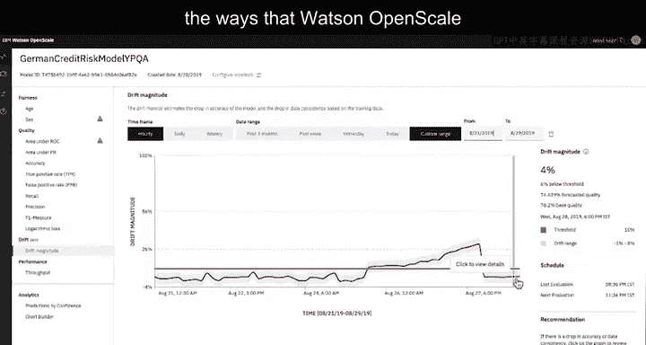

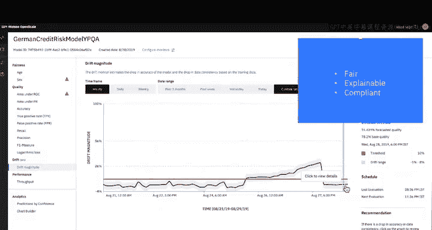

## 总结 🎯

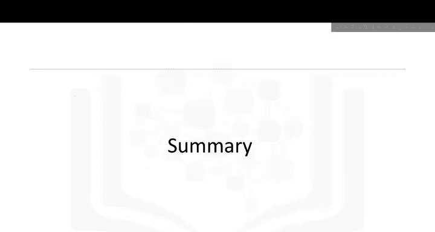

本节课中，我们一起学习了IBM Watson OpenScale如何确保模型的公平性与可解释性，并在生产环境中监控模型漂移。我们了解了它通过量化指标检测偏见、提供直观预测解释、以及预警和辅助修复性能漂移的核心机制。这完成了关于IBM为数据科学家提供的产品介绍模块。祝测验顺利！😊