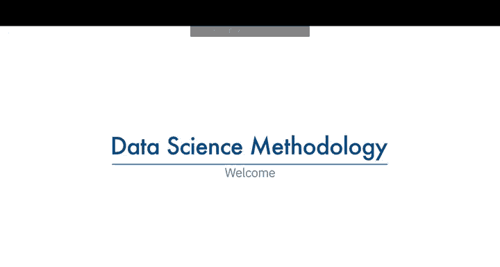
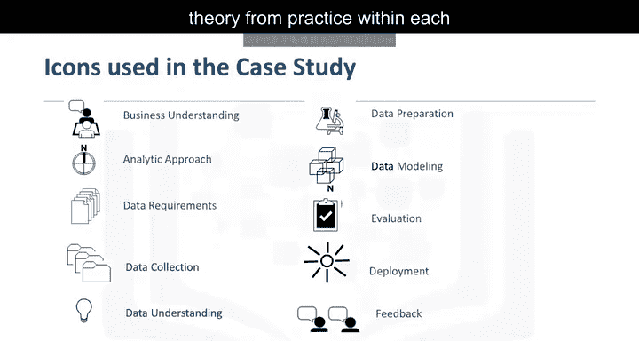
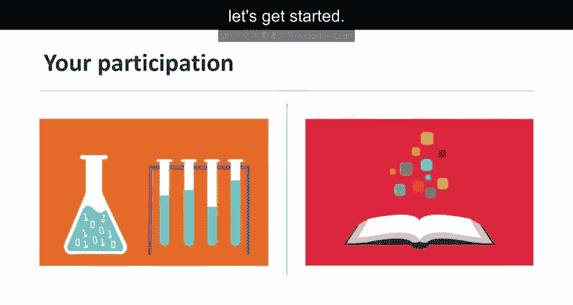

# 001：《数据科学方法论》导论

在本节课中，我们将学习数据科学方法论的基本概念和框架。我们将了解为什么在数据科学项目中遵循一套系统化的方法至关重要，并初步认识由IBM资深数据科学家John Rawlins提出的10个核心问题。通过本课程的学习，你将掌握如何从问题定义到解决方案验证的完整流程，确保数据被正确且有效地用于解决实际问题。

---

## 🎯 什么是数据科学方法论？

欢迎来到《数据科学方法论101》。

这是一个故事的开始，一个你未来多年都会向他人讲述的故事。这个故事的形式并非你在此处体验的课程，而是你将与他人分享的经历，解释你如何通过对一个问题的理解，得出了改变某种做事方式的答案。

尽管过去几十年计算能力和数据获取途径显著增加，但我们在决策过程中利用数据的能力要么丧失，要么未能最大化。原因常常在于，我们对所提问题缺乏扎实的理解，也不知道如何将数据正确应用于手头的问题。

以下是“方法论”一词的定义。思考这一点很重要，因为人们常常倾向于绕过方法论，直接跳转到解决方案。然而，这样做会阻碍我们解决问题的初衷。

---

## 🧭 课程目标与核心框架

本课程只有一个目的，即分享一种可在数据科学中使用的方法论，以确保用于解决问题的数据是相关的，并且经过恰当处理以应对当前问题。

本课程讨论的数据科学方法论由John Rawlins概述，他是一位经验丰富、目前在IBM任职的高级数据科学家。本课程基于他的经验，阐述了他对遵循方法论以取得成功的重要性的立场。

简而言之，数据科学方法论旨在按规定的顺序回答10个基本问题。

从这张幻灯片可以看出，有两个问题旨在定义问题，从而确定要使用的方法。接着有四个问题帮助你围绕所需数据进行组织。最后，还有四个额外问题，旨在验证所设计的数据和方法。

现在请花点时间熟悉这10个问题，它们对你的成功至关重要。

---

## 📚 课程结构与学习组件

本课程由几个部分组成。共有五个模块，每个模块讲解方法论的两个阶段，并解释每个阶段为何必要。

在同一模块内，会分享一个支持你所学内容的案例研究。还有一个实践实验室，帮助你应用所学材料。最后，有三个复习问题来测试你对概念的理解。当你准备好时，参加期末考试。

课程中包含的案例研究重点展示了数据科学方法论如何在具体情境中应用。它围绕以下场景展开：用于向公众提供医疗保健的预算有限。因反复出现问题而导致的医院再入院，可被视为系统在患者初次出院前未能妥善处理其状况的失败迹象。核心问题是：分配这些资金的最佳方式是什么，以最大化其在提供优质护理方面的效用？

正如你将看到的，如果新的数据科学试点项目成功，它将通过为医生提供新工具，将及时的数据驱动信息纳入患者护理决策，从而提供更好的患者护理。

案例研究部分会在屏幕右上角显示这些图标，以帮助你在每个模块中区分理论与实践。

---

## 💡 辅助资源与学习支持

还提供了一个数据科学术语表，以帮助澄清课程中使用的关键术语。

在参与课程时，如果你遇到一些挑战或有一些问题，请探索讨论区和Wiki部分。

现在你已经准备就绪，调整好耳机，让我们开始吧。

---

## 📝 总结

本节课中，我们一起学习了《数据科学方法论》课程的导论部分。我们明确了方法论在数据科学项目中的核心价值，认识了由10个关键问题构成的框架，并了解了课程的整体结构、案例研究场景以及可用的学习资源。掌握这套方法论，是确保数据科学项目从问题定义到成果验证都能系统、高效进行的关键。在接下来的模块中，我们将深入探讨这10个问题的具体内容。