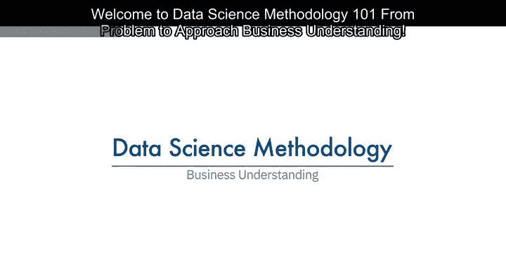
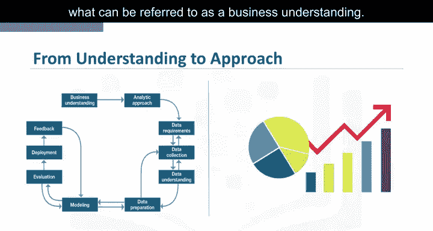
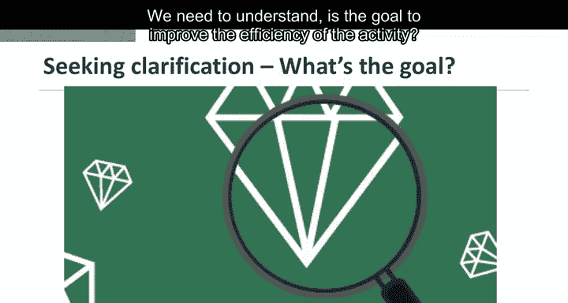
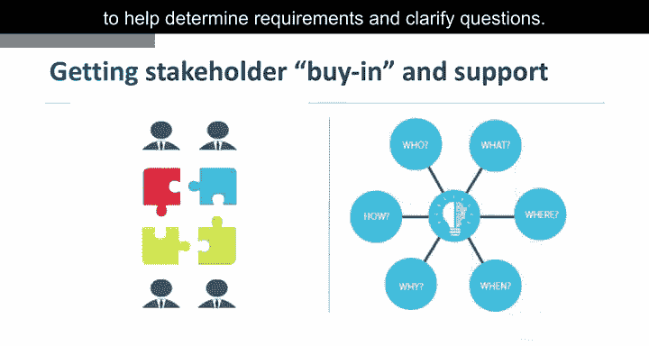
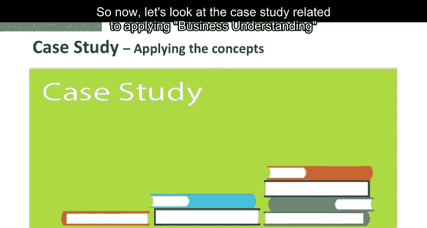
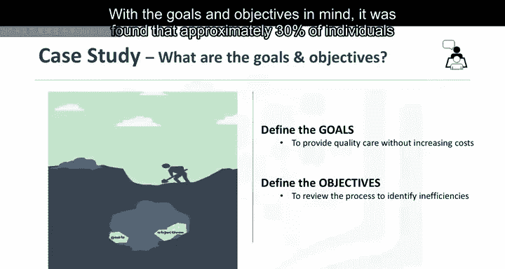
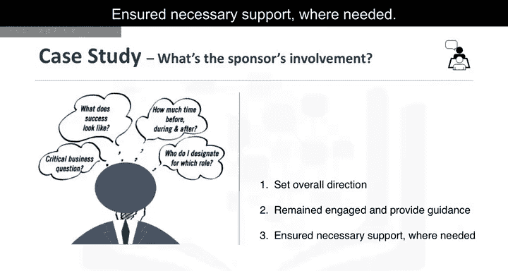
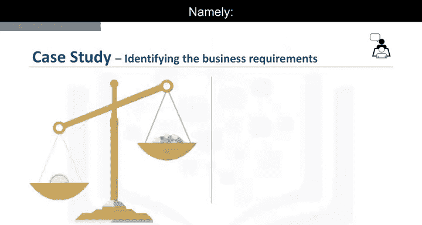

# 002：业务理解

在本节课中，我们将学习数据科学方法论的第一步：业务理解。这一步骤的核心在于明确问题、设定目标，并确保所有相关方对任务有共同的理解，从而为后续的数据收集和分析奠定坚实基础。

---

## 🎯 概述：从问题到方法

你是否曾遇到过这种情况：老板紧急召开会议，布置一项重要任务，截止日期非常紧迫，必须按时完成。你们反复讨论，确保考虑了任务的各个方面，会议结束时双方都信心满满，认为一切顺利。然而，当天下午，当你仔细研究各种问题时，你意识到需要提出几个额外的问题才能真正完成任务。不幸的是，老板要到第二天早上才有空。此时，紧迫的截止日期仍在耳边回响，你开始感到不安。那么，你该怎么办？是冒险继续前进，还是停下来寻求澄清？

数据科学方法论的第一步就是花时间寻求澄清，以获得所谓的“业务理解”。

---

## 🔍 为什么业务理解至关重要

将业务理解放在方法论的开头，是因为明确要解决的问题有助于确定哪些数据将用于回答核心问题。Roawin指出，拥有明确定义的问题至关重要，因为它最终决定了解决问题所需的分析方法。很多时候，人们花费大量精力去回答他们认为是问题的问题。虽然用于解决该问题的方法可能很合理，但它们无助于解决实际问题。

建立明确定义的问题始于理解提问者的目标。例如，如果企业主问：“我们如何降低执行某项活动的成本？”我们需要理解目标是提高活动效率，还是增加企业的盈利能力。

---

## 🧩 明确目标与分解目标

一旦目标明确，下一步就是找出支持该目标的具体目标。通过分解目标，可以进行结构化讨论，确定优先级，从而组织和规划如何解决问题。根据问题的不同，需要让不同的利益相关者参与讨论，以帮助确定需求并澄清问题。

---

## 📊 案例研究：医疗预算分配

现在，让我们看一个关于应用业务理解的案例研究。

在案例研究中，提出的问题是：“如何最佳分配有限的医疗预算，以最大化其在提供优质护理方面的使用？”这个问题成为美国一家医疗保险公司热议的话题。随着公共资金对再入院的资助减少，这家保险公司面临不得不弥补成本差额的风险，这可能导致客户费率上升。

知道提高保险费率不会受欢迎，这家保险公司与其所在地区的卫生当局坐下来，并请来IBM的数据科学家，看看如何将数据科学应用于当前的问题。甚至在开始收集数据之前，就需要定义目标和具体目标。在花时间确定目标和具体目标后，团队将患者再入院作为审查的有效领域。

考虑到目标和具体目标，团队发现大约30%完成康复治疗的人会在一年内再次入院康复中心，50%的人会在五年内再次入院。在审查了一些记录后，发现充血性心力衰竭患者位居再入院名单的首位。进一步确定可以应用决策树模型来审查这种情况，以确定为什么会发生这种情况。

为了获得指导分析团队制定和执行其第一个项目的业务理解，IBM数据科学家提出并举办了一次现场研讨会，以启动项目。关键业务发起人在整个项目中的参与至关重要，因为发起人设定了总体方向，保持参与，提供指导，并在需要时确保必要的支持。

最后，为将要构建的任何模型确定了四个业务要求，即：预测充血性心力衰竭患者的再入院结果、预测再入院风险、理解导致预测结果的事件组合，以及对新患者应用易于理解的流程来评估其再入院风险。

---

## ✅ 总结

本节课中，我们一起学习了数据科学方法论的第一步——业务理解。我们探讨了明确问题、设定目标以及分解目标的重要性，并通过一个医疗预算分配的案例研究，展示了如何在实际项目中应用这些概念。业务理解是数据科学项目的基石，确保我们从一开始就走在正确的道路上，为后续的数据收集、分析和建模工作打下坚实基础。