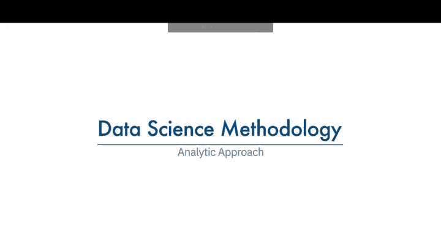
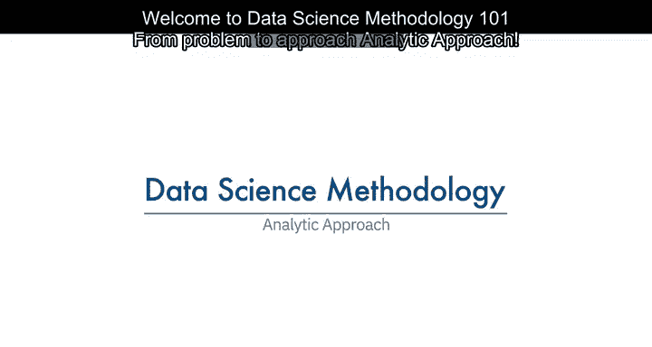
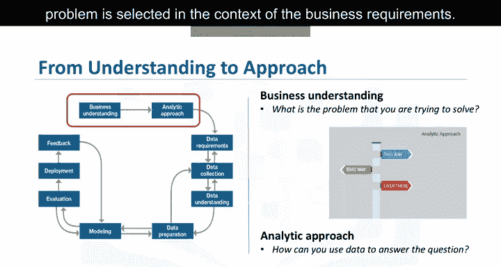
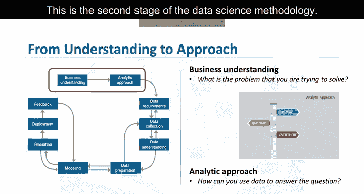

# 003：分析方法

在本节课中，我们将学习数据科学方法论的第二阶段：如何根据已定义的问题，选择合适的分析方法。我们将探讨不同类型的分析模式及其适用场景，并通过一个案例研究来具体说明如何应用决策树分类模型。

---

选择正确的分析方法取决于所提出的问题。这一阶段需要与提问者进行充分沟通，以明确问题细节，从而选择最合适的分析路径或方法。

上一节我们明确了要解决的问题，本节中我们来看看如何在业务需求的背景下，为这个问题选择恰当的分析方法。这是数据科学方法论的第二个阶段。

一旦对问题有了深刻理解，就可以选择分析方法。这意味着需要确定哪种类型的模式能最有效地解决问题。

以下是几种常见的分析模式及其适用场景：

*   **预测模型**：如果问题涉及预测某个事件发生的概率，则可能使用预测模型。
*   **描述性方法**：如果问题旨在展示数据间的关系，则可能需要描述性方法。例如，基于事件和偏好来寻找相似活动的聚类。
*   **统计分析**：适用于需要计数的问题。例如，如果问题需要一个“是”或“否”的答案，那么使用分类方法来预测响应是合适的。
*   **机器学习**：这是一个让计算机无需明确编程即可学习的领域。机器学习可用于识别数据中其他方法难以发现的关系和趋势。
*   **聚类与关联方法**：如果问题是为了了解人类行为，那么使用聚类和关联方法是合适的。

---

现在，让我们通过一个案例研究来看看分析方法的具体应用。

在该案例研究中，使用了一个**决策树分类模型**来识别导致每位患者特定结果的组合条件。

在这种方法中，沿着每条路径检查每个节点中的变量，会得到一个相应的阈值。这意味着决策树分类器不仅能提供预测结果，还能基于每组中主要结果（是或否）的比例提供该结果的可能性。

分析师可以从这些信息中获取每位患者的再入院风险（即结果为“是”的可能性）。如果某个叶子节点中的主要结果是“是”，那么风险就是该叶子节点中“是”的患者比例。如果主要结果是“否”，那么风险就是1减去该叶子节点中“否”的患者比例。

决策树分类模型易于非数据科学家理解和应用，可用于对新患者的再入院风险进行评分。临床医生可以清楚地看到导致患者被评分为高风险的条件，并且可以在患者住院期间的各个时间点建立和应用多个模型，从而动态地了解患者的风险及其随着各种治疗措施而发生的变化。

基于这些原因，该案例选择了决策树分类方法来构建充血性心力衰竭再入院模型。

---

本节课中，我们一起学习了数据科学方法论的第二阶段——分析方法。我们了解了如何根据问题的性质选择预测、描述、统计或机器学习等不同分析路径，并通过一个医疗案例深入了解了决策树分类模型的实际应用和优势。选择正确的分析方法是构建有效数据科学解决方案的关键一步。