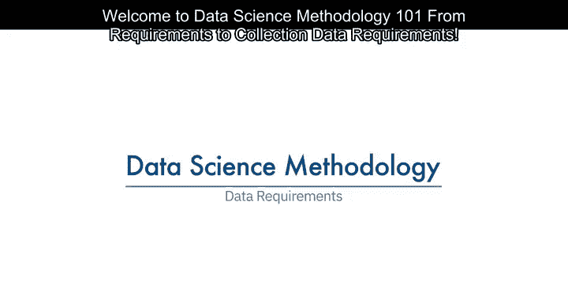
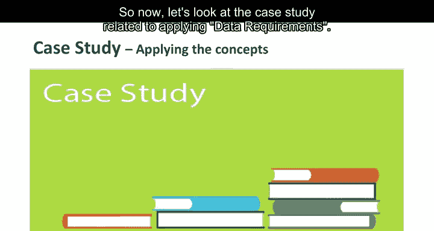

# 004：数据需求

在本节课中，我们将学习数据科学方法论中的“数据需求”阶段。我们将了解如何根据已定义的问题和分析方法，明确所需的数据内容、格式与来源，为后续的数据收集与准备工作奠定基础。

---

上一节我们确定了分析问题并选择了分析方法。本节中，我们来看看如何根据所选方法，明确具体的数据需求。

如果把解决数据科学问题比作烹饪一顿意大利面，那么问题就是食谱，而数据则是食材。如果缺少正确的食材，就无法成功做出菜肴。因此，数据需求阶段至关重要，它确保我们拥有合适的“食材”来“烹饪”出解决方案。

基于对问题的理解以及所选的分析方法，数据科学家可以开始着手明确数据需求。在进入数据收集和准备阶段之前，必须为所选的分析方法（例如决策树分类）定义清晰的数据要求。这包括确定所需的数据内容、格式和初始收集来源。

以下是明确数据需求时通常涉及的几个关键方面：

*   **数据内容**：需要哪些具体的信息或变量？
*   **数据格式**：数据应以何种结构组织（例如，每条记录代表什么）？
*   **数据来源**：数据可以从哪里获取？

---

现在，让我们通过一个案例研究来具体看看如何应用数据需求阶段。

在该案例中，首要任务是为已选定的**决策树分类**方法定义数据需求。这涉及从医疗保险服务商的会员库中筛选合适的患者队列。

为了编译完整的临床病史，研究团队为该队列设定了三条入选标准：

1.  患者必须在服务提供区域内住院，以确保能获取必要信息。
2.  研究聚焦于在完整一年内，主要诊断为充血性心力衰竭的患者。
3.  患者在因充血性心力衰竭首次入院前，必须至少有连续六个月的参保记录，以便汇编完整的病史。

同时，那些同时被诊断患有其他严重疾病的充血性心力衰竭患者被排除在队列之外。因为这些并发症会导致高于平均的再入院率，从而可能扭曲分析结果。

接下来，团队定义了决策树分类所需的数据内容、格式和表现形式。这种建模技术要求**每个患者对应一条记录**，记录的列代表模型中的变量。

为了对再入院结果进行建模，需要涵盖患者临床病史所有方面的数据。这些内容包括：入院记录、主要/次要/第三诊断、手术、处方以及在住院期间或门诊期间提供的其他服务。

因此，单个患者可能拥有代表其所有相关属性的数千条事务性记录。为了达成“每位患者一条记录”的格式，数据科学家需要将这些事务记录汇总到患者级别，并创建一系列新变量来代表这些信息。这部分工作属于后续的“数据准备”阶段，因此在数据需求阶段提前考虑并预见后续步骤非常重要。

---

本节课中，我们一起学习了数据科学方法论中的数据需求阶段。我们明白了明确数据需求就像准备烹饪食材一样关键，它确保了后续分析拥有正确、可用的数据基础。通过案例，我们看到了如何根据分析方法（如决策树分类）制定具体的数据入选标准，并规划所需的数据内容和格式，同时为下一阶段的数据准备工作做好铺垫。