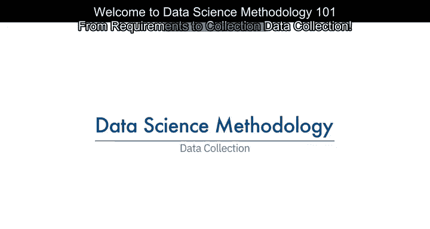
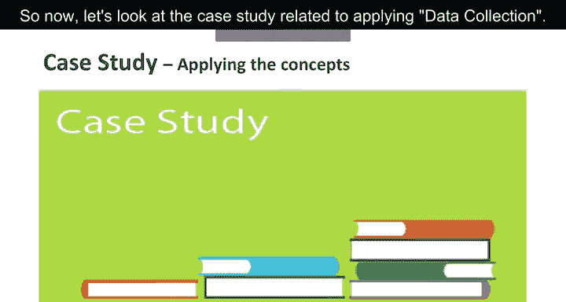
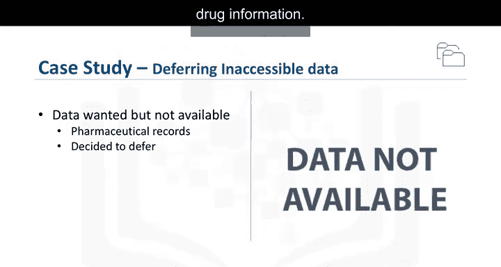
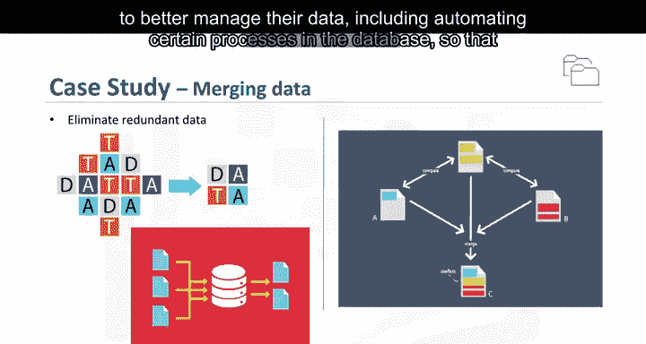

# 005：数据收集

在本节课中，我们将学习数据科学方法论中的数据收集阶段。我们将了解如何根据需求收集数据，评估数据质量，并处理数据收集过程中可能遇到的问题。

---

上一节我们讨论了数据需求的定义，本节中我们来看看如何根据这些需求进行数据收集。

数据收集完成后，数据科学家会进行评估，以确定是否已获得所需数据。

这就像购买食材准备一顿饭，有些食材可能因季节原因难以获取，或成本超出预期。

在此阶段，数据需求会被重新审视，并决定是否需要收集更多或更少的数据。

一旦数据“食材”收集完毕，数据科学家就能更好地理解他们将处理的内容。

可以应用描述性统计和可视化等技术来评估数据集的内容、质量，并获得对数据的初步洞察。

数据中的空白将被识别，并制定填补或替代的计划。本质上，数据现在已准备就绪，如同食材已放在砧板上。

---

现在，让我们看看数据科学方法论中数据收集阶段的一些实例。这个阶段是数据需求阶段的后续工作。

以下是数据收集阶段的关键步骤：

1.  **确定数据来源**：你需要知道所需数据元素的来源或查找方法。
2.  **收集相关数据**：根据案例需求，收集所有必要的数据集。
3.  **处理数据缺失**：对于暂时无法获取的数据，可以做出延迟决策。
4.  **整合与清理数据**：将来自不同来源的数据进行提取、合并，并去除冗余。

---

接下来，我们通过一个案例研究来具体应用数据收集。

在我们的案例研究中，所需数据可能包括患者的**人口统计学、临床和保险信息**，提供者信息，理赔记录，以及与所有充血性心力衰竭患者诊断相关的**药物和其他信息**。

对于此案例研究，还需要某些药物信息，但该数据源尚未与其他数据源整合。

这引出了一个重要观点：**对于暂时无法获取的数据，可以推迟决策，并尝试在后续阶段获取**。

例如，甚至可以在从预测建模中获得一些中间结果后再进行。如果这些结果表明药物信息对于获得良好模型可能很重要，那么就会投入时间去获取。不过，事实证明，即使没有这些药物信息，他们也能够建立一个相当不错的模型。

---

数据库管理员和程序员经常协作，从各种来源提取数据，然后进行合并。

这有助于去除冗余数据，使其可用于方法论的下一阶段，即数据理解。

在此阶段，如有必要，数据科学家和分析团队成员可以讨论各种更好地管理数据的方法，包括在数据库中自动化某些流程，以使数据收集更轻松、更快速。

---

本节课中我们一起学习了数据收集的核心流程：从根据需求确定数据源，到实际收集与评估数据，再到处理数据缺失问题并整合数据。我们了解到，数据收集是一个迭代过程，可能需要根据初步评估调整计划，并且灵活处理暂时无法获取的数据是可行的策略。