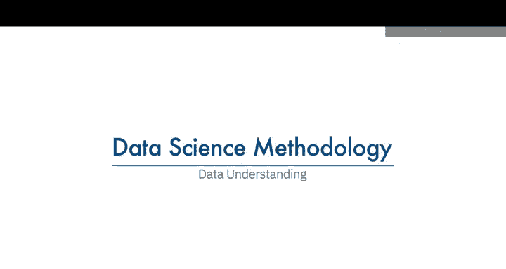
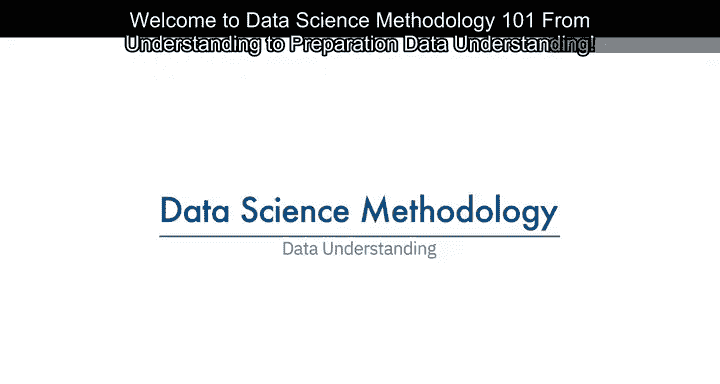
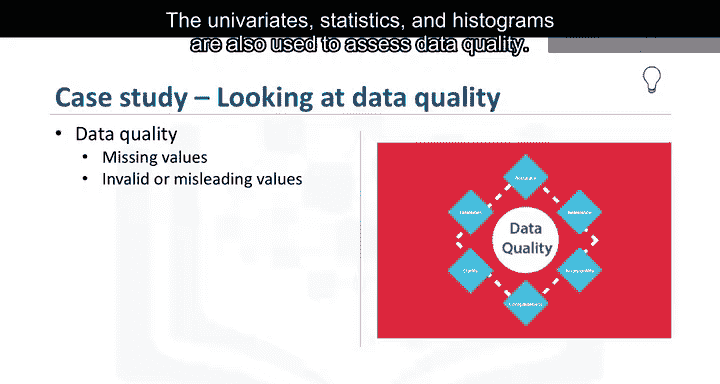
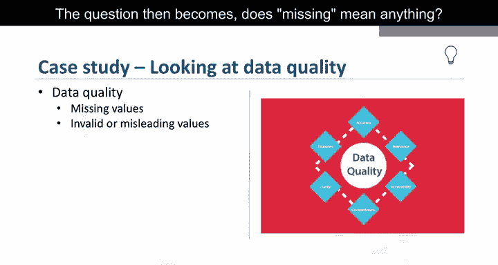
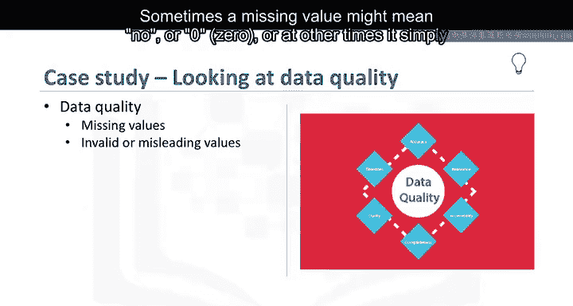
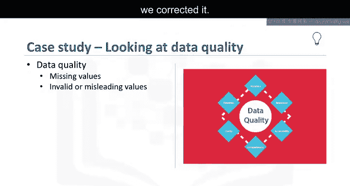
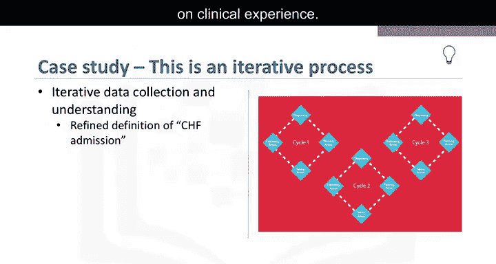

# 006：数据理解





在本节课中，我们将学习数据科学方法论中的“数据理解”阶段。这一阶段的核心任务是评估所收集的数据是否足以代表待解决的问题，并为后续的数据准备和建模工作奠定基础。

---

## 概述：什么是数据理解？

数据理解涵盖了所有与构建数据集相关的活动。本质上，数据理解阶段旨在回答一个问题：**你所收集的数据是否能代表需要解决的问题？**

为了更具体地说明，我们将把数据理解阶段的方法论应用到我们一直在研究的案例中。

---

## 数据理解的具体步骤

上一节我们介绍了数据理解的目标，本节中我们来看看实现这一目标需要执行哪些具体分析。

以下是数据理解阶段通常包含的三类关键分析活动：

1.  **单变量统计分析**
    首先，需要对将成为模型中变量的数据列运行描述性统计。这包括计算每个变量的均值、中位数、最小值、最大值和标准差等统计量。其公式可概括为对单个变量 `X` 计算：
    ```
    均值 (Mean) = ΣX / N
    标准差 (Std) = sqrt( Σ(X - Mean)² / (N-1) )
    ```

2.  **变量间相关性分析**
    其次，使用成对相关性分析来查看某些变量之间的关联紧密程度，并识别是否存在高度相关的变量。高度相关的变量本质上是冗余的，在建模时通常只保留其中一个。相关性可通过皮尔逊相关系数 `r` 来衡量：
    ```
    r = Σ[(Xi - X_mean)(Yi - Y_mean)] / sqrt[ Σ(Xi - X_mean)² * Σ(Yi - Y_mean)² ]
    ```

3.  **数据分布可视化**
    第三，检查变量的直方图以理解其分布。直方图是理解变量值分布方式的良好工具，并能帮助决定需要进行何种数据预处理以使变量在模型中更有用。例如，对于一个拥有过多不同值以至于在模型中信息量不足的分类变量，直方图可以帮助决定如何合并这些值。



---

## 数据质量评估


单变量统计和直方图也被用于评估数据质量。从分析提供的信息中，某些值可能被重新编码，甚至在必要时被删除。



一个常见的问题是处理缺失值。问题在于：**“缺失”本身是否有含义？** 有时，缺失值可能意味着“否”或“0”；而在其他时候，它仅仅意味着“我们不知道”。



或者，如果一个变量包含无效或误导性的值，也需要处理。例如，一个名为“年龄”的数值变量，其值范围是0到100，但也包含“999”，而这个“999”实际上表示缺失，但除非我们进行纠正，否则它会被当作一个有效值处理。

---


## 方法论中的迭代过程




在我们的案例研究中，最初，“充血性心力衰竭入院”的定义是基于主要诊断为充血性心力衰竭。

但在执行数据理解阶段后，发现最初的定义并未涵盖基于临床经验所预期的所有充血性心力衰竭入院病例。

这意味着需要**返回到数据收集阶段**，添加次要和第三诊断，并构建一个更全面的“充血性心力衰竭入院”定义。

这只是方法论中互动过程的一个例子。一个人对问题和数据研究得越多，学到的就越多，因此就能在模型中进行更多的改进，最终为问题带来更好的解决方案。



---

## 总结

本节课中，我们一起学习了数据科学方法论的“数据理解”阶段。我们了解到，这一阶段通过统计分析（如单变量统计、相关性分析）和可视化（如直方图）来评估数据的代表性和质量。同时，数据理解可能揭示初始定义的不足，促使我们返回之前的阶段进行完善，这体现了数据科学项目迭代和循环的本质。扎实的数据理解是构建有效模型、获得可靠见解的坚实基础。

本课程的数据理解部分到此结束。感谢观看。