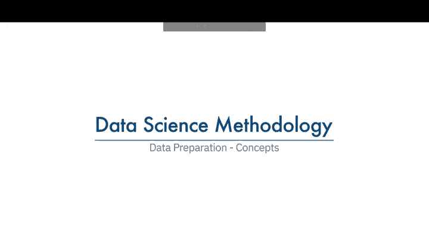
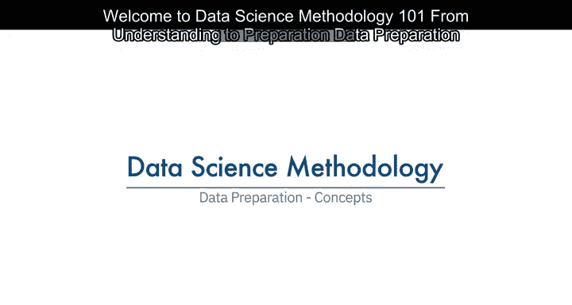
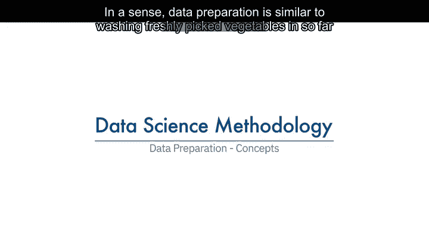
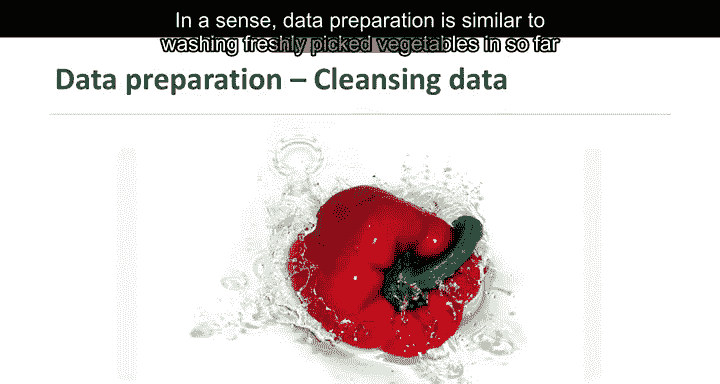
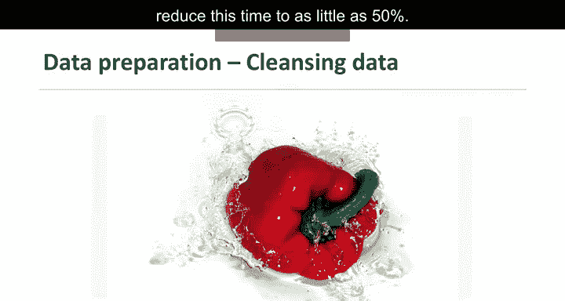
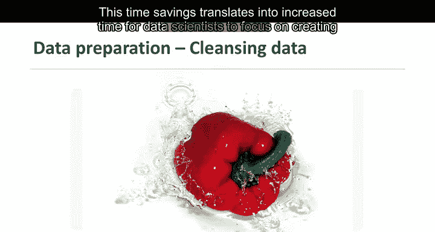
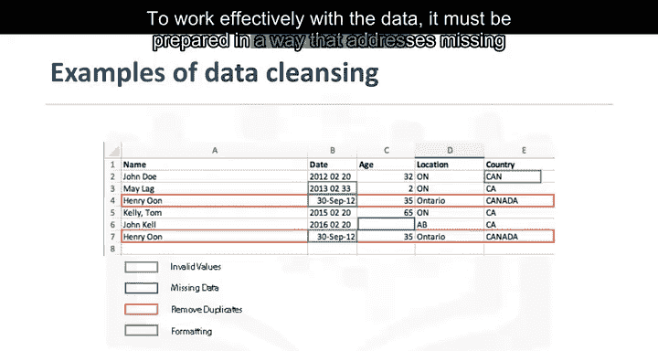
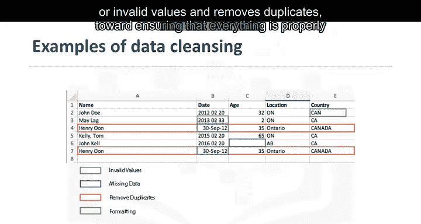

# 007：数据准备概念

在本节课中，我们将要学习数据准备阶段的核心概念。数据准备是数据科学项目中至关重要的一步，它涉及清洗、转换和整理原始数据，使其适合后续的分析与建模。我们将探讨数据准备的重要性、主要任务以及如何高效地完成这一过程。

---

上一节我们介绍了数据理解，本节中我们来看看数据准备。从某种意义上说，数据准备类似于清洗刚采摘的蔬菜，目的是去除污垢或瑕疵等不需要的元素。

与数据收集和数据理解阶段一起，数据准备是数据科学项目中最耗时的阶段，通常占总项目时间的70%，甚至高达90%。

在数据库中自动化部分数据收集和准备流程，可以将这一时间减少至50%左右。

这种时间节省意味着数据科学家可以将更多时间专注于创建模型。

延续我们的烹饪比喻，我们知道将洋葱切碎可以让其风味更容易融入酱汁中，这比将整个洋葱放入锅中效果更好。同样，在数据准备阶段转换数据，就是使数据达到更易于处理的状态的过程。

具体而言，方法论中的数据准备阶段回答了这个问题：**有哪些方法可以准备数据，以便有效地处理数据？** 数据必须经过处理，以解决缺失值或无效值，并去除重复项，确保所有内容格式正确。

以下是数据准备阶段涉及的核心任务：

*   **处理数据质量问题**：识别并修正缺失值、无效值和重复记录。
*   **数据转换**：将数据转换为更适合分析的格式或结构。
*   **特征工程**：利用数据的领域知识创建特征，使机器学习算法能够有效工作。

特征工程是数据准备的一部分。特征是可能有助于解决问题的特性。数据中的特征对预测模型至关重要，并将影响您希望实现的结果。当应用机器学习工具分析数据时，特征工程尤为关键。

处理文本数据时，需要对数据进行编码的文本分析步骤，以便能够操作数据。数据科学家需要知道在数据集中寻找什么来解决问题。文本分析对于确保设置正确的分组以及编程不会忽略隐藏内容至关重要。

数据准备阶段为解决问题的后续步骤奠定了基础。虽然这个阶段可能需要一些时间来完成，但如果做得正确，其结果将有力地支持整个项目。如果跳过此阶段，结果将不尽如人意，并可能让您不得不从头开始。

在这一领域投入时间至关重要，同时应利用可用工具自动化常见步骤以加速数据准备。请务必关注此处的细节。毕竟，一粒老鼠屎能坏一锅粥。

---

本节课中我们一起学习了数据准备的关键概念。我们了解到数据准备是耗时但至关重要的阶段，涉及清洗、转换和特征工程等任务，旨在为后续建模与分析提供高质量、格式规整的数据基础。正确完成数据准备能显著提升整个项目的成功概率。