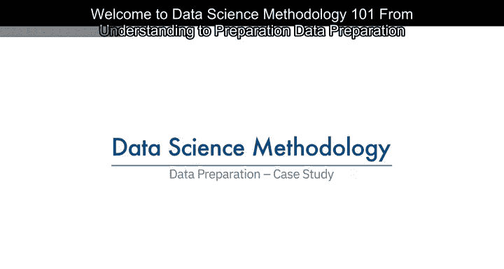
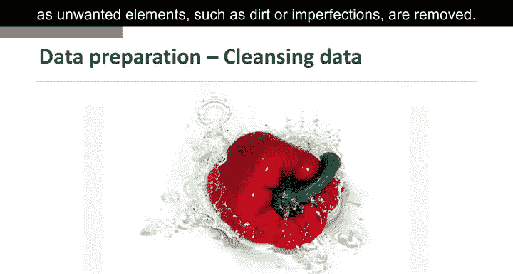
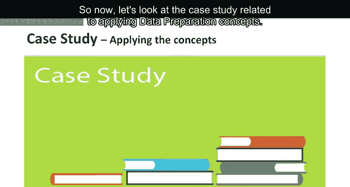

# 008：数据准备案例研究

在本节课中，我们将学习数据准备阶段的具体应用，通过一个实际案例来理解如何清洗、整理和准备数据，以便进行后续的建模分析。

---

数据准备类似于清洗刚采摘的蔬菜，目的是去除如污垢或瑕疵等不需要的元素。

上一节我们介绍了数据准备的基本概念，本节中我们来看看如何将这些概念应用于一个具体案例。

现在，让我们查看与应用数据准备概念相关的案例研究。

在该案例研究中，数据准备阶段的重要第一步是明确定义“充血性心力衰竭”。这听起来简单，但精确定义并不直接。首先，需要识别与诊断相关的组代码，因为充血性心力衰竭涉及特定类型的体液积聚。我们还需考虑充血性心力衰竭仅是心力衰竭的一种类型。需要临床指导来获取充血性心力衰竭的正确代码。

下一步涉及为同一病症定义再入院标准。需要评估事件的时间顺序，以确定某次充血性心力衰竭入院是初始事件（称为索引入院），还是与充血性心力衰竭相关的再入院。基于临床专业知识，设定30天为时间窗口，用于判断充血性心力衰竭患者自首次入院出院后的相关再入院。

接着，对处于事务格式的记录进行聚合。这意味着数据包含每位患者的多个记录。事务记录包括为医生、实验室、医院和临床服务提交的专业提供者设施索赔。还包括描述所有诊断、程序、处方以及住院和门诊患者其他信息的记录。根据患者的临床历史，一位患者可能轻易拥有数百甚至数千条此类记录。

然后，将所有事务记录聚合到患者级别，为每位患者生成单一记录，这是后续将使用的决策树分类方法建模所要求的。作为聚合过程的一部分，创建了许多新列来表示事务中的信息。例如，就诊医生、诊所和医院的频率及最近时间，以及诊断、程序、处方等。还考虑了与充血性心力衰竭共存的疾病，如糖尿病、高血压以及许多其他可能影响充血性心力衰竭再入院风险的疾病和慢性病。

在数据准备的讨论过程中，还进行了关于充血性心力衰竭的文献综述，以检查是否忽略了任何重要的数据元素，例如尚未考虑的共存疾病。文献综述涉及回溯到数据收集阶段，为病症和程序添加更多指标。

在患者级别聚合事务数据意味着将其与其他患者数据合并，包括他们的人口统计信息，如年龄、性别、保险类型等。结果是创建一个表，每位患者对应一条记录，包含许多代表患者及其临床历史属性的列。这些列将作为预测建模中的变量使用。

以下是最终用于构建模型的变量列表。因变量或目标是充血性心力衰竭。结果是在因充血性心力衰竭住院出院后30天内是否再入院。

数据准备阶段产生了一个包含2343名患者的队列，所有患者均符合案例研究的所有标准。然后将该队列分为训练集和测试集，分别用于构建和验证模型。

---

本节课中我们一起学习了数据准备在案例研究中的实际应用，包括明确定义问题、设定标准、聚合数据、创建变量以及最终形成建模所需的数据集。通过这个案例，我们看到了数据准备如何为后续的建模分析奠定坚实基础。