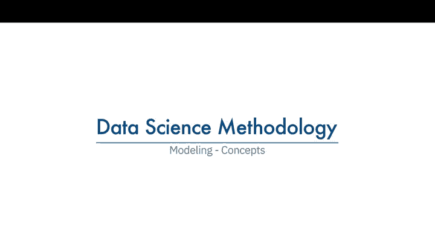
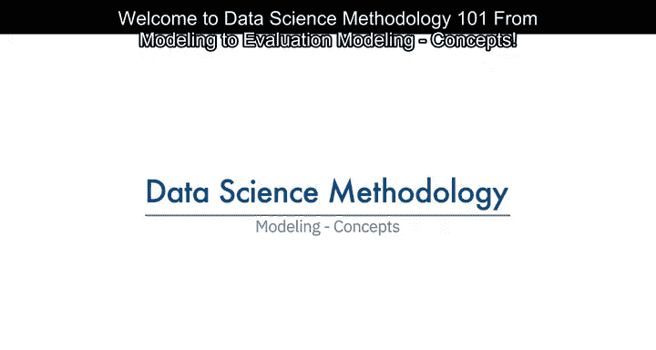
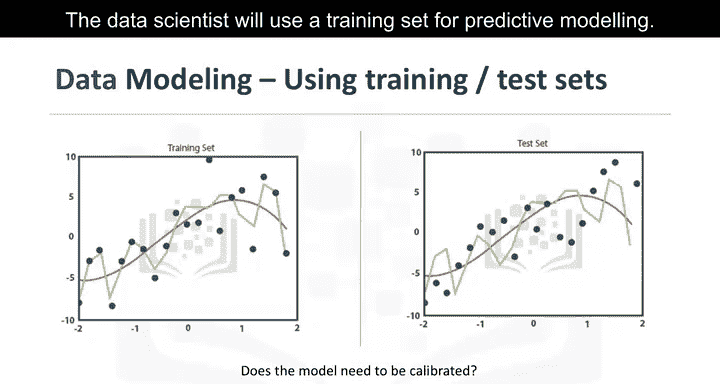
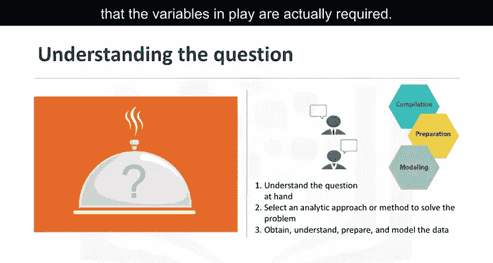
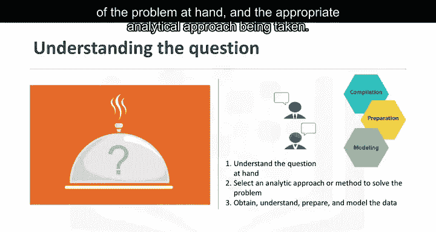
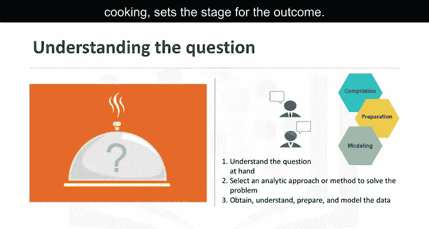
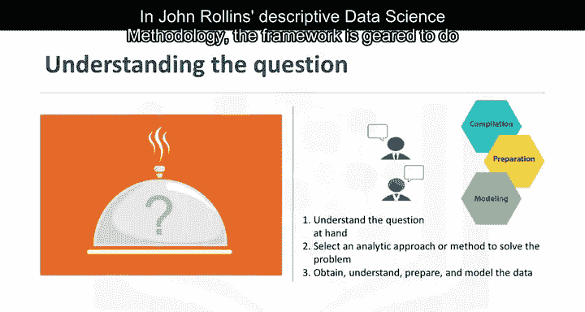
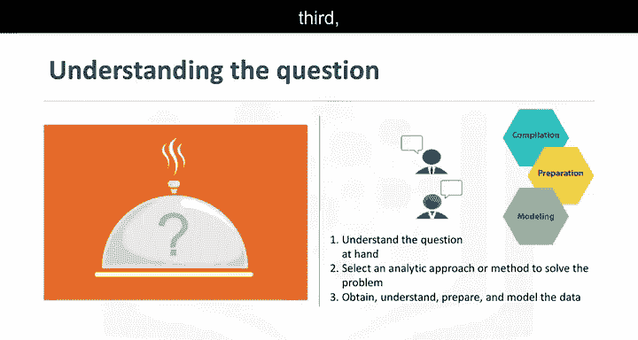
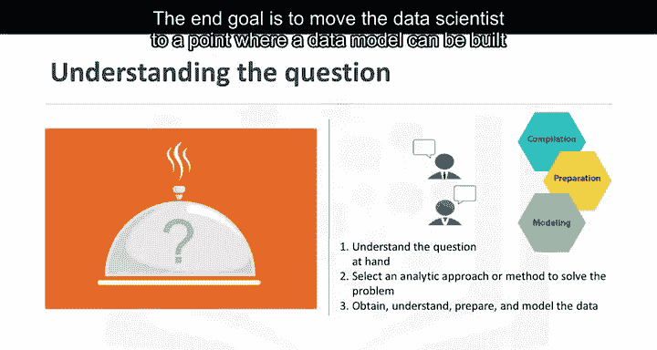

# 009：建模概念

在本节课中，我们将学习数据科学方法论中的建模阶段。我们将探讨建模的目的、过程及其关键组成部分，帮助初学者理解如何从数据中构建有效的模型。

---

## 🎯 建模的目的与过程

上一节我们介绍了数据准备，本节中我们来看看建模阶段。建模是数据科学方法论中的一个关键阶段，数据科学家在此阶段有机会检验数据并确定模型是否需要调整。

建模阶段主要回答两个关键问题：第一，数据建模的目的是什么？第二，这个过程有哪些特点？

数据建模侧重于开发描述性或预测性模型。描述性模型用于分析行为模式，例如“如果一个人做了这件事，那么他可能更喜欢那件事”。预测性模型则试图产生“是/否”或“停止/继续”类型的结果。这些模型基于所采用的分析方法，可以是统计驱动或机器学习驱动。

---

## 🔧 训练集与模型校准

在预测建模中，数据科学家会使用训练集。训练集是一组历史数据，其中结果已知。训练集的作用是作为衡量标准，以确定模型是否需要校准。

在这一阶段，数据科学家会尝试不同的算法，以确保所使用的变量确实是必需的。

---

## 📈 成功建模的关键因素

数据编译、准备和建模的成功取决于对当前问题的理解以及所采取的适当分析方法。数据支持问题的回答，就像烹饪中食材的质量为最终结果奠定了基础。

在每个步骤中，持续的优化、调整和微调是必要的，以确保结果可靠。

---

## 🧩 数据科学方法论框架

在约翰·劳温的描述性数据科学方法论中，框架旨在完成三件事：第一，理解当前问题；第二，选择解决问题的分析方法；第三，获取、理解、准备和建模数据。

最终目标是使数据科学家能够构建数据模型来回答问题。

---

## ✅ 模型评估与反馈

随着晚餐即将上桌，饥饿的客人坐在桌旁，关键问题是：“我做的够吃吗？”希望如此。在方法论的这一阶段，模型评估、部署和反馈循环确保答案接近实际且相关。

这种相关性对整个数据科学领域至关重要，因为它是一个相对较新的研究领域，人们对其提供的可能性感兴趣。从这种实践中受益的人越多，该领域的发展就越深入。

---

## 📝 总结

本节课中我们一起学习了数据科学方法论中的建模阶段。我们探讨了建模的目的、训练集的作用、成功建模的关键因素以及方法论框架。最后，我们了解了模型评估和反馈的重要性，以确保模型的实用性和相关性。

通过理解这些概念，你将能够更好地构建和优化数据模型，为实际问题提供有效的解决方案。