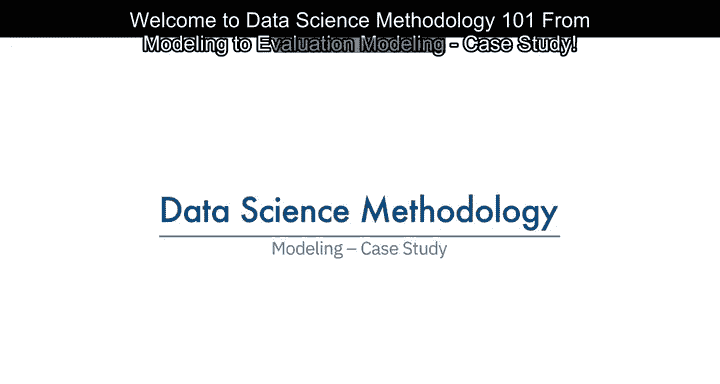
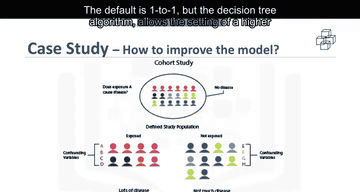

# 010：建模案例研究 🧪

在本节课中，我们将学习数据科学方法论中的建模阶段，并通过一个具体的案例研究，探讨如何通过参数调优来改进模型。我们将重点关注决策树分类模型，并理解如何调整误分类成本以优化模型性能。

---

## 从建模到评估

建模是数据科学方法论中的一个关键阶段。在此阶段，数据科学家有机会“品尝酱汁”，判断其是否恰到好处，或是否需要进一步调味。

上一节我们介绍了数据准备，本节中我们来看看如何将案例研究应用到建模阶段。我们将讨论模型构建的众多方面之一：参数调优。

---

## 构建初始模型

以下是构建初始模型的步骤。

准备好训练集后，可以构建第一个用于充血性心力衰竭再入院的决策树分类模型。我们的目标是识别高再入院风险的患者，因此关注的结果是 **充血性心力衰竭再入院 = 是**。

在第一个模型中，对“是”和“否”结果进行分类的总体准确率为 **85%**。这听起来不错，但它仅正确分类了 **45%** 的实际再入院病例（即“是”类别）。这意味着模型在预测“是”结果方面并不准确。

随之而来的问题是：如何提高模型预测“是”结果的准确性？

---

## 理解误分类成本

对于决策树分类，最佳的调整参数是误分类“是”和“否”结果的相对成本。

可以这样理解：
*   当一个真实的非再入院病例被误分类，并采取了降低该患者风险的措施时，该错误的成本是浪费的干预措施。统计学家称之为 **第一类错误** 或 **假阳性**。
*   当一个真实的再入院病例被误分类，且未采取任何措施降低风险时，该错误的成本是再入院及其所有相关费用，外加患者的创伤。这被称为 **第二类错误** 或 **假阴性**。

由此可见，两种不同类型误分类错误的成本可能截然不同。因此，调整误分类“是”和“否”结果的相对权重是合理的。默认权重是1:1，但决策树算法允许为“是”设置更高的值。

---

## 调整参数并迭代模型

以下是尝试不同参数设置的迭代过程。

**第二个模型**：将相对成本设置为 **9:1**。这是一个非常高的比率，但能更深入地揭示模型的行为。这次，模型正确分类了 **97%** 的“是”病例，但代价是对“否”病例的准确率非常低，总体准确率仅为 **49%**。这显然不是一个好模型。此结果的问题在于存在大量假阳性，这将导致为那些本不会再次入院的患者推荐不必要且成本高昂的干预措施。

因此，数据科学家需要再次尝试，以在“是”和“否”的准确率之间找到更好的平衡。

**第三个模型**：将相对成本设置为更合理的 **4:1**。这次，在“是”病例上获得了 **68%** 的准确率（统计学家称之为**灵敏度**），在“否”病例上获得了 **85%** 的准确率（称为**特异度**），总体准确率为 **81%**。通过调整误分类“是”和“否”结果的相对成本参数，这是在训练集较小的情况下所能获得的最佳平衡。

当然，建模工作远不止于此，通常还包括迭代回到数据准备阶段，重新定义一些其他变量，以更好地表示底层信息，从而改进模型。

---

## 总结

本节课中，我们一起学习了如何将案例研究应用到数据科学方法论的建模阶段。我们通过一个决策树分类案例，探讨了通过调整误分类成本参数来优化模型性能的过程。我们了解到，寻找“是”（灵敏度）和“否”（特异度）预测准确率之间的平衡至关重要，并且建模通常是一个需要多次迭代和调整的循环过程。