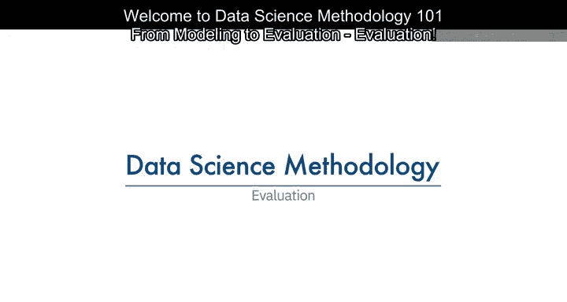
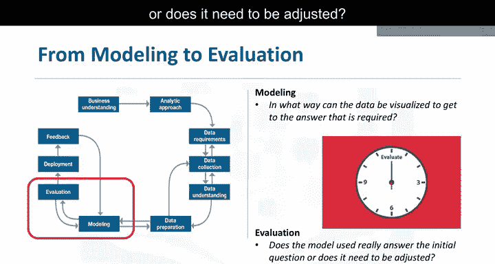
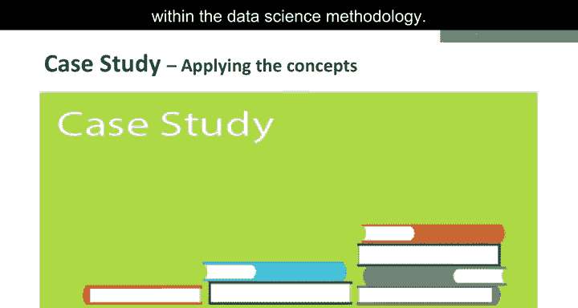

# 011：模型评估

在本节课中，我们将学习数据科学方法论中的模型评估环节。模型评估与模型构建紧密相连，是确保模型质量、验证其是否满足初始需求的关键步骤。我们将探讨评估的两个主要阶段，并通过一个案例研究来理解如何通过诊断指标选择最优模型。

---

## 模型评估概述

模型评估与模型构建相辅相成。因此，建模和评估阶段通常是迭代进行的。

模型评估在模型开发期间进行，并在模型部署之前完成。评估不仅用于评判模型的质量，也是检验模型是否满足初始需求的机会。评估回答的问题是：所使用的模型是否真正回答了初始问题，或者是否需要调整。

---

## 模型评估的两个主要阶段

模型评估主要包含两个阶段。以下是每个阶段的详细介绍。

### 第一阶段：诊断指标评估

诊断指标评估阶段用于确保模型按预期工作。

如果模型是预测模型，可以使用决策树来评估模型的输出是否与初始设计一致。这有助于发现需要调整的环节。

如果模型是描述性模型，即用于评估变量间关系的模型，则可以应用一个已知结果的测试集，并根据需要优化模型。

### 第二阶段：统计显著性检验

此类评估可应用于模型，以确保数据在模型中得到正确处理和解释。其目的是在答案揭晓时，避免不必要的二次猜测。

---

## 案例研究：通过参数调优寻找最优模型

上一节我们介绍了模型评估的两个阶段，本节中我们来看看如何通过调优模型构建中的一个参数，基于诊断指标来寻找最优模型。

具体来说，我们将了解如何调整误分类“是”与“否”结果的相对成本。

如下表所示，我们构建了四个模型，分别对应四种不同的相对误分类成本。

| 模型 | 相对误分类成本 | 真阳性率（敏感度） | 假阳性率 |
|------|----------------|---------------------|----------|
| 模型1 | 1:1            | 较低                | 较低     |
| 模型2 | 2:1            | 中等                | 中等     |
| 模型3 | 4:1            | 较高                | 较高     |
| 模型4 | 8:1            | 高                  | 高       |

如表所示，随着模型构建参数值的增加，预测“是”的准确度（即真阳性率或敏感度）提高，但代价是预测“否”的准确度降低（即假阳性率增加）。

那么问题就变成了：基于对此参数的调优，哪个模型是最优的？

出于预算原因，风险降低干预措施不能应用于大多数或所有充血性心力衰竭患者，因为其中许多人可能不会被再次收治。另一方面，如果未能针对足够多的高风险充血性心力衰竭患者，干预措施在改善患者护理方面的效果将不如预期。

那么，我们如何确定哪个模型是最优的呢？

正如在本幻灯片中可以看到的，最优模型是使蓝色ROC曲线相对于红色基线获得最大分离度的模型。

我们可以看出，相对误分类成本为4比1的模型3，是四个模型中最优的。

---

## ROC曲线：关键诊断工具

顺便提一下，ROC代表接收者操作特征曲线。它最初在第一次世界大战期间开发，用于在雷达上检测敌机。此后，它在许多其他领域也得到了应用，如今普遍用于机器学习和数据挖掘。

ROC曲线是确定最优分类模型的有用诊断工具。该曲线量化了二元分类模型在改变某些判别标准时的性能。在本例中，该标准是相对误分类成本。

通过针对不同的相对误分类成本值绘制真阳性率与假阳性率的关系图，ROC曲线有助于选择最优模型。

其核心思想可以概括为：**最优模型对应于ROC曲线下面积最大或最远离对角线的点**。

---

## 课程总结

本节课中，我们一起学习了数据科学方法论的模型评估环节。我们了解到评估与建模是迭代过程，包括诊断指标和统计显著性检验两个主要阶段。通过一个充血性心力衰竭患者再入院预测的案例，我们深入探讨了如何通过调整误分类成本参数，并利用ROC曲线这一诊断工具，从多个候选模型中选出最优模型。评估确保了模型的有效性，并验证其是否真正解决了初始的业务问题。