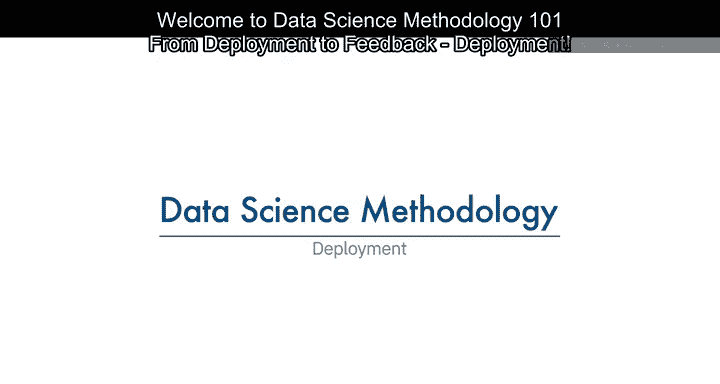
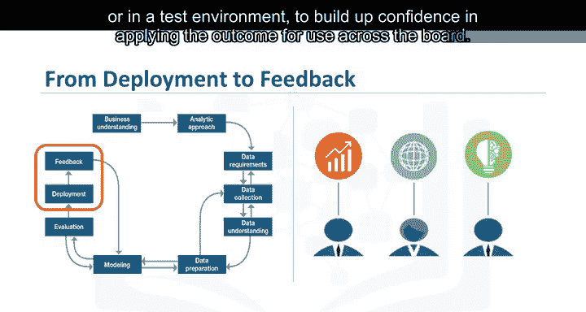
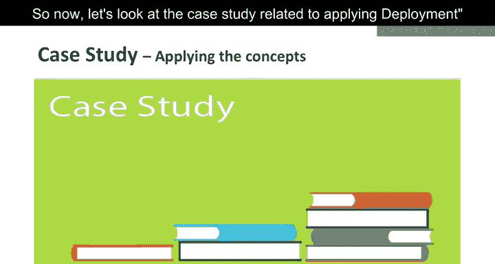
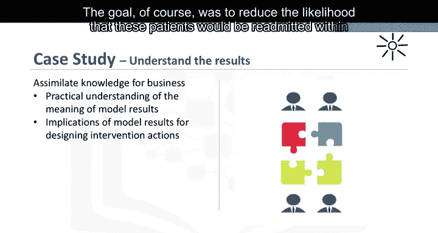
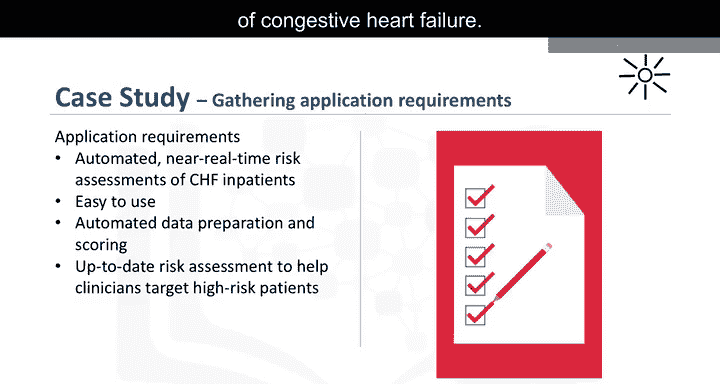
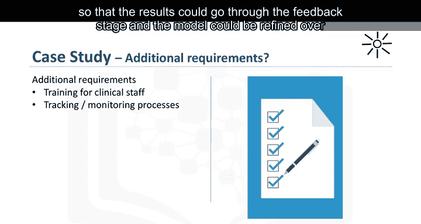
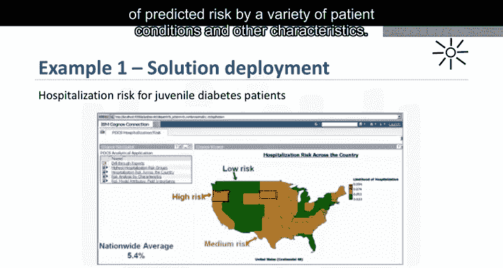
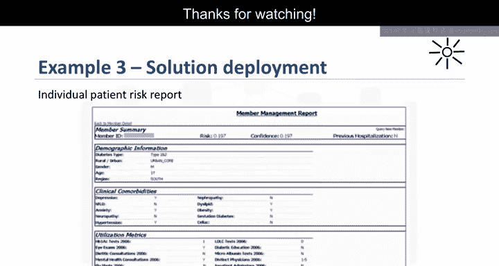

# 012：模型部署 🚀



在本节课中，我们将学习数据科学方法论的“部署”阶段。我们将了解如何将评估后的模型投入实际使用，并确保其能为利益相关者提供有价值的答案。

---

虽然数据科学模型能提供答案，但要使该答案与初始问题相关且有用，关键在于让利益相关者熟悉所构建的工具。

在商业场景中，不同的利益相关者拥有各自的专长，他们能共同促成这一目标。例如，解决方案负责人、市场营销人员、应用程序开发人员和IT管理员。

一旦模型经过评估，且数据科学家确信其能够有效工作，模型就会被部署并接受最终测试。根据模型的目的，它可能会先向有限的用户群体或在测试环境中推出，以建立全面应用其结果的信心。

上一节我们讨论了模型评估，本节中我们来看看如何将模型部署到实际环境中。

---



## 案例研究：部署的应用



现在，让我们看一个与部署应用相关的案例研究。

为准备解决方案的部署，下一步是向将设计和管理干预计划以降低再入院风险的业务团队传授相关知识。

在此场景中，业务人员对模型结果进行了解释，以便临床工作人员能够理解如何识别高风险患者并设计合适的干预措施。当然，最终目标是降低这些患者在出院后30天内再次入院的可能性。

---



## 业务需求与解决方案设计

在业务需求阶段，干预计划负责人及其团队希望有一个应用程序，能够提供充血性心力衰竭的自动化、近乎实时的风险评估。

该应用程序还必须易于临床工作人员使用，最好是通过基于浏览器的平板电脑应用，以便每位工作人员随身携带。



患者数据在整个住院期间生成。这些数据将自动准备成模型所需的格式，并在每位患者临近出院时进行评分。

临床医生因此能获得每位患者最新的风险评估，帮助他们选择出院后需要干预的目标患者。

作为解决方案部署的一部分，干预团队将为临床工作人员制定并开展培训。

此外，还需要与IT开发人员和数据库管理员合作，制定跟踪和监测接受干预患者的流程，以便结果能够进入反馈阶段，模型也能随着时间的推移不断优化。

---

## 部署示例：交互式应用

下图是一个通过Cognos应用程序部署的解决方案示例。在本案例中，研究的是青少年糖尿病患者的住院风险。

与充血性心力衰竭的用例类似，此案例使用**决策树分类**来创建风险模型，作为该应用程序的基础。



该地图提供了全国范围内住院风险的概览，并支持通过多种患者状况和其他特征对预测风险进行交互式分析。

```python
# 示例：决策树分类模型的核心代码结构
from sklearn.tree import DecisionTreeClassifier

# 初始化模型
model = DecisionTreeClassifier(criterion='gini', max_depth=5)

# 训练模型
model.fit(X_train, y_train)

# 进行预测
predictions = model.predict(X_test)
```



此幻灯片展示了模型给定节点内患者群体的风险交互式摘要报告，以便临床医生能够理解该患者亚群的各种状况组合。

这份报告提供了单个患者的详细摘要，包括该患者的预测风险及其临床病史的详细信息，为医生提供简洁的总结。

---

## 总结



本节课中，我们一起学习了数据科学方法论的“部署”阶段。我们了解到，部署不仅仅是发布一个模型，更是一个涉及多团队协作、知识传递、工具设计以及建立持续反馈循环的系统性过程。成功的部署确保模型从理论走向实践，真正为解决初始业务问题创造价值。