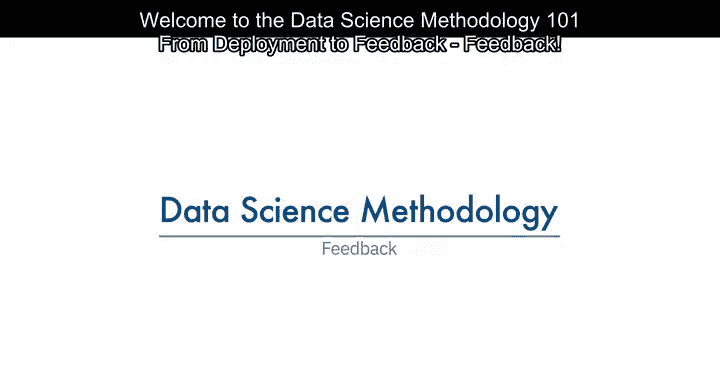
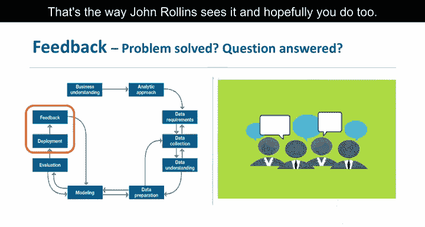
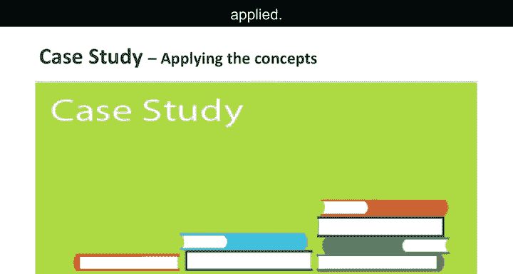

# 013：反馈机制

在本节课中，我们将学习数据科学方法论中的最后一个关键环节——反馈机制。我们将探讨如何通过用户反馈来优化模型，并确保解决方案在长期使用中持续有效。

---

上一节我们介绍了模型的部署，本节中我们来看看如何通过反馈机制来持续改进模型。

模型投入使用后，用户的反馈将帮助优化模型，并评估其性能和影响。只要解决方案仍需使用，模型的价值就取决于能否成功整合反馈并进行相应调整。

在整个数据科学方法论中，每个步骤都为下一步奠定了基础。**将方法论设计为循环过程**，可以确保在每个阶段都能进行优化。

反馈过程基于一个核心理念：**你知道得越多，你想知道的就越多**。John Rollins 这样认为，希望你也认同。

---

一旦模型经过评估，数据科学家确信其可行，它就会被部署并接受最终测试——在实际场景中进行实时使用。

现在，让我们再次回顾案例研究，看看方法论中的反馈部分是如何应用的。

以下是反馈阶段的具体步骤：

首先，定义并建立审查流程，由临床管理高管全面负责衡量“飞行风险模型”对充血性心力衰竭高风险人群的效果。

其次，跟踪接受干预的充血性心力衰竭患者，并记录他们的再入院结果。

第三，衡量干预措施在降低再入院率方面的效果。

出于伦理考虑，充血性心力衰竭患者不会被分为对照组和治疗组。相反，将通过比较模型实施前后的再入院率来衡量其影响。

---

在部署和反馈阶段之后，干预计划实施第一年后，将审查其对再入院率的影响。

然后，根据模型实施后收集的所有数据以及在这些阶段中获得的知识，对模型进行优化。

其他优化措施包括：整合参与干预计划的信息，并可能优化模型以纳入详细的药物数据。

如果你还记得，由于当时药物数据不易获取，数据收集最初被推迟了。但在获得反馈和实际使用经验后，可能会确定添加这些数据值得投入精力和时间。

我们还必须考虑到，在反馈阶段可能会出现其他优化点。

此外，基于初步部署和反馈中获得的经验和知识，干预措施、行动和流程也将被审查并很可能进行优化。

最后，优化后的模型和干预措施将被重新部署，反馈过程将在整个干预计划的生命周期中持续进行。

---

本节课中，我们一起学习了反馈机制在数据科学方法论中的重要性。通过持续收集反馈、评估效果并优化模型，我们可以确保数据科学解决方案长期保持有效和价值。反馈是方法论循环中的关键一环，它推动我们不断学习和改进。