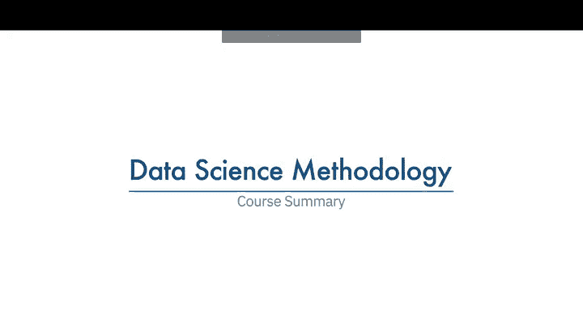
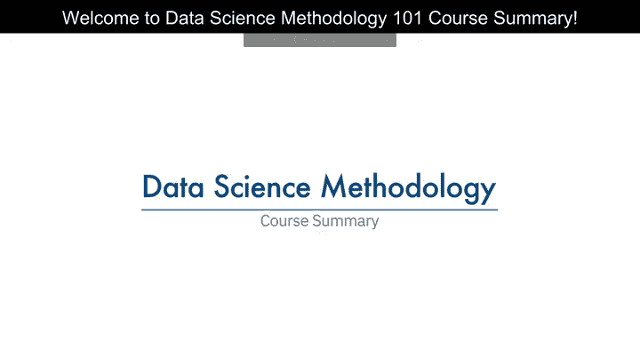
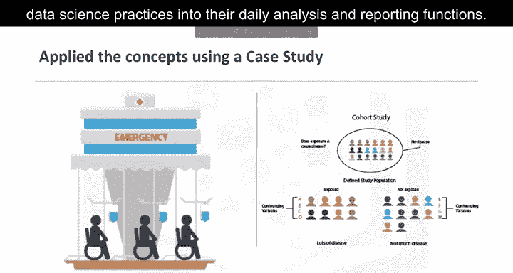
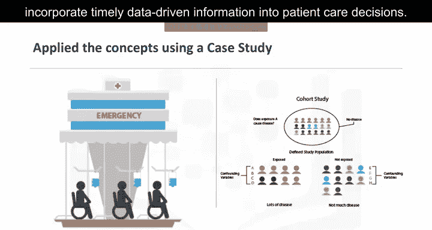

# 014：《数据科学方法论》总结篇

在本节课中，我们将回顾整个数据科学方法论课程的核心内容，总结从问题定义到模型部署与反馈的完整流程，并通过实际案例加深理解。

---

## 🎯 课程概述

我们已经来到了故事的结尾，希望您能分享所学。您学会了如何像数据科学家一样思考，包括处理数据科学问题的步骤，并将它们应用于有趣的现实世界案例。这些步骤包括形成具体的业务或研究问题、收集和分析数据、构建模型，以及理解模型部署后的反馈。

## 🔄 从问题到方法

上一节我们介绍了数据科学方法论的整体框架，本节中我们来看看从问题到方法的具体路径。您学会了系统性地从问题转向方法，包括理解问题、业务目标与目的的重要性，并选择最有效的分析方法来回答问题、解决问题。

以下是关键步骤：

*   **理解问题**：明确业务或研究的具体问题。
*   **设定目标**：确定业务目标和成功标准。
*   **选择方法**：根据问题选择最合适的分析方法。

## 📊 数据处理流程

理解了问题与方法后，下一步是处理数据。您学会了系统性地处理数据，特别是确定数据需求、收集适当的数据、理解数据，然后为建模准备数据。

以下是数据处理的核心环节：

*   **确定需求**：明确解决问题所需的数据类型和来源。
*   **收集数据**：获取相关且高质量的数据。
*   **理解数据**：通过探索性数据分析了解数据特征。
*   **准备数据**：进行清洗、转换和特征工程，为建模做准备。

## 🤖 建模与评估

数据准备就绪后，我们进入建模阶段。您学会了如何根据数据需求和待解决的问题，使用适当的分析方法对数据进行建模。选定方法后，您学习了评估和部署模型的步骤，获取反馈，并建设性地利用反馈来改进模型。

请记住，该方法论的各个阶段是**迭代**的。这意味着只要需要解决方案，模型就可以不断改进，无论改进是来自建设性的反馈，还是来自对新数据源的审视。

## 💡 案例应用与价值

通过一个真实案例研究，您学习了如何应用数据科学方法论，以成功实现业务需求阶段设定的目标。您还看到了该方法论如何通过将数据科学实践融入日常分析和报告职能，为业务部门带来额外价值。

案例研究中回顾的新试点项目的成功是显而易见的，因为医生能够通过使用新工具，将及时的数据驱动信息纳入患者护理决策，从而提供更好的患者护理。

## 📝 方法论的精髓

最后，您简明扼要地学习了方法论的真正含义。其目的是解释如何审视问题、利用数据支持解决问题，并通过系统地回答10个简单问题，提出解决根本问题的答案。

我们教导您，方法论不仅可以帮助您解决数据科学问题，还可以解决任何其他问题。您在数据科学领域的成功，取决于您在正确的时间、以正确的顺序应用正确的工具来解决正确问题的能力。这就是John Rolland的看法。

## 🏁 课程总结

本节课中，我们一起回顾了数据科学方法论的全貌。我们希望您喜欢学习数据科学方法论课程，并发现这是一次宝贵的经历，值得与他人分享。当然，我们也希望您能复习并学习数据科学基础学习路径中的其他课程。

现在，如果您准备好迎接挑战，请参加期末考试。感谢观看。