# 001：Python数据类型入门 📊

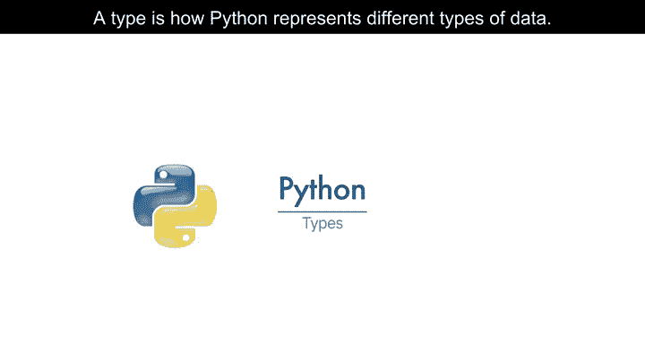

在本节课中，我们将要学习Python中数据类型的基本概念。数据类型是Python用来表示不同种类数据的方式。理解数据类型是编写有效Python代码的基础。

## 概述

数据类型定义了数据的性质以及可以对数据执行的操作。Python内置了几种核心数据类型，用于处理数字、文本和逻辑值。掌握这些类型是进行数据科学、人工智能和软件开发的第一步。

## 数据类型简介

类型是Python表示不同数据的方式。Python中可以有不同的类型。

它们可以是像`11`这样的整数，像`21.213`这样的实数，甚至可以是单词。整数、实数和单词可以表示为不同的数据类型。

以下图表总结了上述示例对应的三种数据类型。第一列表示表达式，第二列表示数据类型。

| 表达式 | 数据类型 |
| :--- | :--- |
| 11 | 整数 |
| 21.213 | 浮点数 |
| “Hello” | 字符串 |

我们可以使用`type()`命令来查看Python中数据的实际类型。

```python
type(11)      # 输出: <class 'int'>
type(21.213)  # 输出: <class 'float'>
type("Hello") # 输出: <class 'str'>
```


我们可以看到有`int`（代表整数）、`float`（代表浮点数，本质上是实数）和`str`（字符串，是字符序列）。

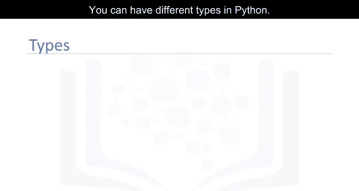

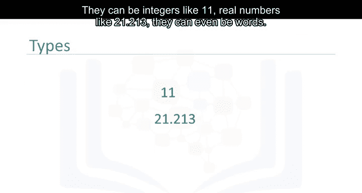

## 整数类型

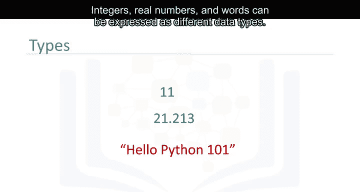

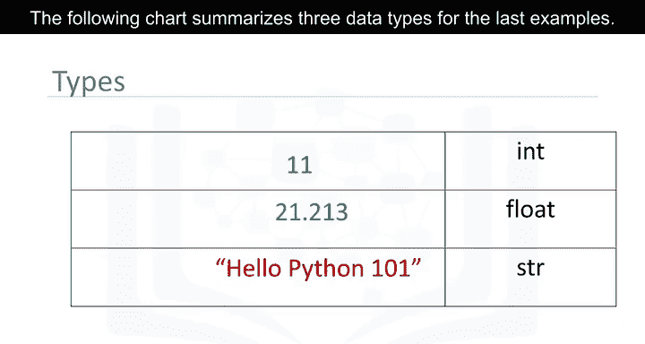

整数可以是负数或正数。需要注意的是，整数的范围是有限的，但这个范围非常大。

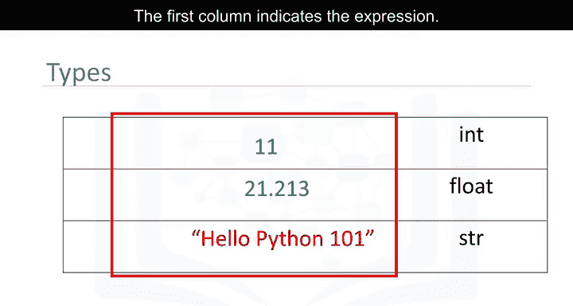

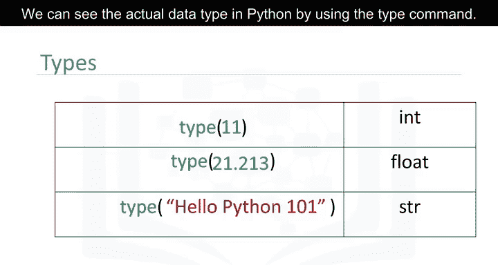

以下是整数的一些例子：
*   `-5`
*   `0`
*   `100`

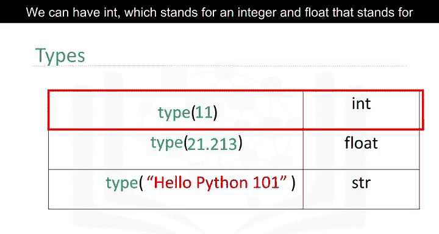

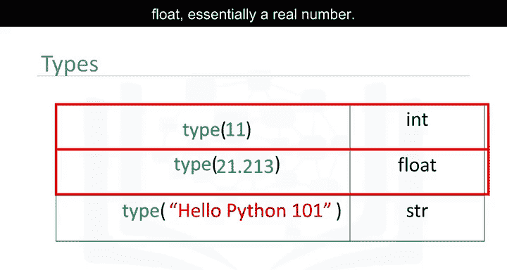

## 浮点数类型

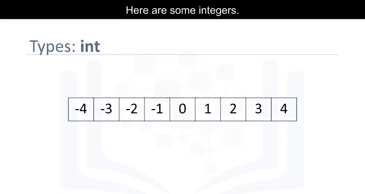

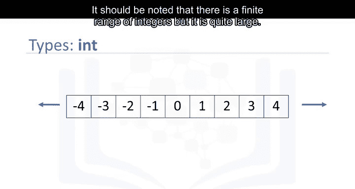

浮点数是实数。它们不仅包括整数，还包括整数之间的数字。

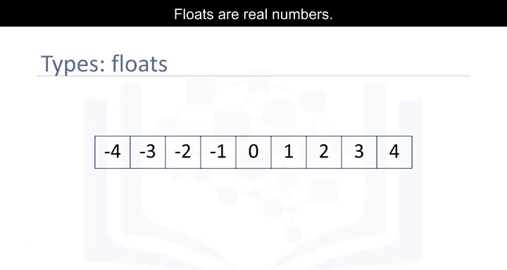

考虑0和1之间的数字，我们可以选择它们之间的数字，这些数字就是浮点数。同样，考虑0.5和0.6之间的数字，我们也可以选择它们之间的数字，这些也是浮点数。

我们可以继续这个过程，为不同的数字“放大”观察。当然，精度存在限制，但这个限制非常小。

以下是浮点数的一些例子：
*   `3.14`
*   `-0.001`
*   `2.0`

## 类型转换

在Python中，你可以改变表达式的类型，这被称为**类型转换**。

你可以将一个`int`转换为`float`。例如，你可以将整数`2`转换或“强制转换”为浮点数`2.0`。这本质上没有改变数值。

```python
float(2) # 结果是 2.0
```

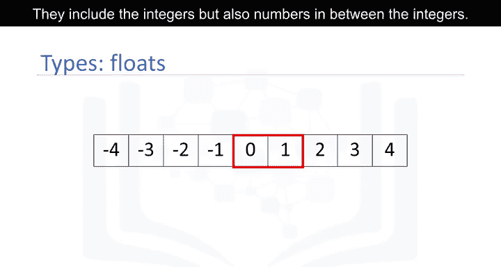

但是，如果将浮点数转换为整数，则必须小心。例如，如果将浮点数`1.1`转换为整数`1`，你会丢失一些信息（小数部分）。

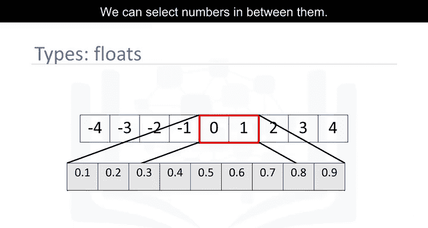

```python
int(1.1) # 结果是 1
```

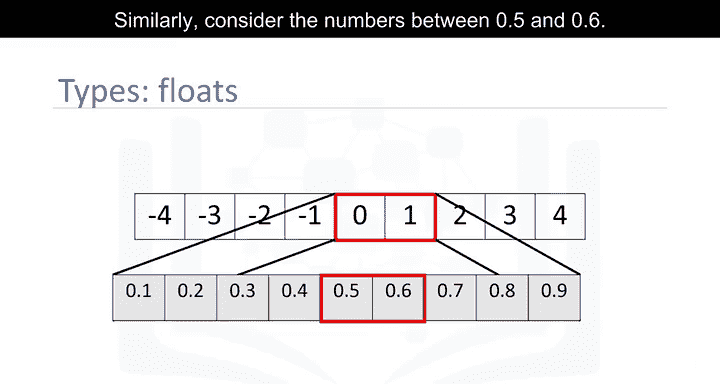

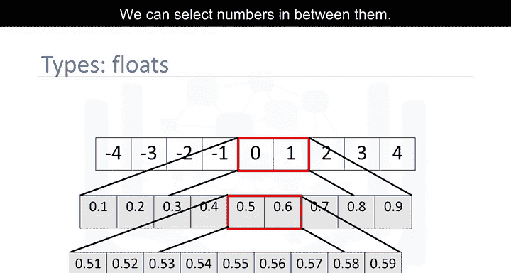

## 字符串与其他类型的转换

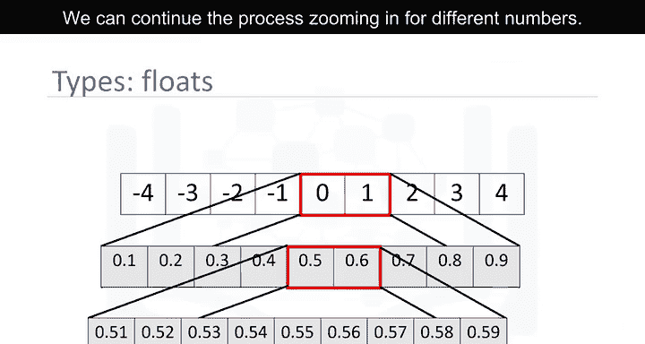

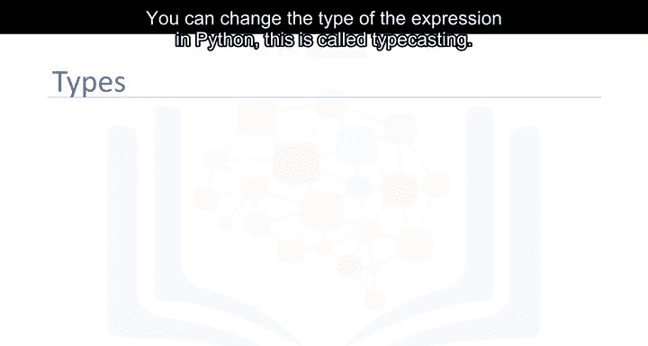

如果字符串包含一个整数值，你可以将其转换为`int`。

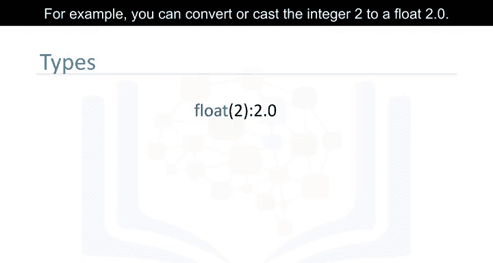

```python
int("123") # 结果是整数 123
```

如果我们转换一个包含非整数值的字符串，就会得到一个错误。

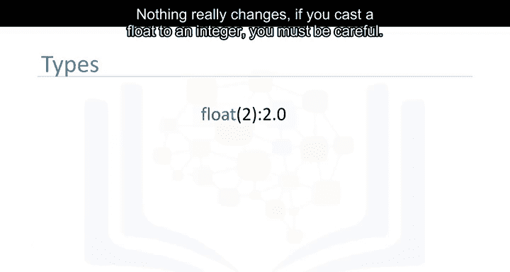

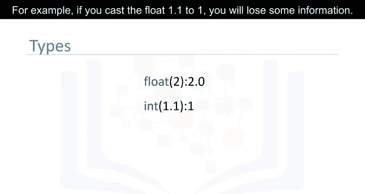

```python
int("123.4") # 这会引发 ValueError
```

你可以在实验部分查看更多例子。你也可以将`int`转换为`str`，或将`float`转换为`str`。

```python
str(123)   # 结果是字符串 "123"
str(3.14)  # 结果是字符串 "3.14"
```

## 布尔类型

布尔类型是Python中另一个重要的类型。一个布尔值可以取两个值。

第一个值是`True`（注意，我们使用大写字母T）。布尔值也可以是`False`（使用大写字母F）。

使用`type()`命令查看布尔值，我们得到术语`bool`，这是boolean的缩写。

```python
type(True)  # 输出: <class 'bool'>
type(False) # 输出: <class 'bool'>
```

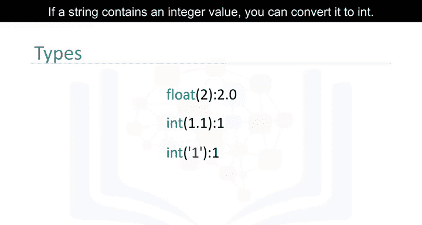

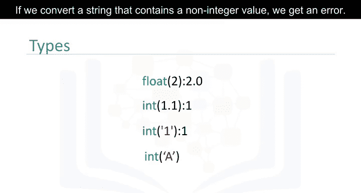

### 布尔值的转换

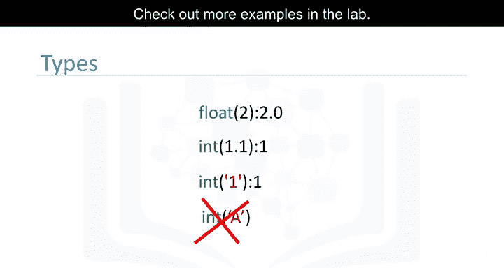

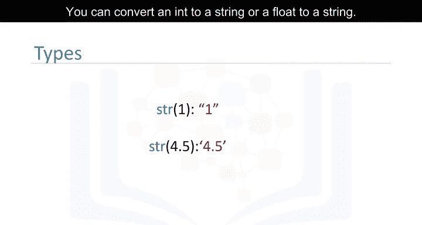

如果我们将布尔值`True`转换为整数或浮点数，会得到`1`。

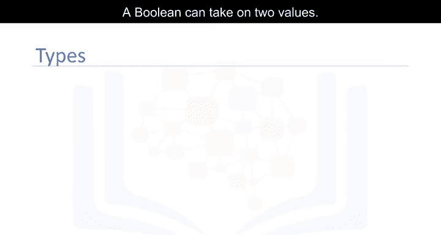

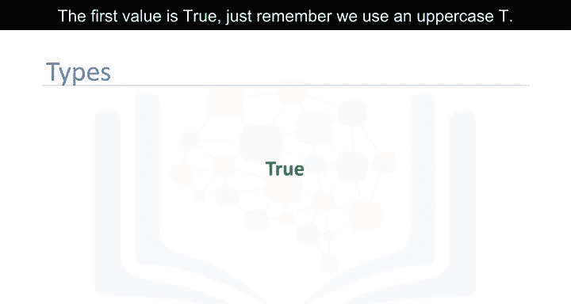

```python
int(True)   # 结果是 1
float(True) # 结果是 1.0
```

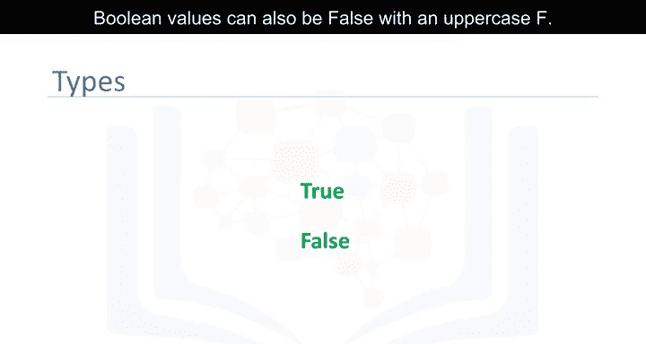

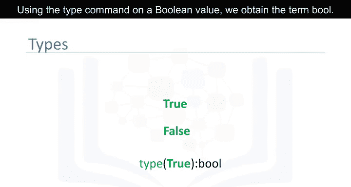

如果我们将布尔值`False`转换为整数或浮点数，会得到`0`。

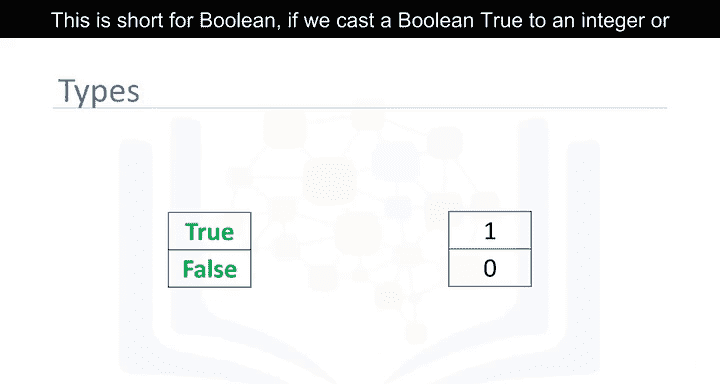

```python
int(False)   # 结果是 0
float(False) # 结果是 0.0
```

如果你将`1`转换为布尔值，会得到`True`。类似地，如果你将`0`转换为布尔值，会得到`False`。

```python
bool(1) # 结果是 True
bool(0) # 结果是 False
```

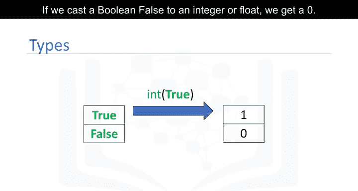

可以在实验部分查看更多例子，或访问Python官网（python.org）查看Python中其他类型的介绍。

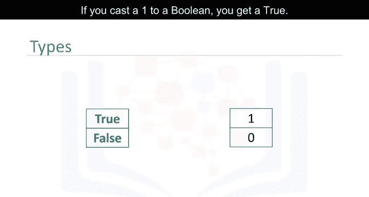

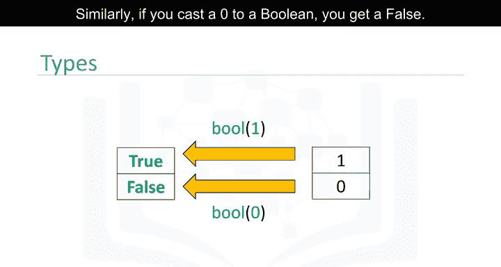

## 总结

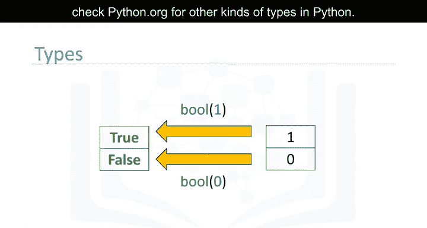

本节课中我们一起学习了Python的几种基本数据类型：用于整数的`int`、用于实数的`float`、用于文本的`str`以及用于逻辑真假的`bool`。我们还了解了如何使用`type()`函数检查类型，以及如何通过类型转换在不同类型之间进行转换。理解这些基础类型是后续学习变量、运算符和更复杂数据结构的关键。