# 003：字符串操作 📝

在本节课中，我们将要学习Python中字符串的基本概念和操作方法。字符串是编程中处理文本数据的基础，掌握其操作对于后续的数据处理至关重要。

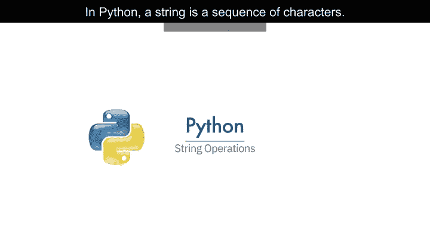

---

## 什么是字符串？🔤

在Python中，字符串是一个字符序列。

一个字符串被包含在两个引号内。你也可以使用单引号。

字符串可以是空格或数字。字符串也可以是特殊字符。

我们可以将字符串绑定或赋值给另一个变量。

将字符串视为一个有序序列是有帮助的。

序列中的每个元素都可以使用由数字数组表示的索引来访问。

---

## 字符串索引与切片 🧮

我们可以像访问列表一样访问字符串中的字符。索引从0开始。

第一个索引可以如下访问：`string[0]`。

我们可以访问索引6：`string[6]`。

我们还可以访问第13个索引：`string[12]`。

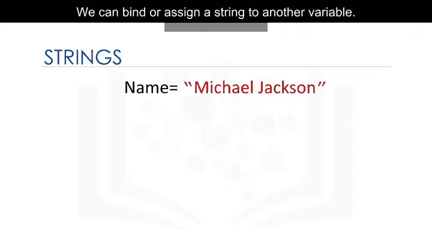

我们也可以对字符串使用负索引。

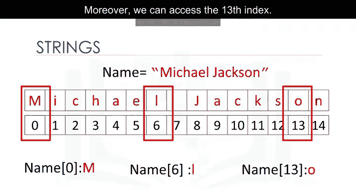

最后一个元素由索引-1给出：`string[-1]`。

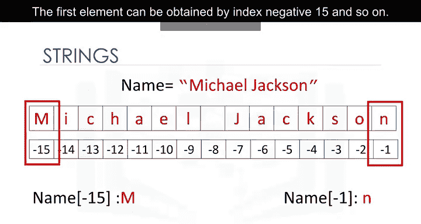

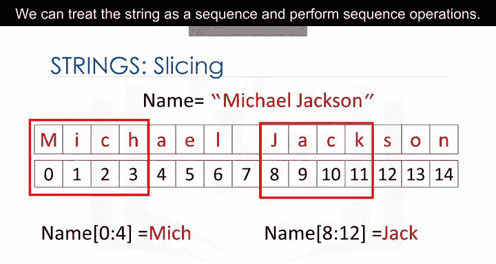

第一个元素可以通过索引-15获得，依此类推。

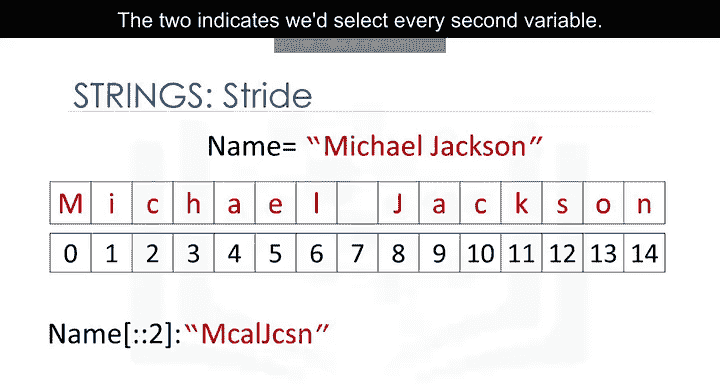

我们可以将字符串赋值给另一个变量。将字符串视为列表或元组是有帮助的。

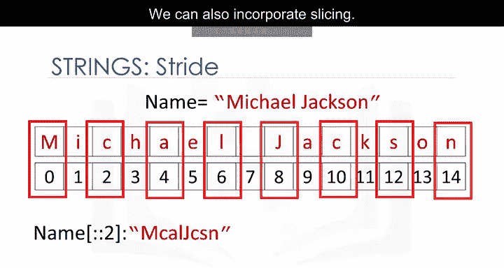

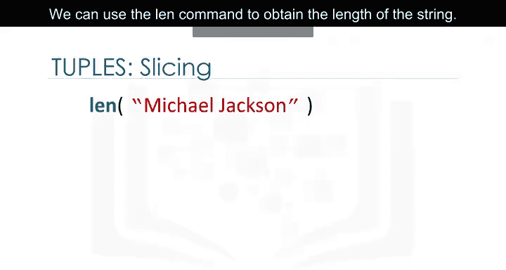

我们可以将字符串作为序列处理并执行序列操作。

我们还可以输入一个步长值，如下所示。通过指定两个索引，我们选择每第二个变量。

我们也可以结合切片。在这种情况下，我们返回直到索引4的每第二个值。

我们可以使用`len()`命令来获取字符串的长度。例如，`len("Hello World")`的结果是11。

---

## 字符串操作：连接与复制 ➕✖️

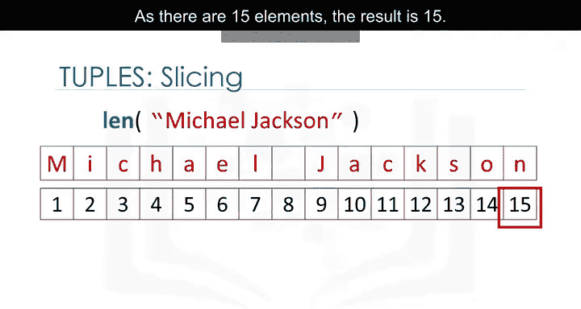

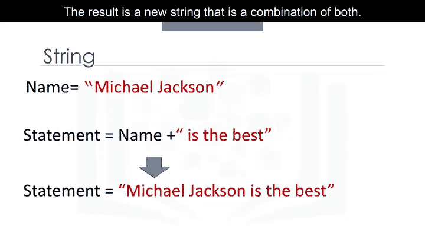

我们可以连接或组合字符串。我们使用加号符号。

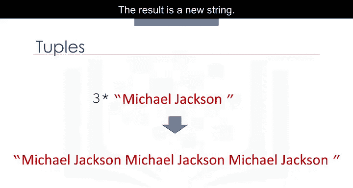

结果是一个结合了两者的新字符串。例如：`"Hello" + " " + "World"`。

我们可以复制字符串的值。

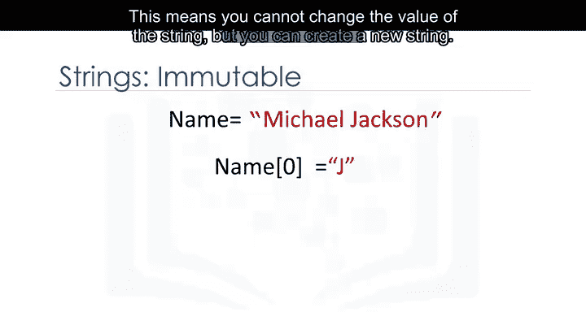

我们只需将字符串乘以我们希望复制的次数。例如：`"Hi" * 3`。

结果是一个新字符串。新字符串由原始字符串的三个副本组成。

---

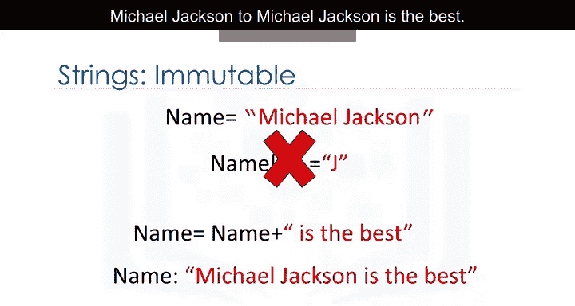

## 字符串的不可变性 🔒

字符串是不可变的。这意味着你不能改变字符串的值，但你可以创建一个新字符串。

例如，你可以通过将其设置为原始变量并与新字符串连接来创建一个新字符串。

结果是一个从“Michael Jackson”变为“Michael Jackson is the best”的新字符串。

---

## 转义序列 ⚡

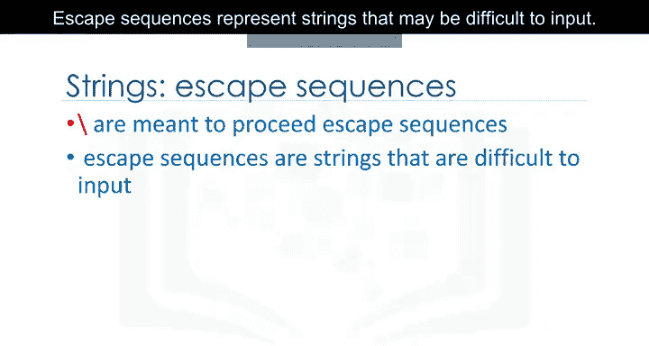

反斜杠表示转义序列的开始。

转义序列表示可能难以输入的字符串。例如，`\n`代表一个换行符。

输出是在遇到`\n`后换行。

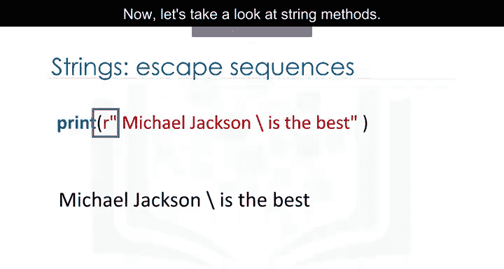

类似地，`\t`代表一个制表符。输出是在`\t`所在位置有一个制表符。

如果你想在字符串中放置一个反斜杠，请使用双反斜杠`\\`。

结果是一个反斜杠，在转义序列之后。

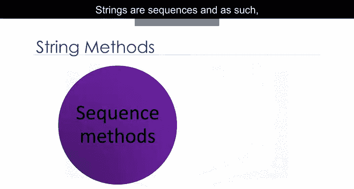

我们也可以在字符串前面放一个`r`，表示原始字符串，忽略转义字符。例如：`r"C:\User\Name"`。

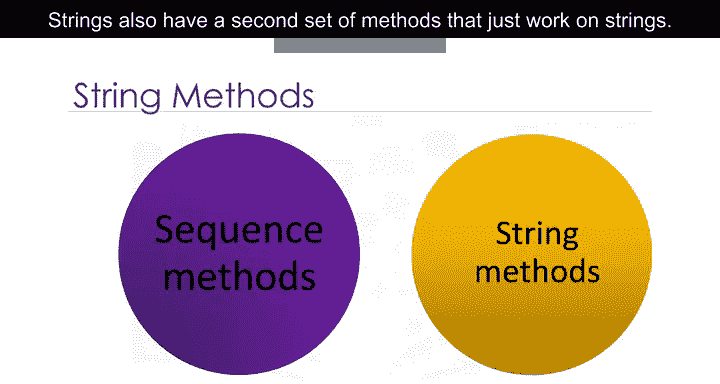

---

## 字符串方法 🛠️

字符串是序列，因此具有适用于列表和元组的方法。

字符串还有第二组专门用于字符串的方法。

当我们对字符串A应用一个方法时，我们会得到一个新的字符串B，它与A不同。

让我们看一些例子。

---

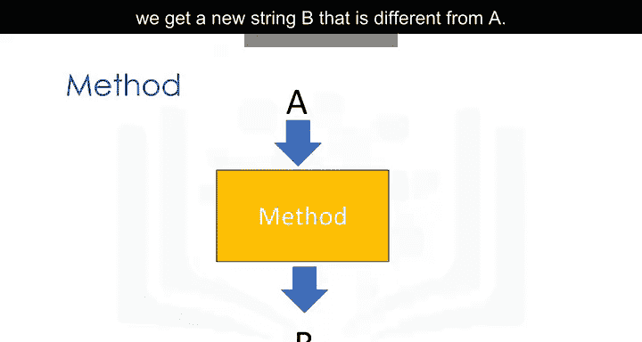

### 方法示例

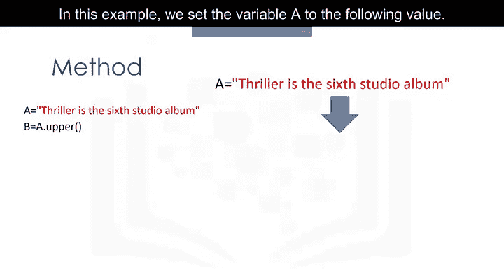

以下是几个常用的字符串方法示例：

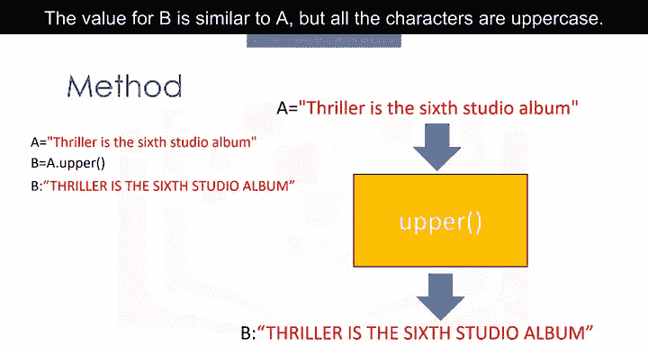

**`upper()` 方法**
此方法将小写字符转换为大写字符。
```python
A = "Hello World"
B = A.upper()
# B 现在是 "HELLO WORLD"
```

**`replace()` 方法**
该方法将字符串的一个片段（即子字符串）替换为一个新字符串。
我们输入想要更改的字符串部分。第二个参数是我们想要用其替换该片段的内容。
结果是一个片段被更改的新字符串。
```python
A = "Hello World"
B = A.replace("World", "Python")
# B 现在是 "Hello Python"
```

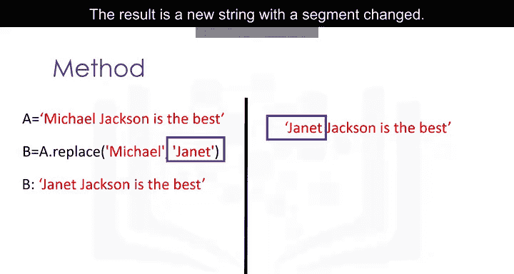

**`find()` 方法**
该方法查找子字符串。参数是您想要查找的子字符串。
输出是该子字符串第一次出现的索引。我们可以查找子字符串“jack”。
如果子字符串不在字符串中，则输出为-1。
```python
A = "Michael Jackson"
index = A.find("jack")
# index 是 8（注意：Python区分大小写，'jack'和'Jack'不同）
```

请查看实验部分以获取更多示例。

---

## 总结 📚

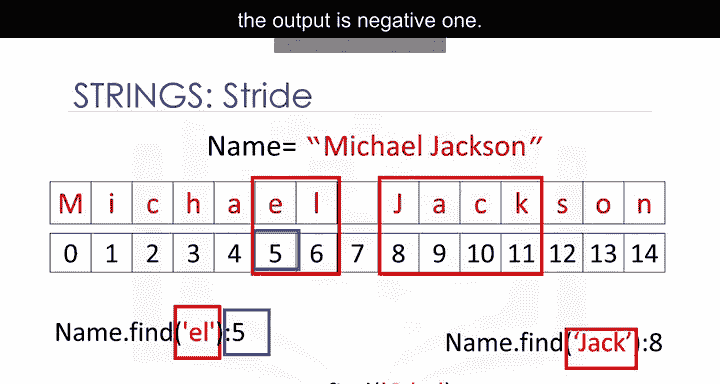

本节课中我们一起学习了Python字符串的核心操作。我们了解了字符串的定义、索引与切片、连接与复制操作，以及字符串不可变的特性。我们还介绍了转义序列的用法和几个重要的字符串方法，如`upper()`、`replace()`和`find()`。理解这些基础概念是进行有效文本数据处理的关键。