# 004：列表与元组 📚

在本节课中，我们将学习Python中的两种复合数据类型：**列表**和**元组**。它们是Python中关键的数据结构，用于存储有序的元素序列。我们将了解它们的创建、访问、操作以及它们之间的核心区别。

---

## 元组 📦

元组是一种有序序列。以下是创建一个名为`ratings`的元组的示例。

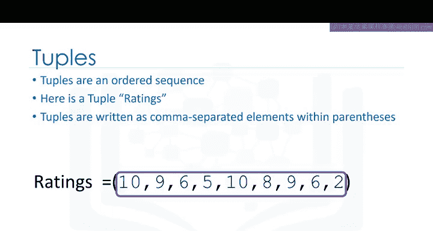

元组用圆括号括起来，其中的元素用逗号分隔。

括号内的这些值就是元组的元素。

```python
ratings = (1, 2, 3, 4, 5)
```

在Python中，元组可以包含不同类型的元素，如字符串、整数、浮点数等。但变量本身的类型是`tuple`。

元组的每个元素都可以通过索引来访问。

以下表格展示了索引与元组元素之间的关系。

| 索引 | 元素 |
| :--- | :--- |
| 0    | 1    |
| 1    | 2    |
| 2    | 3    |
| 3    | 4    |
| 4    | 5    |

第一个元素可以通过元组名称后跟方括号和索引号来访问，索引从0开始。

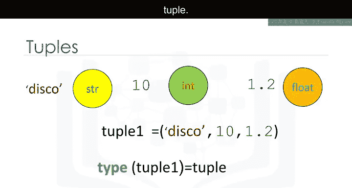

```python
first_element = ratings[0] # 结果为 1
```

我们可以这样访问第二个元素。

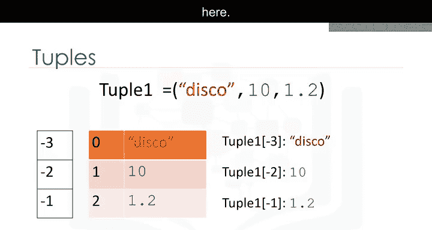

```python
second_element = ratings[1] # 结果为 2
```

我们也可以访问最后一个元素。

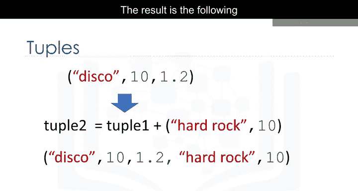

```python
last_element = ratings[4] # 结果为 5
```

在Python中，我们还可以使用负索引。其对应关系如下。

| 负索引 | 正索引 | 元素 |
| :----- | :----- | :--- |
| -5     | 0      | 1    |
| -4     | 1      | 2    |
| -3     | 2      | 3    |
| -2     | 3      | 4    |
| -1     | 4      | 5    |

对应的值如上所示。

```python
last_element_negative = ratings[-1] # 结果为 5
```

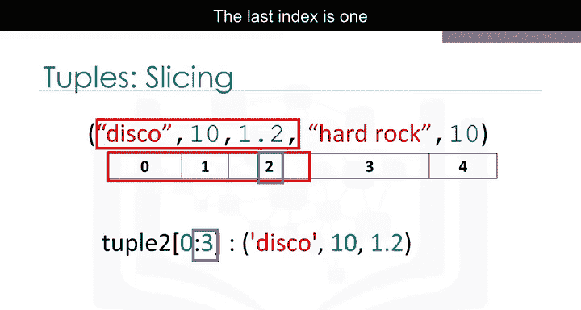

我们可以通过相加来连接或组合元组。结果如下。

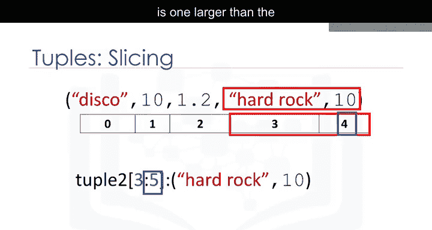

```python
tuple1 = (1, 2, 3)
tuple2 = (4, 5, 6)
combined_tuple = tuple1 + tuple2 # 结果为 (1, 2, 3, 4, 5, 6)
```

新元组的索引如下。

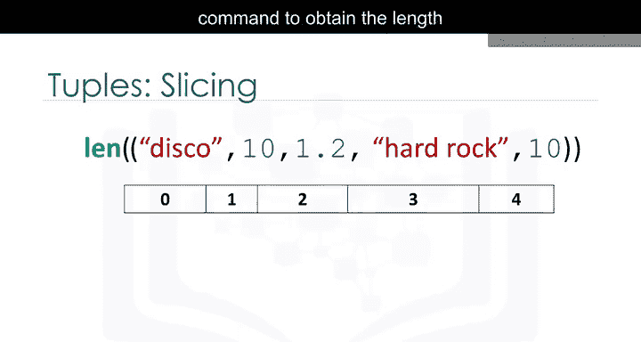

| 索引 | 元素 |
| :--- | :--- |
| 0    | 1    |
| 1    | 2    |
| 2    | 3    |
| 3    | 4    |
| 4    | 5    |
| 5    | 6    |

如果我们想从一个元组中获取多个元素，我们也可以对元组进行切片。例如，如果我们想要前三个元素，我们使用以下命令。

```python
first_three = ratings[0:3] # 结果为 (1, 2, 3)
```

请注意，结束索引（3）比我们想要的最后一个元素的索引（2）大1。

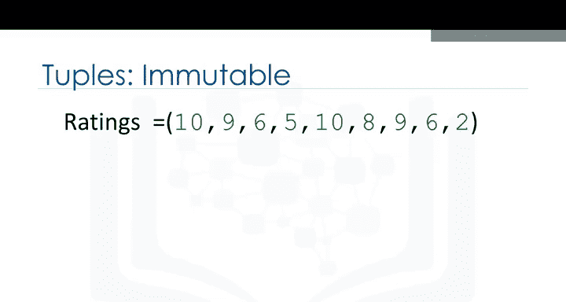

类似地，如果我们想要最后两个元素，我们使用以下命令。

```python
last_two = ratings[3:5] # 结果为 (4, 5)
```

请注意，结束索引（5）比元组的长度（5）大1。实际上，`ratings[3:]` 或 `ratings[-2:]` 是更常见的写法。

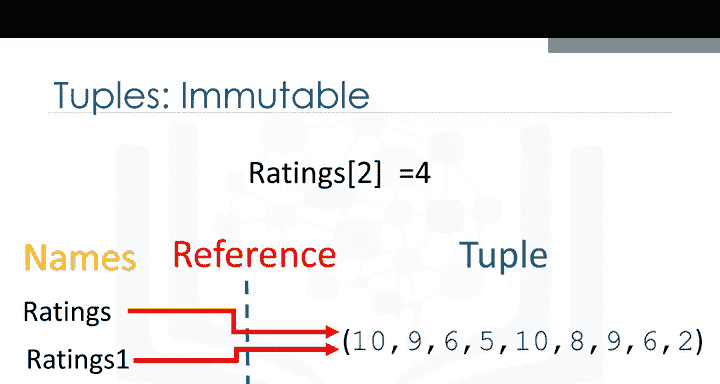

我们可以使用`len`命令来获取元组的长度。

```python
length = len(ratings) # 结果为 5
```

因为有五个元素，所以结果是5。

**元组是不可变的**，这意味着我们不能改变它们。为了理解为什么这很重要，让我们看看当我们将变量`ratings1`设置为`ratings`时会发生什么。

```python
ratings = (1, 2, 3, 4, 5)
ratings1 = ratings
```

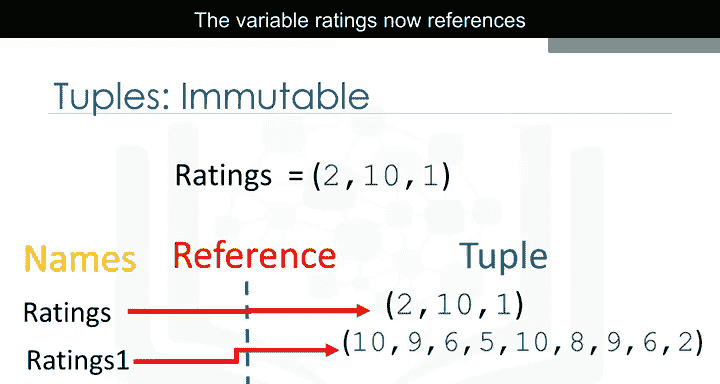

每个变量并不包含一个元组，而是引用了同一个不可变的元组对象。关于对象的更多信息，请参见对象和类模块。

假设我们想更改索引2处的元素，因为元组是不可变的，所以我们不能。

```python
# ratings[2] = 99 # 这行代码会引发 TypeError
```

因此，`ratings1`不会因为`ratings`的改变而受到影响，因为元组是不可变的。也就是说，我们不能改变它。

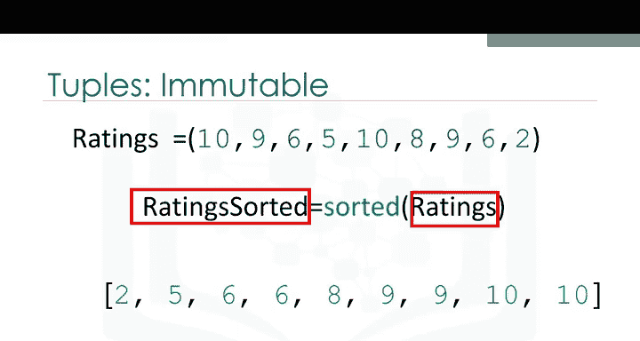

我们可以为`ratings`变量分配一个不同的元组。

```python
ratings = (10, 15, 20)
```

现在，变量`ratings`引用了另一个元组。

由于不可变性，如果我们想操作一个元组，我们必须创建一个新的元组。例如，如果我们想对一个元组排序，我们使用`sorted`函数。

```python
sorted_ratings = sorted(ratings) # 输入是原始元组，输出是一个新的已排序列表
```

关于函数的更多信息，请参见我们关于函数的视频。

一个元组可以包含其他元组，以及其他复杂的数据类型。这被称为**嵌套**。

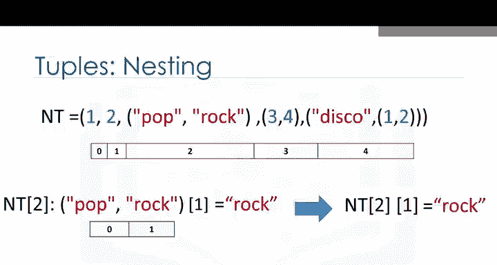

我们可以使用标准的索引方法来访问这些元素。

```python
NT = (1, 2, ("a", "b"), (3, ("c", "d")))
```

如果我们选择一个包含元组的索引，同样的索引约定也适用。因此，我们可以访问该元组中的值。例如，我们可以访问第二个元素（索引为2的元组）。

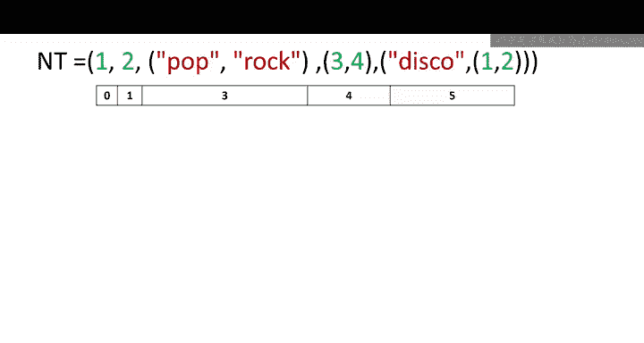

```python
element = NT[2] # 结果为 ("a", "b")
```

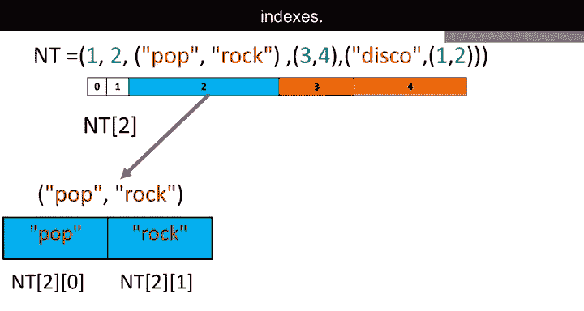

我们可以直接将此索引应用于元组变量`NT`。将其可视化为一棵树会很有帮助。

我们可以将这种嵌套可视化为一棵树。该元组具有以下索引。

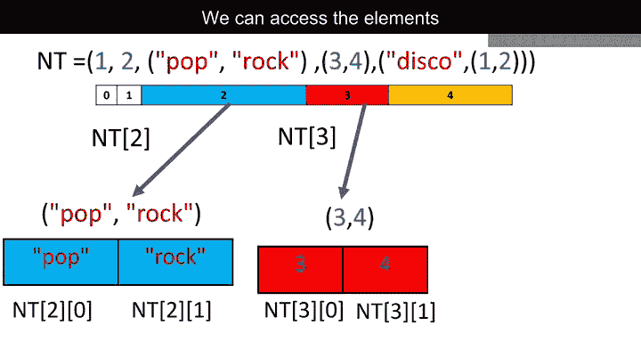

如果我们考虑包含其他元组的索引，我们看到索引2包含一个具有两个元素的元组。我们可以访问这两个索引。

```python
first_in_nested = NT[2][0] # 结果为 "a"
```

同样的约定适用于索引3。我们也可以访问那些元组中的元素。

```python
deep_element = NT[3][1][0] # 结果为 "c"
```

我们甚至可以通过添加另一个方括号来访问树的更深层次。

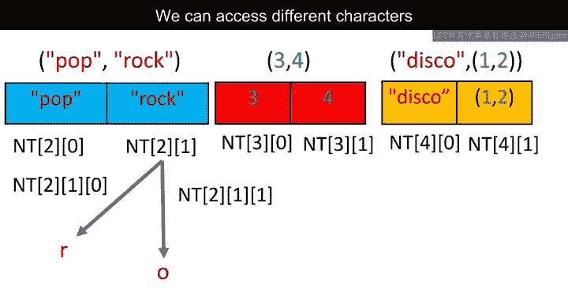

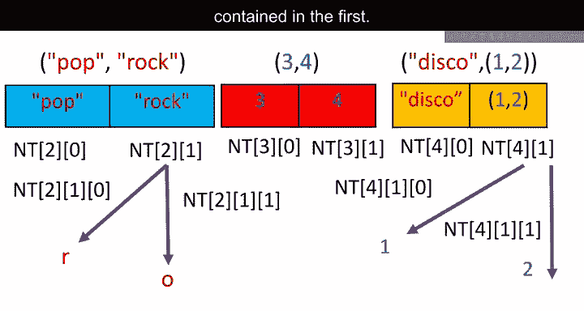

我们可以访问字符串中的不同字符或第二个元组中包含的各种元素。

---

## 列表 📝

列表也是Python中一种流行的数据结构。列表同样是一个有序序列。

以下是一个列表`L`。

```python
L = ["Michael Jackson", 10.1, 1982]
```

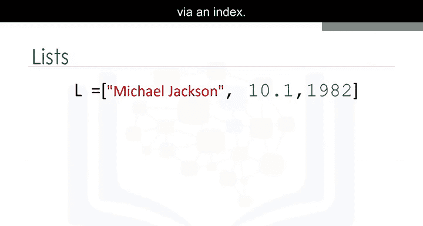

列表用方括号表示。在许多方面，列表类似于元组。一个关键区别是它们是**可变的**。

列表可以包含字符串、浮点数、整数。我们可以嵌套其他列表。我们也可以嵌套元组和其他数据结构。对于嵌套，应用相同的索引约定。

和元组一样，列表的每个元素都可以通过索引访问。

以下表格代表了索引与列表中元素之间的关系。

| 索引 | 元素            |
| :--- | :-------------- |
| 0    | "Michael Jackson" |
| 1    | 10.1           |
| 2    | 1982           |

第一个元素可以通过列表名称后跟方括号和索引号来访问，索引从0开始。

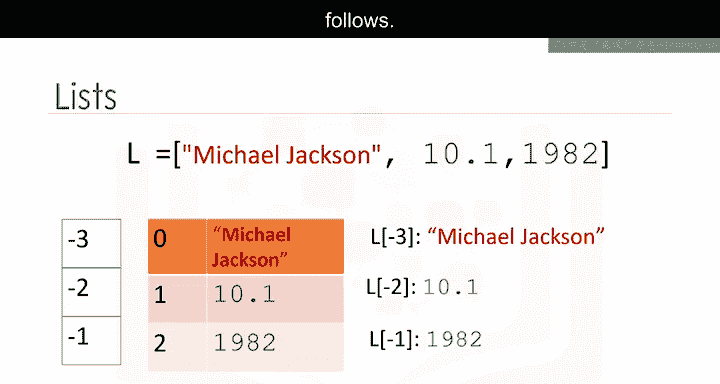

```python
first_element = L[0] # 结果为 "Michael Jackson"
```

我们可以这样访问第二个元素。

```python
second_element = L[1] # 结果为 10.1
```

我们也可以访问最后一个元素。

```python
last_element = L[2] # 结果为 1982
```

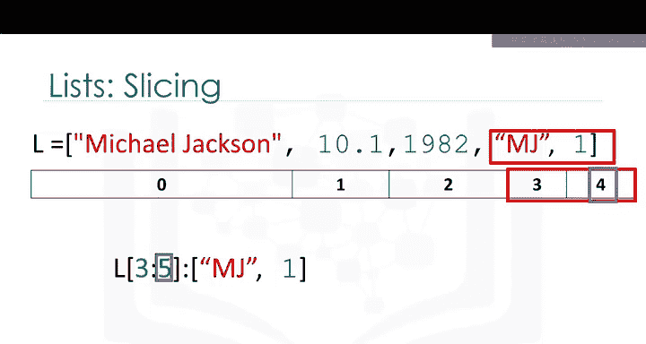

在Python中，我们可以使用负索引，其对应关系如下。

| 负索引 | 正索引 | 元素            |
| :----- | :----- | :-------------- |
| -3     | 0      | "Michael Jackson" |
| -2     | 1      | 10.1           |
| -1     | 2      | 1982           |

对应的索引如上所示。

```python
last_element_negative = L[-1] # 结果为 1982
```

我们也可以在列表中进行切片。例如，如果我们想要这个列表中的最后两个元素，我们使用以下命令。

```python
last_two_elements = L[1:3] # 结果为 [10.1, 1982]
```

请注意，结束索引（3）比列表的长度（3）大1。列表和元组的索引约定是相同的。更多示例请查看实验部分。

我们可以通过相加来连接或组合列表。结果如下。

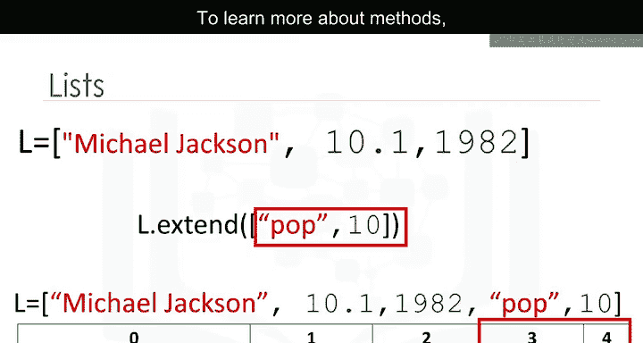

```python
L1 = ["Michael Jackson", 10.1]
L2 = [1982]
L3 = L1 + L2 # 结果为 ["Michael Jackson", 10.1, 1982]
```

新列表具有以下索引。

列表是可变的。因此，我们可以改变它们。例如，我们应用`extend`方法，通过添加一个点后跟方法名，然后是括号。括号内的参数是我们要连接到原始列表的新列表。

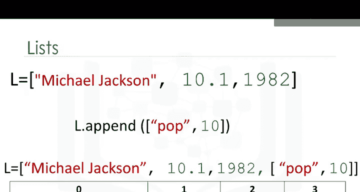

```python
L = ["Michael Jackson", 10.1]
L.extend([1982, "Thriller"])
# 现在 L 变为 ["Michael Jackson", 10.1, 1982, "Thriller"]
```

在这种情况下，不是创建一个新列表`L1`，而是通过添加两个新元素来修改原始列表`L`。要了解更多关于方法的信息，请查看我们关于对象和类的视频。

另一个类似的方法是`append`。如果我们应用`append`而不是`extend`，我们向列表中添加一个元素。

```python
L = ["Michael Jackson", 10.1, 1982]
L.append(["Thriller"])
# 现在 L 变为 ["Michael Jackson", 10.1, 1982, ["Thriller"]]
```

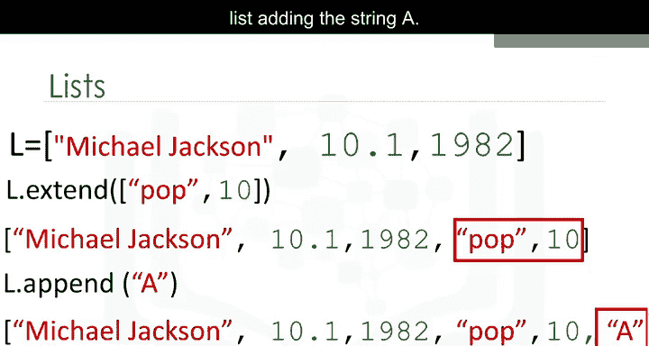

如果我们查看索引，只多了一个元素。索引3包含我们追加的列表。

每次我们应用一个方法，列表都会改变。如果我们应用`extend`，我们向列表添加两个新元素。列表`L`通过添加两个新元素被修改。

如果我们追加字符串`"A"`，我们进一步改变列表，添加了字符串`"A"`。

由于列表是可变的，我们可以改变它们。例如，我们可以如下更改第一个元素。

```python
L[0] = "hard rock"
# 现在列表变为 ["hard rock", 10.1, 1982]
```

我们可以使用`del`命令删除列表的一个元素。我们只需将要删除的列表项作为参数指明。例如，如果我们想删除第一个元素。

```python
del(L[0])
# 结果变为 [10.1, 1982]
```

我们可以删除第二个元素。此操作会移除列表的第二个元素。

我们可以使用`split`将字符串转换为列表。例如，`split`方法将以空格分隔的每组字符转换为列表的一个元素。

```python
string = "A,B,C,D"
result_list = string.split(",") # 结果为 ["A", "B", "C", "D"]
```

我们可以使用`split`函数在特定字符（称为分隔符）上分隔字符串。我们只需传递我们想要分割的分隔符作为参数。在这种情况下是逗号。结果是一个列表。每个元素对应一组被逗号分隔的字符。

当我们设置一个变量`B`等于`A`时，`A`和`B`都引用同一个列表。多个名称引用同一个对象被称为**别名**。

```python
A = ["hard rock", 10, 1.2]
B = A
```

我们从列表的幻灯片中知道，`B`中的第一个元素被设置为`"hard rock"`。如果我们将`A`中的第一个元素改为`"banana"`，会产生副作用。`B`的值也会随之改变。

```python
A[0] = "banana"
print(B[0]) # 输出 "banana" 而不是 "hard rock"
```

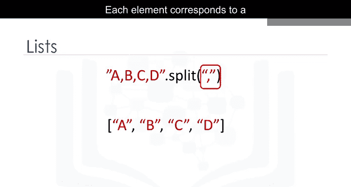

`A`和`B`引用同一个列表，因此，如果我们改变`A`，列表`B`也会改变。如果在更改列表`A`后检查`B`的第一个元素，我们得到的是`"banana"`而不是`"hard rock"`。

你可以使用以下语法克隆列表`A`。

```python
A = ["hard rock", 10, 1.2]
B = A[:] # 创建 A 的一个新副本
```

变量`A`引用一个列表。变量`B`引用原始列表的一个新副本或克隆。现在，如果你改变`A`，`B`不会改变。

我们可以使用`help`命令获取关于列表、元组和Python中许多其他对象的更多信息。只需传入列表、元组或任何其他Python对象。

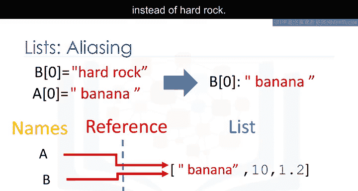

```python
help(list)
help(tuple)
```

更多关于列表的操作，请参见实验部分。

---

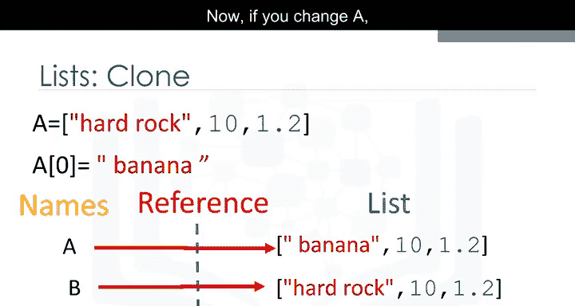

## 总结 ✨

在本节课中，我们一起学习了Python中两个重要的复合数据类型：**元组**和**列表**。

*   **元组**：使用圆括号`()`定义，是**不可变**的有序序列。这意味着一旦创建，其内容无法更改。它们适用于存储不应被修改的数据集合。
*   **列表**：使用方括号`[]`定义，是**可变**的有序序列。这意味着创建后，可以对其内容进行添加、删除或修改。它们功能更灵活，是编程中最常用的数据结构之一。

我们掌握了如何创建它们、通过索引和切片访问元素、进行连接操作，并理解了可变性与不可变性的核心区别及其影响（如别名问题）。我们还简要了解了嵌套结构和一些实用的方法（如`split`, `append`, `extend`）。

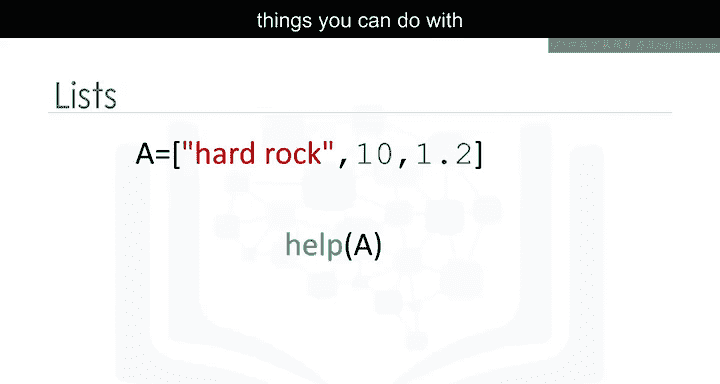

理解列表和元组是有效组织和管理数据的基础，对于后续学习更复杂的数据结构和进行数据分析至关重要。