# 005：Python字典结构 📚

在本节课中，我们将要学习Python中的字典结构。字典是Python中一种重要的集合类型，它通过键值对来存储和访问数据。我们将从字典的基本概念开始，逐步学习如何创建、访问、修改字典，以及如何使用字典的常用方法。

---

## 字典的基本概念 🔑

上一节我们介绍了列表，列表使用整数索引来访问元素。本节中我们来看看字典，它与列表类似，但使用键来访问值。

字典由键和值组成。键类似于列表的索引，但键不一定是整数，通常是字符串。值则类似于列表中的元素，用于存储具体信息。

以下是字典的核心概念公式：

*   **字典结构**：`{key1: value1, key2: value2, ...}`
*   **访问值**：`dict_name[key]`

---

## 创建字典 ➕

要创建一个字典，我们使用花括号 `{}`。键是第一个元素，必须是不可变且唯一的。每个键后面跟着一个冒号 `:`，然后是值。值可以是任何类型的数据，并且允许重复。每个键值对之间用逗号 `,` 分隔。

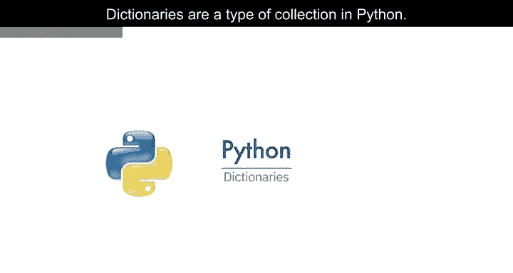

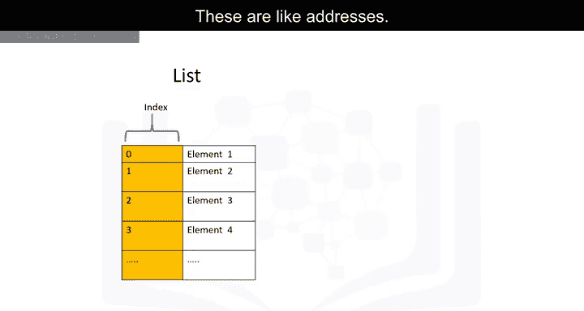

考虑以下字典示例，其中专辑名称是键，发行年份是值：

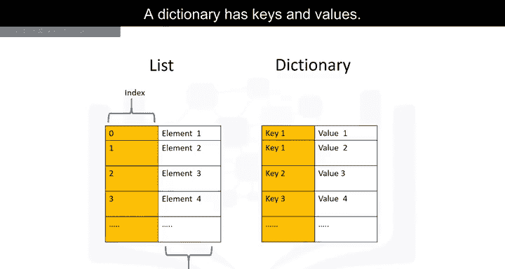

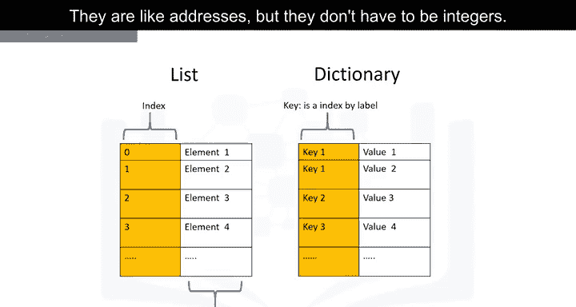

```python
# 创建一个字典
album_release_dates = {
    "Back in Black": 1980,
    "The Dark Side of the Moon": 1973,
    "The Bodyguard": 1992
}
```

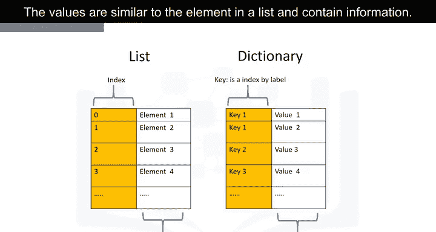

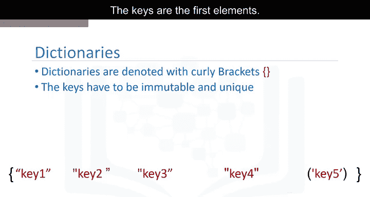

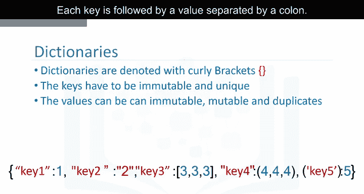

我们可以将字典想象成一个表格，第一列是键，第二列是对应的值。

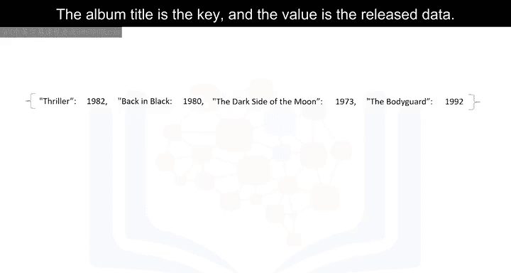

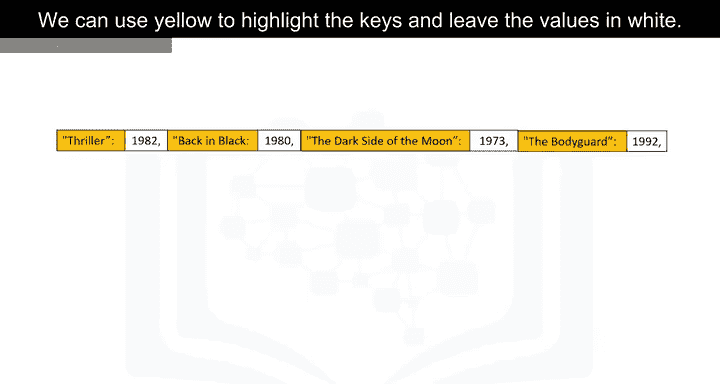

---

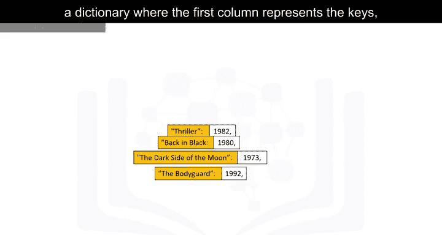

## 访问与修改字典 🔄

我们可以通过键来访问字典中的值，使用方括号 `[]`，括号内的参数是键。这会返回对应的值。

以下是访问字典值的示例：

```python
# 访问值
print(album_release_dates["Back in Black"])  # 输出：1980
print(album_release_dates["The Dark Side of the Moon"])  # 输出：1973
```

我们可以向字典中添加新的条目，方法是为一个新的键赋值。

```python
# 添加新条目
album_release_dates["Graduation"] = 2007
```

我们也可以删除字典中的条目，使用 `del` 语句。

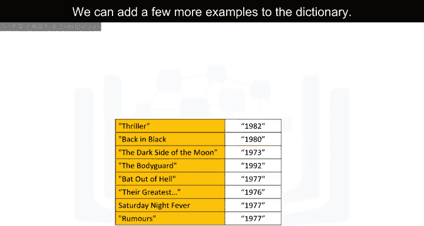

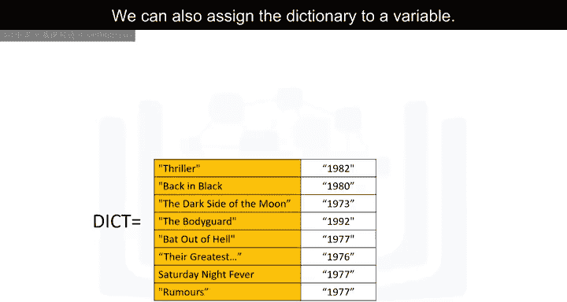

```python
# 删除条目
del album_release_dates["The Bodyguard"]
```

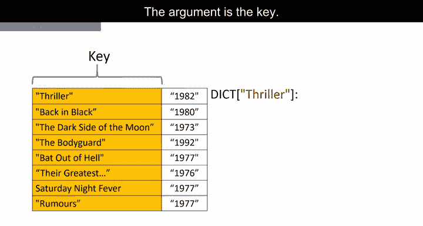

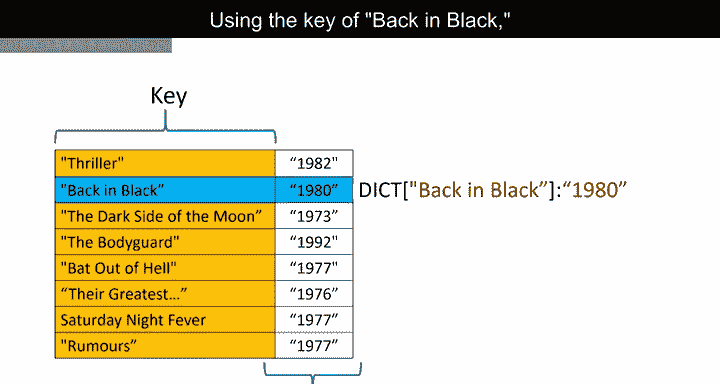

---

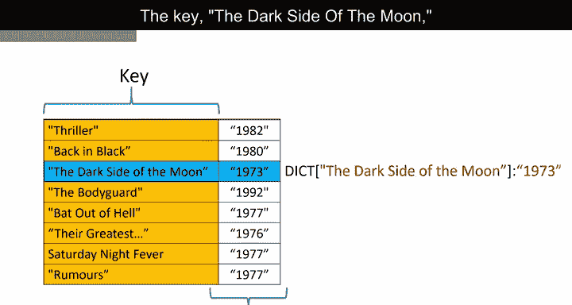

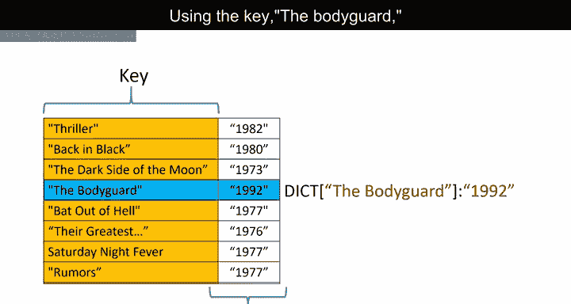

## 字典的常用操作 🛠️

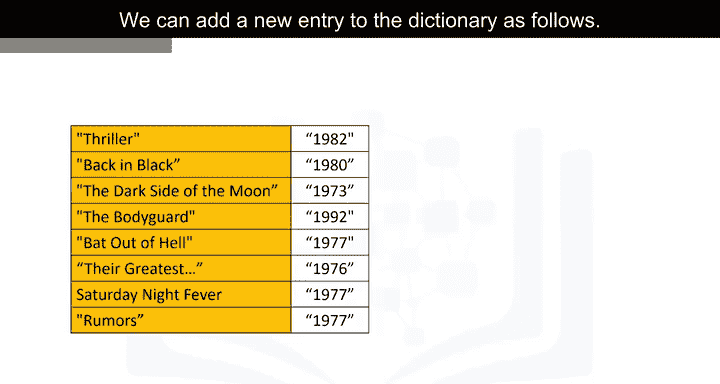

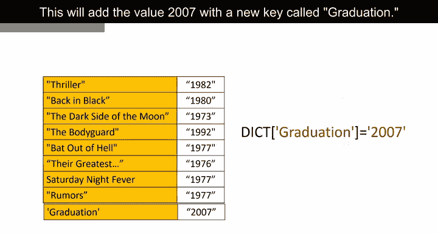

我们可以使用 `in` 命令来检查某个键是否存在于字典中。这个命令会检查键，如果键在字典中，则返回 `True`，否则返回 `False`。

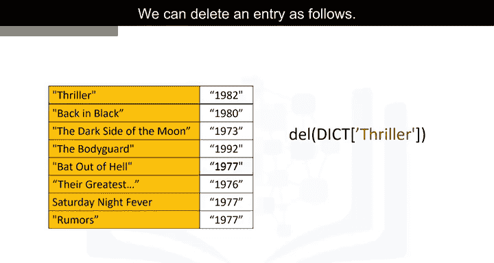

以下是检查键是否存在的示例：

```python
# 检查键是否存在
print("Thriller" in album_release_dates)  # 输出：False
print("Back in Black" in album_release_dates)  # 输出：True
```

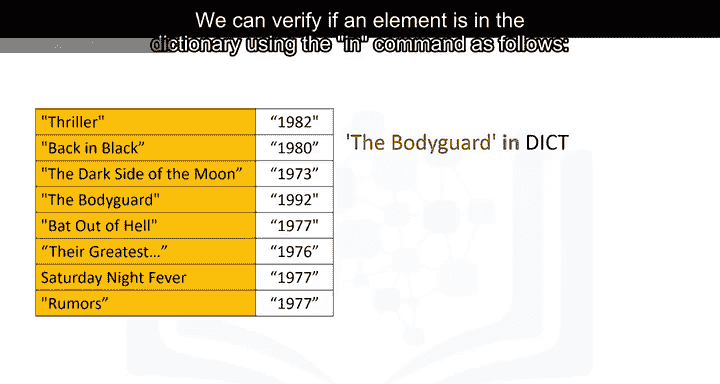

为了获取字典中所有的键，我们可以使用 `.keys()` 方法。其输出是一个类似列表的对象，包含所有键。

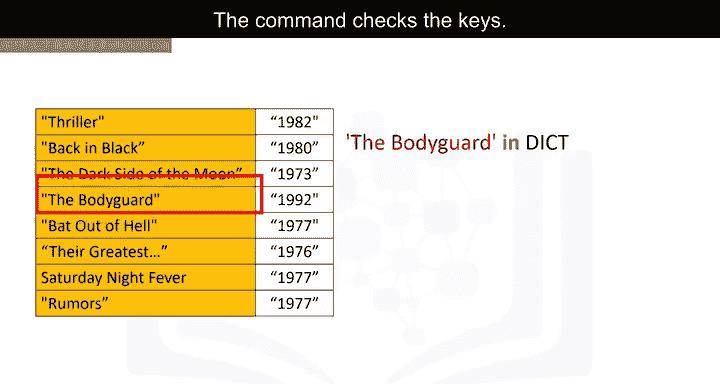

同样地，我们可以使用 `.values()` 方法来获取字典中所有的值。

以下是获取所有键和值的示例：

```python
# 获取所有键
keys = album_release_dates.keys()
print(keys)  # 输出类似：dict_keys(['Back in Black', 'The Dark Side of the Moon', 'Graduation'])

# 获取所有值
values = album_release_dates.values()
print(values)  # 输出类似：dict_values([1980, 1973, 2007])
```

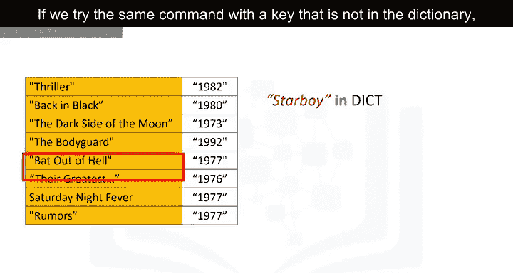

---

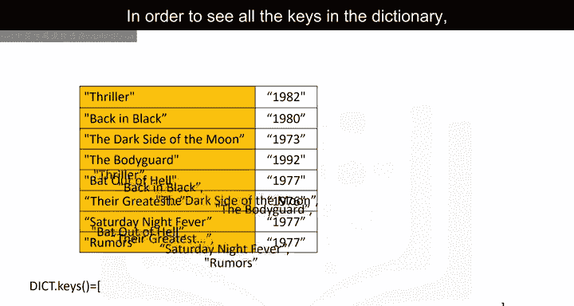

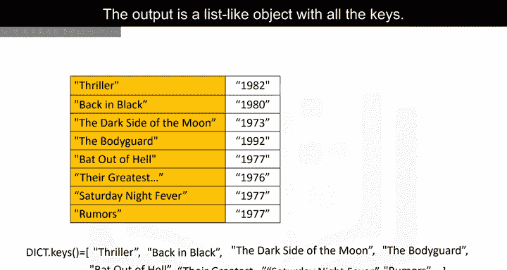

## 总结 📝

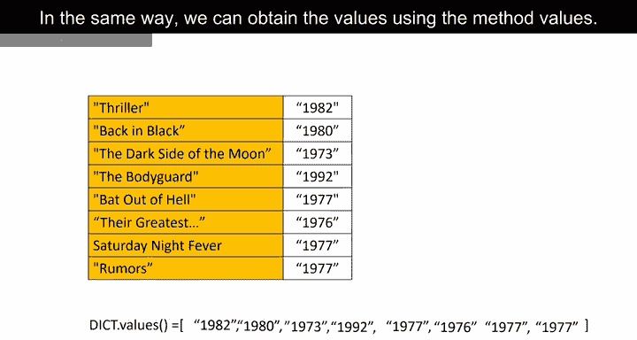

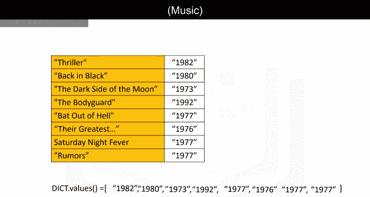

本节课中我们一起学习了Python字典结构。我们了解了字典由键值对组成，学会了如何使用花括号创建字典，如何通过键访问和修改值，以及如何使用 `in` 命令、`.keys()` 和 `.values()` 方法来操作字典。字典是存储和快速查找关联数据的强大工具，请在实验环节查看更多示例以加深理解。