# 006：集合类型详解

在本节课中，我们将学习Python中的集合类型。集合是一种无序且元素唯一的容器，与列表和元组不同，它不记录元素位置。我们将介绍如何创建集合、进行类型转换，以及执行常见的集合操作。

---

## 🧩 什么是集合？

集合是一种容器类型。这意味着，与列表和元组类似，你可以在集合中存放不同的Python数据类型。

与列表和元组不同，集合是无序的。这意味着集合不记录元素的位置。

集合只包含唯一元素。这意味着在集合中，每个特定元素只出现一次。

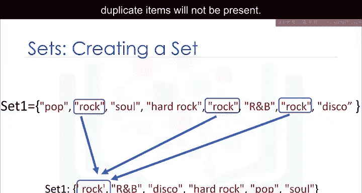

---

## 🔧 创建集合

要定义一个集合，需使用花括号。将集合的元素放在花括号内。

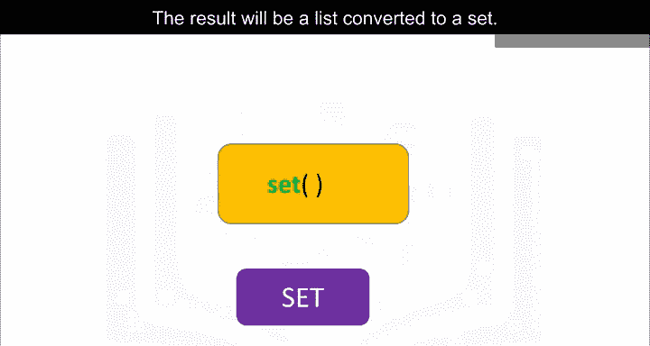

```python
# 示例：创建集合
my_set = {1, 2, 3, 'apple', 'banana'}
```

你可能会注意到存在重复项。当实际创建集合时，重复项将不会出现。

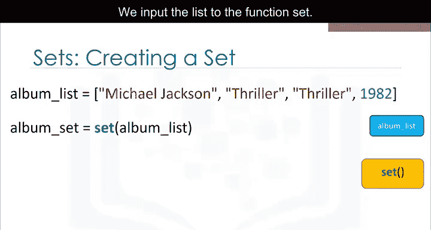

---

## 🔄 列表转换为集合

你可以使用`set()`函数将列表转换为集合。这称为类型转换。

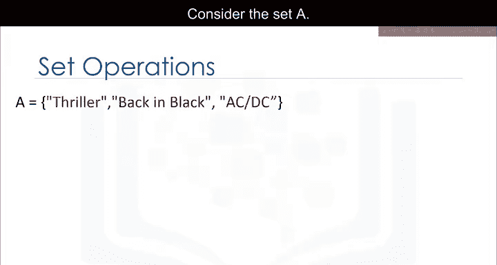

你只需将列表作为`set()`函数的输入参数。结果将是一个由列表转换而来的集合。

```python
# 示例：将列表转换为集合
my_list = [1, 2, 2, 3, 'apple', 'apple']
my_set = set(my_list)
# 结果：{1, 2, 3, 'apple'}
```

注意转换后没有重复元素。

---

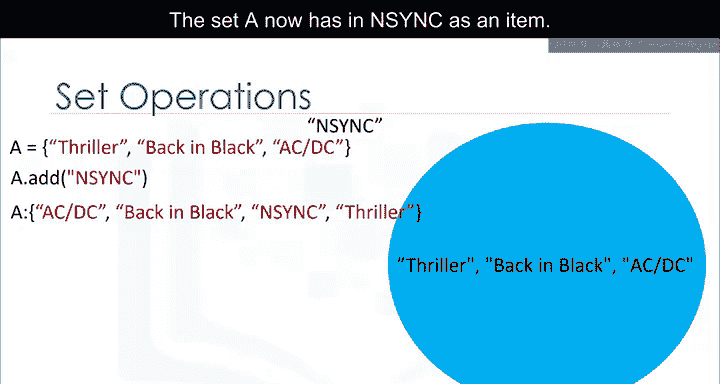

## 🛠️ 集合操作

这些操作用于修改集合。考虑集合A，我们可以用一个圆圈来表示它。如果你熟悉集合，这可以是维恩图的一部分。

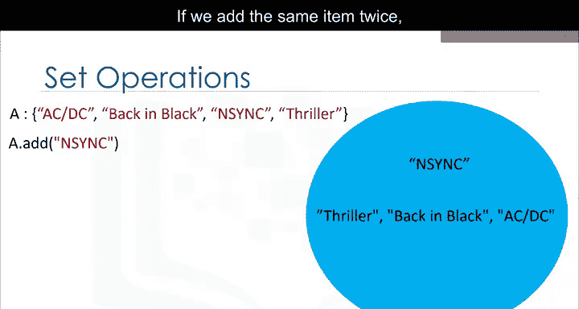

维恩图是一种使用形状（通常是圆形）来表示集合的工具。

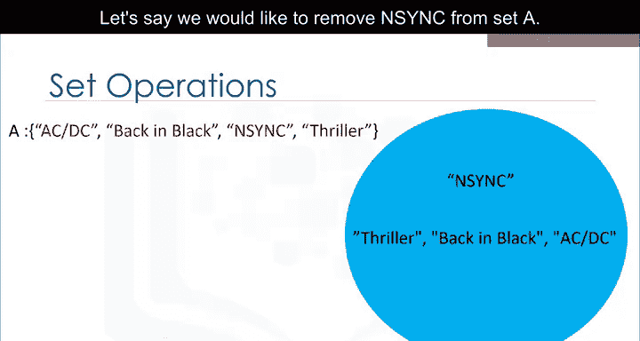

---

### 添加元素

我们可以使用`add()`方法向集合中添加一个元素。只需在集合名称后加点号，然后调用`add()`方法。参数是我们要添加的新元素。

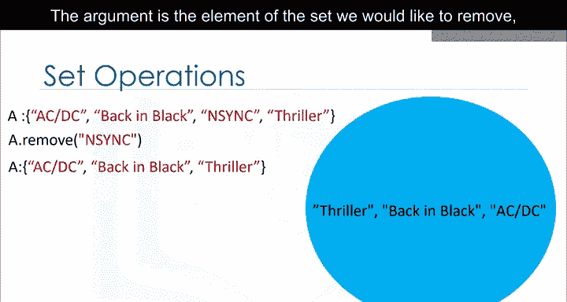

```python
# 示例：向集合添加元素
set_A = {1, 2, 3}
set_A.add(4)
# 结果：{1, 2, 3, 4}
```

如果添加相同的元素两次，不会发生任何变化，因为集合中不能有重复项。

---

### 移除元素

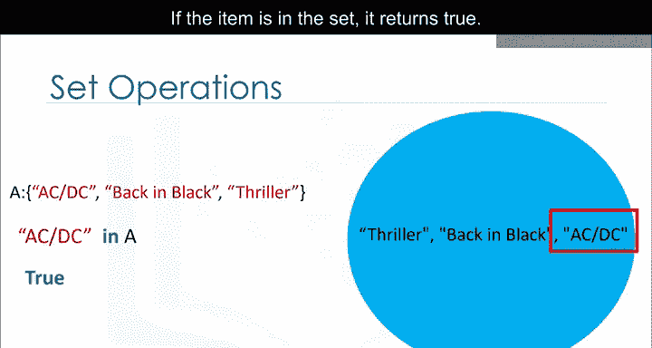

我们可以使用`remove()`方法从集合中移除一个元素。只需在集合名称后加点号，然后调用`remove()`方法。参数是我们要移除的元素。

```python
# 示例：从集合移除元素
set_A = {1, 2, 3, 4}
set_A.remove(4)
# 结果：{1, 2, 3}
```

应用`remove()`方法后，集合A不再包含该元素。你可以对集合中的任何元素使用此方法。

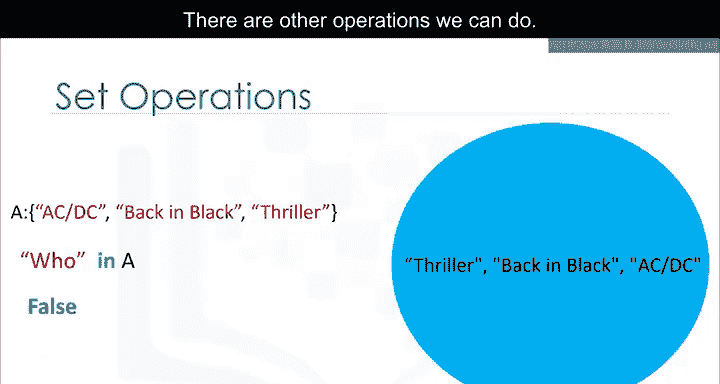

---

### 检查元素是否存在

我们可以使用`in`命令来验证一个元素是否在集合中。

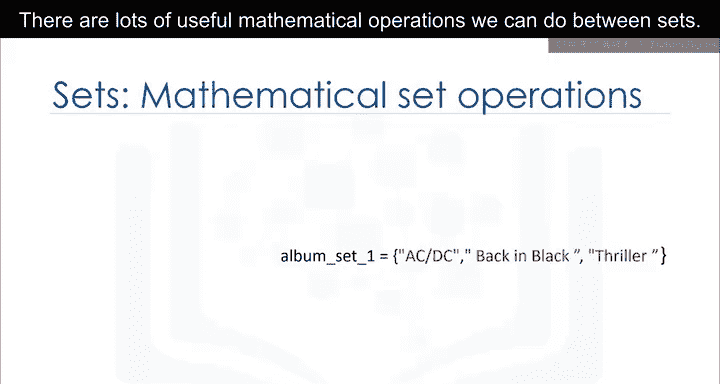

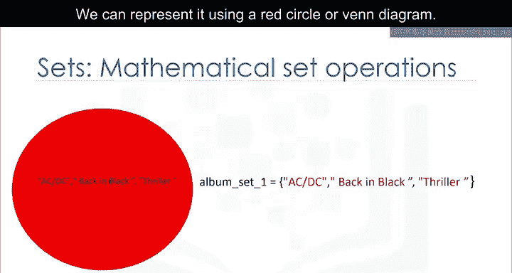

```python
# 示例：检查元素是否在集合中
set_A = {1, 2, 3}
print(2 in set_A)  # 输出：True
print(5 in set_A)  # 输出：False
```

该命令检查指定项是否在集合中。如果存在，则返回`True`；如果不存在，则返回`False`。

---

## ➕ 集合的数学运算

我们可以在集合之间进行许多有用的数学运算。

让我们定义集合`album_set1`。我们可以用一个红色圆圈或维恩图来表示它。

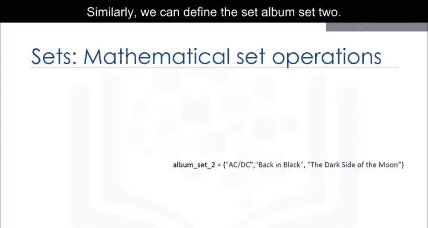

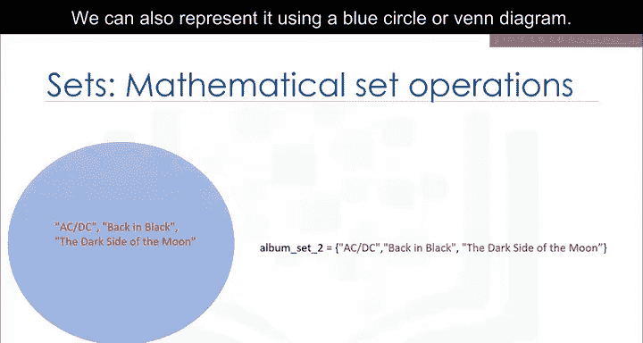

类似地，我们可以定义集合`album_set2`。我们也可以用一个蓝色圆圈或维恩图来表示它。

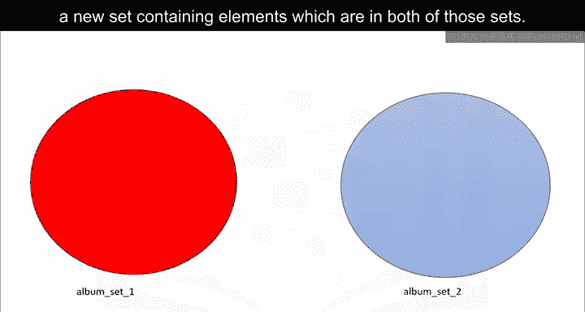

---

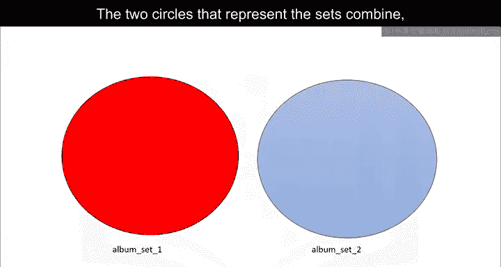

### 交集

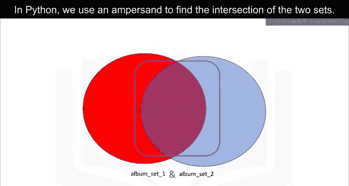

两个集合的交集是一个新集合，包含同时存在于这两个集合中的元素。使用维恩图有助于理解。代表两个集合的圆圈合并，重叠部分代表新集合。

在Python中，我们使用`&`符号来求两个集合的交集。

```python
# 示例：求两个集合的交集
album_set1 = {'AC/DC', 'Back in Black', 'Thriller'}
album_set2 = {'AC/DC', 'Back in Black', 'The Dark Side of the Moon'}
album_set3 = album_set1 & album_set2
# 结果：{'AC/DC', 'Back in Black'}
```

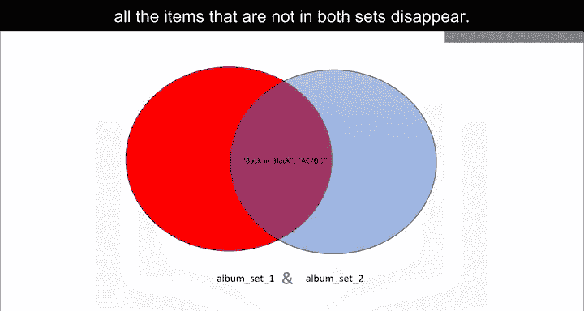

应用交集操作后，所有不同时存在于两个集合中的项都会消失。

---

### 并集

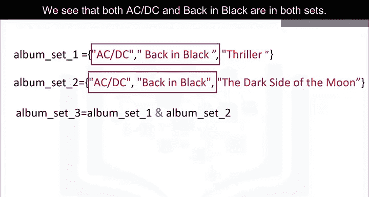

两个集合的并集是一个新集合，包含两个集合中的所有元素。

我们可以如下找到集合`album_set1`和`album_set2`的并集：

```python
# 示例：求两个集合的并集
album_set1 = {'AC/DC', 'Back in Black', 'Thriller'}
album_set2 = {'AC/DC', 'Back in Black', 'The Dark Side of the Moon'}
union_set = album_set1 | album_set2
# 结果：{'AC/DC', 'Back in Black', 'Thriller', 'The Dark Side of the Moon'}
```

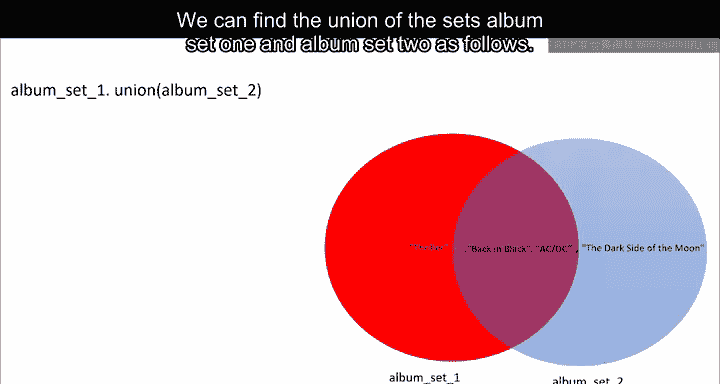

结果是一个包含`album_set1`和`album_set2`所有元素的新集合。

---

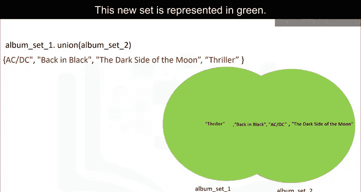

### 子集检查

考虑新集合`album_set3`。该集合包含元素`AC/DC`和`Back in Black`。我们可以用维恩图表示，因为`album_set3`的所有元素都在`album_set1`中。

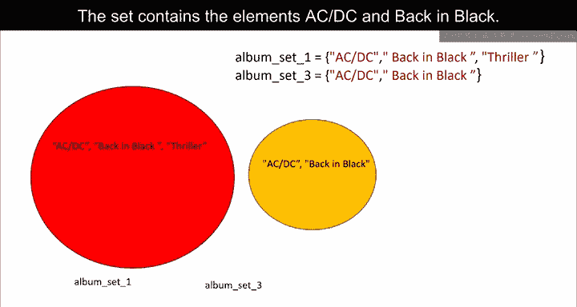

我们可以使用`issubset()`方法检查一个集合是否是另一个集合的子集。

```python
# 示例：检查子集关系
album_set1 = {'AC/DC', 'Back in Black', 'Thriller'}
album_set3 = {'AC/DC', 'Back in Black'}
print(album_set3.issubset(album_set1))  # 输出：True
```

由于`album_set3`是`album_set1`的子集，结果为`True`。

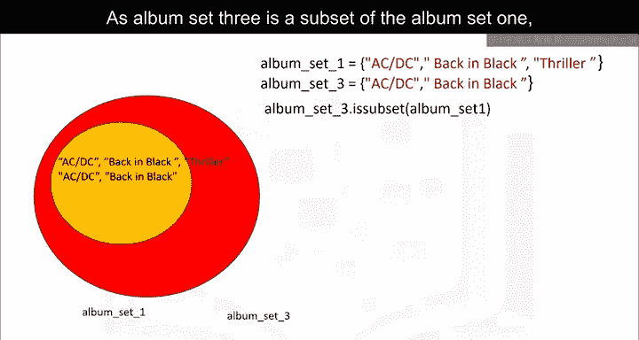

---

## 📝 总结

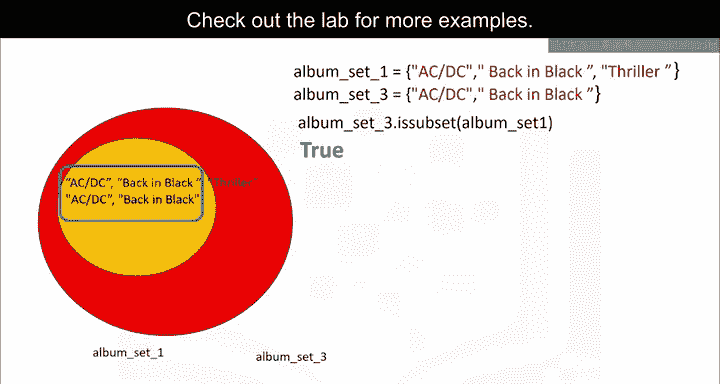

在本节课中，我们一起学习了Python中的集合类型。我们了解了集合是无序且元素唯一的容器，学会了如何创建集合、将列表转换为集合，以及执行添加、移除、检查元素存在性等基本操作。我们还探讨了集合的数学运算，包括交集、并集和子集检查。集合是处理唯一数据集时的强大工具，在数据科学和AI应用中非常有用。