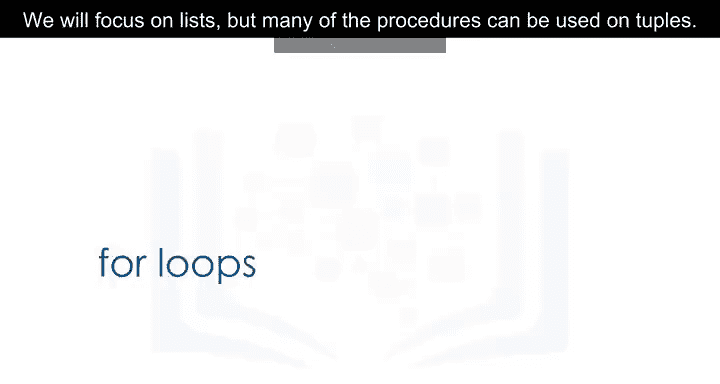
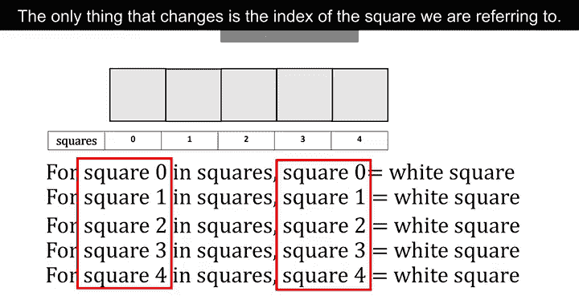
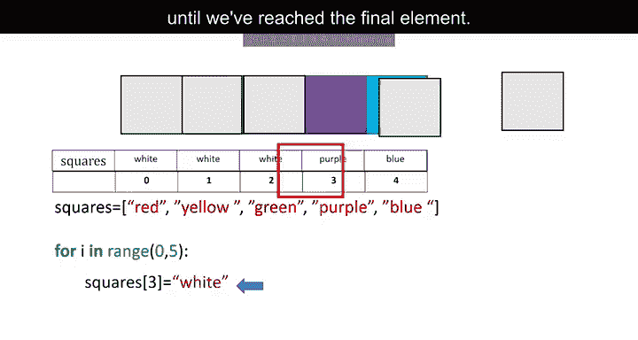
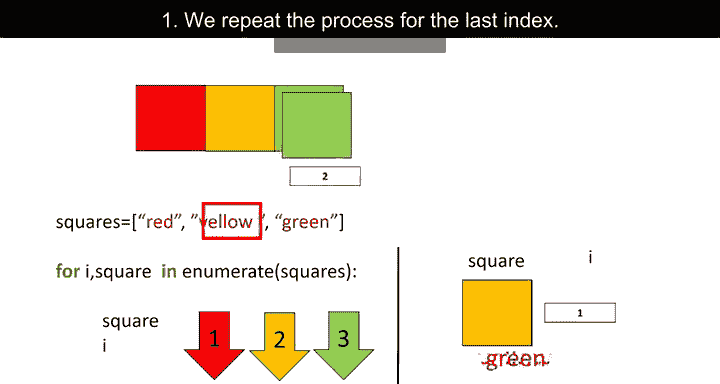
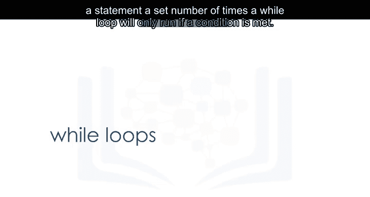
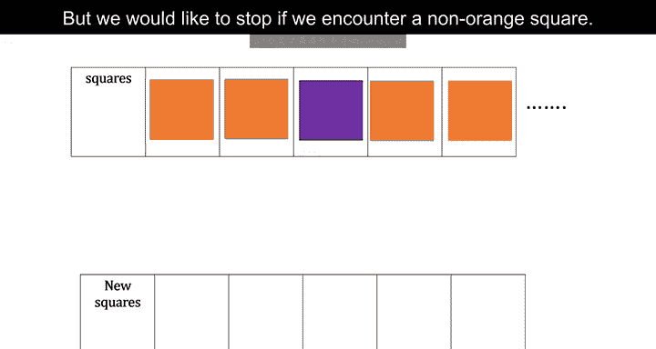
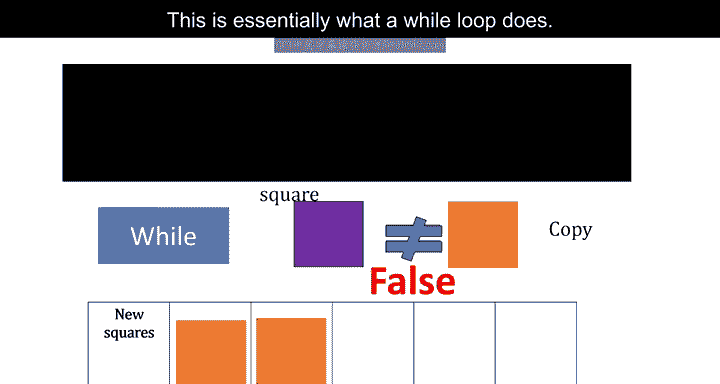
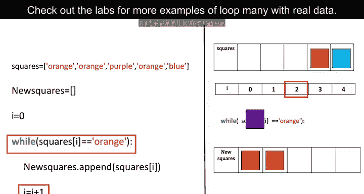

# 008：循环结构 🔄

在本节课中，我们将学习Python中的循环结构，特别是**for循环**和**while循环**。我们将通过直观的示例来理解它们的工作原理，并学习如何使用`range`函数和`enumerate`函数来辅助循环操作。掌握循环是自动化重复任务的关键，对于数据处理和算法实现至关重要。

***

## 🔢 `range`函数简介

在深入讨论循环之前，我们先来了解一个重要的内置函数：`range`。`range`函数用于生成一个有序的数字序列。

*   如果只提供一个正整数参数`n`，`range(n)`会生成一个从`0`开始，到`n-1`结束的序列。例如，`range(3)`生成序列`[0, 1, 2]`。
*   如果提供两个参数`start`和`stop`，`range(start, stop)`会生成一个从`start`开始，到`stop-1`结束的序列。例如，`range(10, 15)`生成序列`[10, 11, 12, 13, 14]`。

请注意，在Python 3中，`range`函数生成的是一个“range对象”，它按需生成值，而不是像Python 2那样直接生成一个完整的列表，这在处理大范围数字时更高效。

***



## 🔁 For循环

上一节我们介绍了`range`函数，本节中我们来看看最常用的循环结构——**for循环**。我们将以列表为例，但许多操作同样适用于元组。

循环的核心作用是**重复执行某项任务**。设想有一组彩色方块，我们想将每个方块都替换成白色方块。




为了便于操作，我们给每个方块编号，并将这组方块称为`squares`列表。在Python中，我们可以用列表来表示这些方块，列表中的每个元素是一个代表颜色的字符串。我们的目标是将每个元素的值改为`"white"`。

以下是使用`range`函数和索引进行for循环的语法：

```python
squares = ['red', 'yellow', 'green', 'purple', 'blue']

for i in range(5):
    squares[i] = "white"
```

代码解析：
*   `range(5)`生成序列`[0, 1, 2, 3, 4]`。
*   循环会重复执行缩进块内的代码5次。
*   每次循环，变量`i`的值依次为0, 1, 2, 3, 4。
*   在每次迭代中，我们将列表`squares`的第`i`个元素设置为`"white"`。


### 直接迭代列表元素

我们也可以不通过索引，直接迭代列表或元组中的每一个元素。



```python
squares = ['red', 'yellow', 'green']

for square in squares:
    print(square)
```
循环过程：
*   第一次迭代：变量`square`的值为`'red'`。
*   第二次迭代：变量`square`的值为`'yellow'`。
*   第三次迭代：变量`square`的值为`'green'`。

### 使用`enumerate`函数同时获取索引和元素

有时我们需要在循环中同时获得元素的索引和值，这时`enumerate`函数就非常有用。


其语法如下：
```python
squares = ['red', 'yellow', 'green']

for i, square in enumerate(squares):
    print(f"Index {i} is {square}")
```
循环过程：
*   第一次迭代：`i = 0`, `square = 'red'`。
*   第二次迭代：`i = 1`, `square = 'yellow'`。
*   第三次迭代：`i = 2`, `square = 'green'`。

***

## ⏱️ While循环



for循环用于执行已知次数的重复任务，而**while循环**则用于在某个条件为真时，持续执行代码块。

设想一个场景：我们想从一个方块列表中复制所有橙色方块到新列表，但一旦遇到非橙色方块就立即停止。我们事先并不知道列表里有多少个橙色方块。




这就是while循环的典型应用。我们用代码来模拟这个过程：


```python
squares = ['orange', 'orange', 'purple', 'blue']
new_squares = []
i = 0



while i < len(squares) and squares[i] == 'orange':
    new_squares.append(squares[i])
    i = i + 1
```
代码解析：
1.  我们创建空列表`new_squares`和索引`i=0`。
2.  `while`语句会检查条件：`i`是否在列表长度内 **且** 当前元素是否为`'orange'`。
3.  只要条件为真，就执行缩进块内的代码：将当前元素添加到`new_squares`，并将索引`i`加1。
4.  当遇到`'purple'`（第三个元素）时，条件`squares[i] == 'orange'`变为假，循环终止。




***

## 📝 总结


本节课中我们一起学习了Python中两种主要的循环结构：
1.  **For循环**：通常用于遍历序列（如列表、元组）或执行已知次数的迭代。我们学习了使用`range`函数控制迭代次数，以及使用`enumerate`函数同时获取元素索引和值。
2.  **While循环**：用于在指定条件保持为真时重复执行代码块。它适用于迭代次数未知，需要根据运行时条件决定是否继续的场景。

循环是编程中实现自动化和批量处理的基础工具。请务必通过实验课中的真实数据示例进行练习，以巩固对这些概念的理解。




