# 009：函数定义

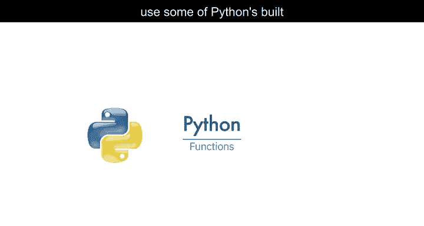

在本节课中，我们将学习Python中的函数。你将了解如何使用Python的一些内置函数，以及如何构建自己的函数。函数是代码复用的核心，理解它们对于高效编程至关重要。

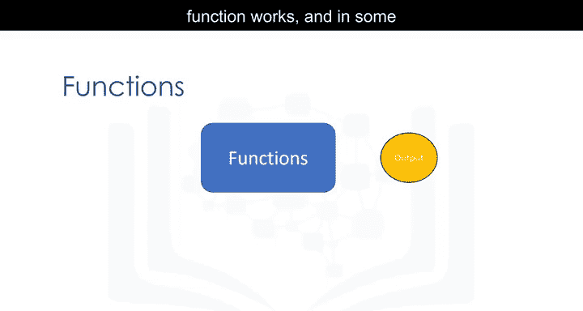

---

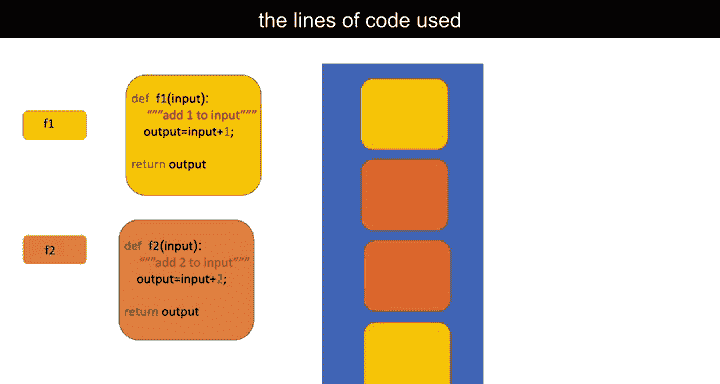

## 🧩 什么是函数？

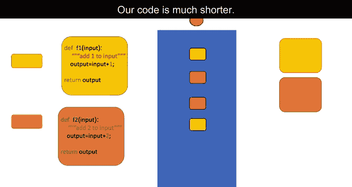

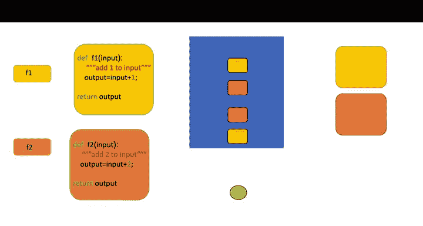

函数接收一些输入，然后产生输出或引发变化。它是一段可以重复使用的代码。你可以实现自己的函数，但在许多情况下，你会使用他人编写的函数。这时，你只需要知道函数如何工作，以及在某些情况下如何导入它们。

为了更直观地理解，我们可以将橙色和黄色的方块视为相似的代码块。通过输入运行这些代码，我们可以得到输出。如果我们定义一个函数来执行这个任务，我们只需要调用这个函数。让小的方块代表调用函数所需的代码行。

我们可以通过多次调用函数来替换这些冗长的代码行。现在，我们只需调用函数，代码变得更短，但执行的任务完全相同。

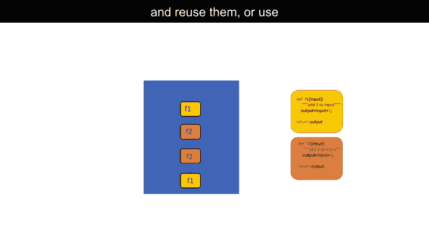

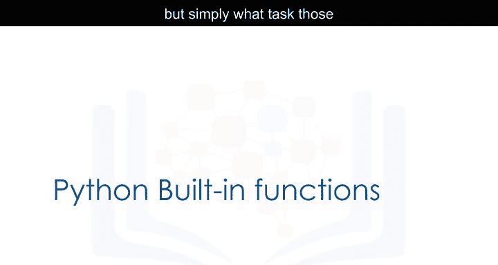

---

## 🔄 函数的工作流程

你可以将这个过程想象成这样：当我们调用函数 `F1` 时，我们将一个输入传递给函数。这些值被传递给你编写的所有代码行。函数返回一个值，你可以使用这个值。例如，你可以将这个值作为输入传递给一个新函数 `F2`。当我们调用这个新函数 `F2` 时，该值被传递给另一组代码行。函数返回一个值。这个过程不断重复，将值传递给你调用的函数。你可以保存这些函数并重复使用，或者使用他人的函数。

---

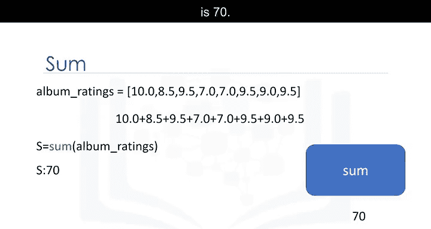

## 🛠️ Python的内置函数

Python有许多内置函数。你不需要知道这些函数内部如何工作，只需要知道它们执行什么任务。

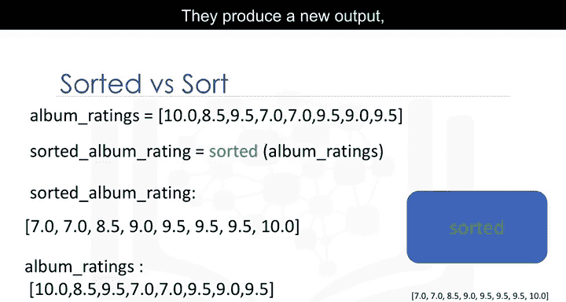

以下是几个常用内置函数的示例：

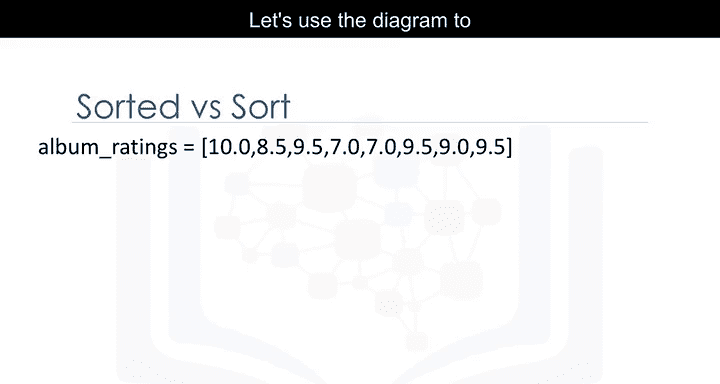

*   **`len()` 函数**：接收一个序列类型（如字符串或列表）或集合类型（如字典或集合）的输入，并返回该序列或集合的长度。
    *   **示例**：`len([1, 2, 3, 4, 5, 6, 7, 8])` 返回 `8`。
*   **`sum()` 函数**：接收一个可迭代对象（如元组或列表），并返回所有元素的总和。
    *   **示例**：`sum([10, 20, 30, 10])` 返回 `70`。

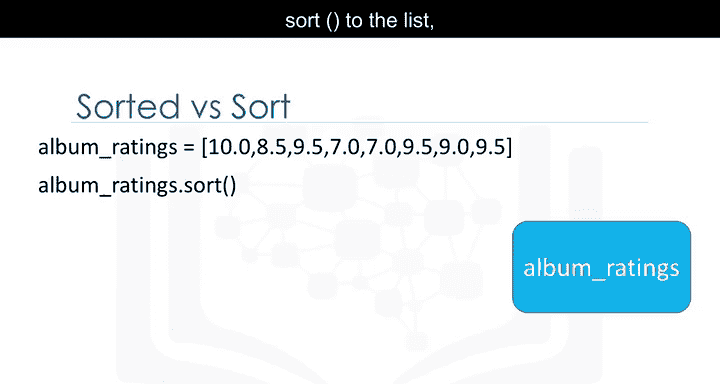

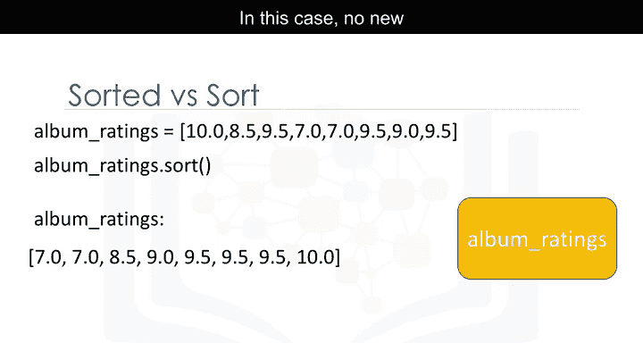

---

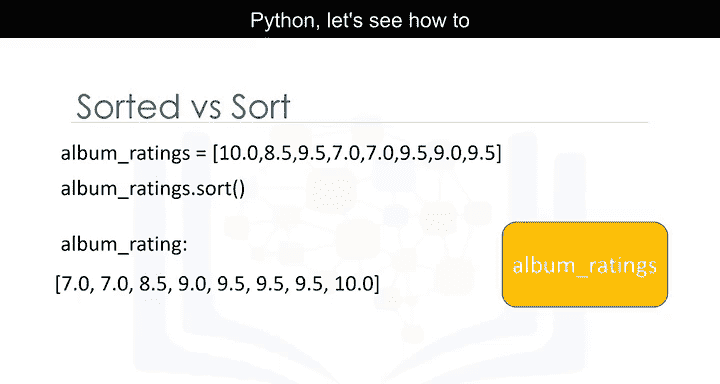

## 📊 排序：函数 vs. 方法

有两种对列表进行排序的方式，它们的行为有所不同。

上一节我们介绍了内置函数，本节中我们来看看排序这个具体操作，它展示了函数和方法的一个关键区别。

以下是两种排序方式的对比：

*   **使用 `sorted()` 函数**：`sorted()` 函数返回一个新的已排序列表或元组，原始列表保持不变。
    *   **示例**：
        ```python
        album_ratings = [10.0, 8.5, 9.5]
        sorted_album_rating = sorted(album_ratings) # 返回新列表 [8.5, 9.5, 10.0]
        # album_ratings 仍然是 [10.0, 8.5, 9.5]
        ```
*   **使用 `.sort()` 方法**：`.sort()` 方法会直接修改原始列表，而不会创建新列表。
    *   **示例**：
        ```python
        album_ratings = [10.0, 8.5, 9.5]
        album_ratings.sort() # album_ratings 变为 [8.5, 9.5, 10.0]
        ```

我们可以用图表来帮助说明这个过程。使用 `.sort()` 方法时，代表列表 `album_ratings` 的矩形本身发生了变化。与之前使用 `sorted()` 函数的情况不同，列表 `album_ratings` 被改变了，并且没有创建新列表。

---

## 🏗️ 如何构建自定义函数

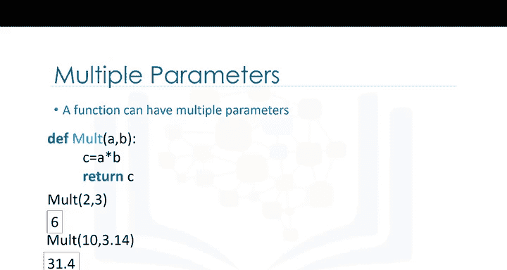

现在我们已经了解了如何使用Python中的函数，接下来看看如何构建我们自己的函数。

我们将从在Python中构建你自己的函数开始。这是一个Python函数的例子，它返回输入值加一的结果。

要定义一个函数，我们以关键字 `def` 开始。函数名应描述其功能。我们在括号内有函数的形式参数 `a`，后面跟着一个冒号。我们有一个带缩进的代码块。在这个例子中，我们将 `a` 加1并赋值给 `b`。然后我们返回或输出 `b` 的值。

定义函数后，我们可以调用它。函数将5加1并返回6。我们可以再次调用该函数，这次将其赋值给变量 `c`，`c` 的值将是11。

让我们进一步探索。当你调用一个函数时，可以这样理解（请注意，这是Python的简化模型，Python底层并非完全如此工作）：我们调用函数并给它输入5。可以认为值5被传递给了函数。现在，运行一系列命令。`a` 的值是5。`b` 将被赋值为6。然后我们返回 `b` 的值，即6。如果我们再次调用该函数，过程重新开始，我们传入8。执行后续操作。上次调用中发生的一切都会再次发生，只是 `a` 的值不同。函数返回一个值，这里是9。再次强调，这只是一个有帮助的类比。

---

## 📝 函数的更多特性

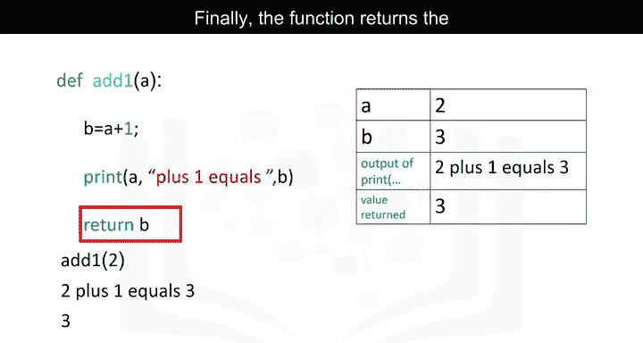

让我们尝试让这个函数更复杂一些。通常在前几行记录函数的功能，这告诉任何使用该函数的人它的作用。这个文档字符串用三引号包围。你可以使用 `help` 命令在函数上显示文档。

一个函数可以有多个参数。例如，函数 `mult` 将两个数字相乘，换句话说，它找到它们的乘积。如果我们传递整数2和3，结果是一个新的整数6。如果我们传递整数10和浮点数3.14，结果是一个浮点数31.4。

如果我们传入整数2和字符串“Michael Jackson”，字符串“Michael Jackson”会被重复两次。这是因为乘法符号也可以表示重复一个序列。如果你不小心用一个整数乘以一个字符串，而不是两个整数相乘，你不会得到错误。相反，你会得到一个字符串，你的程序可能会继续运行，但之后可能会失败，因为你在期望整数的地方得到了一个字符串。这个特性会使编码更简单，但你必须更彻底地测试你的代码。

在许多情况下，函数没有 `return` 语句。在这些情况下，Python将返回特殊的 `None` 对象。实际上，如果你的函数没有 `return` 语句，你可以将其视为函数根本不返回任何内容。例如，函数 `MJ` 只是打印名字“Michael Jackson”。我们调用该函数，它打印“Michael Jackson”。让我们定义一个不执行任何任务的函数 `no_work`。Python不允许函数有空的主体，所以我们可以使用关键字 `pass`，它不做任何事情，但满足非空主体的要求。如果我们调用该函数并打印它，函数返回 `None`。在后台，如果没有调用 `return` 语句，Python会自动返回 `None`。

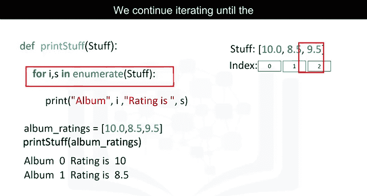

通常函数执行多个任务。这个函数打印一条语句，然后返回一个值。我们可以用这个表格来表示函数被调用时的不同值。我们以输入2调用函数。我们找到 `b` 的值。函数打印带有 `a` 和 `b` 值的语句。最后，函数返回 `b` 的值，在这个例子中是3。

我们可以在函数中使用循环。这个函数打印出列表或元组的值和索引。我们以列表 `album_ratings` 作为输入调用该函数。让我们在右侧显示列表及其对应的索引。`lst` 用作函数 `enumerate` 的输入。这个操作会将索引传递给 `i`，将列表中的值传递给 `rating`。函数将开始遍历循环。函数将打印第一个索引和列表中的第一个值。我们继续遍历循环。`i` 和 `rating` 的值被更新。到达打印语句。类似地，打印列表和索引的下一个值。重复这个过程，直到打印出列表中的最终值。

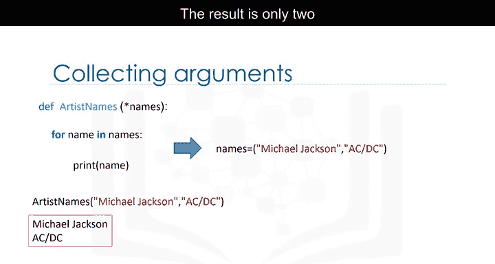

---

## 🌐 变量的作用域

变量的作用域是程序中该变量可被访问的部分。在任何函数外部定义的变量被称为在**全局作用域**内，这意味着在它们被定义后，可以在任何地方访问。

这里我们有一个函数，它将字符串“DC”添加到参数 `x` 中。当我们到达 `x` 的值被设置为“AC”的部分时，这是在全局作用域内，意味着 `x` 在定义后可以在任何地方访问。在全局作用域内定义的变量称为**全局变量**。当我们调用函数时，我们进入一个新的作用域，即 `add_dc` 的作用域。我们传递一个参数给 `add_dc` 函数，在这个例子中是“AC”。在函数的作用域内，`x` 的值被设置为“ACDC”。函数返回值并被赋值给全局作用域内的 `z`。返回值后，函数的作用域被删除。

**局部变量**只存在于函数的作用域内。考虑函数 `thriller`。局部变量 `date` 被设置为1982。当我们调用该函数时，我们创建了一个新的作用域。在该函数的作用域内，`date` 的值被设置为1982。`date` 的值在全局作用域内不存在。

全局作用域内的变量可以与局部作用域内的变量同名而不会冲突。考虑函数 `thriller`。局部变量 `date` 被设置为1982。全局变量 `date` 被设置为2017。当我们调用该函数时，我们创建了一个新的作用域。在该作用域内，`date` 的值被设置为1982。如果我们调用该函数，它返回局部作用域内 `date` 的值，即1982。当我们在全局作用域内打印时，我们使用全局变量的值。变量的全局值是2017。因此，该值被设置为2017。

如果一个变量在函数内没有定义，Python将检查全局作用域。考虑函数 `ACDC`。该函数有一个变量 `rating` 没有赋值。如果我们在全局作用域内定义变量 `rating`，然后调用该函数，Python会看到变量 `rating` 没有值。因此，Python将离开该作用域，并检查变量 `ratings` 是否存在于全局作用域中。它将在 `ACDC` 的作用域内使用全局作用域中 `ratings` 的值。函数将打印出9。全局作用域中 `z` 的值将是10，因为我们加了一。`rating` 的值在全局作用域内将保持不变。

考虑函数 `pink_floyd`。如果我们用关键字 `global` 定义变量 `claimed_sales`，该变量将是一个全局变量。我们调用函数 `pink_floyd`。变量 `claimed_sales` 在全局作用域内被设置为字符串“45 million”。当我们打印该变量时，我们得到的值是“45 million”。

关于函数，你还可以做更多事情，请查看实验部分以获取更多示例。

---

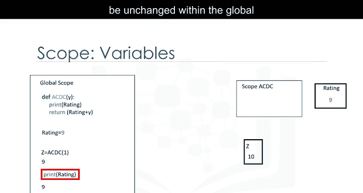

## 📚 总结


在本节课中，我们一起学习了Python函数的核心概念。我们从了解函数的基本定义和工作流程开始，然后探索了Python的内置函数，如 `len()` 和 `sum()`。我们区分了函数（如 `sorted()`）和方法（如 `.sort()`）在行为上的不同。接着，我们深入学习了如何定义自己的函数，包括参数传递、返回值、文档字符串以及函数内部的循环使用。最后，我们探讨了变量的作用域，理解了全局变量和局部变量的区别及其交互规则。掌握这些知识将使你能够编写更模块化、可重用和易于维护的代码。