# 012：Python文件读取操作教程

在本节课中，我们将学习如何使用Python内置的`open`函数创建文件对象，并从TXT文件中获取数据。我们将介绍文件对象的基本操作、读取方法以及最佳实践。

## 概述

我们将使用Python的`open`函数获取文件对象，并对该对象应用方法来读取文件数据。以下是打开文件`example1.txt`的基本步骤。

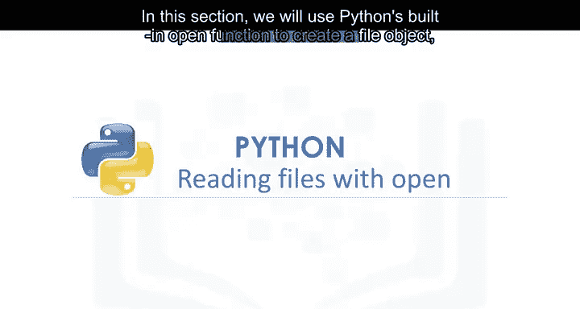

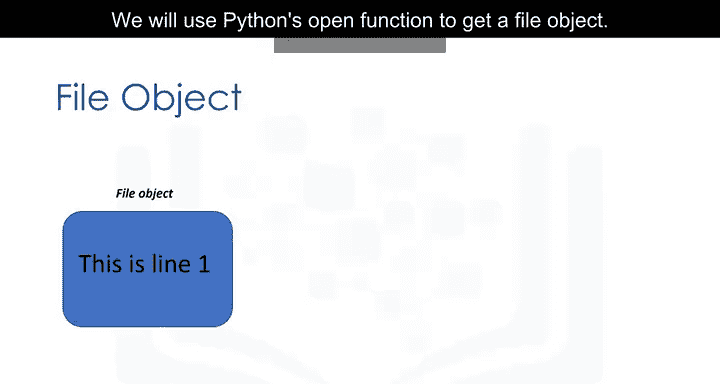

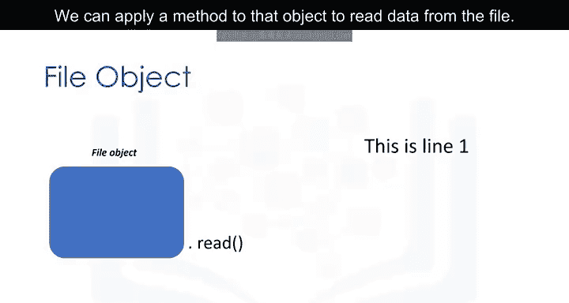

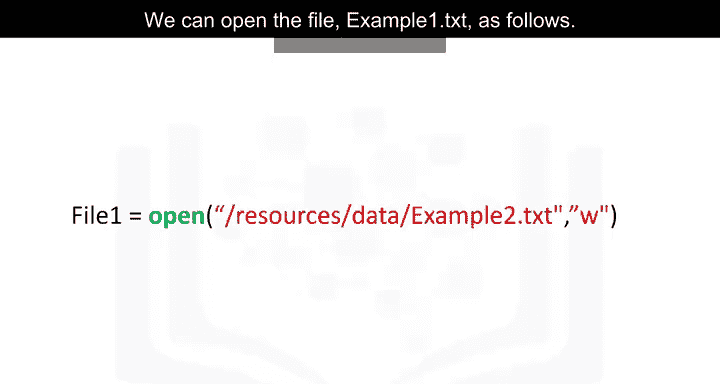

## 使用open函数

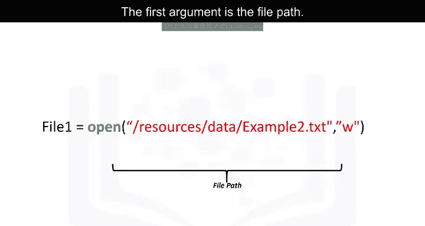

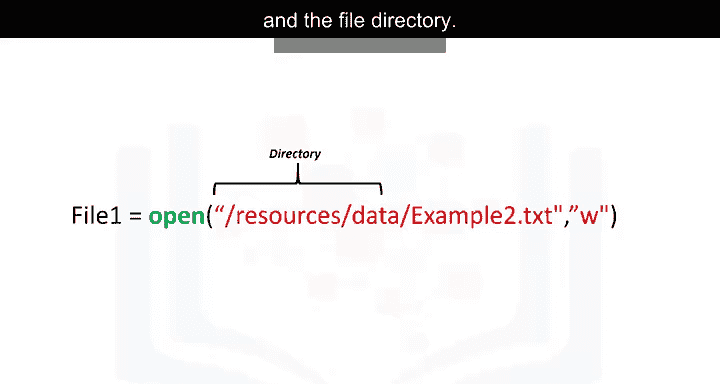

我们使用`open`函数。第一个参数是文件路径，由文件名和文件目录组成。

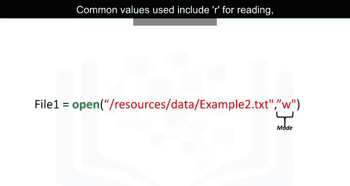

第二个参数是模式。常用值包括`R`用于读取、`W`用于写入和`A`用于追加。我们将使用`R`进行读取。最后，我们获得文件对象。

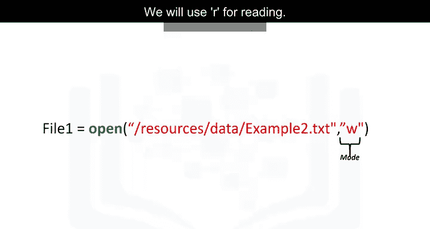

## 获取文件信息

现在我们可以使用文件对象获取文件信息。我们可以使用数据属性`name`获取文件名，结果是一个包含文件名的字符串。我们可以使用数据属性`mode`查看对象的模式，`R`表示读取。应始终使用方法`close`关闭文件对象。

有时这可能很繁琐，因此让我们使用`with`语句。使用`with`语句打开文件是更好的做法，因为它会自动关闭文件。

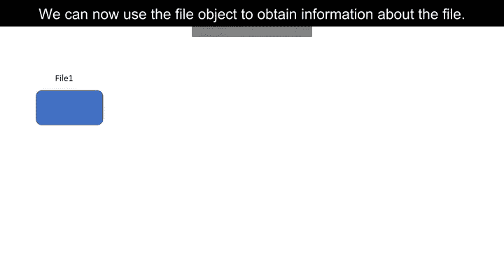

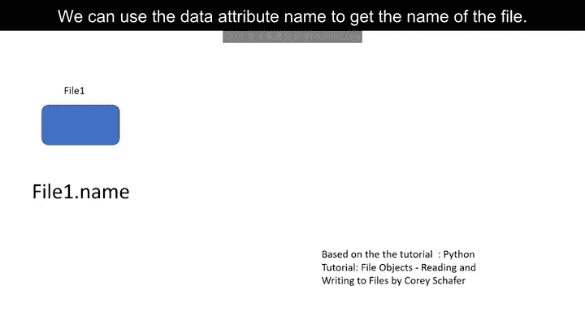

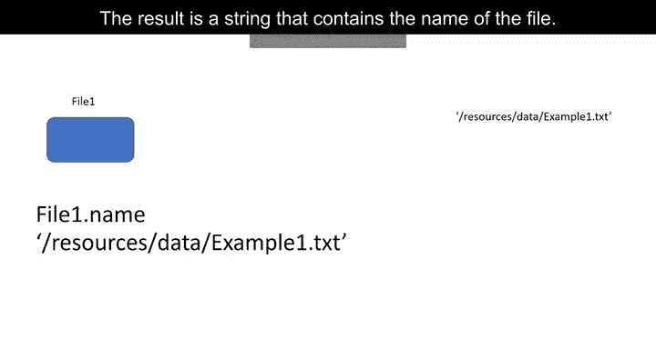

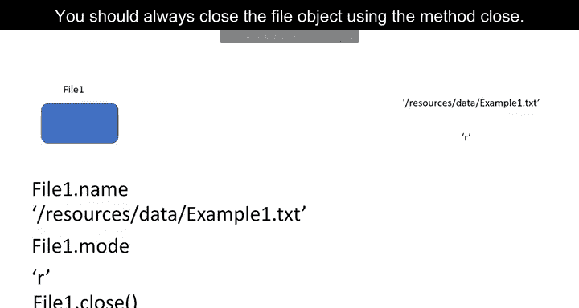

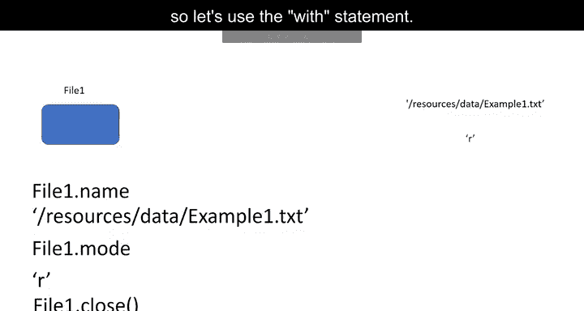

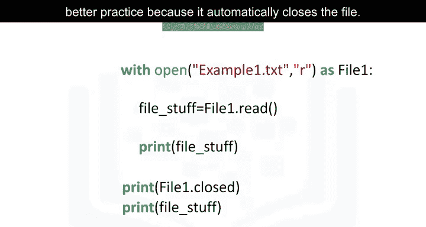

## 使用with语句

代码将运行缩进块中的所有内容，然后关闭文件。此代码读取文件`example1.txt`。我们可以使用文件对象`file1`。代码将执行缩进块中的所有操作，然后在缩进结束时关闭文件。

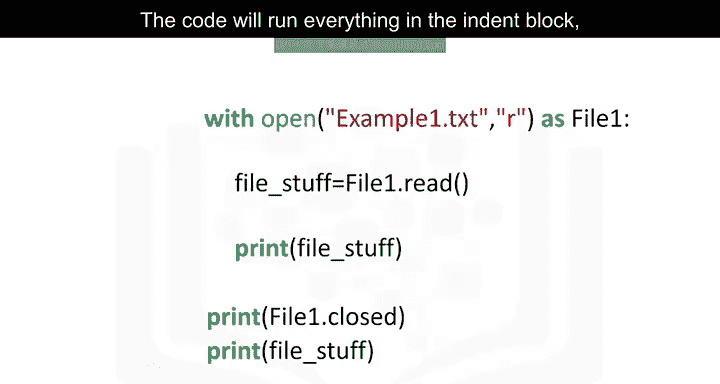

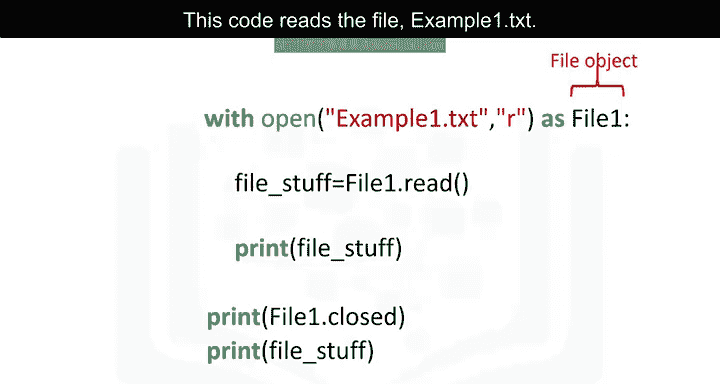

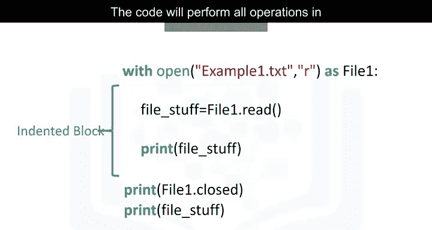

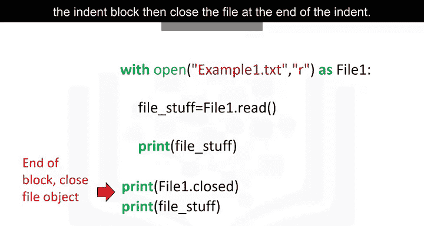

## 读取文件内容

方法`read`将文件的值作为字符串存储在变量`file_stuff`中。可以打印文件内容。可以检查文件是否关闭，但不能在缩进块外读取文件。不过，也可以在缩进块外打印文件内容。

我们可以打印文件内容。我们将看到以下内容。当我们检查原始字符串时，我们将看到`\n`。这是Python知道开始新行的方式。

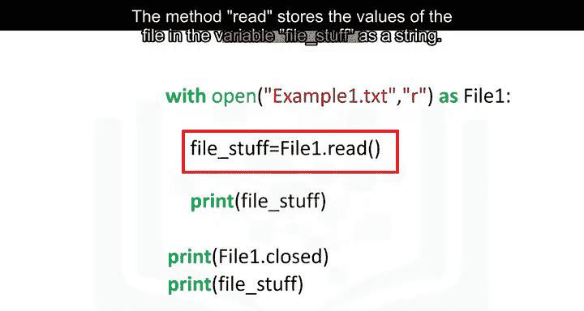

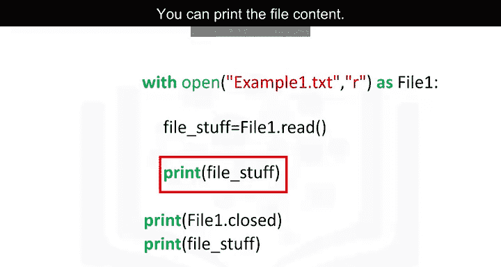

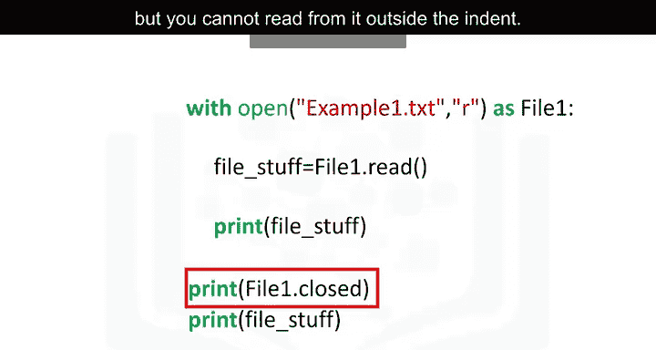

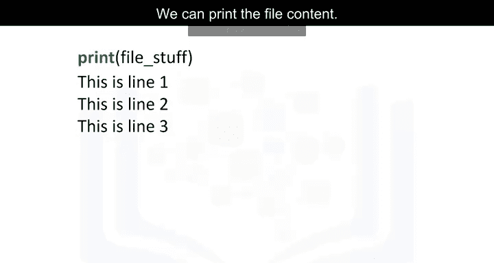

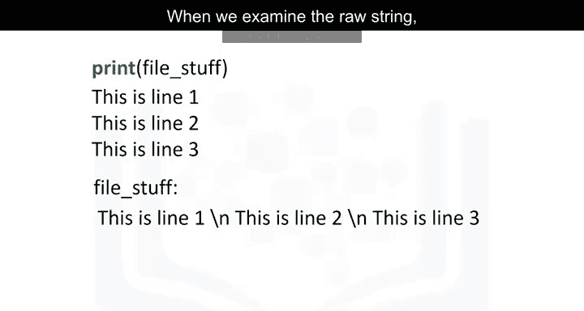

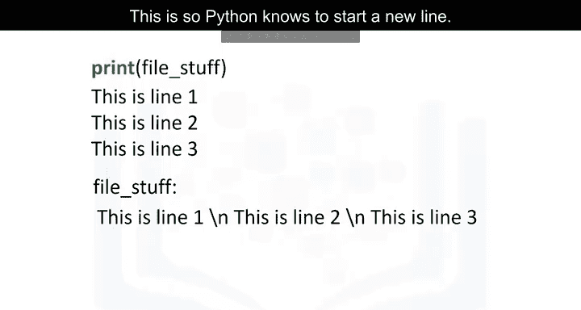

## 使用readlines方法

我们可以使用方法`readlines`将每一行输出为列表中的一个元素。第一行对应列表中的第一个元素，第二行对应列表中的第二个元素，依此类推。

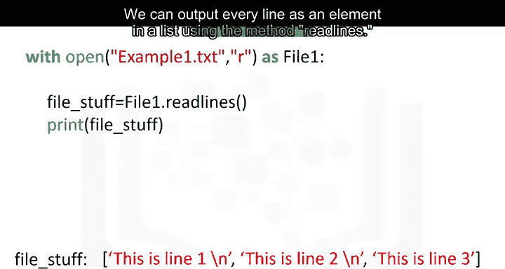

## 使用readline方法

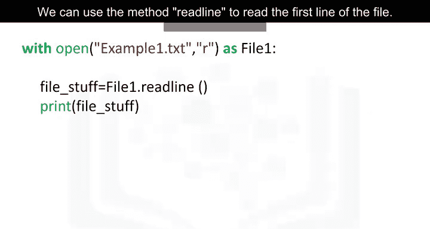

我们可以使用方法`readline`读取文件的第一行。如果运行此命令，它将第一行存储在变量`file_stuff`中，然后打印第一行。

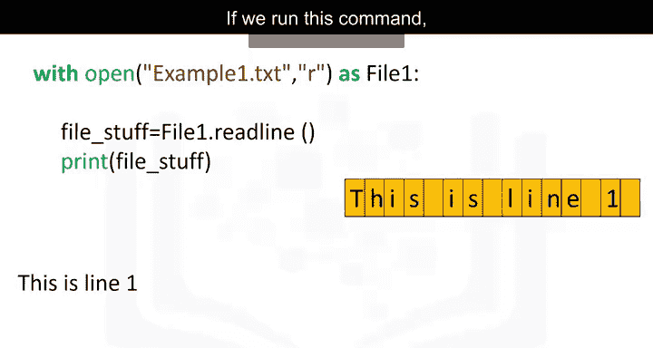

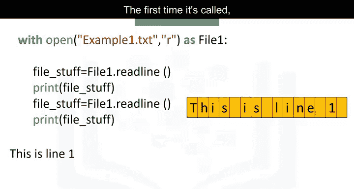

我们可以使用`readline`方法两次。第一次调用时，它将第一行保存在变量`file_stuff`中，然后打印第一行。

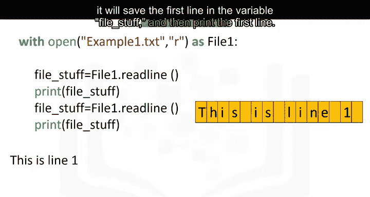

第二次调用时，它将第二行保存在变量`file_stuff`中，然后打印第二行。我们可以使用循环单独打印每一行，如下所示。

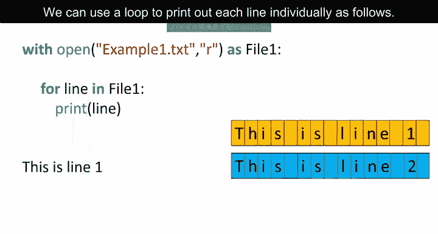

## 指定读取字符数

让我们将字符串中的每个字符表示为一个网格。我们可以指定要从字符串中读取的字符数，作为方法`readlines`的参数。

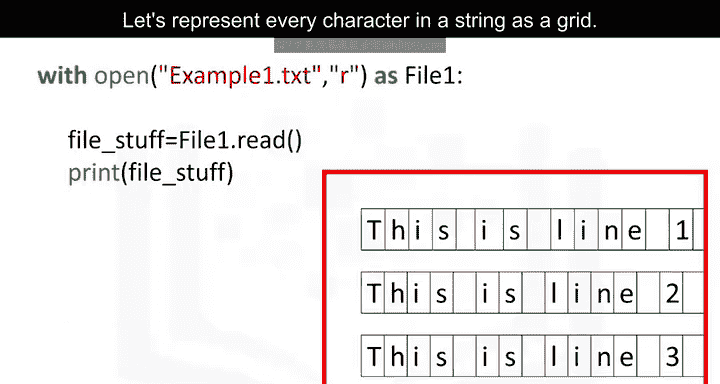

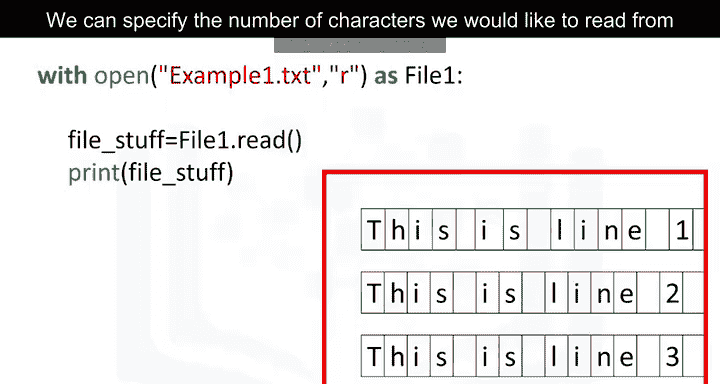

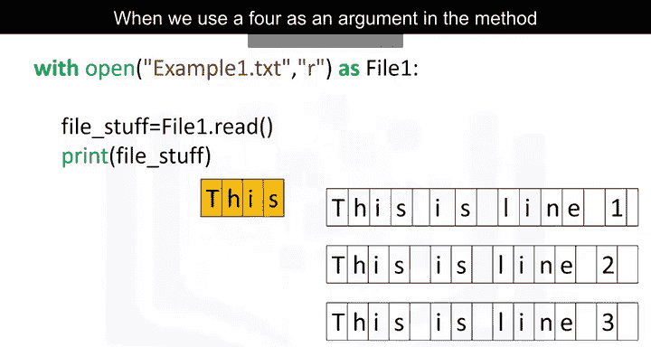

当我们在方法`readlines`中使用参数`4`时，我们打印出文件中的前四个字符。

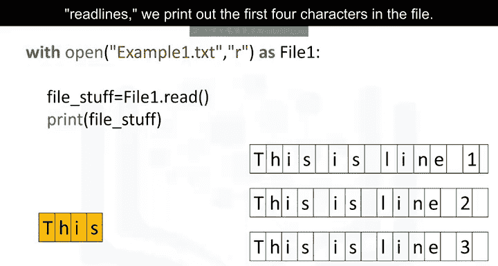

## 逐步读取

每次调用该方法时，我们都会在文本中前进。如果我们使用参数`16`调用该方法，则打印前16个字符，然后换行。如果我们第二次调用该方法，则打印接下来的五个字符。最后，如果我们最后一次调用该方法，参数为`9`，则打印最后9个字符。查看实验以获取更多方法和其他文件类型的示例。😊

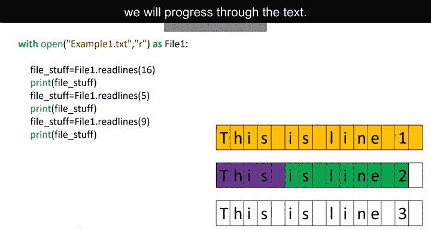

## 总结

在本节课中，我们一起学习了如何使用Python的`open`函数创建文件对象，以及如何通过`read`、`readline`和`readlines`方法读取文件内容。我们还介绍了使用`with`语句自动管理文件关闭的最佳实践，并探讨了如何指定读取字符数以逐步处理文件数据。