# 013：Python文件写入操作

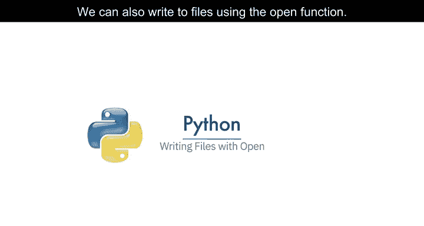

在本节课中，我们将学习如何使用Python的`open()`函数和文件对象来创建新文件、向文件中写入数据，以及如何复制文件内容。掌握文件写入操作是数据持久化存储的基础。

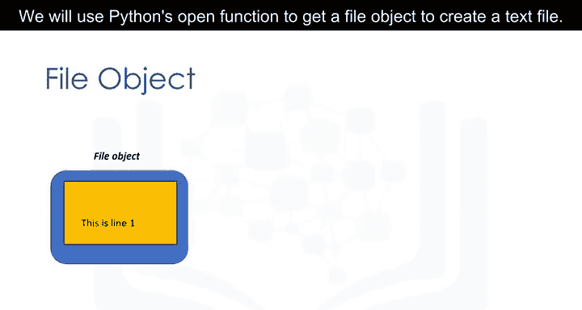

## 使用open()函数写入文件

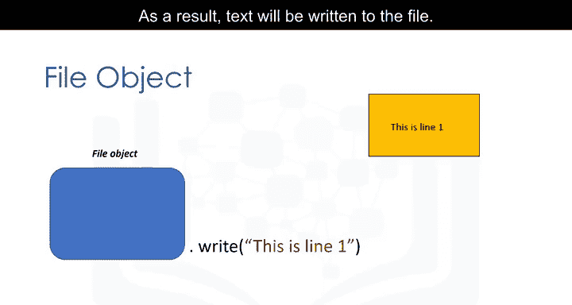

我们可以使用`open()`函数来写入文件。通过该函数获取一个文件对象，然后使用`write()`方法将数据写入文件，最终文本会被保存到文件中。

以下是创建并写入文件的基本步骤：

1.  使用`open()`函数，第一个参数是文件路径（包含文件名）。
2.  如果指定目录下已存在同名文件，它将被覆盖。
3.  将模式参数`mode`设置为`‘w’`，表示写入。
4.  使用`with`语句，确保代码块执行完毕后文件会被正确关闭。

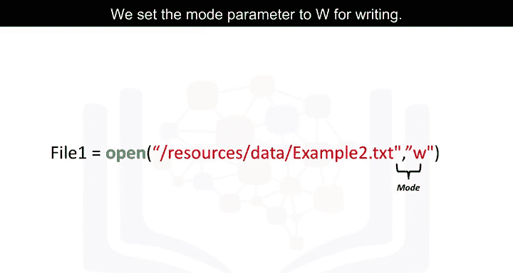

```python
with open(‘example2.txt‘, ‘w‘) as file1:
    file1.write(“This is a test.\n”)
```

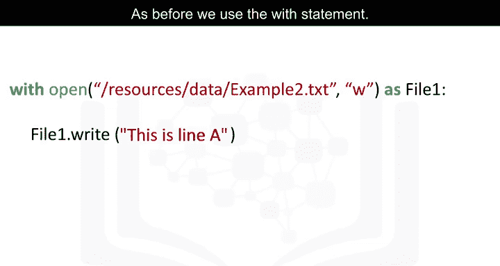

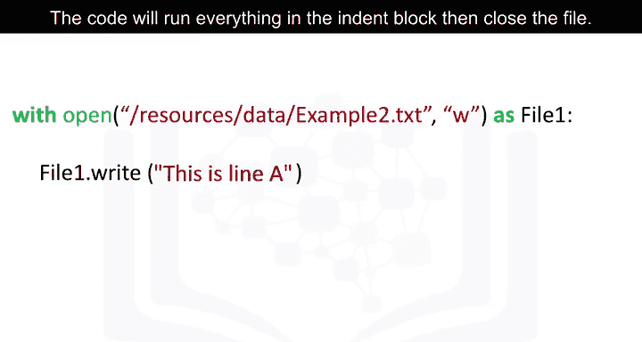

上面的代码会在当前目录下创建一个名为`example2.txt`的文件，并向其中写入一行文本“This is a test.”，`\n`表示换行。

## 连续写入与列表写入

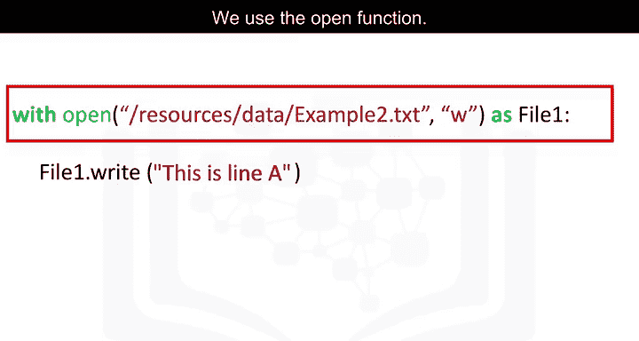

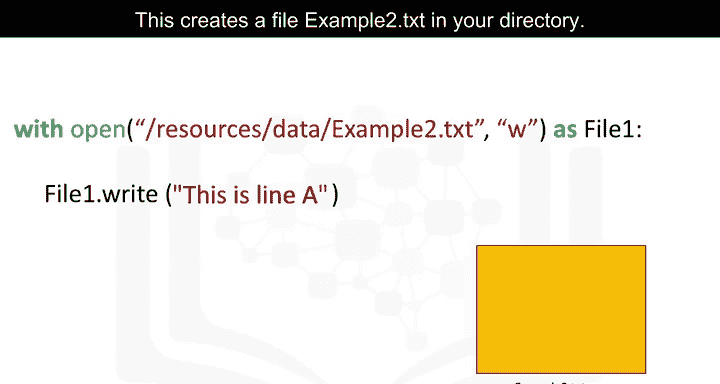

如果我们连续多次调用`write()`方法，每次调用都会向文件中追加内容。

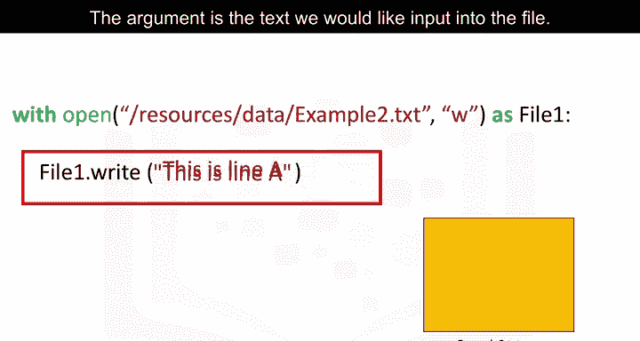

```python
with open(‘example2.txt‘, ‘w‘) as file1:
    file1.write(“This is line A\n”)
    file1.write(“This is line B\n”)
```

这段代码会先写入“This is line A”，然后在新的一行写入“This is line B”。

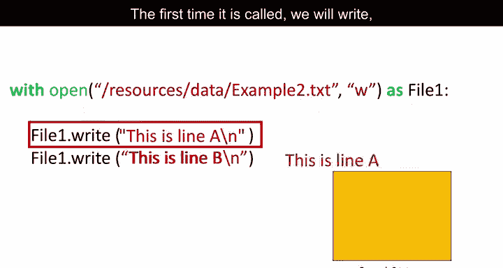

我们也可以将一个列表中的每个元素写入文件。上一节我们介绍了基本的写入操作，本节中我们来看看如何批量写入数据。


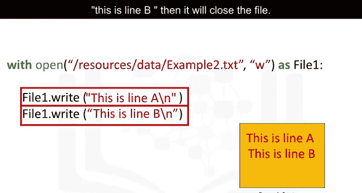

以下是具体方法：

```python
lines = [“Line 1\n”, “Line 2\n”, “Line 3\n”]
with open(‘example2.txt‘, ‘w‘) as file1:
    for line in lines:
        file1.write(line)
```

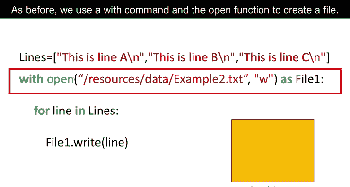

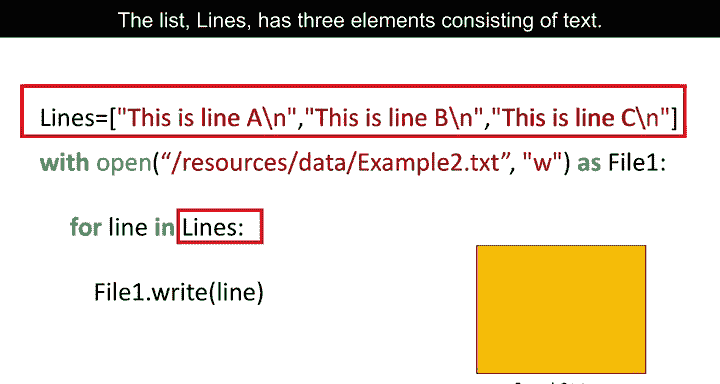

首先，我们使用`with`命令和`open()`函数创建一个文件。列表`lines`包含三个文本元素。然后，我们使用`for`循环读取列表`lines`的每个元素，并将其赋值给变量`line`。

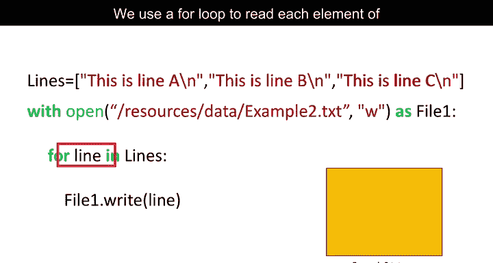

*   循环的第一次迭代将列表的第一个元素写入文件。
*   第二次迭代写入第二个元素，依此类推。
*   循环结束时，文件会自动关闭。

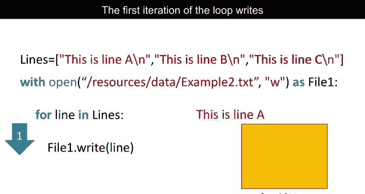

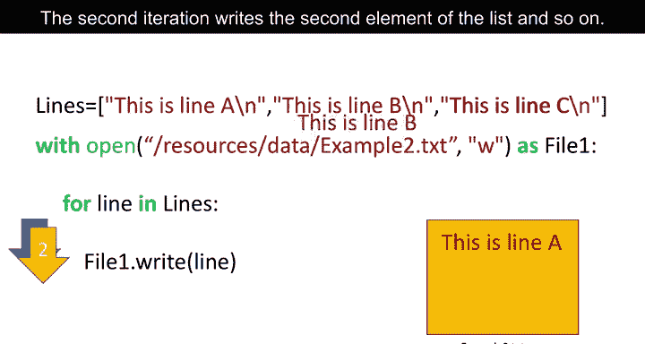

## 追加模式与文件复制

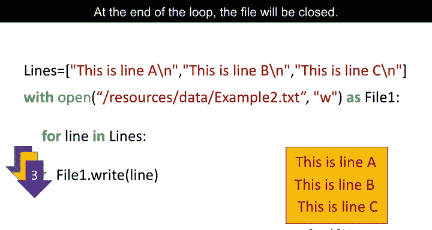

除了覆盖写入(`‘w‘`)，我们还可以将模式设置为追加(`‘a‘`)。这不会创建新文件，而是在现有文件末尾添加内容。

```python
with open(‘example2.txt‘, ‘a‘) as file1:
    file1.write(“This is line C\n”)
```

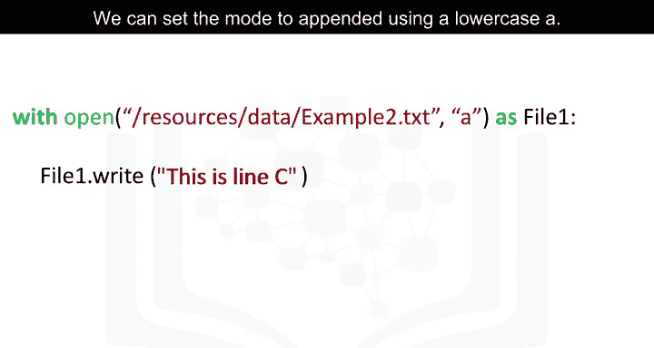

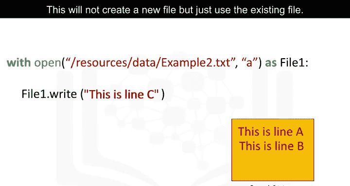

这段代码会打开已存在的`example2.txt`文件，在文件末尾追加一行“This is line C”，然后关闭文件。

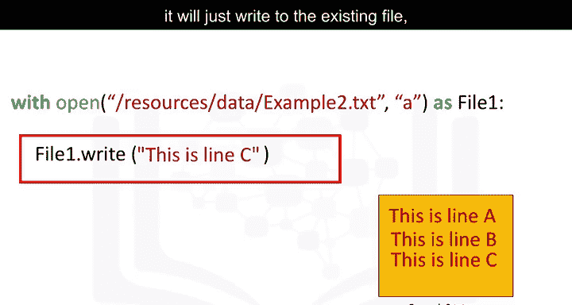

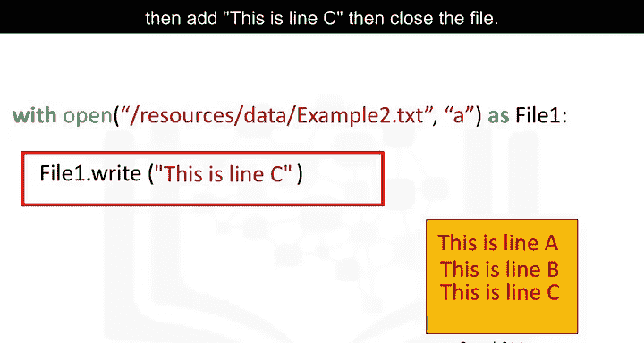

我们还可以将一个文件的内容复制到另一个新文件中。

1.  首先，读取源文件`example1.txt`，通过文件对象`read_file`与其交互。
2.  然后，创建一个新文件`example3.txt`，使用文件对象`write_file`与其交互。

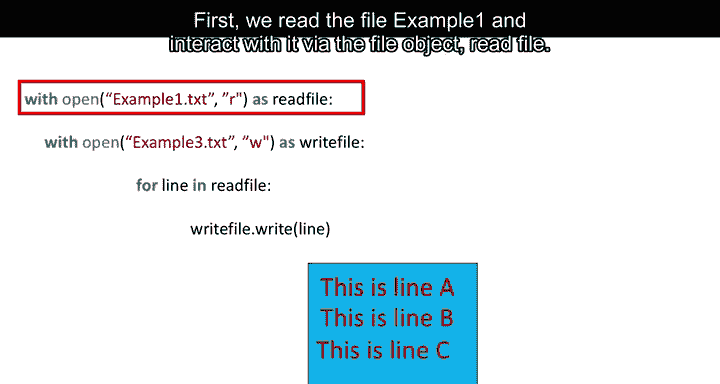

```python
with open(‘example1.txt‘, ‘r‘) as read_file:
    with open(‘example3.txt‘, ‘w‘) as write_file:
        for line in read_file:
            write_file.write(line)
```

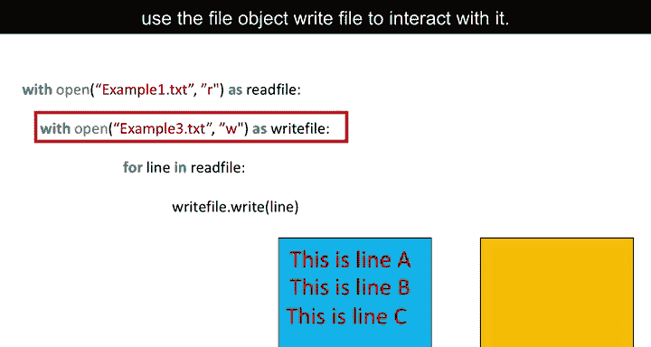

`for`循环从文件对象`read_file`中逐行读取内容，并使用文件对象`write_file`将其存储到`example3.txt`文件中。

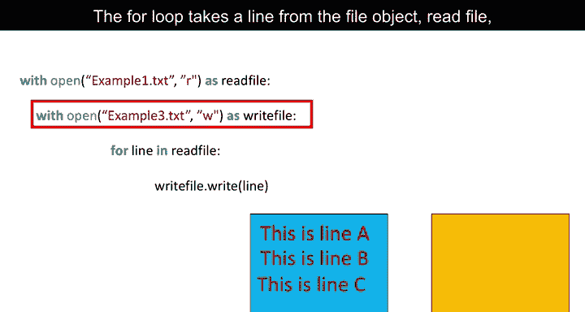

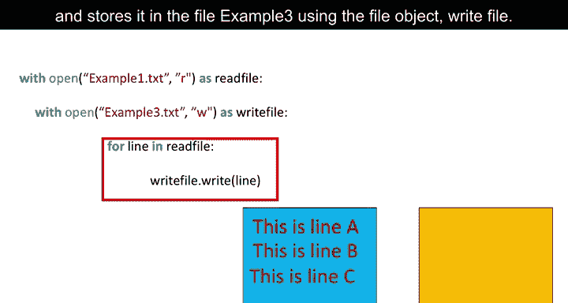

*   第一次迭代复制第一行。
*   第二次迭代复制第二行，直到读取到文件末尾。
*   最后，两个文件都会被关闭。

## 总结

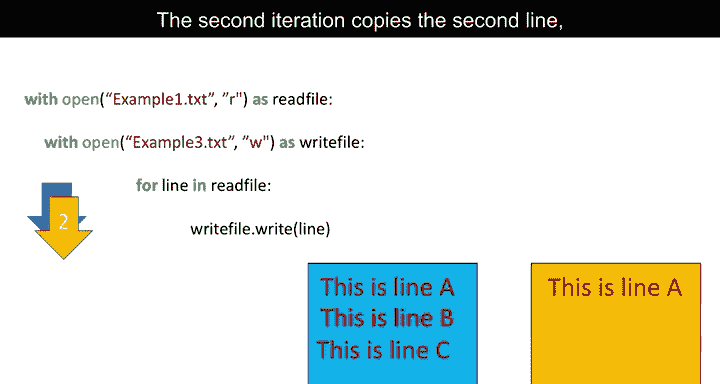

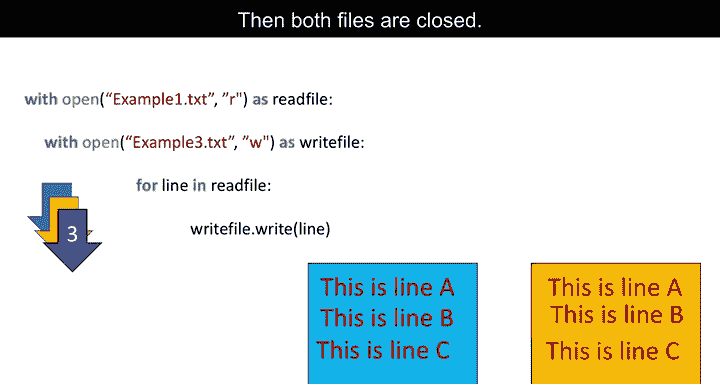

本节课中我们一起学习了Python的文件写入操作。我们掌握了如何使用`open()`函数在`‘w‘`（写入）和`‘a‘`（追加）模式下操作文件，如何使用`write()`方法写入字符串或列表内容，以及如何实现一个文件到另一个文件的复制。请查阅相关实验练习以获取更多示例。