# 014：Python应用于数据科学、AI与开发 - P14 📊 使用Pandas加载数据

在本节课中，我们将学习如何使用Python的Pandas库来加载和处理数据。Pandas是一个强大的数据分析工具，能够帮助我们高效地读取、操作和分析各种格式的数据文件。

---


## 什么是依赖库或库？📚


依赖库或库是预先编写好的代码，用于帮助解决特定问题。在本视频中，我们将介绍Pandas，这是一个用于数据分析的流行库。

---

## 导入Pandas库 🚀

我们可以使用以下命令导入Pandas库或依赖项。我们以`import`命令开始，后跟库的名称。

```python
import pandas
```

现在，我们可以访问大量预构建的类和函数。这假设该库已安装在我们的实验环境中。所有必要的库都已安装。

---

## 加载CSV文件 📄

假设我们想使用Pandas的内置函数`read_csv`来加载一个CSV文件。CSV是一种用于存储数据的典型文件类型。我们只需输入单词`pandas`，然后是一个点号，以及带有所有输入参数的函数名称。

```python
pandas.read_csv('file_path.csv')
```


频繁输入`pandas`可能会很繁琐。我们可以使用`as`语句来缩短库的名称。在这种情况下，我们使用标准缩写`pd`。

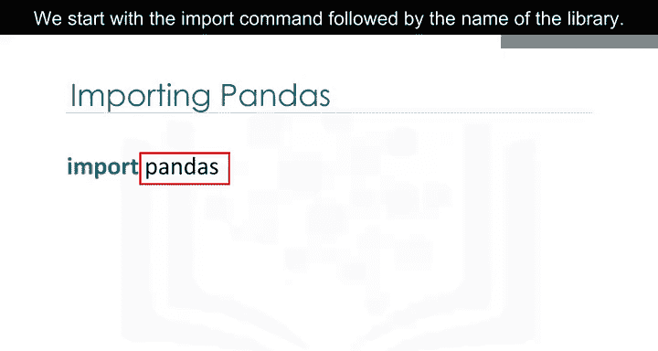

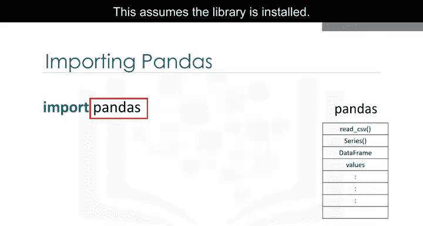

```python
import pandas as pd
```

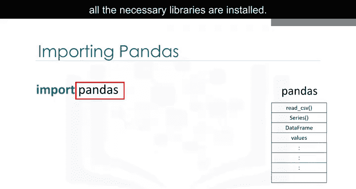

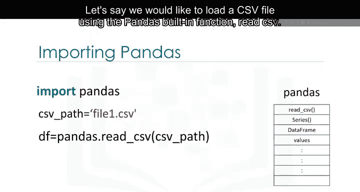

现在，我们输入`pd`和一个点号，后跟我们想要使用的函数名称。在本例中，是`read_csv`。

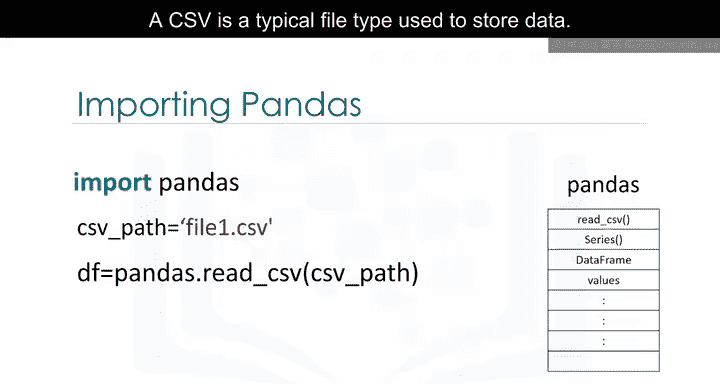

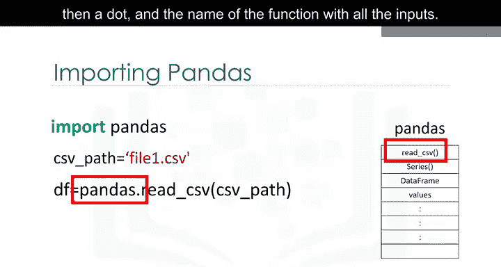

```python
pd.read_csv('file_path.csv')
```

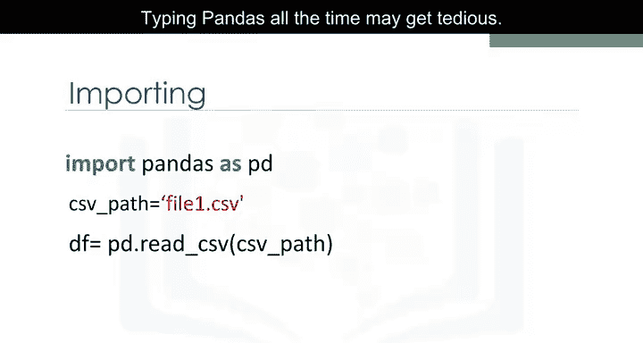

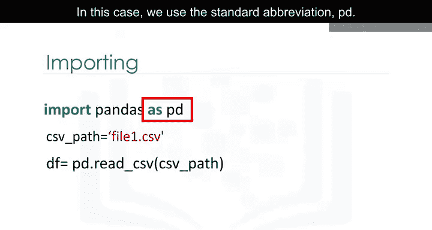

我们不仅限于缩写`pd`。例如，我们可以使用术语`banana`，但为了保持一致性，在本视频的其余部分我们将坚持使用`pd`。

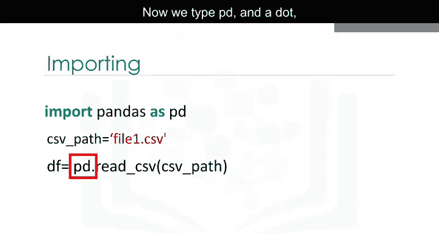

---

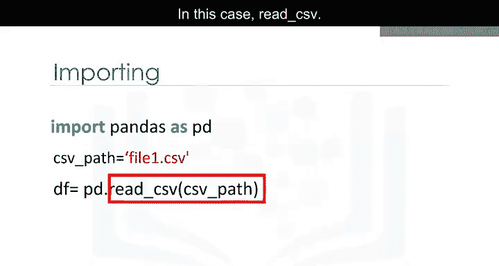

## 深入理解代码 🧐

Pandas允许您通过**数据框（DataFrame）**来处理数据。让我们详细了解一下从CSV文件到数据框的过程。

```python
path = 'file_path.csv'
df = pd.read_csv(path)
```

变量`path`存储CSV文件的路径。它被用作`read_csv`函数的参数。结果存储在变量`df`中，这是数据框（DataFrame）的缩写。

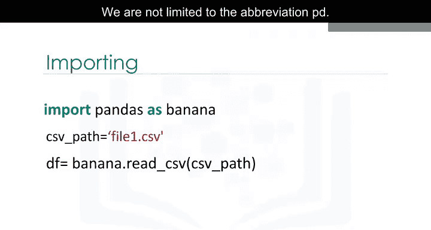

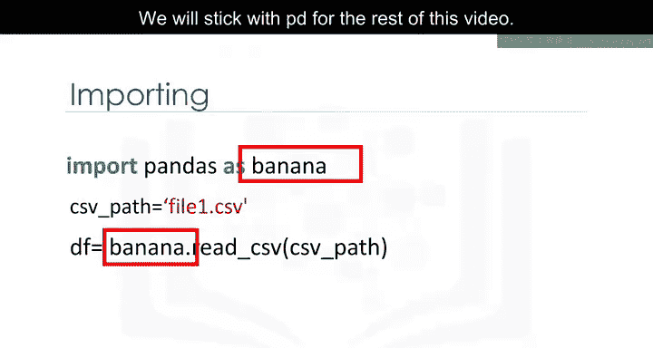

---


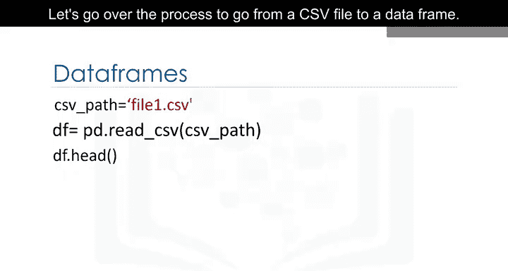

## 查看数据框内容 👀

现在我们已经将数据加载到数据框中，可以开始处理它。我们可以使用`head`方法来检查数据框的前五行。

```python
df.head()
```

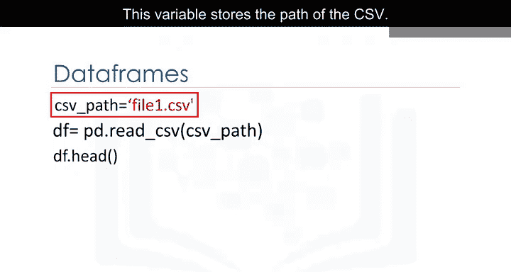

---

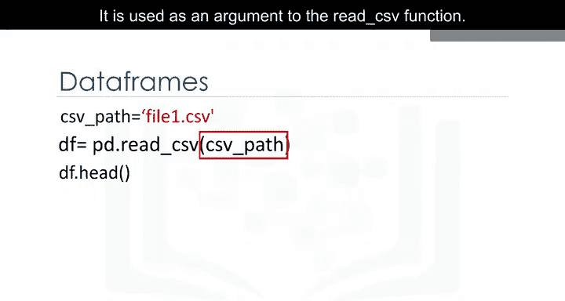

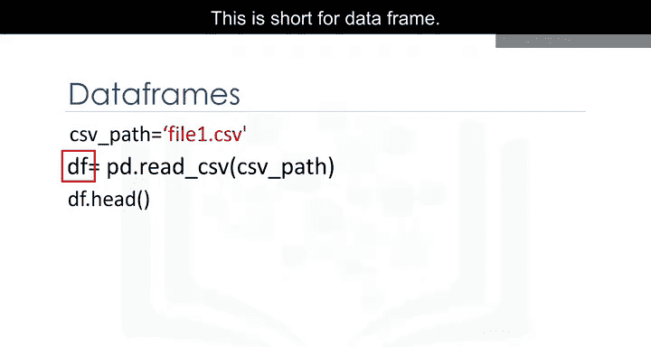

## 加载Excel文件 📊

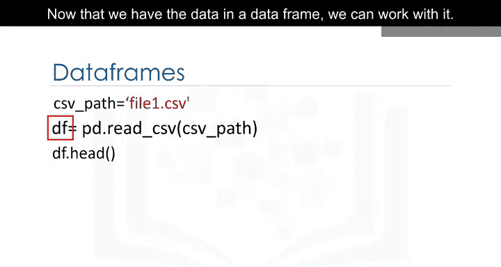

加载Excel文件的过程类似。我们使用Excel文件的路径和函数`read_excel`。结果也是一个数据框。

```python
path = 'file_path.xlsx'
df = pd.read_excel(path)
```

---

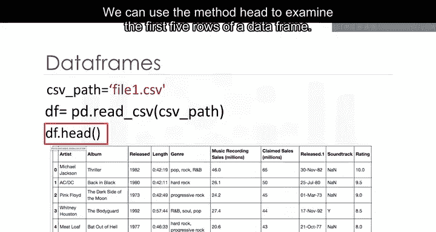

## 从字典创建数据框 🗂️

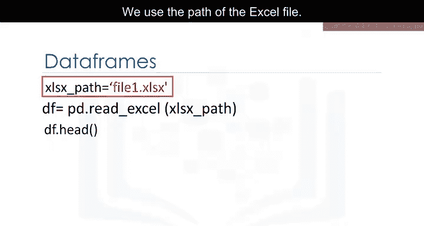

数据框由行和列组成。我们可以从字典创建数据框。字典的键对应列标签，值是列表，对应行数据。

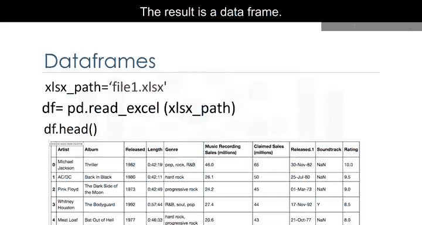

```python
data = {
    'Column1': [1, 2, 3],
    'Column2': ['A', 'B', 'C']
}
df = pd.DataFrame(data)
```

然后，我们使用`DataFrame`函数将字典转换为数据框。我们可以直接看到表格与字典之间的对应关系：键对应表头，值是对应行的列表。

---

## 选择数据框的列 🔍

我们可以创建一个由单列组成的新数据框。只需输入数据框名称（在本例中为`df`）和用双括号括起来的列标题名称。

```python
new_df = df[['Column1']]
```

结果是一个由原始列组成的新数据框。

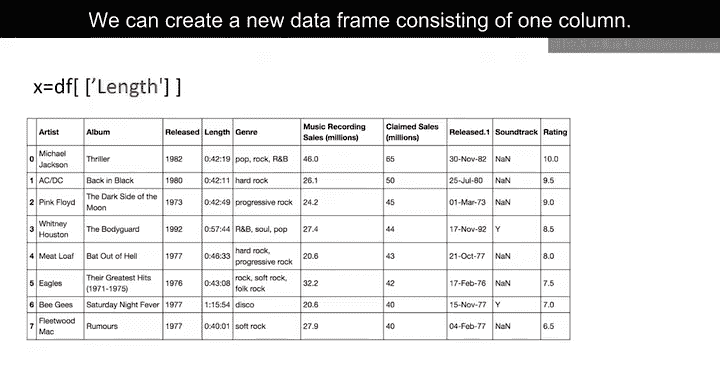

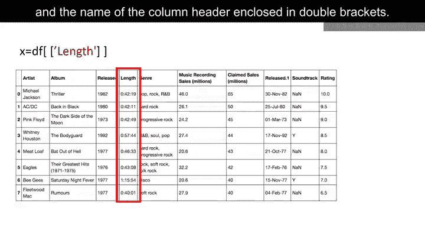

您也可以对多列执行相同的操作。只需输入数据框名称（在本例中为`df`）和用双括号括起来的多个列标题名称。

```python
new_df = df[['Column1', 'Column2']]
```

结果是一个由指定列组成的新数据框。

---


## 总结 📝

在本节课中，我们一起学习了如何使用Pandas库加载和处理数据。我们介绍了如何导入Pandas、加载CSV和Excel文件、从字典创建数据框，以及如何选择和查看数据框的特定列。掌握这些基本操作是进行数据分析和处理的重要第一步。