# 015：Pandas数据处理与保存

在本节课中，我们将学习如何使用Pandas库对DataFrame进行数据处理，包括查找唯一值、基于条件筛选数据，以及将处理后的数据保存为不同格式的文件。


---

## 🧮 查找唯一值

上一节我们介绍了DataFrame的基本结构，本节中我们来看看如何识别数据中的唯一值。

考虑一堆由13个不同颜色方块组成的积木。我们可以看到共有三种独特的颜色。


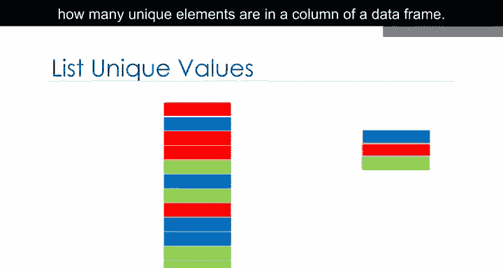

假设你想找出DataFrame某一列中有多少个唯一元素。当数据量从13个元素增加到数百万时，手动识别会变得非常困难。


Pandas提供了`unique`方法来确定DataFrame某一列中的唯一元素。


假设我们想确定数据集中专辑发行年份的唯一值。

我们输入DataFrame的名称，然后在方括号内输入列名`released`。接着我们应用`unique`方法。结果就是`released`列中的所有唯一元素。


以下是具体操作步骤：

1.  使用`df['column_name']`语法选择目标列。
2.  对该列应用`.unique()`方法。

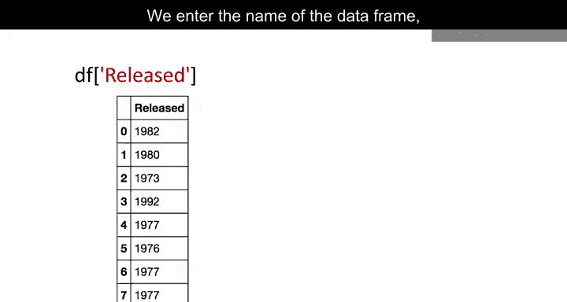

```python
unique_years = df['released'].unique()
```

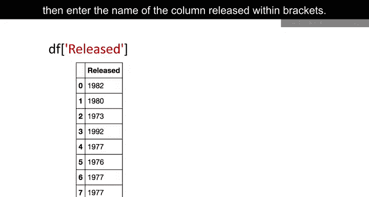

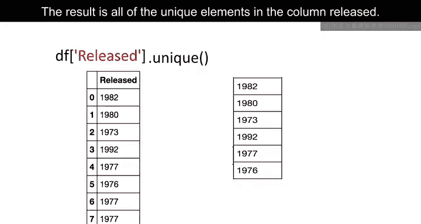

---

## 🔍 基于条件筛选数据

了解了如何查找唯一值后，我们来看看如何根据特定条件筛选出我们感兴趣的数据行。

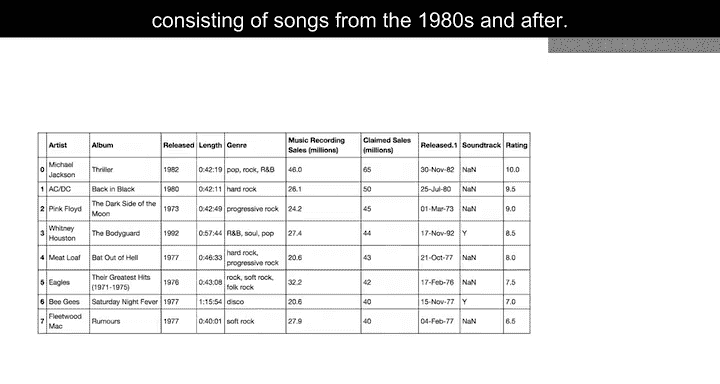

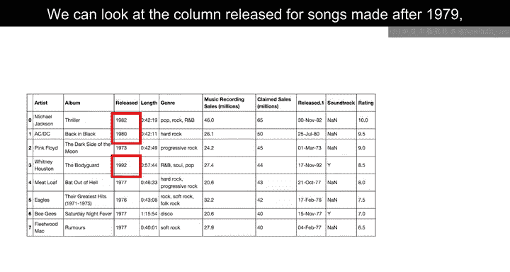

假设我们想创建一个仅包含1980年代歌曲的新数据库。我们可以先查看`released`列中发行年份晚于1979年的歌曲，然后选择对应的数据行。

我们可以在Pandas中用一行代码完成这个操作，但让我们先分解步骤。

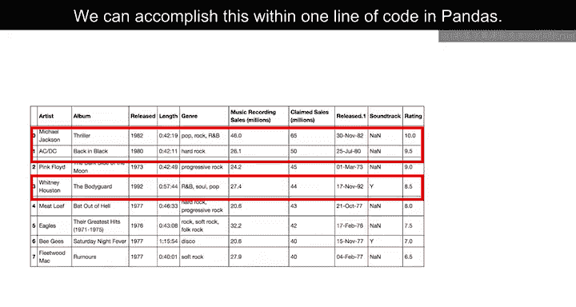

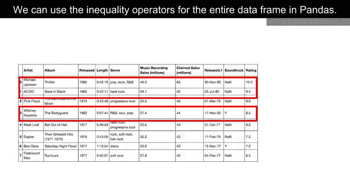

我们可以对Pandas中的整个DataFrame使用不等式运算符。结果是一个布尔值序列。在我们的案例中，我们只需指定`released`列以及“晚于1979年”的不等式条件。结果是一个布尔值序列，当条件为真时结果为True，否则为False。

我们可以在一行代码中选择指定的列。我们只需使用DataFrame的名称，然后在方括号内放入前面提到的不等式条件，并将其赋值给变量`DF1`。现在我们就得到了一个新的DataFrame，其中每张专辑的发行年份都晚于1979年。

以下是实现筛选的步骤：

1.  创建布尔条件序列。
2.  使用该条件对DataFrame进行索引。

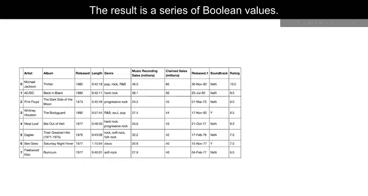

```python
# 步骤分解
condition = df['released'] > 1979
DF1 = df[condition]

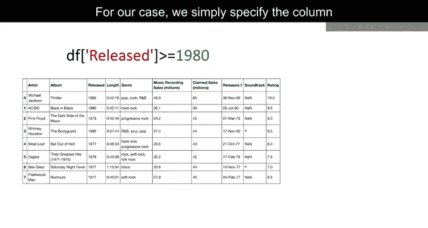

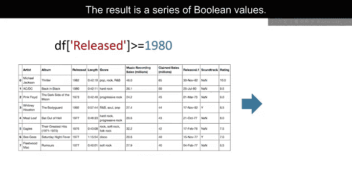

# 或一行代码完成
DF1 = df[df['released'] > 1979]
```

---

## 💾 保存数据

筛选出所需数据后，最后一步是将结果保存下来，以便后续使用或分享。

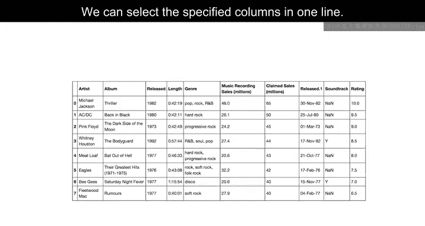

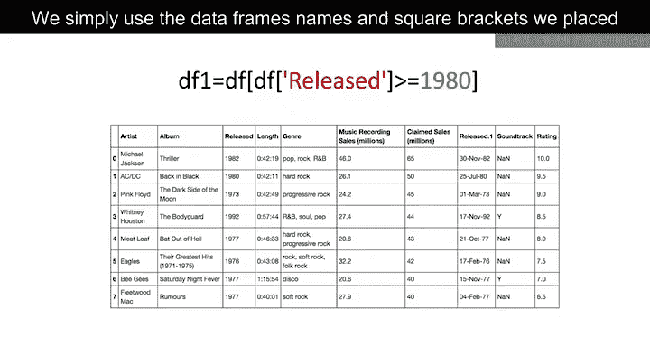

我们可以使用`to_csv`方法保存新的DataFrame。参数是CSV文件的名称。请确保包含`.csv`扩展名。还有其他函数可以将DataFrame保存为其他格式。

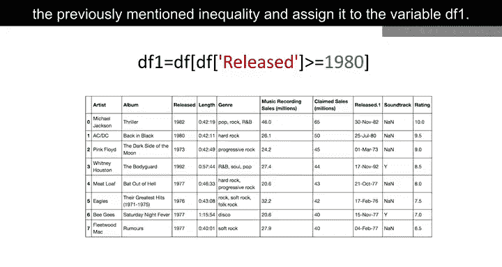

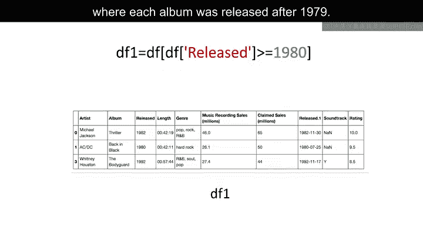

以下是保存数据的基本语法：

```python
DF1.to_csv('new_songs_after_1979.csv')
```

---

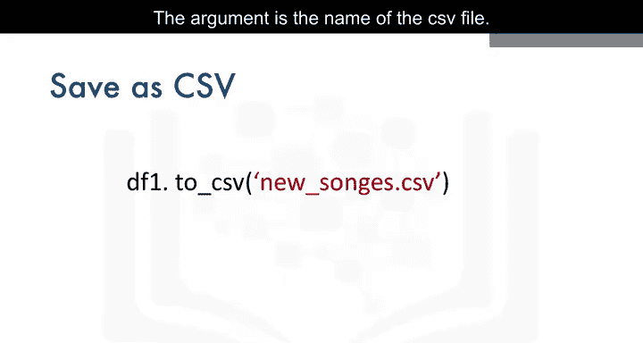


## 📝 课程总结


本节课中我们一起学习了Pandas数据处理与保存的核心操作。我们首先使用`.unique()`方法查找了数据列中的唯一值。接着，我们通过创建布尔条件并应用该条件进行索引，实现了基于特定条件（如年份）的数据筛选。最后，我们使用`.to_csv()`方法将处理后的DataFrame保存为CSV文件，以便持久化存储分析结果。这些技能是数据清洗和预处理的基础。