# 018：简单API使用（上）🚀

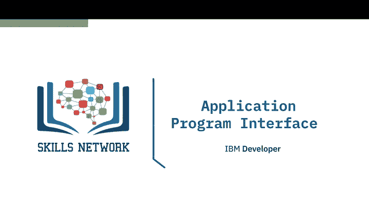

在本节课中，我们将要学习应用程序接口，简称API。我们将讨论API是什么、API库、REST API（包括请求和响应），并通过一个使用PyCoinGecko库的加密货币数据获取示例来加深理解。

## 什么是API？🤔

API让两个软件组件能够相互通信。例如，你有一个程序、一些数据以及其他软件组件。你可以通过API，利用输入和输出来与其他软件进行通信。就像调用函数一样，你无需了解API内部如何工作，只需知道其输入和输出即可。

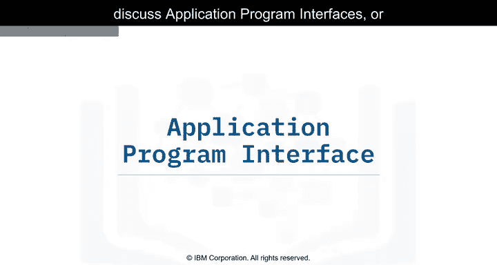

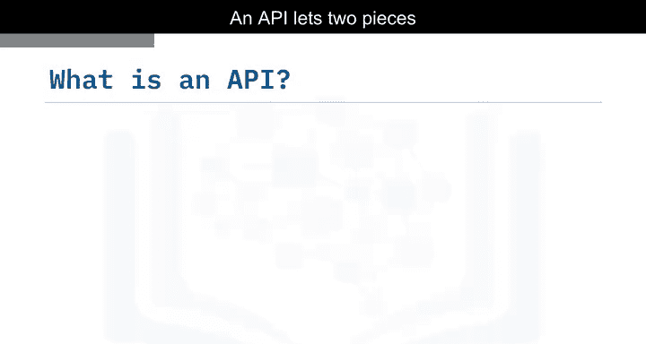

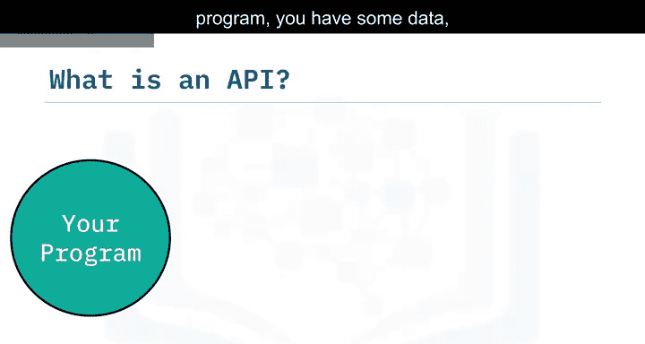

Pandas库实际上就是一组软件组件，其中许多甚至不是用Python编写的。当你有一些数据时，你可以使用Pandas API与其他软件组件通信来处理这些数据。

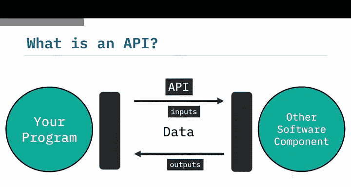

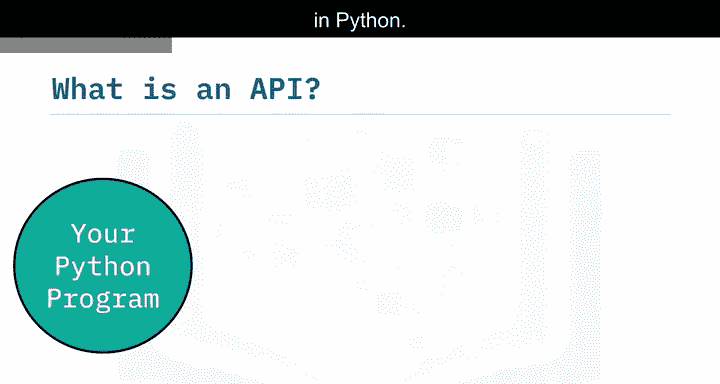

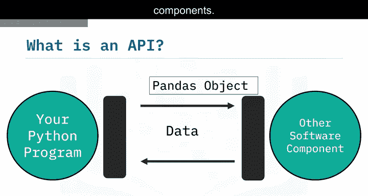

## API库与实例

让我们通过一个更清晰的图示来理解。当你创建一个字典，然后使用`DataFrame`构造函数创建一个Pandas对象时，在API术语中，这被称为创建一个**实例**。字典中的数据被传递给Pandas API。然后，你可以使用这个`DataFrame`对象与API进行通信。

以下是具体过程：
*   当你调用`.head()`方法时，`DataFrame`会与API通信，并显示数据的前几行。
*   当你调用`.mean()`方法时，API会计算平均值并返回结果。

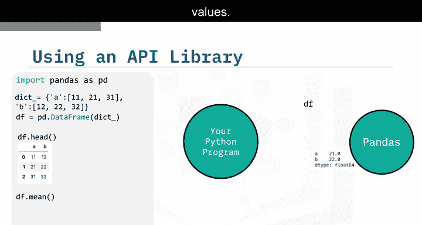

## REST API简介 🌐

REST API是另一种流行的API类型。它允许你通过互联网进行通信，从而利用远程资源，如存储空间、更多数据、人工智能算法等。REST代表“表述性状态转移”。

在REST API中，你的程序被称为**客户端**。API通过互联网与你调用的**Web服务**进行通信。通信、输入（或称**请求**）和输出（或称**响应**）都遵循一套规则。

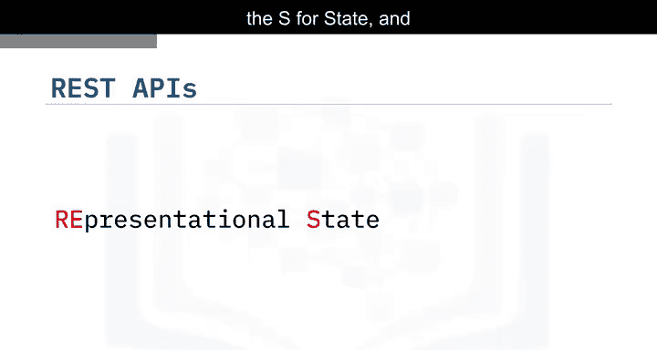

以下是REST API中的一些常见术语：
*   **客户端**：指你或你的代码。
*   **资源**：指Web服务。
*   **端点**：客户端通过它来找到服务（我们将在下一节详细讨论）。
*   **请求**：客户端发送给资源的信息。
*   **响应**：资源返回给客户端的信息。

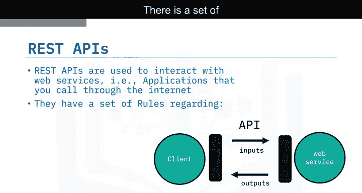

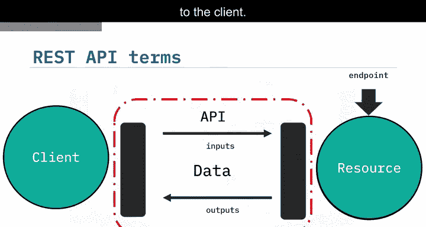

## HTTP方法与通信过程

HTTP方法是在互联网上传输数据的一种方式。我们通过发送**请求**来告诉REST API要做什么。请求通常通过HTTP消息进行通信，该消息通常包含一个JSON文件，其中包含我们希望服务执行的操作指令。

这些指令通过互联网传输到Web服务，服务执行相应操作。类似地，Web服务通过HTTP消息返回**响应**，信息通常也以JSON文件的形式返回，并传输回客户端。

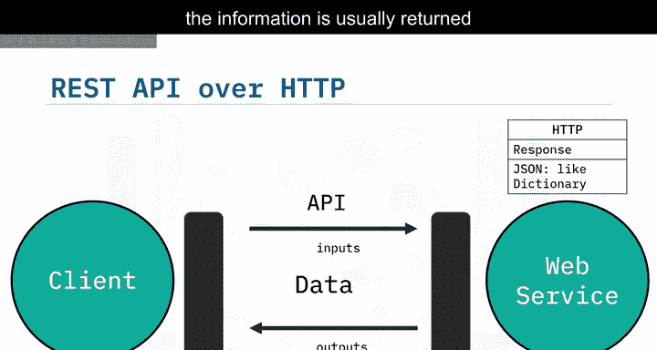

## 实战示例：使用PyCoinGecko API获取加密货币数据 💹

加密货币数据非常适合用于API实践，因为它不断更新，并且对加密货币交易至关重要。我们将使用PyCoinGecko这个Python客户端（或称包装器）来访问CoinGecko API，该API由CoinGecko每分钟更新一次。使用包装器是因为它更易于使用，让你能专注于数据收集任务。

我们还将介绍Pandas的时间序列函数，用于处理时间序列数据。

使用PyCoinGecko收集数据非常简单，只需三步：
1.  安装并导入库。
2.  创建一个客户端对象。
3.  使用函数请求数据。

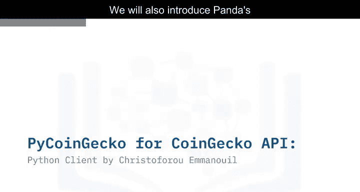

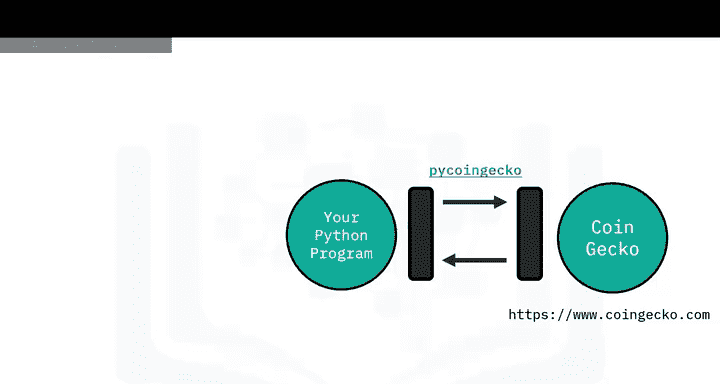

例如，以下代码获取比特币过去30天以美元计价的数据：
```python
# 示例：获取比特币过去30天的数据
from pycoingecko import CoinGeckoAPI
cg = CoinGeckoAPI()
bitcoin_data = cg.get_coin_market_chart_by_id(id='bitcoin', vs_currency='usd', days=30)
```
在这种情况下，响应是一个JSON文件，在Python中表现为一个嵌套列表的字典，其中包含价格、市值和总交易量等数据，这些数据又包含Unix时间戳和对应时间点的价格。

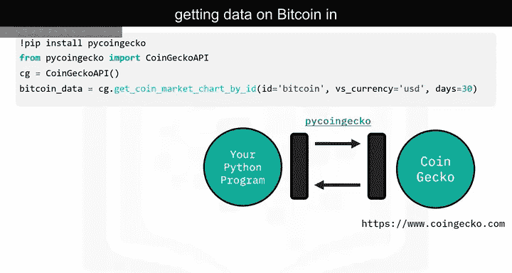

我们只对价格数据感兴趣，因此使用键`‘price’`来选取它。为了简化操作，我们可以将这个嵌套列表转换为一个包含`‘timestamp’`和`‘price’`两列的DataFrame。

`‘timestamp’`列的时间格式难以理解，我们将使用Pandas的`to_datetime`函数将其转换为更易读的格式。使用此函数，我们创建了可读的时间数据。输入是时间戳列，时间单位设置为毫秒。我们将输出附加到新的`‘date’`列。

现在，我们想创建一个K线图。为了获取每日K线所需的数据，我们将按日期分组，以找出每天的最低、最高、开盘（第一个）和收盘（最后一个）价格。最后，我们将使用Plotly库创建K线图并进行绘制。

现在，我们可以通过打开生成的HTML文件，并在浏览器标签页顶部点击“信任HTML”来查看K线图，它看起来应该类似这样。

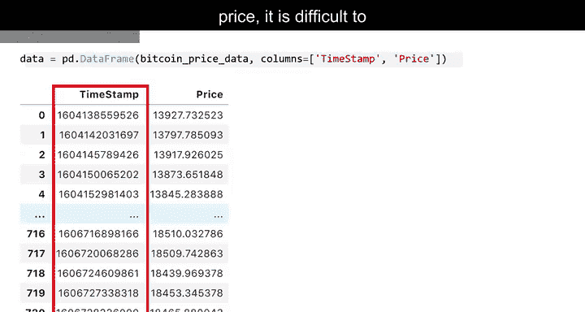

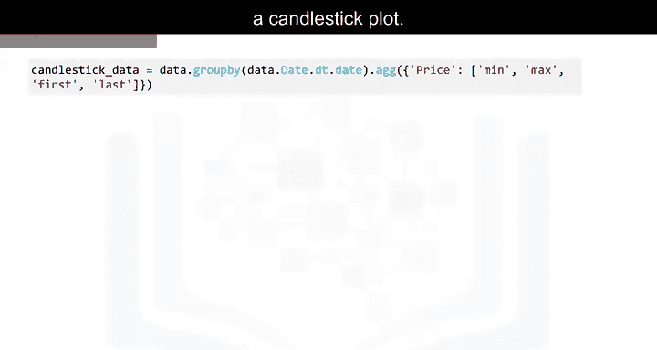

---

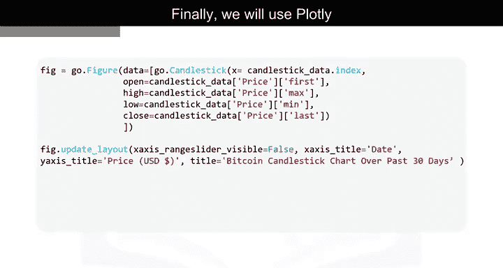

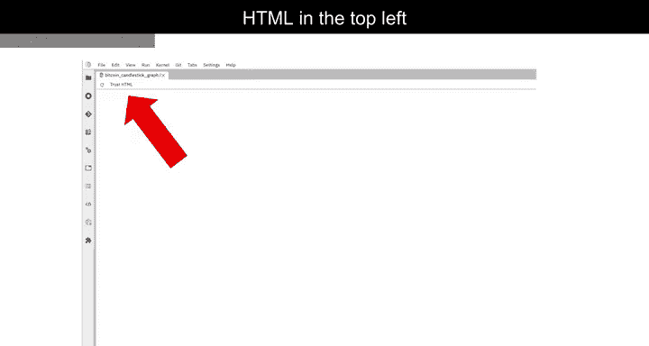


本节课中，我们一起学习了API的基本概念，了解了API如何作为软件组件间的桥梁。我们重点介绍了REST API的工作原理，包括客户端、资源、请求和响应等核心概念。最后，我们通过一个获取和分析比特币价格数据的完整示例，实践了如何使用Python库调用外部API、处理JSON响应、转换时间格式以及进行基本的数据可视化。掌握API的使用是连接你的程序与广阔网络资源的关键技能。