# 019：简单API使用（下）—— 结合人工智能的API应用

在本节课中，我们将学习如何使用结合了人工智能技术的应用程序接口（API）。具体来说，我们将通过两个IBM Watson服务来实践：首先使用**语音转文本API**将音频文件转换为文字，然后使用**语言翻译API**将文字翻译成另一种语言。通过这个过程，你将理解如何通过API发送请求并处理返回的数据。


## 🤖 人工智能API概述

上一节我们介绍了API的基本概念，本节中我们来看看如何利用集成了人工智能的API完成实际任务。

我们将构建一个简单的流程：先对音频文件进行转录，再将得到的文本翻译成新的语言。在API调用中，你需要将音频文件发送给API，这种操作常被称为**POST请求**。


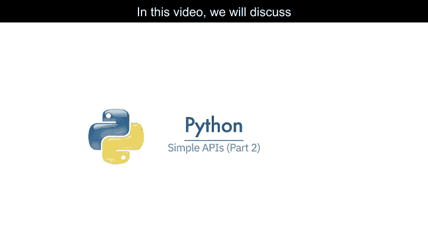

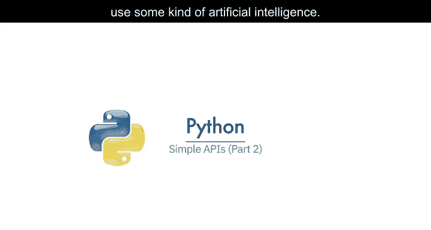


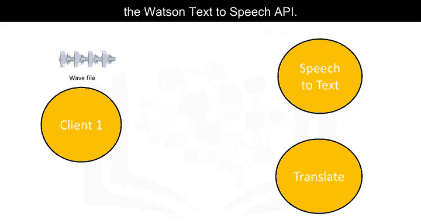

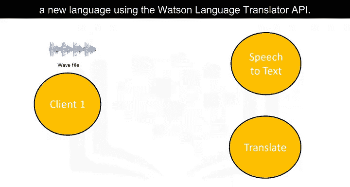


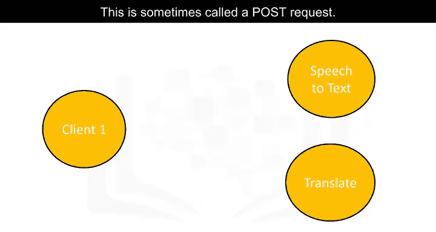


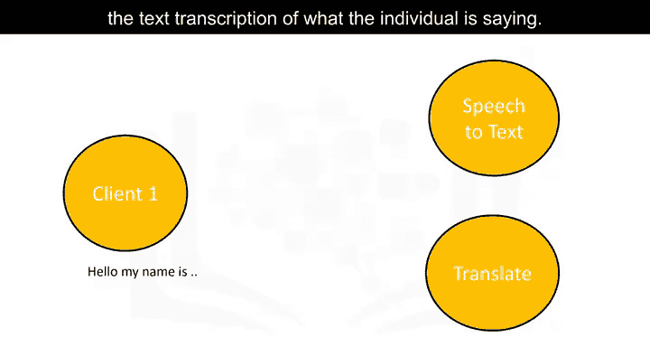

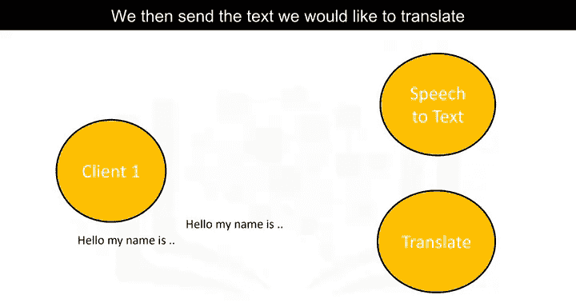


随后，API会返回音频中人物所说的文字转录。在底层，API执行的是**GET请求**。接着，我们将这段希望翻译的文本发送给第二个API。


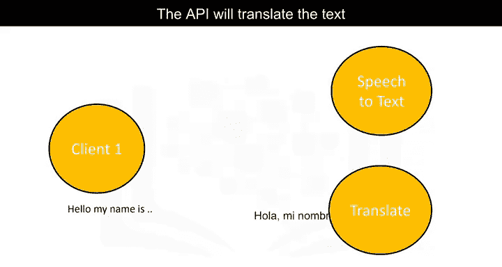

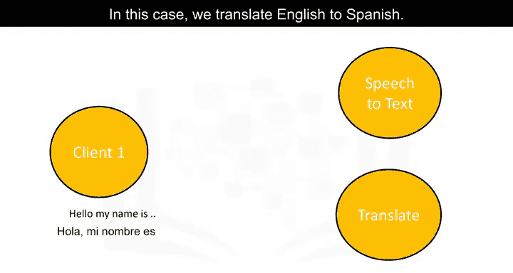

第二个API会将文本翻译并返回结果。在本例中，我们将实现从英语到西班牙语的翻译。接下来，我们先概述一下API密钥、端点以及我们将用到的Watson服务。


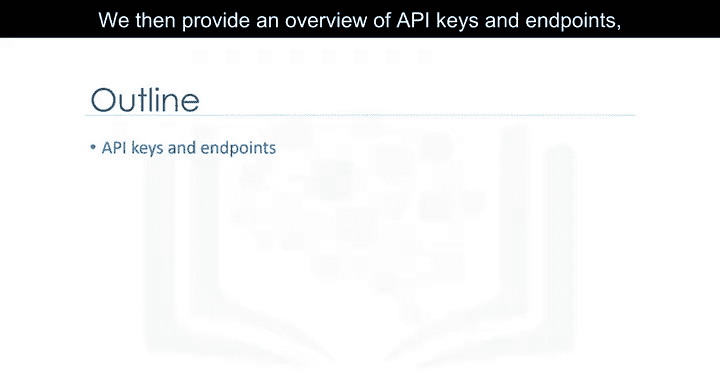

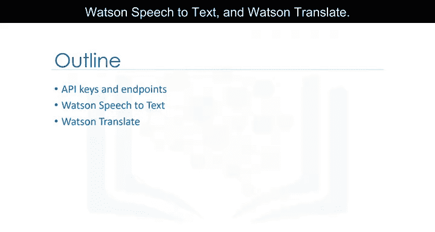

## 🔑 API密钥与端点

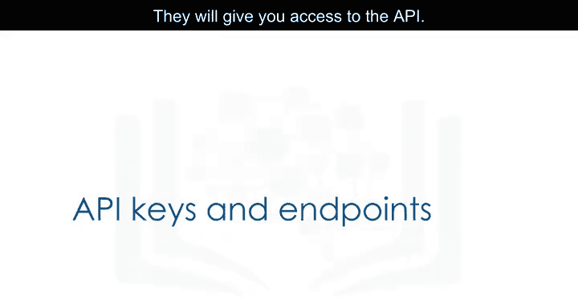

在开始实践之前，我们需要理解两个核心概念：**API密钥**和**端点**。它们是访问任何API服务的基础。


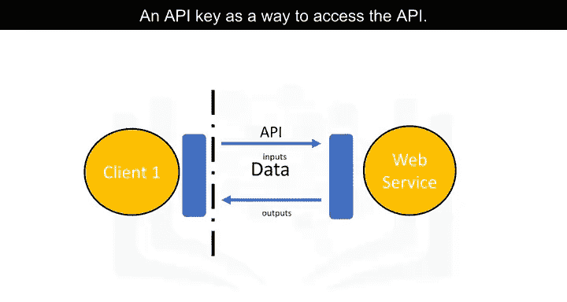


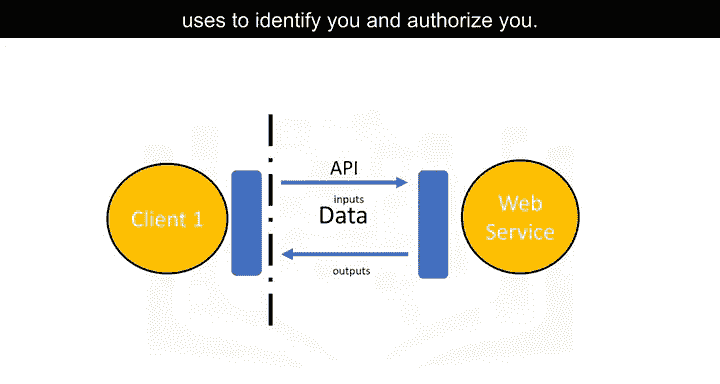

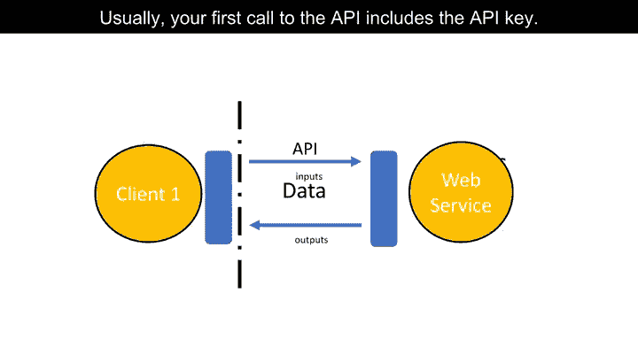


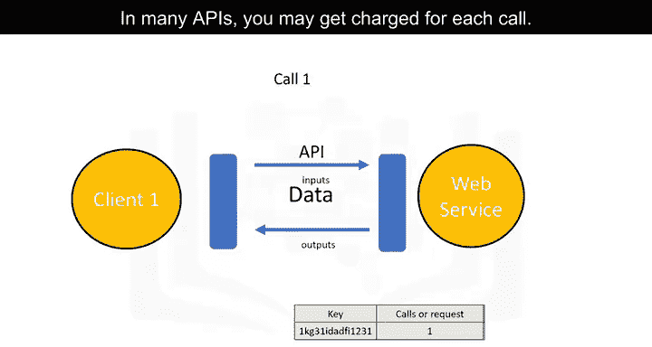

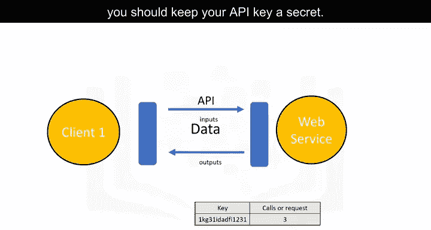


**API密钥**是访问API的凭证。它是一串独特的字符，API通过它来识别和授权你的身份。通常，你的首次API调用就需要包含这个密钥。


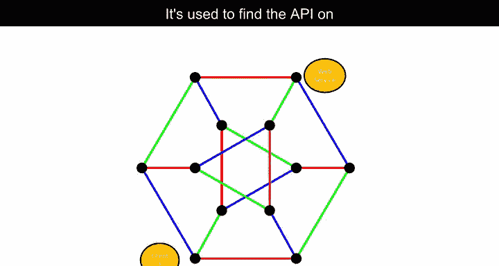


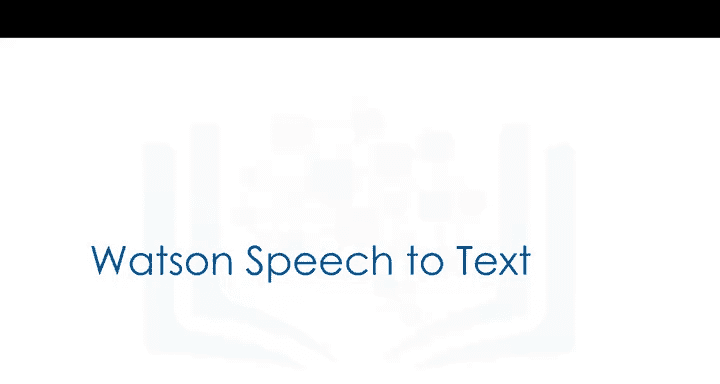


对于许多API，每次调用都可能产生费用，因此，**API密钥应像密码一样妥善保管，切勿泄露**。


**端点**则是服务所在的位置。它用于在互联网上定位API，就像一个网址。


理解了这些概念后，我们就可以开始动手操作了。


## 🎤 使用Watson语音转文本API

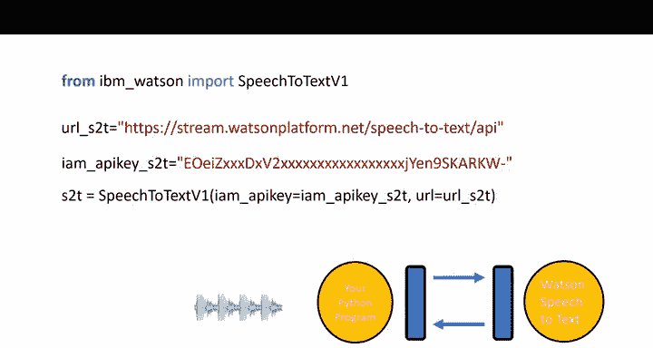

现在，我们将学习如何使用Watson语音转文本API来转录一个音频文件。


在开始实验前，你需要先注册并获取一个API密钥。我们会将一个音频文件下载到你的工作目录中。

以下是实现步骤：

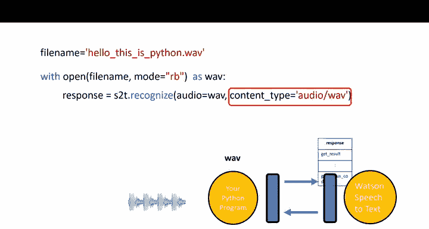

首先，从IBM Watson库中导入必要的模块并设置服务。
```python
from ibm_watson import SpeechToTextV1

# 设置服务端点（URL根据你的服务实例位置而定）
url_s2t = "YOUR_SPEECH_TO_TEXT_URL"

# 设置你的API密钥
apikey_s2t = "YOUR_SPEECH_TO_TEXT_APIKEY"
```

接着，创建一个语音转文本的适配器对象，用于与服务通信。
```python
s2t = SpeechToTextV1(iam_apikey=apikey_s2t, url=url_s2t)
```

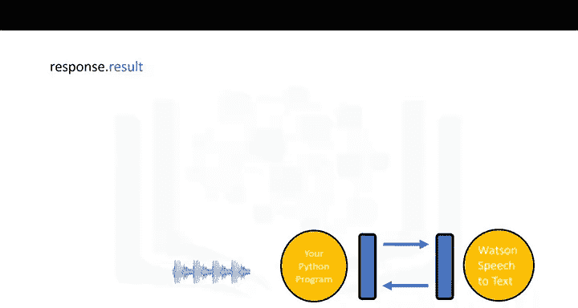

假设我们有一个名为`my_audio.wav`的音频文件。
```python
# 以二进制读取模式打开音频文件
with open('my_audio.wav', 'rb') as audio_file:
```
然后，调用`recognize`方法将音频文件发送给Watson服务。
```python
    response = s2t.recognize(audio=audio_file, content_type='audio/wav')
```

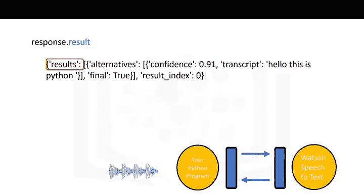

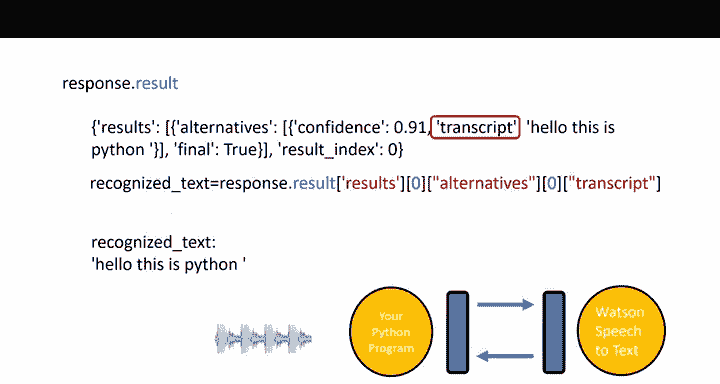

服务返回的响应是一个对象，其`result`属性是一个Python字典。
```python
# 从响应结果中提取转录文本
recognized_text = response.result['results'][0]['alternatives'][0]['transcript']
```
此时，变量`recognized_text`中就包含了转录出的文本字符串。


## 🌐 使用Watson语言翻译API

上一节我们成功获取了文本，本节中我们来看看如何使用Watson语言翻译API将其翻译成其他语言。


首先，导入翻译模块并设置服务。
```python
from ibm_watson import LanguageTranslatorV3

# 设置语言翻译服务的端点和API密钥
url_lt = "YOUR_LANGUAGE_TRANSLATOR_URL"
apikey_lt = "YOUR_LANGUAGE_TRANSLATOR_APIKEY"
version_lt = '2018-05-01'  # API版本日期，请参考文档
```
创建语言翻译器对象。
```python
translator = LanguageTranslatorV3(iam_apikey=apikey_lt, url=url_lt, version=version_lt)
```
你可以获取服务支持的语言列表。
```python
languages = translator.list_identifiable_languages().get_result()
```
例如，英语的代码是`en`，西班牙语是`es`。

现在，使用之前转录的文本`recognized_text`进行翻译。
```python
# 将英文翻译成西班牙文
translation_response = translator.translate(
    text=recognized_text,
    model_id='en-es'
).get_result()
```
响应结果是一个字典，其中包含翻译文本、字数等信息。
```python
spanish_translation = translation_response['translations'][0]['translation']
```
变量`spanish_translation`现在包含了西班牙语的翻译文本。


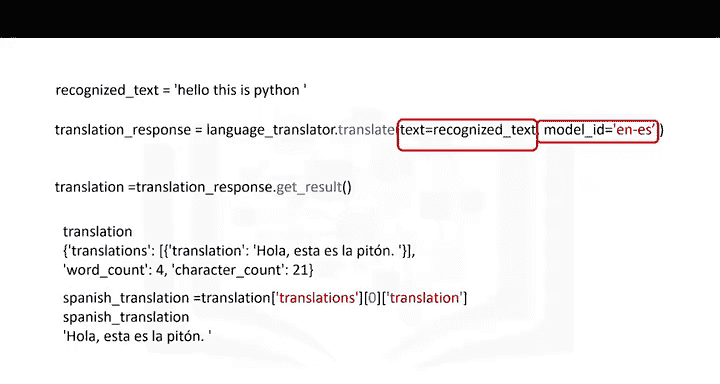

你还可以进行反向翻译或翻译成其他语言。
```python
# 将西班牙语翻译回英语
translation_back = translator.translate(
    text=spanish_translation,
    model_id='es-en'
).get_result()


# 将原始英文翻译成法语
french_translation = translator.translate(
    text=recognized_text,
    model_id='en-fr'
).get_result()
```


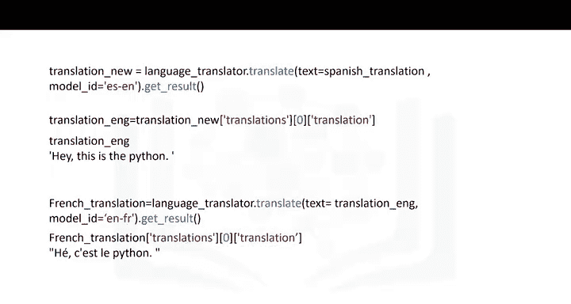

## 📝 课程总结


本节课中，我们一起学习了如何结合人工智能API来完成实际任务。我们首先了解了**API密钥**和**端点**的重要性，然后逐步实践了使用**IBM Watson语音转文本API**将音频转换为文字，以及使用**语言翻译API**将文字翻译成不同语言（如西班牙语和法语）的完整流程。通过这个过程，你应该对如何通过代码调用复杂的云端AI服务有了初步的认识。